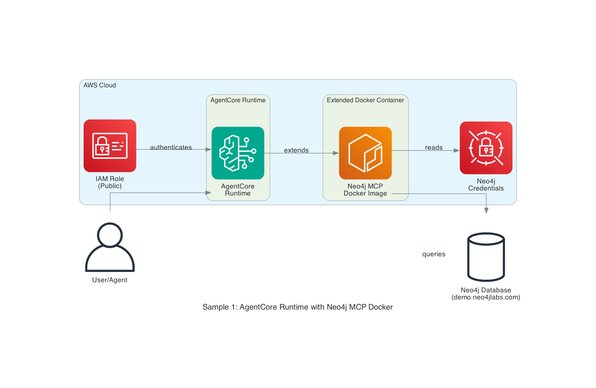

# Sample 1: AWS AgentCore Runtime with Neo4j MCP Docker Extension

## Introduction

This sample demonstrates how to extend AWS AgentCore Runtime with a Neo4j MCP server using Docker container extension. AgentCore Runtime provides the ability to extend an existing Docker image, allowing you to package and deploy the official Neo4j MCP server as part of your agent runtime environment.

**Key Features:**

- **Docker Extension**: Extends the official Neo4j MCP Docker image from Docker Hub
- **IAM Authentication**: Uses AWS IAM permissions for secure, public runtime access
- **Secrets Management**: Leverages AWS Secrets Manager for Neo4j credentials
- **Serverless Deployment**: Fully managed runtime with 8-hour execution windows
- **CDK Infrastructure**: Complete infrastructure-as-code deployment

**Use Cases:**

- Quick deployment of Neo4j MCP capabilities without custom server development
- Production-ready agent runtime with minimal configuration
- Secure access to Neo4j knowledge graphs for AI agents
- Enterprise-grade authentication and authorization

## Architecture Design



### Components

1. **AWS AgentCore Runtime**
   - Managed agent execution environment
   - 8-hour execution windows
   - Built-in episodic memory
   - Framework-agnostic orchestration

2. **Neo4j MCP Docker Image**
   - Official MCP server from [Docker Hub](https://hub.docker.com/mcp/server/neo4j/overview)
   - Extended into AgentCore Runtime
   - Provides MCP protocol tools for Neo4j queries

3. **AWS Secrets Manager**
   - Stores Neo4j connection credentials
   - URI, username, password, database name
   - Automatic rotation support

4. **IAM Role**
   - Public runtime access with IAM authentication
   - Fine-grained permission controls
   - Service-linked role for workload identity

5. **Neo4j Database**
   - Demo instance: `neo4j+s://demo.neo4jlabs.com:7687`
   - Companies database with organizations, people, locations
   - Production-ready for custom Neo4j instances

## In-Depth Analysis

### Docker Extension Mechanism

AgentCore Runtime's Docker extension feature allows you to:

```bash
# Configure runtime with Docker image extension
agentcore configure -e docker://mcp/server/neo4j:latest --protocol MCP
```

**How It Works:**

1. AgentCore pulls the specified Docker image
2. Runtime environment is extended with the MCP server
3. Container runs within the AgentCore execution context
4. MCP protocol communication is automatically configured
5. IAM permissions control access to the runtime

**Benefits:**

- No custom server code required
- Leverage official, maintained MCP servers
- Automatic updates when using `:latest` tag
- Consistent deployment across environments

### Authentication Flow

```
User/Agent Request
    ↓
[AWS IAM Authentication]
    ↓
AgentCore Runtime (Public)
    ↓
[Extended Docker Container]
    ↓
Neo4j MCP Server
    ↓
[Secrets Manager - Neo4j Credentials]
    ↓
Neo4j Database
```

**Security Layers:**

1. **IAM Authentication**: Controls who can invoke the runtime
2. **Public Runtime**: Accessible via IAM, no VPC required
3. **Secrets Manager**: Credentials never exposed in code
4. **TLS Encryption**: Secure connection to Neo4j (neo4j+s://)

### MCP Tools Available

The Neo4j MCP server provides the following tools:

| Tool                | Description                      | Parameters                      |
| ------------------- | -------------------------------- | ------------------------------- |
| `query_graph`       | Execute Cypher queries           | `query`, `params`               |
| `get_schema`        | Retrieve database schema         | `database`                      |
| `search_nodes`      | Search nodes by label/properties | `label`, `properties`, `limit`  |
| `get_relationships` | Get relationships for a node     | `node_id`, `direction`, `types` |

### CDK Stack Components

The CDK deployment creates:

- **Secrets Manager Secret** for Neo4j credentials (uri, username, password, database)
- **IAM Role** for AgentCore Runtime with Bedrock and Secrets Manager permissions
- **Secret Read Permissions** granted to the runtime role

### Environment Variables

The MCP Docker container receives Neo4j credentials from Secrets Manager:

- `NEO4J_URI` - Database connection URI
- `NEO4J_USERNAME` - Database username
- `NEO4J_PASSWORD` - Database password
- `NEO4J_DATABASE` - Database name

These are automatically injected from Secrets Manager at runtime.

## How to Use This Example

### Prerequisites

- AWS Account with Bedrock and AgentCore access
- AWS CLI configured with appropriate credentials
- AWS CDK installed (`npm install -g aws-cdk`)
- Node.js 18+ or Python 3.9+
- Access to Neo4j database (demo or production)

### Step 1: Clone the Repository

```bash
git clone https://github.com/neo4j-labs/neo4j-agent-integrations.git
cd neo4j-agent-integrations/aws-agentcore/samples/1-mcp-runtime-docker
```

### Step 2: Install Dependencies

**For TypeScript CDK:**

```bash
npm install
```

**For Python CDK:**

```bash
pip install -r requirements.txt
```

### Step 3: Configure Neo4j Credentials

Edit the CDK stack to use your Neo4j credentials, or use the demo database.

For demo database, the secret should contain:

- `uri`: `neo4j+s://demo.neo4jlabs.com:7687`
- `username`: `companies`
- `password`: `companies`
- `database`: `companies`

For production, reference an existing secret or create one with your credentials.

### Step 4: Deploy Infrastructure

```bash
# Bootstrap CDK (first time only)
cdk bootstrap

# Deploy the stack
cdk deploy Neo4jMCPRuntimeStack

# Confirm the deployment when prompted
```

**Expected Output:**
The deployment will output:

- Secret ARN for Neo4j credentials
- Runtime Role ARN for AgentCore
- Stack ARN

### Step 5: Configure AgentCore Runtime

```bash
# Configure the runtime with Neo4j MCP Docker image
agentcore configure \
  -e docker://mcp/server/neo4j:latest \
  --protocol MCP \
  --name neo4j-mcp-runtime \
  --role-arn <RuntimeRoleArn from CDK output>

# Set up IAM authentication (public runtime)
agentcore configure \
  --runtime-name neo4j-mcp-runtime \
  --auth-type IAM \
  --public-access true
```

**Expected Output:**
The configuration will show:

- Runtime ARN
- Status: ACTIVE
- MCP Protocol: Enabled
- Authentication: IAM
- Access: Public

### Step 6: Test the Runtime

**Using AWS CLI:**

Create a session and invoke tools using the AWS CLI with the runtime ARN and tool parameters.

**Using Python SDK:**

Use the boto3 `bedrock-agentcore` client to:

1. Create a session with the runtime ARN
2. Invoke tools like `query_graph` with Cypher queries
3. Process the returned graph data

### Step 7: Integrate with Bedrock Agents

Connect your Bedrock agents to the AgentCore Runtime to enable:

- Company data queries via Neo4j
- Graph relationship traversal
- Knowledge graph integration in agent workflows

The runtime handles:

- Tool orchestration
- MCP protocol communication
- Credential management
- Session state

### Step 8: Clean Up

```bash
# Destroy the CDK stack
cdk destroy Neo4jMCPRuntimeStack

# Delete the AgentCore runtime
agentcore delete-runtime --runtime-name neo4j-mcp-runtime
```

## References

### AWS Documentation

- [AWS AgentCore Official Documentation](https://docs.aws.amazon.com/bedrock/latest/userguide/agentcore.html)
- [AgentCore MCP Runtime Guide](https://docs.aws.amazon.com/bedrock-agentcore/latest/devguide/runtime-mcp.html)
- [AWS Secrets Manager](https://docs.aws.amazon.com/secretsmanager/)
- [AWS CDK Documentation](https://docs.aws.amazon.com/cdk/)

### Neo4j Resources

- [Neo4j MCP Server](https://github.com/neo4j/mcp)
- [Neo4j MCP Docker Hub](https://hub.docker.com/mcp/server/neo4j/overview)
- [Neo4j Python Driver](https://neo4j.com/docs/python-manual/current/)
- [Cypher Query Language](https://neo4j.com/docs/cypher-manual/current/)

### Demo Database

- **URI**: `neo4j+s://demo.neo4jlabs.com:7687`
- **Username**: `companies`
- **Password**: `companies`
- **Database**: `companies`
- **Schema**: Organizations, People, Locations, Industries, Articles

### Related Samples

- [Sample 2: AgentCore Gateway with External Neo4j MCP](../2-gateway-external-mcp/README.md)
- [Sample 3: AgentCore Runtime with Neo4j SDK Tools](../3-runtime-neo4j-sdk/README.md)

### Community

- [Neo4j Agent Integrations Repository](https://github.com/neo4j-labs/neo4j-agent-integrations)
- [MCP Specification](https://modelcontextprotocol.io/)
