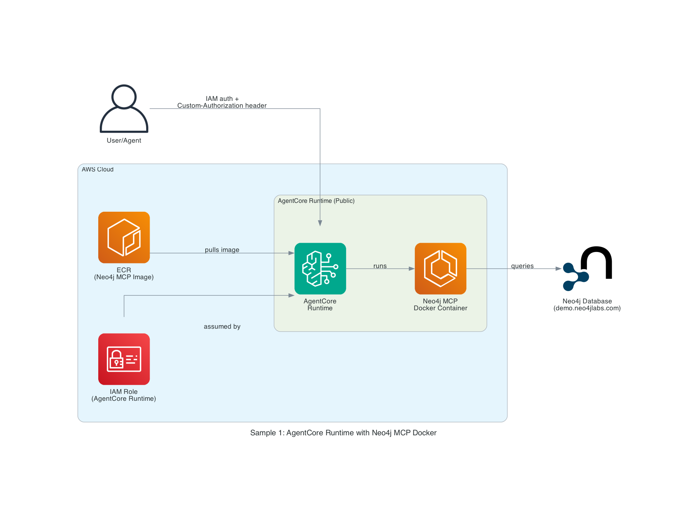

# Sample 1: AWS AgentCore Runtime with Neo4j MCP Docker Extension

## Introduction

This sample demonstrates how to deploy an AWS AgentCore Runtime with a Neo4j MCP Docker image.
The Neo4j MCP server is configured for HTTP transport and deployed via CDK as an AgentCore Runtime.

You can either use a **pre-built image from the AWS Marketplace** for fast deployment, or **build the Docker image locally** from the included `docker/Dockerfile`.

**Key Features:**

- **Pre-built or Local Docker Image**: Use a pre-built Neo4j MCP Docker image from the AWS Marketplace, or build locally from `docker/Dockerfile`
- **IAM Authentication**: Uses AWS IAM permissions for secure, public runtime access
- **Header-Based Authentication**: Neo4j-Credentials are provided securely via a custom `X-Amzn-Bedrock-AgentCore-Runtime-Custom-Authorization` header
- **Serverless Deployment**: Fully managed AgentCore runtime
- **CDK Infrastructure**: Complete infrastructure-as-code deployment — no manual CLI configuration required

## Prerequisites

- AWS Account with Bedrock and AgentCore access
- AWS CLI configured with appropriate credentials
- AWS CDK installed (`npm install -g aws-cdk`)
- [uv](https://docs.astral.sh/uv/) installed (`curl -LsSf https://astral.sh/uv/install.sh | sh`)
- Docker installed and running

---

## Section 1: Deploy from the AWS Marketplace (Recommended)

The fastest path to deployment. Uses a pre-built Neo4j MCP container image from the AWS Marketplace — no local Docker build required.

### Clone and Install

```bash
git clone https://github.com/neo4j-labs/neo4j-agent-integrations.git
cd neo4j-agent-integrations/aws-agentcore/samples/1-mcp-runtime-docker
uv sync
cp .env.sample .env
```

### Get the Container Image URI

1. Go to the [AWS Marketplace](https://aws.amazon.com/marketplace) and search for **"Neo4j MCP Server"**
2. Subscribe to the listing and follow the instructions to get the container image URI

### Set Up the .env File

The `.env` file holds two kinds of values: ones baked into the deployed runtime at CDK deploy time, and ones used only when running the demo client locally.

```bash
# .env

# Deploy-time: baked into the AgentCore Runtime as container env vars
NEO4J_URI=neo4j+s://demo.neo4jlabs.com:7687
NEO4J_DATABASE=companies
NEO4J_MCP_CONTAINER_URI=<marketplace-container-image-uri>

# Run-time: used by the demo client, sent per-request via custom auth header
NEO4J_USERNAME=companies
NEO4J_PASSWORD=companies
```

**Deploy-time values.** `deploy.sh` reads `NEO4J_URI`, `NEO4J_DATABASE`, and `NEO4J_MCP_CONTAINER_URI` and passes them to CDK as context. The stack injects the URI and database name into the `CfnRuntime` as container environment variables, and the container URI tells AgentCore which image to pull. Changing any of these requires redeploying the stack.

**Run-time values.** The demo client reads `NEO4J_USERNAME` and `NEO4J_PASSWORD` locally, base64-encodes them, and sends them on each request in the `X-Amzn-Bedrock-AgentCore-Runtime-Custom-Authorization` header. They never reach CDK or the deployed runtime. AgentCore forwards the header to the Neo4j MCP server, which uses it to authenticate against the database. This keeps credentials out of CloudFormation state and lets different clients hit the same runtime with different Neo4j credentials.

### Configure Environment

Set `NEO4J_MCP_CONTAINER_URI` in your `.env` to the image URI from the Marketplace:

```bash
# .env
NEO4J_URI=neo4j+s://demo.neo4jlabs.com:7687
NEO4J_DATABASE=companies
NEO4J_MCP_CONTAINER_URI=<marketplace-container-image-uri>
```

### Deploy

```bash
./deploy.sh
```

CDK will reference the pre-built image directly — no local Docker build required.

### Test the Runtime

#### Standalone Demo Script

After deployment, `deploy.sh` automatically queries the CloudFormation stack outputs and writes `AGENTCORE_RUNTIME_ARN` to `.env`, so the demo client can connect without manual copy-paste. Run the demo:

```bash
cd demo
uv sync
uv run python demo.py
```

This lists MCP tools, calls `get-schema`, and runs an agent query. Use `--mode` to run specific steps:

```bash
uv run python demo.py --mode list    # list tools only
uv run python demo.py --mode call    # call get-schema
uv run python demo.py --mode agent   # run agent query (requires Bedrock model access)
```

#### Jupyter Notebook

Open [demo.ipynb](demo.ipynb) and set the `arn` variable to the `Neo4jMcpRuntimeArn` from the CDK output, then run the notebook.
It uses `mcp_proxy_for_aws` and `strands` to connect via IAM-signed requests and the `X-Amzn-Bedrock-AgentCore-Runtime-Custom-Authorization`
header for Neo4j credentials.

```python
arn = "<Neo4jMcpRuntimeArn from CDK output>"
neo4j_user = "companies"
neo4j_password = "companies"
```

### Clean Up

```bash
cdk destroy Neo4jMCPRuntimeStack
```

---

## Section 2: Build and Deploy a Local Docker Image

If you want to customize the container or don't have access to the Marketplace image, you can build the Docker image locally from the included `docker/Dockerfile`.

### Clone and Install

```bash
git clone https://github.com/neo4j-labs/neo4j-agent-integrations.git
cd neo4j-agent-integrations/aws-agentcore/samples/1-mcp-runtime-docker
uv sync
cp .env.sample .env
```

### Configure Environment

Omit `NEO4J_MCP_CONTAINER_URI` from your `.env` — CDK will build the image locally:

```bash
# .env
NEO4J_URI=neo4j+s://demo.neo4jlabs.com:7687
NEO4J_DATABASE=companies
```

### Deploy

```bash
./deploy.sh
```

CDK will build the Docker image locally from `docker/Dockerfile`, push it to ECR, and deploy it as an AgentCore Runtime.

### Test the Runtime

#### Standalone Demo Script

After deployment, `deploy.sh` automatically queries the CloudFormation stack outputs and writes `AGENTCORE_RUNTIME_ARN` to `.env`, so the demo client can connect without manual copy-paste. Run the demo:

```bash
cd demo
uv sync
uv run python demo.py
```

This lists MCP tools, calls `get-schema`, and runs an agent query. Use `--mode` to run specific steps:

```bash
uv run python demo.py --mode list    # list tools only
uv run python demo.py --mode call    # call get-schema
uv run python demo.py --mode agent   # run agent query (requires Bedrock model access)
```

#### Jupyter Notebook

Open [demo.ipynb](demo.ipynb) and set the `arn` variable to the `Neo4jMcpRuntimeArn` from the CDK output, then run the notebook.
It uses `mcp_proxy_for_aws` and `strands` to connect via IAM-signed requests and the `X-Amzn-Bedrock-AgentCore-Runtime-Custom-Authorization`
header for Neo4j credentials.

```python
arn = "<Neo4jMcpRuntimeArn from CDK output>"
neo4j_user = "companies"
neo4j_password = "companies"
```

### Clean Up

```bash
cdk destroy Neo4jMCPRuntimeStack
```

## Architecture Design



### Components

1. **AWS AgentCore Runtime**
   - Managed agent execution environment
   - Built-in episodic memory
   - Framework-agnostic orchestration

2. **Neo4j MCP Docker Image**
   - Pre-built MCP server from ECR, or locally built from `docker/Dockerfile`
   - Deployed in AgentCore Runtime
   - Provides MCP-Tools to query Neo4j

3. **Custom Authorization Header**
   - `X-Amzn-Bedrock-AgentCore-Runtime-Custom-Authorization` header
   - Dynamic credential injection
   - Per-request authentication
   - Secure header transmission

4. **IAM Role**
   - Public runtime access with IAM authentication
   - Fine-grained permission controls
   - Service-linked role for workload identity

5. **Neo4j Database**
   - Demo instance: `neo4j+s://demo.neo4jlabs.com:7687`
   - Companies database with organizations, people, locations

## In-Depth Analysis

### Docker Image Configuration

The sample supports two deployment modes:

1. **Pre-built ECR image** — set `NEO4J_MCP_CONTAINER_URI` to a pre-built image URI. AgentCore references it directly. This is faster and uses a tested, versioned image.
2. **Local Docker build** — omit `NEO4J_MCP_CONTAINER_URI`. CDK builds the image from `docker/Dockerfile`, pushes it to ECR, and configures the runtime automatically.

**How It Works:**

1. The CDK stack checks whether `neo4j_mcp_container_uri` is provided in context
2. If set, the `CfnRuntime` references the pre-built ECR image URI directly
3. If not set, CDK uses `DockerImageAsset` to build from `docker/Dockerfile` and push to ECR
4. AgentCore runs the container with environment variables injected at deployment time
5. MCP protocol communication is automatically configured over HTTP

### Authentication Flow

```
User/Agent Request
    ↓
[AWS IAM Authentication + Neo4j-Credentials via X-Amzn-Bedrock-AgentCore-Runtime-Custom-Authorization header]
    ↓
AgentCore Runtime (Public)
    ↓
Neo4j MCP Server (Configured with URI/DB only)
    ↓
[Extract Basic Auth from X-Amzn-Bedrock-AgentCore-Runtime-Custom-Authorization header]
    ↓
Neo4j Database
```

**Security Layers:**

1. **IAM Authentication**: Controls who can invoke the runtime
2. **Public Runtime**: Accessible via IAM, no VPC required
3. **MCP-Auth**: Neo4j-Credentials passed securely via `X-Amzn-Bedrock-AgentCore-Runtime-Custom-Authorization` header per invocation
4. **TLS Encryption**: Secure connection to Neo4j (neo4j+s://)

### MCP Tools Available

For tools available see the [official Neo4j MCP server documentation](https://github.com/neo4j/mcp/?tab=readme-ov-file#tools--usage)

### CDK Stack Components

The CDK deployment creates:

- **IAM Role** for AgentCore Runtime with Bedrock, ECR, CloudWatch Logs, X-Ray, and workload identity permissions
- **AgentCore `CfnRuntime`** — configured with MCP protocol, public network mode, IAM auth, and the custom header allowlist, using either a pre-built ECR image or a locally built Docker image

### Environment Variables

The `.env` file supports the following variables for `deploy.sh`:

| Variable | Required | Description |
|----------|----------|-------------|
| `NEO4J_URI` | Yes | Neo4j connection URI (e.g. `neo4j+s://demo.neo4jlabs.com:7687`) |
| `NEO4J_DATABASE` | Yes | Neo4j database name (e.g. `companies`) |
| `NEO4J_MCP_CONTAINER_URI` | No | Pre-built MCP Docker image URI from ECR. If unset, CDK builds a local Docker image from `docker/Dockerfile`. |

Default values for CDK context are also provided in [cdk.json](cdk.json). When using `deploy.sh`, the `.env` values override the `cdk.json` defaults. You can also override at deploy time with `-c` flags:

```bash
cdk deploy Neo4jMCPRuntimeStack \
  -c neo4j_uri=neo4j+s://your-instance:7687 \
  -c neo4j_database=neo4j
```

The MCP Docker container is configured with the following environment variables at deployment time:

- `NEO4J_URI` - Database connection URI (Required)
- `NEO4J_DATABASE` - Database name (Optional, default: neo4j)
- `NEO4J_READ_ONLY` - Set to `true` to restrict the MCP server to read-only operations
- `NEO4J_LOG_FORMAT` - Log format, e.g. `text` or `json`
- `NEO4J_HTTP_AUTH_HEADER_NAME` - Name of the HTTP header used to pass Basic Auth credentials (set to `X-Amzn-Bedrock-AgentCore-Runtime-Custom-Authorization`)
- `NEO4J_HTTP_ALLOW_UNAUTHENTICATED_PING` - Set to `true` to allow unauthenticated health check pings

**Authentication:**

Credentials (`NEO4J_USERNAME`, `NEO4J_PASSWORD`) are NOT stored in the container. Instead, they are provided dynamically via the `X-Amzn-Bedrock-AgentCore-Runtime-Custom-Authorization` header as a Base64-encoded Basic Auth value (`Basic <base64(user:password)>`) on each MCP tool invocation.

## References

### AWS Documentation

- [AWS AgentCore Official Documentation](https://docs.aws.amazon.com/bedrock/latest/userguide/agentcore.html)
- [AgentCore MCP Runtime Guide](https://docs.aws.amazon.com/bedrock-agentcore/latest/devguide/runtime-mcp.html)
- [AWS CDK Documentation](https://docs.aws.amazon.com/cdk/)

### Neo4j Resources

- [Neo4j MCP Server](https://github.com/neo4j/mcp)
- [Neo4j MCP Docker Hub](https://hub.docker.com/mcp/server/neo4j/overview)

## CDK Notes

### IAM Trust Policy: Confused Deputy Protection

The IAM execution role for the AgentCore Runtime includes `aws:SourceAccount` and `aws:SourceArn` conditions on its trust policy. These conditions prevent the [confused deputy problem](https://docs.aws.amazon.com/IAM/latest/UserGuide/confused-deputy.html), where an AWS service could be tricked into acting on behalf of an unintended account or resource.

Without these conditions, _any_ AgentCore service across any AWS account could potentially assume the runtime's execution role. By scoping the trust to your specific account and AgentCore ARN, only runtimes within your account can assume the role.

This follows the [AWS recommended trust policy](https://docs.aws.amazon.com/bedrock-agentcore/latest/devguide/runtime-permissions.html) for AgentCore Runtime execution roles.

### Cross-Account ECR Access for Marketplace Containers

The runtime role's ECR pull permissions (`ecr:BatchGetImage`, `ecr:GetDownloadUrlForLayer`) use `"*"` as the resource rather than scoping to the deploying account. This is necessary because pre-built container images from AWS Marketplace (e.g. the Neo4j MCP Server) are hosted in a separate vendor ECR account. Scoping the resource to only the deploying account would cause AgentCore to fail with an "Access denied while validating ECR URI" error when using Marketplace containers.
