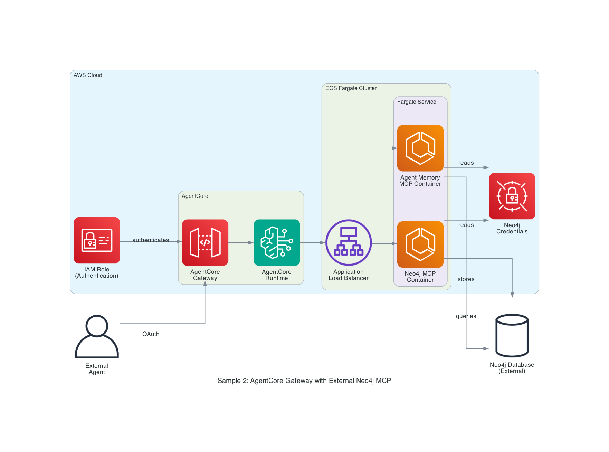

# Sample 2: AWS AgentCore Gateway with External Neo4j MCP via Fargate

## Introduction

This sample demonstrates how to use AWS AgentCore Gateway to connect to external Neo4j MCP servers running on AWS Fargate. The Gateway handles OAuth authentication for external agents and uses a **Lambda Interceptor** to translate OAuth tokens into Neo4j credentials, enabling the use of the **official Neo4j MCP server** in HTTP mode.

**Key Features:**

- **AgentCore Gateway**: Enterprise tool governance and centralized MCP management
- **Lambda Request Interceptor**: Translates OAuth tokens to Neo4j Basic Auth headers
- **Official Neo4j MCP**: Uses unmodified official Docker image in HTTP mode
- **ECS Fargate Deployment**: Serverless container orchestration
- **Multi-MCP Architecture**: Neo4j MCP + Agent Memory MCP working together
- **OAuth Authentication**: Secure M2M authentication for external clients

**Use Cases:**

- Enterprise deployments using official vendor-supported images
- Centralized identity management with OAuth 2.0
- Secure credential injection at the edge (Gateway) rather than in containers
- High availability architecture with public load balancers

## Architecture Design



### Components

1. **AWS AgentCore Gateway**
   - Reverse proxy for MCP servers
   - Inbound OAuth 2.0 validation
   - Lambda Interceptor execution

2. **Request Interceptor Lambda**
   - Executes before request reaches backend
   - Retrieves Neo4j credentials from Secrets Manager
   - Replaces OAuth `Authorization` header with `Basic <user:pass>`

3. **Application Load Balancer (Public)**
   - Publicly accessible endpoint (required for AgentCore Gateway)
   - Distributes traffic to Fargate tasks

4. **Neo4j MCP Container (Official)**
   - Runs `mcp/server/neo4j` image
   - Configured in HTTP mode (`NEO4J_TRANSPORT_MODE=http`)
   - Stateless authentication via per-request Basic Auth

5. **Agent Memory MCP Container (Custom)**
   - Custom MCP server for context graph operations
   - Manages its own authentication

6. **AWS Secrets Manager**
   - Stores Neo4j credentials
   - Accessed by Interceptor Lambda for header injection

## In-Depth Analysis

### Authentication Flow (Token Exchange)

The core innovation in this pattern is the **Auth Interceptor** that enables compatibility between OAuth-based Gateway clients and Basic Auth-based Neo4j MCP.

```
External Agent (OAuth Token)
    ↓
[OAuth Validation - Cognito/Auth0]
    ↓
AgentCore Gateway
    ↓
Request Interceptor Lambda
    ├─ Retrieve Secret ("neo4j/creds")
    ├─ Compute Basic Auth Header
    └─ Replace "Authorization" Header
    ↓
[Basic Auth: neo4j:password]
    ↓
Application Load Balancer (Public)
    ↓
Official Neo4j MCP (HTTP Mode)
```

**Benefits:**

- **Security**: Neo4j credentials never exposed to client
- **Compliance**: Uses standard OAuth patterns for clients
- **Simplicity**: Backend uses stateless, standard HTTP auth

### Fargate Service Architecture

The ECS cluster runs two Fargate services:

**Neo4j MCP Service:**

- Image: `mcp/server/neo4j:latest`
- Env Vars:
  - `NEO4J_URI`: `bolt://...`
  - `NEO4J_TRANSPORT_MODE`: `http`
  - `NEO4J_HTTP_PORT`: `3000`
- **Important**: No credentials in environment variables

**Agent Memory Service:**

- Image: Custom built image
- Env Vars: `NEO4J_URI`, plus internal logic for auth

### Load Balancer Configuration

Since AgentCore Gateway currently requires public endpoints for MCP registration, an internet-facing Application Load Balancer is used.

- **Listeners**: HTTP:80
- **Target Groups**: IP-mode targets for Fargate tasks
- **Security Groups**: Allow inbound from AgentCore Gateway IP ranges (optional hardening)

## How to Use This Example

### Prerequisites

- AWS Account with Bedrock, ECS, and AgentCore access
- AWS CLI and CDK installed
- Docker installed
- OAuth provider (Cognito, Auth0)
- Neo4j database

### Step 1: Set Up OAuth Provider

Configure your OAuth provider (Cognito/Auth0) to issue Client Credentials tokens with appropriate scopes.

### Step 2: Deploy Infrastructure

```bash
cd neo4j-agent-integrations/aws-agentcore/samples/2-gateway-external-mcp
npm install
cdk deploy AgentCoreGatewayStack
```

**Stack Resources Created:**

- VPC, ECS Cluster, Fargate Services
- Public Application Load Balancer
- Lambda Interceptor Function
- Secrets Manager Secret
- IAM Roles

### Step 3: Configure AgentCore Gateway

**1. Register Interceptor:**
Associate the deployed Lambda function as a REQUEST interceptor on the Gateway.

**2. Register MCP Servers:**

```bash
# Register Neo4j MCP (Official)
# Auth Type: NONE (Handled by Interceptor)
agentcore gateway register-mcp \
  --gateway-name agentcore-gateway \
  --mcp-name neo4j-mcp \
  --endpoint http://neo4j-mcp-alb-xxxxx.us-east-1.elb.amazonaws.com \
  --protocol MCP \
  --auth-type NONE

# Register Agent Memory MCP
agentcore gateway register-mcp \
  --gateway-name agentcore-gateway \
  --mcp-name agent-memory-mcp \
  --endpoint http://agent-memory-alb-yyyyy.us-east-1.elb.amazonaws.com \
  --protocol MCP \
  --auth-type NONE
```

**3. Configure OAuth:**
Set up the Gateway to validate JWTs from your provider.

### Step 4: Test Integration

1. **Get Token**: Request OAuth token from Cognito/Auth0.
2. **Call Gateway**:
   ```bash
   curl -X POST https://agentcore-gateway-xxxxx.bedrock.us-east-1.amazonaws.com/invoke \
     -H "Authorization: Bearer $OAUTH_TOKEN" \
     -d '{"mcp_server":"neo4j-mcp", "tool":"get_schema"}'
   ```
3. **Verify Flow**:
   - Gateway validates token
   - Interceptor swaps token for Basic Auth
   - Neo4j MCP accepts request and returns schema

### Step 5: Clean Up

```bash
cdk destroy AgentCoreGatewayStack
agentcore gateway delete --gateway-name agentcore-gateway
```

## References

### AWS Documentation

- [AgentCore Gateway Requests Interceptors](https://docs.aws.amazon.com/bedrock-agentcore/latest/devguide/gateway-interceptors.html)
- [AgentCore Gateway Architecture](https://docs.aws.amazon.com/bedrock-agentcore/latest/devguide/gateway-architecture.html)

### Neo4j Resources

- [Neo4j MCP Transport Modes](https://github.com/neo4j/mcp#transport-modes)
- [Neo4j HTTP Auth Configuration](https://github.com/neo4j/mcp/blob/main/docs/CLIENT_SETUP.md#http-mode)
