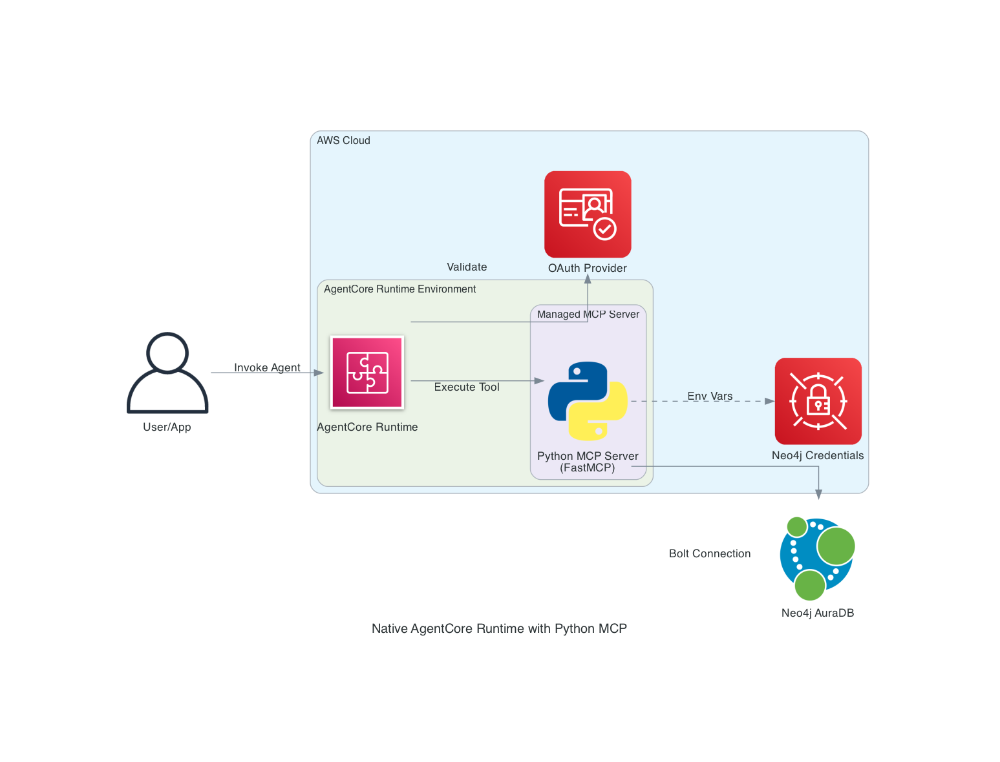

# Sample 3: Native AgentCore Runtime with Python Neo4j MCP

## Introduction

This sample demonstrates how to build and deploy a **Native Python MCP Server** directly to the **AWS AgentCore Runtime**. Instead of managing external infrastructure like Fargate or generic Lambda functions, this approach leverages the native MCP hosting capabilities of AgentCore.

We use the **FastMCP** Python library to define tools that interact with Neo4j using the official SDK, and deploy the server using the `bedrock-agentcore-starter-toolkit`.

**Key Features:**

- **Native Integration**: Deployed directly to AgentCore Runtime (No external ECS/Lambda management)
- **FastMCP SDK**: Simple, decorator-based Python MCP server implementation
- **Neo4j Python Driver**: Direct, optimized database access
- **Serverless**: Managed runtime handles scaling and execution
- **Simplified Deployment**: "Code-to-Cloud" workflow using `agentcore` CLI

**Use Cases:**

- Rapid development of domain-specific MCP agents
- Teams preferring Python-native development workflows
- Deployments requiring minimal infrastructure overhead
- Custom logic encapsulation within standard MCP protocol

## Architecture Design



### Components

1. **AWS AgentCore Runtime**
   - Managed service for hosting MCP servers
   - Handles connection handling, session management, and auto-scaling
   - Inteprets MCP protocol natively

2. **Python MCP Server (`server.py`)**
   - Built with `mcp` (FastMCP) library
   - Defines tools: `query_company`, `search_news`, `get_entity_graph`
   - Implements business logic and Neo4j queries

3. **Neo4j Database**
   - External Neo4j instance (AuraDB or Self-Managed)
   - Connected via Bolt protocol (`neo4j+s://...`)

4. **Authentication**
   - OAuth 2.0 (Cognito/Auth0) tied to AgentCore Runtime
   - Neo4j Credentials securely managed by the Runtime environment

## In-Depth Analysis

### Tool Implementation Strategy

The tools are implemented as Python functions decorated with `@mcp.tool`.

**1. `query_company`**

- Uses `neo4j` driver to run optimized Cypher.
- Returns structured JSON for the LLM.

**2. `search_news`**

- Performs vector search on the `news` index.
- Uses `neo4j` driver to fetch embeddings (or call Bedrock Embeddings API) and query the graph.

**3. `get_entity_graph`**

- Uses APOC procedures for flexible subgraph retrieval.
- Formats graph data (nodes/relationships) into text representation.

## How to Use This Example

### Prerequisites

- Python 3.10+
- AWS Account with AgentCore access
- Neo4j Database
- `bedrock-agentcore-starter-toolkit` installed

### Step 1: Project Setup

Initialize your project structure:

```bash
mkdir neo4j-agentcore-mcp
cd neo4j-agentcore-mcp
pip install mcp neo4j bedrock-agentcore-starter-toolkit
```

Create `requirements.txt`:

```text
mcp
neo4j
```

### Step 2: Implement MCP Server

Create `server.py`:

_(Conceptual Code Snippet)_

```python
from mcp.server.fastmcp import FastMCP
from neo4j import GraphDatabase
import os

# Initialize FastMCP
mcp = FastMCP("Neo4j Agent", dependencies=["neo4j"])

# Database Connection (Credentials from Env)
URI = os.getenv("NEO4J_URI")
AUTH = (os.getenv("NEO4J_USERNAME"), os.getenv("NEO4J_PASSWORD"))

@mcp.tool()
def query_company(name: str) -> str:
    """Get company details from the knowledge graph."""
    with GraphDatabase.driver(URI, auth=AUTH) as driver:
        # ... logic ...
        return result
```

### Step 3: Configure Deployment

We use **AWS CDK** to define and deploy the infrastructure.

**Resources Created:**

- **AgentCore Runtime**: Hosted container environment for the MCP server
- **IAM Roles**: Execution role for the Runtime (access to Secrets Manager, etc.)
- **Asset**: Zips and uploads the Python MCP server code

### Step 4: Deploy

Deploy the stack using standard CDK commands:

```bash
# Bootstrap (first time only)
cdk bootstrap

# Deploy the Native MCP Stack
cdk deploy NativeNeo4jMCPStack
```

**Output:**

- Agent Runtime ARN: `arn:aws:bedrock-agentcore:region:acc:runtime/native-neo4j-mcp`

### Step 5: Test

Test your deployed agent using the AWS CLI or SDK:

```bash
aws bedrock-agent-runtime invoke-agent \
  --agent-alias-id <ALIAS_ID> \
  --agent-id <AGENT_ID> \
  --session-id test-session \
  --input-text "Tell me about Google and its recent news"
```

### Step 6: Clean Up

```bash
cdk destroy NativeNeo4jMCPStack
```

## References

- [Deploy MCP servers in AgentCore Runtime](https://docs.aws.amazon.com/bedrock-agentcore/latest/devguide/runtime-mcp.html)
- [FastMCP Documentation](https://github.com/modelcontextprotocol/python-sdk)
- [Neo4j Python Driver](https://neo4j.com/docs/python-manual/current/)
