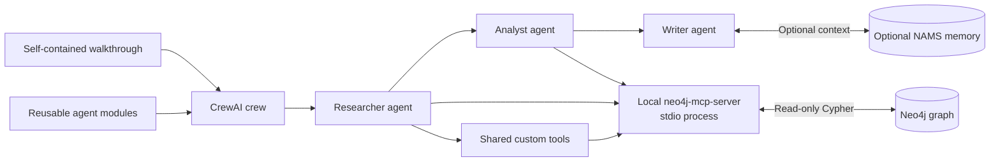

# CrewAI + Neo4j Walkthrough

[](https://www.python.org/downloads/)
[](https://www.crewai.com/)
[](https://neo4j.com/)
[](https://modelcontextprotocol.io/)

This integration provides both a self-contained walkthrough notebook and reusable CrewAI agent modules. Both paths combine CrewAI orchestration, a local Neo4j MCP server, optional Neo4j Agent Memory Server (NAMS), and reusable graph tools. It does not require a web service or browser application.

## Execution Paths

### Self-contained notebook

Open and run [`notebooks/crewai_neo4j_walkthrough.ipynb`](notebooks/crewai_neo4j_walkthrough.ipynb). It embeds its own MCP, Neo4j, NAMS, and CrewAI implementation so it can be shared and studied as one file. It includes retained, sanitized outputs for each executable cell.

### Reusable agent modules

[`agent/`](agent/) contains the production-oriented implementation used by applications or scripts. It separates CrewAI crew assembly, local MCP adaptation, Neo4j tools, NAMS tools, and shared-tool wrappers into importable modules with unit tests in [`tests/`](tests/).

```python
from agent.crew import build_query_crew

result = build_query_crew(
    "Show all entities connected to DB and their relationship types."
).kickoff()
print(result)
```

## Concepts and Integration Map

CrewAI organizes an AI workflow into a **Crew** of specialized **Agents**. Each agent receives a role, goal, backstory, model, and a set of tools. A **Task** gives an agent a concrete outcome; CrewAI executes the tasks in a defined **Process** and carries prior task output to subsequent agents.

| CrewAI concept | Role in this walkthrough | Neo4j integration |
| --- | --- | --- |
| LLM | `gpt-5.4-mini` interprets requests and chooses tools. | Turns natural-language questions into tool calls and grounded responses. |
| Tool | Supplies an agent with a capability it can invoke. | Local MCP tools, shared custom tools, direct graph tools, and optional NAMS tools. |
| Agent | Performs a focused stage of work. | Researcher retrieves facts, analyst explores relationships, writer produces the briefing. |
| Task | Defines expected output for one agent. | Company research, relationship analysis, and briefing synthesis tasks. |
| Crew | Coordinates agents and tasks sequentially. | Passes graph-grounded facts from researcher to analyst to writer. |
| Memory | Retains useful context outside the immediate prompt. | Optional NAMS tools search and store long-term graph-backed context. |



## Neo4j Components

### Local MCP server

The official `neo4j-mcp-server` runs as a local stdio subprocess. [`agent/mcp.py`](agent/mcp.py) forwards the configured Neo4j connection values to it, requests read-only access, discovers its advertised tools, and builds typed CrewAI tool schemas from their MCP input schemas.

The key MCP tools are:

| Tool | Use |
| --- | --- |
| `get-schema` | Inspect labels, relationship types, and properties before asking data-specific questions. |
| `read-cypher` | Run parameterized, read-only Cypher against the configured graph. |

### Shared custom tools

[`agent/custom_tools.py`](agent/custom_tools.py) makes all repository custom tools available to the query crew. These cover company profiles, relationships, industries, articles, people, influential companies, and investments. When local MCP is configured, their graph reads use it instead of a direct driver connection.

The custom tools expect the Companies/News schema. They may correctly produce no matches against a NAMS-only graph, whose labels and relationships differ.

### Optional NAMS memory

[`agent/memory.py`](agent/memory.py) adds `search_memory`, `save_memory_fact`, and `get_preferences` when NAMS is configured. Use it to retrieve prior context, persist verified findings, and apply stored report preferences. It is optional; graph exploration works without it.

## Use Cases and Example Questions

Start with a schema-aware question. The agent can inspect the graph through local MCP before answering.

| Use case | Example question | Expected tools |
| --- | --- | --- |
| Explore an unfamiliar graph | “What node labels and relationship types are available?” | `get-schema` |
| Investigate an entity in a NAMS graph | “Show entities connected to DB and their relationship types.” | `get-schema`, `read-cypher` |
| Find company information | “What industries, locations, and leaders are recorded for Google?” | `query_company` or `query_company_profile` |
| Map relationships | “What organizations are within two hops of Acme, and how are they related?” | `analyze_relationships` or `read-cypher` |
| Research investments | “Which organizations has Acme invested in?” | `get_investments` |
| Produce a briefing | “Create an evidence-based briefing for a company in the Companies/News graph.” | Researcher, analyst, writer crew |

For NAMS graphs, prefer generic entity and relationship questions rather than Companies/News-specific questions. Set `CREW_VERBOSE=true` to display CrewAI tool execution details in notebook output.

## Setup with uv

Install [uv](https://docs.astral.sh/uv/) and run the following from a repository checkout:

```bash
cd crewai
uv venv
source .venv/bin/activate
uv pip install -r requirements.txt
uv pip install -e .
cp .env.example .env
cd notebooks
jupyter notebook crewai_neo4j_walkthrough.ipynb
```

The notebook installs its dependencies directly into its active kernel. For the reusable modules, keep credentials exclusively in `crewai/.env`; do not add them to the notebook or commit that file.

If `uv` cannot verify a certificate issued by an internal certificate authority, retry
the install command with `--system-certs`:

```bash
uv pip install --system-certs -r requirements.txt
```

### Configuration

Set these values in `crewai/.env`:

```ini
OPENAI_API_KEY=your-openai-api-key
OPENAI_MODEL_NAME=gpt-5.4-mini

NEO4J_URI=neo4j+s://<instance-id>.databases.neo4j.io
NEO4J_USERNAME=<database-username>
NEO4J_PASSWORD=<database-password>
NEO4J_DATABASE=<database-name>

MCP_SERVER_COMMAND=neo4j-mcp-server
NEO4J_TELEMETRY=false

# Optional NAMS configuration
MEMORY_API_KEY=
MEMORY_WORKSPACE_ID=

# Disable optional outbound tracing and telemetry for local/offline environments.
CREWAI_TRACING_ENABLED=false
CREWAI_DISABLE_TELEMETRY=true
```

## Validation

The notebook's MCP verification section performs a live, read-only schema call. The test suite checks MCP discovery, typed schemas, custom-tool adapters, memory helpers, and crew construction:

```bash
cd crewai
uv run pytest
uv run ruff check agent tests
```
