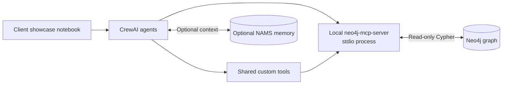

# CrewAI + Neo4j Client Showcase

[](https://www.python.org/downloads/)
[](https://www.crewai.com/)
[](https://neo4j.com/)
[](https://modelcontextprotocol.io/)

This integration is delivered as a guided, client-facing notebook. It demonstrates CrewAI orchestration with Neo4j, optional Neo4j Agent Memory Server (NAMS), local MCP, and the repository's shared custom tools. No web service or browser application is required.

## Client Workflow

Open and run [`notebooks/crewai_neo4j_walkthrough.ipynb`](notebooks/crewai_neo4j_walkthrough.ipynb). Its dedicated sections cover:

1. Installing the integration and shared custom-tool dependencies.
2. Loading a local, untracked configuration file.
3. Discovering the local stdio MCP tools.
4. Calling the MCP schema tool to verify Neo4j connectivity.
5. Inspecting the shared custom tools available to CrewAI.
6. Asking a natural-language graph question.
7. Creating a multi-agent company intelligence briefing when the graph has the required Companies/News schema.



## Setup

From a repository checkout:

```bash
cd crewai
python3 -m venv .venv
source .venv/bin/activate
pip install -r requirements.txt
pip install -e .
cp .env.example .env
cd notebooks
jupyter notebook crewai_neo4j_walkthrough.ipynb
```

The notebook's installation cell uses these same relative paths. Keep credentials exclusively in `crewai/.env`; do not add them to the notebook or commit that file.

### Configuration

Set these values in `crewai/.env`:

```ini
OPENAI_API_KEY=your-openai-api-key
OPENAI_MODEL_NAME=gpt-5.4-mini

NEO4J_URI=neo4j+s://<instance-id>.databases.neo4j.io
NEO4J_USERNAME=<database-username>
NEO4J_PASSWORD=<database-password>
NEO4J_DATABASE=<database-name>

MCP_SERVER_COMMAND=neo4j-mcp-server
NEO4J_TELEMETRY=false

# Optional NAMS configuration
MEMORY_API_KEY=
MEMORY_WORKSPACE_ID=
```

The official `neo4j-mcp-server` runs locally as a stdio subprocess. The integration forwards the Neo4j settings above to the MCP server and configures it for read-only use; no hosted MCP endpoint or OAuth credentials are needed.

## Choosing a Demonstration

Use the natural-language question section for any graph, especially a NAMS graph. The model can select local MCP tools such as `read-cypher` to explore its actual schema.

The full company briefing and some shared custom tools assume a Companies/News graph with labels such as `Organization`, `Article`, and `IndustryCategory`. They may correctly return no results for a NAMS-only graph. The notebook calls this out before the briefing section.

Set `CREW_VERBOSE=true` in `.env` to see CrewAI's tool calls and reasoning trace in notebook output.

## Validation

The notebook's MCP verification section performs a live read-only schema call. The repository test suite also verifies MCP discovery, generated tool schemas, custom-tool adapters, memory helpers, and crew construction:

```bash
cd crewai
pytest
ruff check agent tests
```
