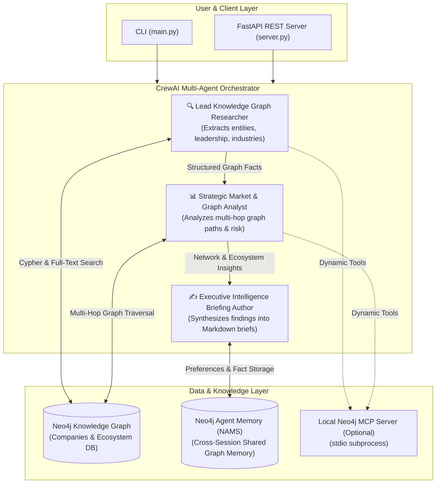
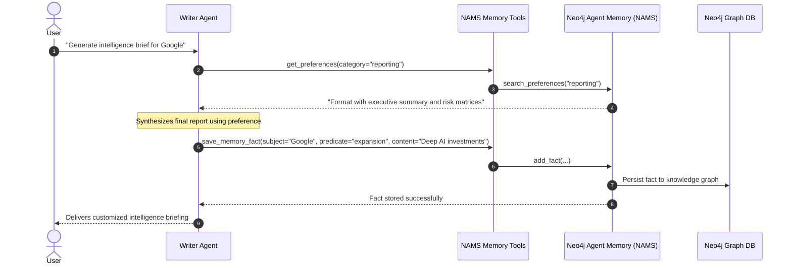
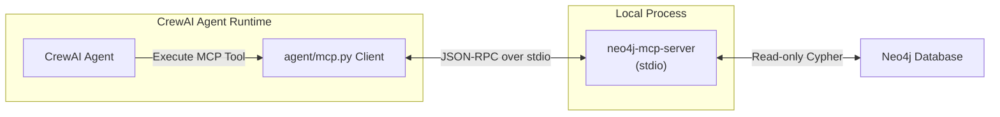

# CrewAI + Neo4j Agent Integrations

[](https://www.python.org/downloads/)
[](https://www.crewai.com/)
[](https://neo4j.com/)
[](https://memory.neo4jlabs.com/)
[](https://modelcontextprotocol.io/)

Production-grade multi-agent orchestration with **CrewAI**, integrated with the **Neo4j Knowledge Graph**, **Neo4j Agent Memory Server (NAMS)** for cross-session long-term context, and local **Model Context Protocol (MCP)** tool discovery.

---

## Architecture Overview

This integration demonstrates how specialized AI agents collaborate sequentially to research, analyze, and synthesize deep graph intelligence from Neo4j without hallucinations.



---

## Key Capabilities

1. **Multi-Agent Orchestration & Task Delegation**:
   - **Researcher Agent**: Executes parameterized Cypher queries and full-text index lookups for organizations, leadership rosters, and sector taxonomies.
   - **Analyst Agent**: Traverses multi-hop relationship paths (`o1-[*1..2]-o2`) to uncover hidden corporate ties, investor networks, and supply chain dependencies.
   - **Writer Agent**: Formats the final executive intelligence briefing, recalls formatting guidelines from memory, and commits key analytical takeaways.

2. **Neo4j Knowledge Graph Tools**:
   - `search_companies`: Full-text Lucene index search with automatic fallback.
   - `query_company_profile`: Enriched company metadata, locations, and executive/board leadership.
   - `analyze_company_relationships`: Multi-hop path exploration with cycle prevention and depth clamping.
   - `run_cypher_query`: Safe, read-only Cypher query execution with injection protection.
   - `list_industry_categories`: Sector taxonomy inspection.

3. **Neo4j Agent Memory (NAMS) Integration**:
   - Cross-session memory and shared context graph across all crew members.
   - Tools: `search_memory`, `save_memory_fact`, and `get_preferences`.
   - Allows agents to remember prior analyses and adapt to user reporting preferences.

4. **Model Context Protocol (MCP) Support**:
   - Runs the official `neo4j-mcp-server` locally over stdio; no hosted MCP endpoint or OAuth credentials are required.
   - Forwards the integration's Neo4j credentials to the MCP server and defaults its tools to read-only mode.
   - Discovers local MCP tools and exposes them to the researcher and analyst agents.

5. **Production Deployment Options**:
   - CLI execution script (`main.py`).
   - Production FastAPI application (`server.py`) with OpenAPI documentation.
   - Taskfile automation for developer workflows (`Taskfile.yml`).

---

## Memory Flow (NAMS)



---

## Local MCP Architecture



---

## Quick Start

### 1. Prerequisites
- Python 3.10+
- OpenAI API Key (or any LiteLLM-supported provider key)
- Neo4j Database (public demo DB provided by default)

### 2. Installation

Clone repository and navigate to `crewai/`:

```bash
cd crewai
python3 -m venv .venv
source .venv/bin/activate
pip install -r requirements.txt
pip install -e .
```

Alternatively, with [Task](https://taskfile.dev/):
```bash
task install
```

### 3. Configure Environment

Copy `.env.example` to `.env` and set your credentials:

```bash
cp .env.example .env
```

```ini
OPENAI_API_KEY=your-openai-api-key
OPENAI_MODEL_NAME=gpt-5.4-mini

# Pre-configured public demo database:
NEO4J_URI=neo4j+s://demo.neo4jlabs.com:7687
NEO4J_USERNAME=companies
NEO4J_PASSWORD=companies
NEO4J_DATABASE=companies

# Optional local MCP tools. The server receives the Neo4j settings above.
MCP_SERVER_COMMAND=neo4j-mcp-server
```

For an Aura instance, replace the `NEO4J_*` values with the connection details
from the Aura console:

```ini
NEO4J_URI=neo4j+s://<instance-id>.databases.neo4j.io
NEO4J_USERNAME=<database-username>
NEO4J_PASSWORD=<database-password>
NEO4J_DATABASE=<database-name>

# Optional metadata for external deployment tooling; the application does not
# use these to establish the database connection.
AURA_INSTANCEID=<instance-id>
AURA_INSTANCENAME=<instance-name>
```

To enable local MCP tools, install the MCP dependency group:

```bash
pip install -e ".[mcp]"
```

### 4. Chat in Your Browser

Start the FastAPI server:

```bash
task server
# or
uvicorn server:app --host 127.0.0.1 --port 8000
```

Open [http://127.0.0.1:8000](http://127.0.0.1:8000) and ask normal-language
questions about the graph. The chat interface uses `/api/v1/query`; each message
is an independent agent run that can use the built-in Neo4j tools and optional
local MCP tools. When `MCP_SERVER_COMMAND` is configured, normal-language
queries use the local MCP tools for graph access.

### 5. Run the Full Research Crew

Run a complete company intelligence workflow:

```bash
python main.py --company "Google" --output "google_brief.md"
```

Or via Taskfile:
```bash
task run -- "Microsoft"
```

---

## Running Tests

Run the comprehensive pytest test suite covering Neo4j tools, NAMS memory, MCP integration, and multi-agent crew orchestration:

```bash
task test
# or
pytest -vv tests/
```

---

## Production Deployment

### 1. FastAPI REST Server and Chat Interface

Start the production API server:

```bash
task server
# or
uvicorn server:app --host 0.0.0.0 --port 8000
```

Open [http://localhost:8000](http://localhost:8000) for the chat interface. It
submits normal-language requests to the query API and displays the response in
the conversation. API documentation remains available at
[http://localhost:8000/docs](http://localhost:8000/docs).

Trigger research runs programmatically:

```bash
curl -X POST http://localhost:8000/api/v1/research \
  -H "Content-Type: application/json" \
  -d '{"company_name": "Apple", "output_file": "apple_report.md"}'
```

### 2. Natural-Language Queries

Send a normal-language request to the graph intelligence assistant. It can use
the built-in Neo4j tools and optional local MCP tools to answer the request. This
endpoint is stateless; persist conversation state externally if your application
requires multi-turn context.

```bash
curl -X POST http://localhost:8000/api/v1/query \
  -H "Content-Type: application/json" \
  -d '{"query": "Which organizations are connected to Google?"}'
```

### 3. Docker Deployment

```dockerfile
FROM python:3.11-slim
WORKDIR /app
COPY requirements.txt .
RUN pip install --no-cache-dir -r requirements.txt
COPY . .
CMD ["uvicorn", "server:app", "--host", "0.0.0.0", "--port", "8000"]
```

---

## Resources

- **CrewAI Documentation**: https://docs.crewai.com/
- **Neo4j Agent Memory (NAMS)**: https://memory.neo4jlabs.com/
- **Neo4j Official Website**: https://neo4j.com/
- **Model Context Protocol**: https://modelcontextprotocol.io/
