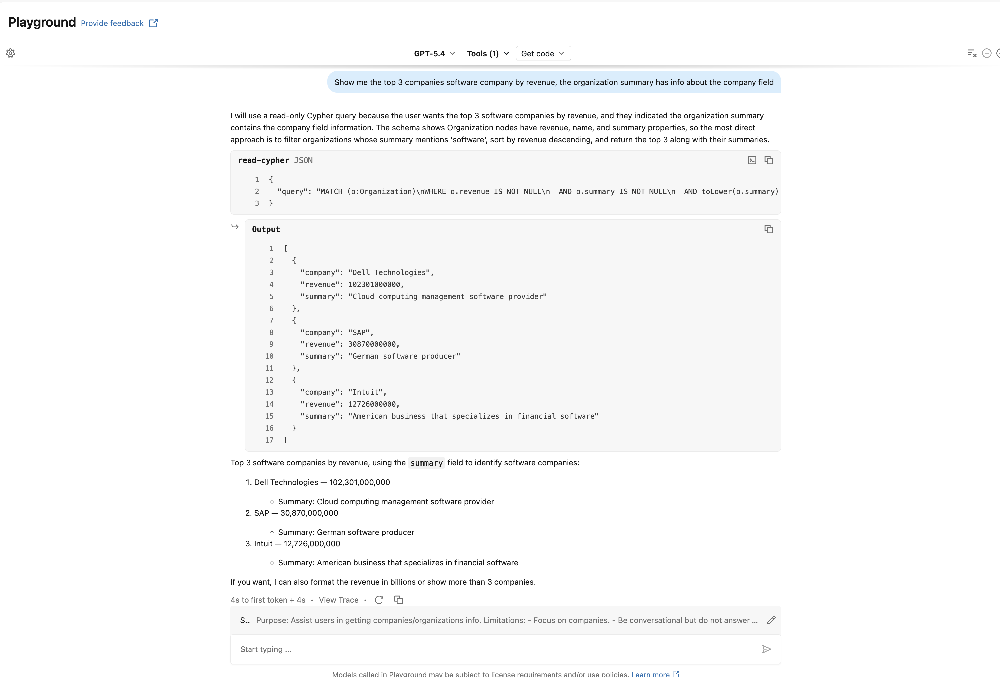

# 1. Databricks Official MCP server (Neo4j via Databricks App)

## Introduction

This guide demonstrates how to deploy the **Official Neo4j MCP Server** using **Databricks Apps**.

This setup allows you to use the official Neo4j **MCP Tools** to interact with a remote Neo4j instance, directly from Databricks apps.  

By following this guide, you can expose Neo4j based MCP Tools and interact with them using the Databricks Agent capabilities, enabling integration with LLM agents or other workflows.

The example shows the full setup to deploy and use the Official Neo4j MCP Server.

---

## Preliminary Notes

This integration pattern fits really well when you need to leverage graph knowledge alongside your Databricks data.
The following example uses the neo4j-mcp-server python package, that encapsulate the official MCP server.

---

## Architecture Overview

-> Databricks Agent / Playground

-> Databricks App defined upon Official MCP Server

-> Proxy to drive requests to the python package

-> Neo4j Database (e.g., demo.neo4jlabs.com / companies dataset)

## Key points:

- The Official Python Neo4j MCP Server exposes the tools to interact with Neo4j.
- A Proxy is the entry point for the Databrikcs App, it controls the requests to the MCP Server.
- The Databricks App is synced with the server.
- The LLM or agent interacts with the MCP Tools.
- The Neo4j connection is secured using SSL.

## Advantages

- No Code & Low infrastructure (Databricks App).
- Fast Prototyping (Local Tests).
- Allows for Complex Scenarios implementation.
- Automatic permission inheritance.
- Credentials hided behind Databricks secrets.
- Schema-level exposure (multiple functions → multiple tools)
- Works in Playground immediately

## Limitations

- Python only.

## Prerequisites

- Databricks Subscription with Compute capabilities.
- Databricks CLI installed on your PC.

## Implementation

### Step 1 - Setup the environment

The first thing to do is to define the Databricks secrets for the Neo4j credentials. An env file and a script are provided to automate the process.

1. Copy the sample env file and fill in your credentials:

```
cp .env.sample .env
```

See [.env.sample](.env.sample) for the required variables.

2. Run the setup script to upload your secrets to Databricks:

```
./setup_secrets.sh
```

See [setup_secrets.sh](setup_secrets.sh) for the full script.

After running the script in the terminal, the secrets will be stored in the Databricks environment.

### Step 2 - Implement the MCP Server

In this guide, the App is kept as simple as possible but you can easly extend it.

#### Project Structure

```
official_neo4j_mcp_server
└───app
   │   app.py
   │   app.yaml
   │   requirements.txt
   |   neo4j_mcp_server_process.py
```

First we define a YAML file that will instruct the Databricks App to bind Databricks Secrets to Environment Variables. See [app/app.yaml](app/app.yaml).

Second we define the Python requirements file. See [app/requirements.txt](app/requirements.txt).

Third we implement the `neo4j_mcp_server_process.py` that will simply launch the process and add some control to it. See [app/neo4j_mcp_server_process.py](app/neo4j_mcp_server_process.py).

Finally we implement the entry point of the app that will interact with the Neo4j MCP Server. It consists of a uvicorn app that accepts requests and forwards them to the Neo4j MCP process, adding the authentication header for the MCP server to properly authenticate the request. See [app/app.py](app/app.py).

You can also test the server locally using a client. See [client.py](client.py).

### Step 3 - Create the Databricks App

Now we can create the Databricks App that will use our custom Python MCP Server.

**It is important that the app name starts with "mcp-", otherwise Databricks will not be able to treat it as an MCP.**

Run the deploy script to create, sync, and deploy the app with secret resources automatically configured. See [deploy.sh](deploy.sh) and [databricks.yml](databricks.yml).

```
./deploy.sh --app-name mcp-<app_name> [--profile <databricks-profile>]
```

The deploy script uses Databricks Asset Bundles to create the app and bind the secrets from Step 1 as app resources automatically.

Check your Workspace to review the app name and the synced files.

The App is associated with a Service Principal, be sure that it has the grants to read secrets.

## Test & Use

### Playground

In the `Playground` select the custom MCP Server from `Tools -> Add Tool -> MCP Servers (Tab)`, add a System Prompt like the following and start asking your first question: `What are the competitors of BigFix?`

```
Purpose: Assist users in getting companies/organizations info.

Limitations:
- Focus on companies.
- Be conversational but do not answer any unrelated queries that are not related to companies.
- Handle queries for multiple companies.
- If there is no company information, do not attempt to retrieve otherwise – inform the user with an appropriate error message.

Data Sources:
- Use the mcp tools you have been provided when requested with questions about companies.

Error Handling:
- Provide clear error messages if Neo4j Connection calls fail.

Sample Questions:
- "What are the competitors of 'BigFix'?"
-"Show me the top 3 companies software company by revenue, the organization summary has info about the company field"
```

The LLM will use the MCP Server to retrieve the information from Neo4j and it will prompt the natural language response.
If the Model states that it cannot use the MCP Server try to switch to another model as Claude Opus 4.6



Note: it is possible to use many Tools coming from different source at the same time (External MCPs, UC Functions, etc...) , giving you the possibility to create more complex agents.

Now that we tested the Agent capabilities, we are ready to use it.

### External use of the Databricks App

From Compute -> Apps you will find the public url associated with your app, alternatively, select your App, in the Status you will find the public url as well.

Now, to integrate the app in your code project, or share it with your team, you need a databricks token and a Client (e.g. Cloude).

```
databricks auth token -p <your-profile>
```

Here an example of a simple Python client with Workspace authentication. See [client_workspace.py](client_workspace.py).

You can also publish your App into the Databricks Marketplace.


