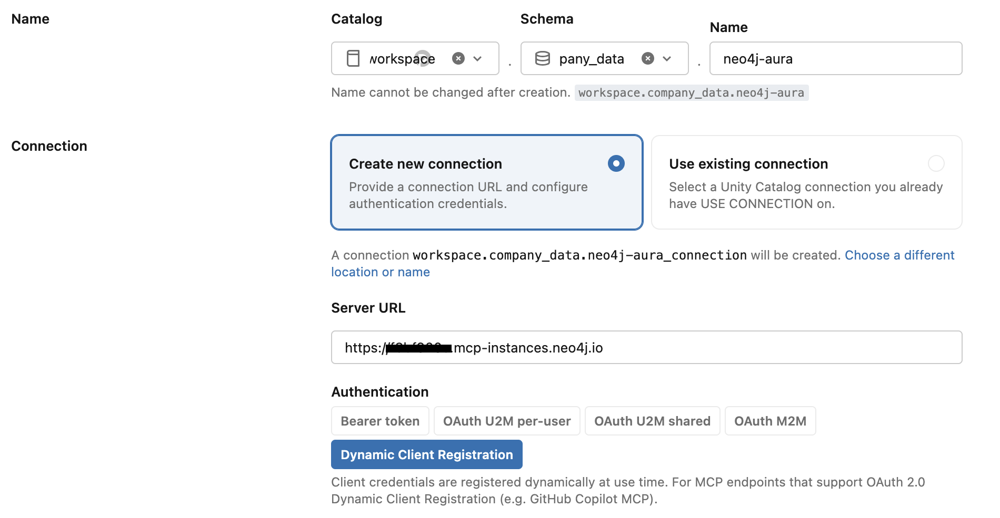
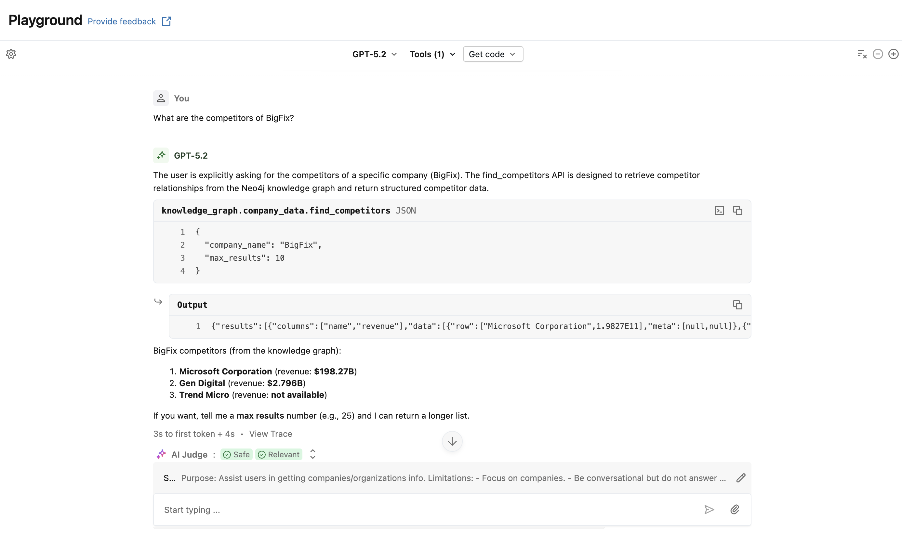

# MCP over Unity AI Gateway (Neo4j Aura MCP)

## Introduction

This guide demonstrates how to connect a **Neo4j Aura MCP server** to Databricks through **Unity AI Gateway**.

Unity AI Gateway manages the MCP connection and its authentication, while Unity Catalog governs who can use it. The MCP server could be self-managed, as in [samples 3 and 4](../../README.md#samples), but this sample uses the MCP endpoint provided for a Neo4j Aura instance and authenticates users with OAuth.

After completing the guide, you can discover and call Neo4j MCP tools from a Databricks notebook or add them to an agent in AI Playground. No Aura credentials are stored in the notebook.

---

## Preliminary Notes

This sample focuses on an interactive, per-user OAuth flow. Each user must authorize the connection with their Aura account before using it.

---

## Architecture Overview

-> Databricks Notebook / AI Playground

-> Unity AI Gateway MCP Service

-> Unity Catalog HTTP Connection (OAuth)

-> Neo4j Aura MCP Server

-> Neo4j Aura Instance

## Key points

- Unity AI Gateway proxies MCP requests and keeps Aura OAuth tokens out of notebooks and agent code.
- The MCP service is registered as a three-level Unity Catalog object and can be governed with Unity Catalog permissions.
- The Aura MCP endpoint is bound to one Aura instance through the instance ID in its URL.
- Aura supports OAuth 2.0 Dynamic Client Registration, so Databricks can discover the OAuth endpoints and register a client automatically.

## Advantages

- No MCP server to deploy or maintain.
- OAuth registration, consent, and token refresh are managed by Databricks.
- Centralized access control and auditing through Unity Catalog and Unity AI Gateway.
- The same connection works in notebooks and AI Playground.

## Limitations

- Each Aura instance has a different MCP URL and therefore needs its own connection.
- Each user must complete the Aura OAuth consent flow before first use.
- Availability depends on Databricks workspace support for Unity AI Gateway, MCP services, and Model Serving.

## Prerequisites

- A Neo4j Aura instance and permission to access it through the Aura Console.
- A Unity Catalog-enabled Databricks workspace with MCP services available.
- Permission to create a Unity Catalog connection and MCP service in the target catalog and schema.
- A Databricks model with tool calling enabled for the Playground test.

## Implementation

### Step 1 - Configure the MCP Connection

First, retrieve the MCP URL for the Aura instance. In the Aura Console, open the instance details and copy the **MCP URL**, or build it from the instance ID:

```text
https://<AURA_INSTANCE_ID>.mcp-instances.neo4j.io
```

The instance ID is part of the hostname. The URL is therefore bound to that specific Aura instance; do not use the Bolt connection URI or reuse another instance's MCP URL.

In Databricks:

1. Go to **AI Gateway > MCPs** and select **Register MCP Server**.
2. Choose the catalog, schema, and name for the MCP service. This guide uses `workspace.company_data.neo4j-aura`.
3. Select **Create new connection**.
4. Enter the Aura MCP URL as the **Server URL**.
5. Select **Dynamic Client Registration** for authentication.
6. Create the MCP service.



Dynamic Client Registration means that no static OAuth client ID or secret is needed. Aura publishes the OAuth metadata required for Databricks to register a client dynamically. Databricks then manages the per-user authorization and token refresh.

Before the first call, open the new MCP service in Catalog Explorer, click **Login**, and complete the Aura OAuth consent flow. Sign in with the account that has access to the Aura instance. After authorization, Databricks discovers and displays the available Neo4j tools.

### Step 2 - Test the MCP Connection in a Notebook

Create a Databricks notebook and install the MCP client:

```python
%pip install -U "mcp>=1.9" "databricks-sdk[openai]" "mlflow>=3.1.0" "databricks-agents>=1.0.0" "databricks-mcp"
dbutils.library.restartPython()
```

Create a client for the Unity AI Gateway endpoint and list the tools exposed by the Aura MCP server:

```python
from databricks_mcp import DatabricksMCPClient
from databricks.sdk import WorkspaceClient
import nest_asyncio

# Enable nested event loops for notebook environment
nest_asyncio.apply()

workspace_client = WorkspaceClient(profile="DEFAULT")
host = workspace_client.config.host

# Use a managed, MCP Service, or custom server URL:
mcp_server_url = f"{host}/ai-gateway/mcp-services/workspace.default.neo4j-aura"

mcp_client = DatabricksMCPClient(server_url=mcp_server_url, workspace_client=workspace_client)
tools = mcp_client.list_tools()
print(f"Available tools: {[t.name for t in tools]}")
```

The result should include Neo4j tools such as `get-schema` and `read-cypher`. Test the connection with a read-only call:

```python
query = """
MATCH (c:Organization {{name: 'Neo4j'}})-[:HAS_COMPETITOR]->(competitor:Organization)
RETURN competitor.name as name, competitor.revenue as revenue
LIMIT 5
"""
response = mcp_client.call_tool("read-cypher", {"query": query})
display(response)
```

If Databricks reports that authentication is required, return to the MCP service detail page and complete the **Login** flow for the current user.

### Step 3 - Explore the MCP Server in AI Playground

Once the notebook test succeeds:

1. Open **AI Playground**.
2. Select a model with tool calling enabled.
3. Select **Tools > Add tool > MCP Servers**.
4. Select **External MCP servers**, then choose `workspace.company_data.neo4j-aura`.
5. Ask the model a question about the data in the Aura instance.

For example, start with:

```text
What are the competitors of BigFix?
```

The model should first use `get-schema` to understand the graph and then use `read-cypher` to retrieve the answer. Review the tool-call trace in Playground to inspect the generated Cypher and the result returned through Unity AI Gateway.

The LLM will use the MCP connection to retrieve the information from Neo4J and it will prompt the natural language response.




## Additional Resources

- [Register an external MCP server in Databricks](https://docs.databricks.com/aws/en/ai-gateway/register-mcp-service)
- [Use MCP servers in Databricks agents](https://docs.databricks.com/aws/en/agents/mcp-tools/use-mcp-in-agents)
- [Introducing MCP for Aura: Hosted MCP, built into every Aura instance](https://neo4j.com/blog/genai/introducing-mcp-for-aura/)
- [Neo4j MCP for Aura quickstart](https://neo4j.com/docs/mcp/current/quickstart/)
