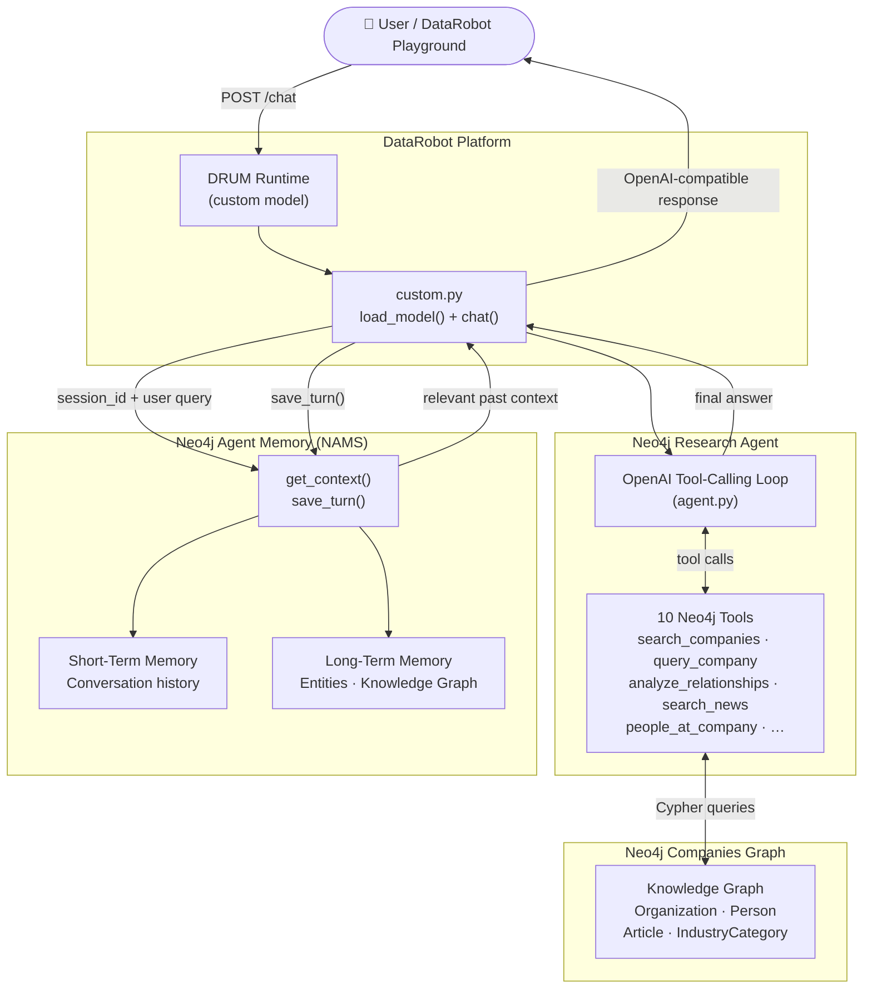

# DataRobot + Neo4j Integration

## Overview

This integration packages a **Neo4j-backed research agent** as a DataRobot **Agentic Workflow** custom model.  
It also integrates **Neo4j Agent Memory (NAMS)** so the agent remembers context across sessions.

**What this example demonstrates:**
- DataRobot custom-model `load_model()` + `chat()` entrypoints
- 10 Neo4j graph tools exposed to an OpenAI tool-calling loop
- Persistent cross-session memory via `neo4j-agent-memory` (NAMS)
- Local CLI runner that mirrors the exact DataRobot execution path
- ZIP packaging + DataRobot API validation helpers

---

## Architecture



---

## Files

```
datarobot/
├── .env.example            ← copy to .env and fill in secrets
├── README.md
├── requirements.txt        ← top-level deps for local use
├── run_local.py            ← CLI test harness (same path as DataRobot)
├── datarobot_agent.ipynb   ← Jupyter demo notebook
├── agent/
│   ├── __init__.py
│   ├── agent.py            ← Neo4jResearchAgent + 10 tools
│   ├── custom.py           ← DataRobot entrypoints (load_model / chat)
│   ├── helpers.py          ← prompt helpers + response formatting
│   ├── memory.py           ← NAMS integration (graceful no-op if absent)
│   ├── model-metadata.yaml ← DataRobot runtime parameter definitions
│   └── requirements.txt    ← deps bundled into the DataRobot ZIP
└── infra/
    ├── __init__.py
    └── agent.py            ← ZIP packager + DataRobot API validator
```

---

## Quick Start (local)

```bash
cd datarobot
python3 -m venv .venv && source .venv/bin/activate
pip install -r requirements.txt
cp .env.example .env
# fill in OPENAI_API_KEY, and optionally MEMORY_API_KEY
python run_local.py "Give me a competitive snapshot of Google"
```

### With memory enabled

```bash
# Get a free NAMS key at https://memory.neo4jlabs.com
echo "MEMORY_API_KEY=nams_..." >> .env
python run_local.py "Tell me about Apple"
python run_local.py "How does it compare to the company we discussed?"  # agent remembers Apple
```

---

## Agent Memory integration

The agent uses [`neo4j-agent-memory`](https://pypi.org/project/neo4j-agent-memory/) (Python SDK).  
Memory is **optional and non-blocking**: if the package is absent or `MEMORY_API_KEY` is not set, every call silently no-ops and the agent works normally.

| Step | What happens |
|---|---|
| Request arrives | `session_id` derived from `user` field or a hash of the first user message |
| Pre-run | `memory.get_context()` fetches relevant past-session context from NAMS |
| Context found | Prepended as a `system` message so the LLM is aware of prior interactions |
| Post-run | `memory.save_turn()` persists the user message + assistant response to NAMS short-term memory |

`memory.py` wraps all async NAMS calls in `asyncio.run()` so the synchronous DataRobot `chat()` interface works without changes.

---

## Neo4j tools

| Tool | Description |
|---|---|
| `search_companies` | Full-text company lookup |
| `list_industries` | List all industry categories |
| `companies_in_industry` | Companies in a specific industry |
| `query_company` | Company profile — summary, industries, locations, leadership |
| `analyze_relationships` | Org-to-org graph traversal (depth 1–4) |
| `people_at_company` | Executives and board members by company_id |
| `search_news` | Semantic news search (vector similarity) |
| `articles_in_month` | Articles published in a given month |
| `get_article` | Full article body by article_id |
| `companies_in_article` | Organizations mentioned in an article |

---

## DataRobot packaging & deployment

### 1. Package

```bash
python infra/agent.py package
# → datarobot/dist/neo4j_datarobot_agent.zip
```

### 2. Upload to DataRobot

1. Open **DataRobot → Registry → Custom Models → Create Custom Model**
2. Upload `dist/neo4j_datarobot_agent.zip`
3. Set **Target Type** = `Agentic Workflow`
4. Add runtime parameters from `agent/model-metadata.yaml` (see table below)

### 3. Validate access

```bash
python infra/agent.py validate
```

> In Zscaler / corporate-proxy environments this returns HTTP 403 before reaching DataRobot. Run from a network-open machine.

---

## Runtime parameters

| Parameter | Purpose | Default |
|---|---|---|
| `OPENAI_API_KEY` | OpenAI API key | _(required)_ |
| `OPENAI_MODEL` | Chat model | `gpt-4o-mini` |
| `OPENAI_EMBEDDING_MODEL` | Embedding model for semantic search | `text-embedding-3-small` |
| `NEO4J_URI` | Neo4j connection string | `neo4j+s://demo.neo4jlabs.com:7687` |
| `NEO4J_USERNAME` | Neo4j username | `companies` |
| `NEO4J_PASSWORD` | Neo4j password | _(required)_ |
| `NEO4J_DATABASE` | Neo4j database name | `companies` |
| `MEMORY_API_KEY` | NAMS API key — leave blank to disable memory | _(optional)_ |
| `AGENT_MAX_TOOL_STEPS` | Max tool-call iterations per request | `6` |

---

## Notes

- Secrets are loaded from DataRobot runtime parameters first; `.env` is only used for local development.
- The NAMS Python SDK requires **Python ≥ 3.10**. DataRobot's runtime satisfies this. For local testing on Python 3.9, memory will silently disable itself.
