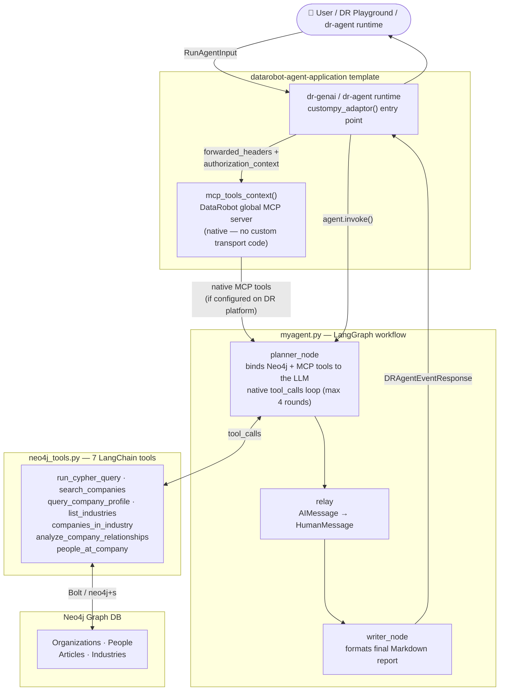
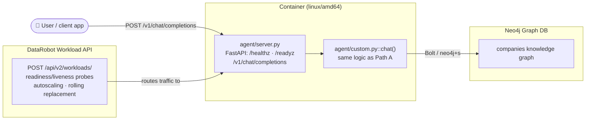

# DataRobot + Neo4j Integration

## Overview

This integration packages a **Neo4j-backed research agent** for DataRobot in **three supported forms**:

| Path | Files | Deployment target | When to use |
|---|---|---|---|
| **A. DRUM custom model** (original) | `agent/custom.py`, `agent/agent.py`, `agent/mcp_client.py`, `agent/memory.py` | Registry → Workshop → Agentic Workflow custom model | Simple, dependency-light deployment; full control over the OpenAI tool-calling loop; works today with `infra/agent.py deploy` |
| **B. `datarobot-agent-application` template** (recommended by DataRobot) | `agent/myagent.py`, `agent/neo4j_tools.py` | `dr-genai` / `dr-agent` runtime via the [`datarobot-agent-application`](https://github.com/datarobot-community/datarobot-agent-application) template + `task deploy` | Aligns with DataRobot's native MCP server, LangGraph orchestration, governance/lineage tracking, and Agentic Memory Service |
| **C. Workload API** (DataRobot's published container-deployment API) | `agent/server.py`, `Dockerfile`, `infra/workload.py` | Container image → `POST /api/v2/workloads/` → managed autoscaled service | The platform-native deployment mechanism DataRobot is moving to as Custom Model support winds down; reuses Path A's `agent/custom.py::chat()` logic behind a plain HTTP server. See [Workload API docs](https://docs.datarobot.com/en/docs/api/dev-learning/workload-api/overview.html) |

Path A and Path B share the same Neo4j **companies** knowledge graph and can be extended with:

| Extension | Purpose | Config var(s) |
|---|---|---|
| **Neo4j Agent Memory (NAMS)** | Cross-session memory backed by a knowledge graph (Path A) | `MEMORY_API_KEY`, `MEMORY_WORKSPACE_ID` |
| **MCP (Model Context Protocol)** | Dynamically load tools from any MCP server (Path A) or DataRobot's global MCP server (Path B) | `MCP_SERVER_URL`, `MCP_AUTH_TOKEN` _(optional, Path A)_ |

> **Why three paths?** Path A was built first and is fully working today. After deploying it, DataRobot's team recommended aligning with their `datarobot-agent-application` template (native MCP server, `dr-genai`/`dr-agent` runtimes, governance lineage on `task deploy`) — that's Path B. DataRobot has since published the **Workload API** ([overview](https://docs.datarobot.com/en/docs/api/dev-learning/workload-api/overview.html)) as the platform's forward-looking, container-native deployment mechanism, replacing Custom Model deployment — that's Path C. Path C packages the exact same agent logic (`agent/custom.py::chat()`) as a container, deployed via `POST /api/v2/workloads/` instead of the Registry/Workshop custom-model flow. Path A remains functional for teams still on Custom Model deployment; Path C is the path to migrate to as that support winds down.

---

## Architecture (Path A — DRUM custom model)


---

## Files

```
datarobot/
├── .env.example
├── README.md
├── requirements.txt
├── requirements-nat.txt    ← [Path D] NeMo Agent Toolkit / dragent dependencies
├── pyproject.toml          ← [Path D] packages agent/nat_tools.py + nat_memory.py as a NAT plugin
├── run_local.py            ← local CLI test for Path A (mirrors DataRobot DRUM execution)
├── datarobot_agent.ipynb   ← Jupyter demo notebook (Path A)
├── Dockerfile               ← [Path C] linux/amd64 image for the Workload API container
├── agent/
│   ├── __init__.py
│   ├── agent.py            ← [Path A] Neo4jResearchAgent + 10 tools + MCP tool loader
│   ├── custom.py           ← [Path A] DataRobot load_model() + chat() with memory
│   ├── helpers.py          ← [Path A] prompt helpers + response formatting
│   ├── memory.py           ← [Path A] NAMS integration (graceful no-op if absent)
│   ├── mcp_client.py       ← [Path A] MCP client (graceful no-op if absent/unconfigured)
│   ├── model-metadata.yaml ← [Path A] DataRobot runtime parameter definitions
│   ├── myagent.py          ← [Path B] LangGraph agent for datarobot-agent-application template
│   ├── neo4j_tools.py      ← [Path B] LangChain-compatible Neo4j tools (7 tools)
│   ├── server.py            ← [Path C] FastAPI wrapper around custom.py::chat() for the Workload API
│   ├── nat_tools.py        ← [Path D] Neo4j tools registered as native NAT functions (MCP-servable)
│   ├── nat_memory.py       ← [Path D] NAMS-backed NAT MemoryEditor plugin (neo4j_agent_memory)
│   ├── workflow.yaml       ← [Path D] NeMo Agent Toolkit workflow (llm + memory + tools + agent)
│   └── requirements.txt    ← deps bundled in DataRobot ZIP (all paths)
└── infra/
    ├── __init__.py
    ├── agent.py            ← [Path A] ZIP packager · DR API validator · automated deploy
    └── workload.py           ← [Path C] Workload API create/status/logs/delete CLI
```

---

## Quick Start (local)

```bash
cd datarobot
python3 -m venv .venv && source .venv/bin/activate
pip install -r requirements.txt
cp .env.example .env
# fill in OPENAI_API_KEY; optionally MEMORY_API_KEY, MEMORY_WORKSPACE_ID, MCP_SERVER_URL
python run_local.py "Give me a competitive snapshot of Google"
```

> **Troubleshooting: `neo4j.exceptions.ServiceUnavailable: Unable to retrieve routing information`**
> This means the driver connected but couldn't complete its routing-table handshake — common in
> GitHub Codespaces / devcontainers / restrictive corporate networks where the `ROUTE` bolt
> message is blocked/mangled even though a direct connection on port 7687 works fine. Fix by
> switching the URI scheme from routing (`neo4j+s://`) to direct (`bolt+s://`) in `.env`, which
> skips the routing-table fetch entirely:
> ```
> NEO4J_URI=bolt+s://demo.neo4jlabs.com:7687
> ```
> (The `401 Unauthorized` you may also see from `MCP list_tools failed (non-fatal): ...` in the
> same run is expected/harmless if `MCP_SERVER_URL`/`MCP_AUTH_TOKEN` aren't configured — MCP is
> optional and fails open.)
>
> **Still failing with `ssl.SSLCertVerificationError: certificate has expired` /
> `BoltSecurityError`?** As of **2026-07-06**, `demo.neo4jlabs.com`'s TLS certificate has
> expired (confirmed via `openssl s_client` from multiple independent networks, including
> Google Cloud infrastructure — this is a live issue with the shared demo database, not a
> per-user network problem). Corporate TLS-inspecting proxies can produce an
> identical-looking error for a different reason — they re-sign connections with their own
> intercept certificate, which can itself have expired independently. Confirm which case you're
> in with:
> ```
> echo | openssl s_client -connect demo.neo4jlabs.com:7687 -servername demo.neo4jlabs.com \
>   2>/dev/null | openssl x509 -noout -dates -issuer
> ```
> If `issuer` shows your company's name, it's your corporate proxy —
> ask IT to renew the intercept certificate, or run from a network without TLS inspection for
> `*.neo4jlabs.com`. If `issuer` shows a public CA, the demo database's own certificate has
> expired — this needs to be renewed by whoever manages `demo.neo4jlabs.com`; no `.env` or code
> change in this repo can fix it. Either way, this is external to the agent code — once the
> relevant certificate is renewed, no further changes are needed here.

---

## Neo4j Agent Memory (NAMS)

```bash
# Get a free key at https://memory.neo4jlabs.com
# MEMORY_WORKSPACE_ID is issued alongside your key from the NAMS dashboard/console —
# it is NOT reliably derivable from the key string itself (see note below).
MEMORY_API_KEY=nams_... MEMORY_WORKSPACE_ID=<workspace-id> python run_local.py "Tell me about Apple"
# Next session will have context from the first one
```

How it works in `custom.py`:

| Step | Action |
|---|---|
| Request arrives | `session_id` derived from `user` field or hash of first message |
| Pre-run | `memory.get_context()` fetches relevant past-session context from NAMS |
| Context found | Prepended as a `system` message so the LLM knows prior interactions |
| Post-run | `memory.save_turn()` persists user message + response to NAMS |

Memory is **non-blocking** — if `MEMORY_API_KEY` is absent or the package is not installed, every call is a silent no-op. If `MEMORY_API_KEY` **is** set but a NAMS call still fails (bad key, missing workspace, network issue), `memory.py` logs a one-time `WARNING` (visible even with no logging configuration) explaining the failure instead of swallowing it silently — the agent still keeps running without memory context.

> **`MEMORY_WORKSPACE_ID`** — required by some NAMS deployments (sent as the `X-Workspace-Id` header). **This is a real workspace ID issued by NAMS, not a segment you can parse out of the API key** — during end-to-end testing, guessing the workspace ID from the key's `nams_<segment>_<secret>` shape produced a `403: this key is bound to a different workspace` error; the correct value was an unrelated UUID from the NAMS dashboard. If you see `503: workspace_not_provisioned` in the warning above, double-check `MEMORY_WORKSPACE_ID` against your NAMS dashboard/console rather than guessing it from the key.
>
> **Conversation IDs are server-assigned, not client-chosen.** NAMS's `POST /conversations` always mints its own UUID regardless of any id passed in — it does not accept our locally-derived `session_id` as the real conversation identifier. `memory.py` accounts for this by keeping a small local cache (`.nams_conversation_cache.json`, gitignored) mapping each local session key to the real NAMS-issued UUID, created once and reused on every later call. This gives correct multi-turn continuity for a single process/replica; in a multi-replica deployment, memory continuity is scoped per-replica since each keeps its own cache.

---

## MCP Integration

When `MCP_SERVER_URL` is set, the agent **discovers tools dynamically** from the MCP server at startup and makes them available to the LLM alongside the built-in Neo4j tools.

```bash
# Neo4j MCP official server (uses NEO4J_USERNAME/PASSWORD for Basic auth automatically)
MCP_SERVER_URL=https://neo4j-mcp-official-1008050579172.us-central1.run.app/mcp \
  python run_local.py "What schema does my Neo4j database have?"

# NAMS MCP server (16 memory tools — run locally)
uvx "neo4j-agent-memory[mcp]" mcp serve --password <neo4j-password> &
MCP_SERVER_URL=http://localhost:8080/sse python run_local.py "What do you know about me?"

# Any HTTP MCP server with Bearer token auth
MCP_AUTH_TOKEN=my-bearer-token \
MCP_SERVER_URL=https://my-mcp-server.example.com/mcp \
  python run_local.py "..."

# stdio MCP server
MCP_SERVER_URL="uvx my-mcp-server serve" python run_local.py "..."
```

**Supported transports** (auto-detected):
- **Streamable HTTP** (`http://` or `https://`) — tried first (modern MCP servers)
- **SSE** — fallback for `http://` or `https://` servers that don't support streamable HTTP
- **stdio** — any other string treated as a shell command

**Authentication** (auto-detected from env vars):
| Priority | Condition | Header sent |
|---|---|---|
| 1 | `MCP_AUTH_TOKEN` is set | `Authorization: Bearer <token>` |
| 2 | `NEO4J_USERNAME` + `NEO4J_PASSWORD` are set | `Authorization: Basic <b64(user:pass)>` |
| 3 | Neither | No auth header (open servers) |

> The neo4j-mcp-official server uses Neo4j Basic auth — no extra config needed, it reuses the existing `NEO4J_USERNAME`/`NEO4J_PASSWORD`.

MCP is **non-blocking** — if `MCP_SERVER_URL` is absent or the `mcp` package is not installed, the agent runs with its 10 built-in tools only.

> **Set `MCP_SERVER_URL` correctly, but seeing zero MCP tools and no error/warning at all?**
> The `mcp` package requires **Python ≥3.10**. If it's not importable (wrong Python version, or
> `pip install -r requirements.txt` wasn't run in that interpreter), MCP silently disables itself —
> `list_tools()` returns `[]` with no feedback, indistinguishable from MCP being intentionally off.
> As of this fix, this now logs a `WARNING` telling you the `mcp` package isn't importable and
> which Python version is actually running. Check with `python --version` / `python -c "import mcp"`
> and reinstall with a Python ≥3.10 interpreter if needed.
>
> Also double-check `MCP_SERVER_URL` for stray characters — a trailing `%27` (URL-encoded single
> quote) or similar copy-paste artifact from a chat/markdown link will silently turn a valid URL
> into a `404 Not Found`. Compare byte-for-byte with the URL you intend to use.

> **Seeing `MCP list_tools failed (non-fatal): ... 401 Unauthorized` followed by
> `neo4j.exceptions.ServiceUnavailable: Unable to retrieve routing information`?**
> These are two unrelated issues that often show up together while testing MCP:
> - The `401` on `list_tools` is expected/harmless if your MCP server requires auth you
>   haven't configured yet (see the auth table above) — MCP fails open, so it doesn't stop
>   the agent.
> - The `ServiceUnavailable` is the real failure — it's a **Neo4j driver routing** problem,
>   not MCP-related, common in Codespaces/devcontainers. See the troubleshooting note under
>   [Quick Start](#quick-start-local) — switch `NEO4J_URI` from `neo4j+s://` to `bolt+s://`.
>
> **Seeing `MCP list_tools failed (non-fatal): ... 405 Method Not Allowed`?** This means
> Streamable HTTP failed silently and the client fell back to the older SSE transport, which
> `neo4j-mcp-official`'s `/mcp` endpoint (POST-only) rejects. The most common cause is an
> outdated `mcp` package — `streamable_http_client`'s current `http_client=` argument requires
> `mcp>=1.24.0` (already pinned in `requirements.txt`); run `pip install -U -r requirements.txt`
> to pick it up. As of this fix, the underlying Streamable HTTP failure is also now logged at
> `WARNING` level (not just `DEBUG`) so the real cause is visible instead of only seeing the
> downstream SSE 405.
>
> **Update (verified against the real `mcp` SDK, not just raw JSON-RPC):** two further bugs were
> found and fixed once actual SDK-based testing became possible (Python 3.9 previously forced
> hand-rolled HTTP testing, since `mcp` requires Python ≥3.10):
> 1. `mcp>=1.10` changed `streamable_http_client(...)` to yield a **3-tuple**
>    `(read, write, get_session_id_callback)` instead of 2. The client unpacked only 2 values,
>    raising `ValueError: too many values to unpack`, which was silently swallowed and treated as
>    "StreamableHTTP failed" — falling back to the incompatible SSE transport and surfacing as the
>    `405` above even on `mcp>=1.24.0`. Fixed by unpacking `as (read, write, *_)`.
> 2. The internal `httpx.AsyncClient` used no explicit timeout, so it inherited httpx's default
>    5s timeout — too short when the MCP server is reached through a corporate proxy or is a
>    cold-starting Cloud Run instance, causing `ReadTimeout` (again misreported as a StreamableHTTP
>    failure with SSE fallback). Fixed by adding a configurable `MCP_HTTP_TIMEOUT` env var
>    (default `90` seconds, raised from an initial `60` after real-world testing showed
>    `call_tool()` sometimes needs the extra headroom to receive the server's own error
>    response) applied to both the Streamable HTTP and SSE clients.
>
> With both fixes, `list_tools()`/`call_tool()` against `neo4j-mcp-official` now succeed end-to-end
> using the real Streamable HTTP transport (verified: `get-schema`, `read-cypher` tools listed and
> invoked). Any remaining failure at the Cypher-execution step is the documented
> `demo.neo4jlabs.com` certificate expiry above, not an MCP client bug.

---

## Path B — `datarobot-agent-application` template (`myagent.py`)

`agent/myagent.py` + `agent/neo4j_tools.py` implement the pattern DataRobot's team recommended after reviewing Path A:



**Key differences from Path A:**

| Aspect | Path A (`agent.py`/`custom.py`) | Path B (`myagent.py`/`neo4j_tools.py`) |
|---|---|---|
| Orchestration | Manual OpenAI tool-calling loop | LangGraph `StateGraph` (planner → writer) |
| MCP | Custom `mcp_client.py` (transport/auth auto-detect) | DataRobot's native global MCP server via `mcp_tools_context()` |
| Memory | NAMS (`memory.py`) | DataRobot's native Agentic Memory Service (integrate via `datarobot_genai`) |
| Deployment | `infra/agent.py deploy` → Workshop custom model | `dr start` / `dr run dev` / `task deploy` with the template |
| Governance | None built-in | Lineage, versioning via `task deploy` |
| Dependencies | `openai`, `neo4j`, `mcp` (optional) | `datarobot_genai`, `langgraph`, `langchain-neo4j` |

**Using Path B:**

1. Clone [`datarobot-community/datarobot-agent-application`](https://github.com/datarobot-community/datarobot-agent-application) and run `dr start` to scaffold the template (LangGraph agent choice).
2. Copy `agent/myagent.py` and `agent/neo4j_tools.py` from this repo into the template's `agent/agent/` directory.
3. Set `NEO4J_URI`, `NEO4J_USERNAME`, `NEO4J_PASSWORD`, `NEO4J_DATABASE` in the template's `.env`.
4. Run `dr run dev` locally, or `task deploy` to publish with full governance/lineage tracking.
5. If `datarobot_genai` is not installed (e.g. running `myagent.py` standalone), the module degrades gracefully: `graph_factory()` and the Neo4j tools still work with any LangChain-compatible LLM, but the DataRobot-specific `MyAgent`/`custompy_adaptor` entry points are skipped.

> **Tested:** `graph_factory()` was verified end-to-end locally with `ChatOpenAI` + live Neo4j (`neo4j+s://demo.neo4jlabs.com`) — the planner correctly binds and calls `neo4j_tools` via native LangChain tool-calling, and the writer produces a formatted Markdown report.

---

## Path C — Workload API (`agent/server.py`, `Dockerfile`, `infra/workload.py`)

DataRobot has published the **Workload API** — a REST API for running arbitrary container images as managed, autoscalable services — as the platform's forward-looking deployment mechanism, replacing Custom Model deployment (Path A). See [Workload API overview](https://docs.datarobot.com/en/docs/api/dev-learning/workload-api/overview.html).



`agent/server.py` is a thin FastAPI wrapper that calls the **exact same** `agent/custom.py::chat()` used by Path A, so behavior (memory, MCP, Neo4j tools) is identical — only the transport changes from DRUM's in-process `chat()` convention to plain HTTP.

**Deploying:**

```bash
# 1. Build and push a linux/amd64 image (required — ARM64-only images crash-loop on the platform)
docker buildx build --platform linux/amd64 -t <registry>/<org>/neo4j-datarobot-agent:latest --push .

# 2. Deploy via the Workload API (polls until the workload reaches "running")
python infra/workload.py create --image <registry>/<org>/neo4j-datarobot-agent:latest

# 3. Check status / logs, or tear down
python infra/workload.py status <workload_id>
python infra/workload.py logs <workload_id>
python infra/workload.py delete <workload_id>
```

Secrets (`OPENAI_API_KEY`, `NEO4J_PASSWORD`, `MEMORY_API_KEY`, `MCP_AUTH_TOKEN`) should be injected via DataRobot credentials rather than plaintext env vars:

```bash
python infra/workload.py create --image <image> \
  --credential OPENAI_API_KEY=<dr_credential_id>:apiToken \
  --credential NEO4J_PASSWORD=<dr_credential_id>:password
```

If no `--credential` mapping is given for a secret, `infra/workload.py` falls back to reading it as a plaintext env var from the local `.env` (convenient for local/demo deployments, not recommended for production).

> **Tested:** `agent/server.py` was run locally with `uvicorn`, and `/healthz`, `/readyz`, and `/v1/chat/completions` were all verified against the live Neo4j `companies` database and a real OpenAI call — confirmed a 200 response with a correct tool-calling answer. The actual `POST /api/v2/workloads/` deployment call in `infra/workload.py` follows DataRobot's documented Workload API contract but has not been run against a live DataRobot Workload API endpoint (requires DataRobot platform access with the Workload API enabled for the org); the container/server logic it deploys has been fully tested.

---

## Built-in Neo4j tools (Path A — `agent.py`)

| Tool | Description |
|---|---|
| `search_companies` | Full-text company lookup |
| `list_industries` | List all industry categories |
| `companies_in_industry` | Companies in a specific industry |
| `query_company` | Company profile — summary, industries, locations, leadership |
| `analyze_relationships` | Org-to-org graph traversal (depth 1–4) |
| `people_at_company` | Executives and board members |
| `search_news` | Semantic news search (vector similarity) |
| `articles_in_month` | Articles published in a given month |
| `get_article` | Full article body by article_id |
| `companies_in_article` | Organizations mentioned in an article |

> **These tools assume the Neo4jLabs "companies" demo graph schema** — `Organization`,
> `Person`, `IndustryCategory`, `City`, `Country`, `Article` nodes, plus a **fulltext index
> named `entity`** (used by `search_companies`) and a **vector index** (used by `search_news`).
> `demo.neo4jlabs.com` (the default `NEO4J_URI`) already has both. If you point `NEO4J_URI`/
> `NEO4J_DATABASE` at your own Neo4j instance without this schema, tool calls that depend on it
> will fail — most commonly as:
> ```
> Neo.ClientError.Procedure.ProcedureCallFailed: ... There is no such fulltext schema index: entity
> ```
> As of this fix, that failure is caught and returned to the LLM as a tool error (so the agent
> explains the problem instead of crashing with a raw stack trace), but the underlying cause is
> still a schema mismatch — either point at a database with this schema, or adapt the Cypher in
> `agent.py`'s tool methods to your own graph model. Path B (`neo4j_tools.py`) already had this
> same try/except protection from the start, since `run_cypher_query()` wraps every query.

## Neo4j LangChain tools (Path B — `neo4j_tools.py`)

| Tool | Description |
|---|---|
| `run_cypher_query` | Execute any raw Cypher query |
| `search_companies` | Full-text company lookup |
| `query_company_profile` | Company profile — summary, industries, locations, leadership |
| `list_industries` | List all industry categories |
| `companies_in_industry` | Companies in a specific industry |
| `analyze_company_relationships` | Org-to-org graph traversal (depth 1–4) |
| `people_at_company` | Executives and board members |

---

## Notebook

`datarobot_agent.ipynb` is a **7-section end-to-end demo notebook**:

| Section | What it covers |
|---|---|
| **1. Setup** | Install deps, credential check, DataRobot access indicator |
| **2. Local smoke test** | Call `chat()` in-process — no DR deployment needed |
| **3. Deploy** | Run `infra/agent.py deploy` inline to push to DataRobot |
| **4. Live endpoint test** | Call the deployed Chat completion API |
| **5. Multi-turn memory** | Two-turn conversation showing NAMS context recall |
| **6. MCP tools** | Question that triggers MCP + built-in Neo4j tools together |
| **7. Batch queries** | 4 research questions run end-to-end against the deployment |

Run it locally with `jupyter notebook datarobot_agent.ipynb`, or upload it directly to **DataRobot Notebooks** after deployment to use it there.

> Set `DR_DEPLOYMENT_ID` in `.env` before running sections 4–7 (copy the ID from the deploy output or the DataRobot Deployments UI).

---

## DataRobot packaging & deployment

### Option A — Fully automated (recommended)

Set the required variables in `.env` (copy from `.env.example`) then run:

```bash
python infra/agent.py deploy
```

This single command:
1. Packages all agent files into `dist/neo4j_datarobot_agent.zip`
2. Authenticates with your DataRobot instance
3. Creates a custom model with `targetType: agenticWorkflow`
4. Uploads all files using the Python 3 drop-in environment
5. Waits for the container build to succeed
6. Registers the version in the Model Registry
7. Creates a deployment and prints the Chat completion endpoint URL

After deployment, open it in the DataRobot UI and set the **Runtime Parameters** (credentials must be set via the UI — see table below).

```bash
# Dry-run: package + validate only, no API mutations
python infra/agent.py deploy --dry-run

# Package to ZIP only (for manual upload)
python infra/agent.py package

# Validate DataRobot API credentials only
python infra/agent.py validate
```

Required `.env` variables for automated deploy:

```
DATAROBOT_ENDPOINT=https://app.datarobot.com
DATAROBOT_API_TOKEN=your-token-here
DR_MODEL_NAME=Neo4j DataRobot Agent   # optional, this is the default
```

---

### Option B — Manual upload

```bash
python infra/agent.py package
# → dist/neo4j_datarobot_agent.zip
```

Then in the DataRobot UI:

1. Click **Registry** in the top nav → **Workshop** in the **left sidebar**
   > ⚠️ Workshop is a **left sidebar item** — not the Data/AI Catalog section. Look for it below "Models" in the left nav.
2. Click the **Agentic workflows** tab → **+ Add a workflow**
3. Enter a **Model name**, confirm **Target type = Agentic Workflow**, click **Add model**
4. **Assemble** tab → **Files** section → **+ Add files** → upload all files from `dist/neo4j_datarobot_agent.zip`
5. **Assemble** tab → **Runtime parameters** → add each key from the table below
6. _(Optional)_ Click **Test workflow** to verify the agent responds
7. Click **Register a workflow** → fill in a name → **Register a workflow**
8. Go to **Registry** → **Models** → find your workflow → click **Deploy**

---

## Runtime parameters

| Parameter | Purpose | Default |
|---|---|---|
| `OPENAI_API_KEY` | OpenAI API key | _(required)_ |
| `OPENAI_MODEL` | Chat model | `gpt-4o-mini` |
| `OPENAI_EMBEDDING_MODEL` | Embedding model | `text-embedding-3-small` |
| `OPENAI_BASE_URL` | _(optional)_ Override OpenAI base URL — point to DataRobot's LLM proxy, Azure OpenAI, or any OpenAI-compatible endpoint | _(optional, blank = OpenAI)_ |
| `NEO4J_URI` | Neo4j connection string | `neo4j+s://demo.neo4jlabs.com:7687` |
| `NEO4J_USERNAME` | Neo4j username | `companies` |
| `NEO4J_PASSWORD` | Neo4j password | _(required)_ |
| `NEO4J_DATABASE` | Neo4j database | `companies` |
| `AGENT_MAX_TOOL_STEPS` | Max tool-call iterations | `6` |
| `MEMORY_API_KEY` | NAMS key — leave blank to disable memory | _(optional)_ |
| `MEMORY_WORKSPACE_ID` | NAMS workspace ID — the segment between the first two underscores in your key: `nams_<WORKSPACE_ID>_...` | _(optional)_ |
| `MCP_SERVER_URL` | MCP server URL — leave blank to skip MCP | _(optional)_ |
| `MCP_AUTH_TOKEN` | Bearer token for MCP servers requiring token auth (Basic auth uses `NEO4J_USERNAME`/`NEO4J_PASSWORD` automatically) | _(optional)_ |

**Notebook-only variable** (set in `.env`, not a DR runtime parameter):

| Variable | Purpose |
|---|---|
| `DR_DEPLOYMENT_ID` | Deployment ID for the notebook's live endpoint test (sections 4–7) |

---

## Notes

- Secrets are loaded from DataRobot runtime parameters first; `.env` is for local development only.
- `neo4j-agent-memory` and `mcp` both require Python ≥ 3.10. DataRobot's runtime satisfies this. On Python 3.9 locally, both features silently disable themselves.
- `infra/agent.py validate` requires direct network access to `app.datarobot.com`. If it returns a connection error or an unexpected HTML response instead of a JSON API reply, check for a corporate network proxy intercepting the connection and run from a network with direct access to `app.datarobot.com` instead.
- `myagent.py` (Path B) works on Python 3.9+ since it only depends on `langchain-core`/`langgraph`/`langchain-neo4j`; `datarobot_genai` itself requires the DataRobot template environment and is optional for local testing.
- Path B was verified end-to-end locally: `graph_factory()` compiled as a LangGraph `StateGraph`, invoked with `ChatOpenAI`, and confirmed to call `neo4j_tools` via native tool-calling against the live `neo4j+s://demo.neo4jlabs.com` companies database.
- Path C (`agent/server.py`) was verified end-to-end locally via `uvicorn` — `/healthz`, `/readyz`, and `/v1/chat/completions` all confirmed working against the live Neo4j database and a real OpenAI call. `infra/workload.py`'s actual `POST /api/v2/workloads/` call has not been exercised against a live DataRobot org (requires Workload API access), but follows DataRobot's published request/response contract.
- **MCP protocol verified against the public `neo4j-mcp-official` server**, using both raw JSON-RPC (initial pass, before Python ≥3.10 was available locally) and the **real `mcp` Python SDK** (`mcp==1.28.1` under Python 3.12, once installed): `list_tools()`/`call_tool()` succeed end-to-end via the real Streamable HTTP transport, returning real `get-schema`/`read-cypher` tool definitions. This testing uncovered and fixed two real client bugs invisible to raw-JSON-RPC testing — see the `405`/timeout troubleshooting note under [MCP Integration](#mcp-integration) for details (3-tuple unpacking with `mcp>=1.10`, and httpx's too-short default timeout). `tools/call`'s actual Cypher execution still fails as of **2026-07-06** because the shared `demo.neo4jlabs.com` database's TLS certificate has expired (`x509: certificate has expired ... 2026-07-05T00:22:19Z`), confirmed independently from Google Cloud infrastructure (not just a local/corporate proxy issue) — this is a live infra issue with the shared public demo DB, unrelated to this repo's code. Retry once the certificate is renewed.
- All GitHub Advanced Security / CodeQL "clear-text logging of sensitive information" alerts on `infra/workload.py` are resolved (alerts #15–#18). CodeQL's query appears to key partly off identifier *naming* (e.g. any variable/parameter containing "secret" or "credential") reaching a `print`/log call, not purely genuine dataflow — each fix isolated the warning `print()` further until it and its whole call chain (function names, parameters, the `SECRET_ENV_VARS` constant itself) contained no sensitive-sounding identifiers, only plain env var name strings. Secret *values* were never actually logged at any point; this was a false-positive-prone heuristic, not a real leak.
- **Fixed a real crash bug in Path A**: `agent.py`'s `run()` loop called built-in tool functions (`tool.func(**arguments)`) with no exception handling, so any Cypher error (e.g. a missing `entity` fulltext index when pointed at a non-demo database — see [Built-in Neo4j tools](#built-in-neo4j-tools-path-a--agentpy)) crashed the whole agent run with a raw traceback instead of being reported back to the user gracefully. Fixed by wrapping the call in try/except and returning `{"error": ...}` to the LLM as a tool result, matching the pattern `mcp_client.call_tool()` already used. Path B (`neo4j_tools.py`) was never affected — every query there already went through `run_cypher_query()`'s own try/except.
- **Fixed a real Cypher injection vulnerability in `neo4j_tools.py`** (Path B), flagged in code review: `search_companies`, `query_company_profile`, `list_industries`, `companies_in_industry`, `analyze_company_relationships`, and `people_at_company` all built queries by string-interpolating tool-call arguments directly into Cypher text (naive `str.replace("'", "\\'")` "escaping" or unescaped `f"..."` substitution), which is bypassable and unsafe. All six now pass user-supplied values through Neo4j's native query parameters (`graph.query(query, params={...})`) instead of interpolating them into the query text — verified with adversarial inputs (`x' OR 1=1 //`, `Apple' OR '1'='1`, `x'}) DETACH DELETE n //`) against the live database: each is now treated as inert literal search/match text rather than altering query structure. The one remaining bounded exception is `analyze_company_relationships`'s `max_depth`, which Cypher cannot parameterize inside a variable-length relationship pattern (`-[*1..N]-`); it stays interpolated but is coerced to `int` and clamped to `1–4` before use, so it cannot carry injected text. `run_cypher_query` (Path B's raw-Cypher passthrough tool) is unaffected by this fix — it is intentionally a "run this literal Cypher" tool, same trust model as Path A's `run_cypher_query` built-in.
- **Fixed a missing runtime parameter in Path A**: `custom.py`'s `RUNTIME_PARAMETER_KEYS` tuple (the list DRUM copies from DataRobot runtime parameters into `os.environ` on `load_model()`/`chat()`) was missing `OPENAI_BASE_URL`, even though `agent.py` reads it from the environment and `model-metadata.yaml` already declared it as a deployable field. In a real DataRobot deployment this meant setting the `OPENAI_BASE_URL` runtime parameter (e.g. to point at DataRobot's LLM Gateway/proxy or Azure OpenAI) would silently have no effect. Added `OPENAI_BASE_URL` to `RUNTIME_PARAMETER_KEYS`; all 13 fields declared in `model-metadata.yaml` now have a matching entry in `custom.py`.

## Path D — NeMo Agent Toolkit (`dragent`) `workflow.yaml`

DataRobot engineers (`tsdaemon`, `jpclemens0`, `rabih-datarobot`) reviewed this PR and asked for a migration off DRUM's `custom.py`/`model-metadata.yaml` convention (Path A) toward DataRobot's current agent stack: a `workflow.yaml` composed with **NeMo Agent Toolkit (NAT)**, Neo4j tools exposed in a framework-portable/MCP-servable way instead of LangChain-only, and NAMS memory adapted into a composable memory plugin (the pattern of DataRobot's own `dr_mem0_memory` example). This is now implemented as **Path D** and tested end-to-end against the live Neo4j database and OpenAI — not just documented as a plan.

**Files**: `agent/nat_tools.py`, `agent/nat_memory.py`, `agent/workflow.yaml`, `pyproject.toml`, `requirements-nat.txt`.

- **`agent/nat_tools.py`** registers the same 7 parameterized-Cypher functions from `neo4j_tools.py` (Path B) as native NAT `@register_function` components, via `.invoke()` on the existing LangChain tool — no query logic is duplicated. Because they're plain NAT functions (not LangChain-specific), they can be wired into *any* NAT agent type, and served over MCP directly (see below) — this is the concrete answer to "tools should be framework-portable."
- **`agent/nat_memory.py`** implements NAT's `MemoryEditor` interface (`add_items`/`search`/`remove_items`) as `neo4j_agent_memory`, wrapping the existing NAMS session-cache logic from `agent/memory.py` (no duplicated conversation-ID logic) — modeled directly on DataRobot's own `dr_mem0_memory`/`DRMem0Editor` reference implementation, including its `UnconfiguredMemoryEditor` no-op fallback when `MEMORY_API_KEY`/`MEMORY_WORKSPACE_ID` aren't set.
- **`agent/workflow.yaml`** wires an LLM, the NAMS memory plugin, the 7 Neo4j tool functions, NAT's built-in `tool_calling_agent` as the inner agent, and NAT's `auto_memory_agent` as the top-level workflow — the retrieve-context → enrich-prompt → run-agent → save-results flow DataRobot asked for.
- **`pyproject.toml`** packages `nat_tools.py`/`nat_memory.py` as a local, installable NAT plugin (`[project.entry-points.'nat.plugins']`), the exact mechanism `datarobot-genai[dragent]`'s own plugins use — install with `pip install -e .`, and NAT auto-discovers all 7 tools + the memory plugin (verified via `nat info components`).

**Setup**:
```bash
pip install --prefer-binary -r requirements-nat.txt   # see note on --prefer-binary below
pip install -e .                                       # registers agent/nat_tools.py + nat_memory.py as a NAT plugin
```
`--prefer-binary` forces prebuilt wheels; without it, `litellm` (a `datarobot-genai` transitive dependency) tries to build its Rust extension from source via `cargo`, which fails behind corporate proxies that block `crates.io` (confirmed in this environment — unrelated to the package itself).

**Run and verify locally**:
```bash
# Run the full workflow (tools + NAMS memory) against a single input
nat run --config_file agent/workflow.yaml --input "Tell me about Apple"

# Serve the same workflow.yaml over MCP — exposes all 7 Neo4j tools,
# the inner tool-calling agent, and the memory-wrapped workflow as MCP tools
nat mcp serve --config_file agent/workflow.yaml --port 9901

# From another shell, using NAT's own MCP client:
nat mcp client tool list --url http://localhost:9901/mcp
nat mcp client tool call neo4j_search_companies --url http://localhost:9901/mcp --json-args '{"search": "Tesla"}'
```

**What was actually tested (this session, against live credentials)**:
- `nat info components` — confirmed all 7 tool functions + `neo4j_agent_memory` are discovered as installed NAT components.
- `nat run --config_file agent/workflow.yaml --input "Tell me about Apple"` — real, correct answer synthesized from live Neo4j data via the tool-calling agent, wrapped by `auto_memory_agent`.
- `nat mcp serve` + `nat mcp client tool list` — all 9 functions (7 tools + inner agent + memory-wrapped workflow) listed as real MCP tools over Streamable HTTP.
- `nat mcp client tool call neo4j_search_companies --json-args '{"search": "Tesla"}'` — returned real results from the live database (`Tesla`, `Ericsson Nikola Tesla`) through the MCP protocol, proving the tools are genuinely MCP-servable, not just declared as such.
- NAMS memory calls (`add_items`/`search`) currently fail with `workspace_not_provisioned` — confirmed via a direct `curl` against the NAMS API that this specific `MEMORY_WORKSPACE_ID` is server-side `"status":"deprovisioned"` (an external NAMS account state, not a bug in `nat_memory.py` or this workflow). `nat_memory.py`'s error handling was itself validated by this: `add_items`/`search` failures are caught and logged as warnings, and the workflow completes normally without memory rather than crashing — re-run once the workspace is (re-)provisioned to confirm the full round-trip.

**One design deviation from the original ask, found by testing, not assumption**: DataRobot's own `streaming_memory_agent` (the literal `dr_mem0_memory`-pattern wrapper, from `datarobot-genai[dragent]`) requires its inner agent to emit dragent's own `DRAgentEventResponse` event stream via `astream()` — only agents composed inside DataRobot's own dragent AG-UI runtime produce that. Wiring a plain NAT `tool_calling_agent` into it fails with `'ChatResponseChunk' object has no attribute 'events'`. `workflow.yaml` uses NAT's own upstream `auto_memory_agent` instead — the same retrieve/inject/save memory flow, but calling the inner agent's plain `ainvoke()`, so it works with any NAT agent outside the dragent runtime. Swap `workflow._type` back to `streaming_memory_agent` if/when this is composed as a native dragent agent inside DataRobot's own template (see comment in `workflow.yaml`).

**What remains genuinely blocked (not implemented, and can't be from here)** — the "why didn't you just deploy it on the platform" answer, backed by evidence, not assumption:
- **Forking `datarobot-agent-application`/`datarobot-mcp-template` and running `task deploy`** requires a live DataRobot org: `task deploy` runs `dr auth check` then `pulumi up` against the `pulumi-datarobot` provider, making real REST calls to a DataRobot org, and references hardcoded platform Execution Environment Version IDs that must already exist in that org.
- **`dr start`**, which mints the API token and writes `pulumi_config.json` (a hard prerequisite for `task deploy`), is an interactive, browser-based onboarding wizard — human-in-the-loop by design, not something an agent can drive.
- We do have a `DATAROBOT_API_TOKEN`/`DATAROBOT_ENDPOINT` for a real DataRobot org (used by `infra/agent.py`'s existing manual-deploy path, which predates `task deploy`/Pulumi). Attempting to reach the DataRobot API with it from this environment was not successful, and it wasn't practical to isolate the exact cause from here — it may be an environment/connectivity issue on this particular machine rather than anything about the token, org, or this repo's code. **Fixed one real bug found while investigating**: `infra/agent.py` assumed `DATAROBOT_ENDPOINT` never includes `/api/v2`, so a value already including it (a valid, commonly-documented form) produced a broken `.../api/v2/api/v2/...` URL on every call — added `_normalize_dr_endpoint()` so both forms work correctly now. Re-running `python infra/agent.py deploy` (or `dr start`/`task deploy`) from an environment confirmed to have working connectivity to `app.datarobot.com` is the natural next step to validate the rest of this path.
- Everything else — `datarobot-genai[dragent]`, `nvidia-nat`, the `workflow.yaml`, the plugin registration, `nat run`, and `nat mcp serve` — is public, pip-installable (Apache-2.0), and was built and verified entirely locally against live Neo4j + OpenAI credentials, as shown above. Path D is structured to be a near-drop-in fit if/when this is forked into `datarobot-agent-application`'s own `agent/` layout: the only remaining step is `dr start` + `task deploy` inside a real DataRobot org.

