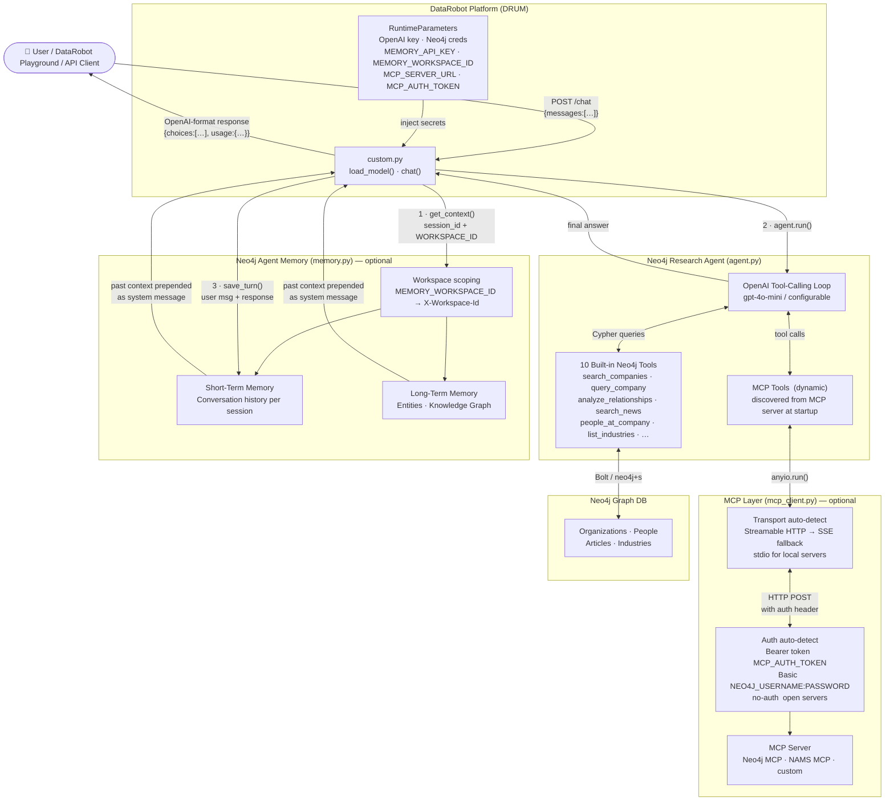

# DataRobot + Neo4j Integration

## Overview

This integration packages a **Neo4j-backed research agent** as a DataRobot **Agentic Workflow** custom model.  
It supports three optional extensions — all non-blocking if not configured:

| Extension | Purpose | Config var(s) |
|---|---|---|
| **Neo4j Agent Memory (NAMS)** | Cross-session memory backed by a knowledge graph | `MEMORY_API_KEY`, `MEMORY_WORKSPACE_ID` |
| **MCP (Model Context Protocol)** | Dynamically load tools from any MCP server | `MCP_SERVER_URL`, `MCP_AUTH_TOKEN` _(optional)_ |

---

## Architecture



---

## Files

```
datarobot/
├── .env.example
├── README.md
├── requirements.txt
├── run_local.py            ← local CLI test (mirrors DataRobot execution)
├── datarobot_agent.ipynb   ← Jupyter demo notebook
├── agent/
│   ├── __init__.py
│   ├── agent.py            ← Neo4jResearchAgent + 10 tools + MCP tool loader
│   ├── custom.py           ← DataRobot load_model() + chat() with memory
│   ├── helpers.py          ← prompt helpers + response formatting
│   ├── memory.py           ← NAMS integration (graceful no-op if absent)
│   ├── mcp_client.py       ← MCP client (graceful no-op if absent/unconfigured)
│   ├── model-metadata.yaml ← DataRobot runtime parameter definitions
│   └── requirements.txt    ← deps bundled in DataRobot ZIP
└── infra/
    ├── __init__.py
    └── agent.py            ← ZIP packager + DataRobot API validator
```

---

## Quick Start (local)

```bash
cd datarobot
python3 -m venv .venv && source .venv/bin/activate
pip install -r requirements.txt
cp .env.example .env
# fill in OPENAI_API_KEY; optionally MEMORY_API_KEY, MEMORY_WORKSPACE_ID, MCP_SERVER_URL
python run_local.py "Give me a competitive snapshot of Google"
```

---

## Neo4j Agent Memory (NAMS)

```bash
# Get a free key at https://memory.neo4jlabs.com
# MEMORY_WORKSPACE_ID is the segment between the first two underscores in your key:
#   e.g. nams_<WORKSPACE_ID>_<secret>
MEMORY_API_KEY=nams_... MEMORY_WORKSPACE_ID=<workspace-id> python run_local.py "Tell me about Apple"
# Next session will have context from the first one
```

How it works in `custom.py`:

| Step | Action |
|---|---|
| Request arrives | `session_id` derived from `user` field or hash of first message |
| Pre-run | `memory.get_context()` fetches relevant past-session context from NAMS |
| Context found | Prepended as a `system` message so the LLM knows prior interactions |
| Post-run | `memory.save_turn()` persists user message + response to NAMS |

Memory is **non-blocking** — if `MEMORY_API_KEY` is absent or the package is not installed, every call is a silent no-op.

> **`MEMORY_WORKSPACE_ID`** — required when using NAMS. Set it to the workspace ID portion of your key (`nams_<WORKSPACE_ID>_<secret>`). The SDK sends it as the `X-Workspace-Id` header to scope all memory to your workspace.

---

## MCP Integration

When `MCP_SERVER_URL` is set, the agent **discovers tools dynamically** from the MCP server at startup and makes them available to the LLM alongside the built-in Neo4j tools.

```bash
# Neo4j MCP official server (uses NEO4J_USERNAME/PASSWORD for Basic auth automatically)
MCP_SERVER_URL=https://neo4j-mcp-official-1008050579172.us-central1.run.app/mcp \
  python run_local.py "What schema does my Neo4j database have?"

# NAMS MCP server (16 memory tools — run locally)
uvx "neo4j-agent-memory[mcp]" mcp serve --password <neo4j-password> &
MCP_SERVER_URL=http://localhost:8080/sse python run_local.py "What do you know about me?"

# Any HTTP MCP server with Bearer token auth
MCP_AUTH_TOKEN=my-bearer-token \
MCP_SERVER_URL=https://my-mcp-server.example.com/mcp \
  python run_local.py "..."

# stdio MCP server
MCP_SERVER_URL="uvx my-mcp-server serve" python run_local.py "..."
```

**Supported transports** (auto-detected):
- **Streamable HTTP** (`http://` or `https://`) — tried first (modern MCP servers)
- **SSE** — fallback for `http://` or `https://` servers that don't support streamable HTTP
- **stdio** — any other string treated as a shell command

**Authentication** (auto-detected from env vars):
| Priority | Condition | Header sent |
|---|---|---|
| 1 | `MCP_AUTH_TOKEN` is set | `Authorization: Bearer <token>` |
| 2 | `NEO4J_USERNAME` + `NEO4J_PASSWORD` are set | `Authorization: Basic <b64(user:pass)>` |
| 3 | Neither | No auth header (open servers) |

> The neo4j-mcp-official server uses Neo4j Basic auth — no extra config needed, it reuses the existing `NEO4J_USERNAME`/`NEO4J_PASSWORD`.

MCP is **non-blocking** — if `MCP_SERVER_URL` is absent or the `mcp` package is not installed, the agent runs with its 10 built-in tools only.

---

## Built-in Neo4j tools

| Tool | Description |
|---|---|
| `search_companies` | Full-text company lookup |
| `list_industries` | List all industry categories |
| `companies_in_industry` | Companies in a specific industry |
| `query_company` | Company profile — summary, industries, locations, leadership |
| `analyze_relationships` | Org-to-org graph traversal (depth 1–4) |
| `people_at_company` | Executives and board members |
| `search_news` | Semantic news search (vector similarity) |
| `articles_in_month` | Articles published in a given month |
| `get_article` | Full article body by article_id |
| `companies_in_article` | Organizations mentioned in an article |

---

## DataRobot packaging & deployment

```bash
# Package all agent files into a ZIP
python infra/agent.py package
# → dist/neo4j_datarobot_agent.zip

# Validate DataRobot API access (requires direct internet access)
python infra/agent.py validate
```

**Upload & deploy steps:**

1. In DataRobot, click **Registry** in the top navigation bar, then click **Workshop** in the **left sidebar**
   > ⚠️ Workshop is a **left sidebar item** — not the Data/AI Catalog section. Look for it below "Models" in the left nav.
2. Click the **Agentic workflows** tab, then click **+ Add a workflow**
3. Enter a **Model name** (e.g. `Neo4j Research Agent`). **Target type** is pre-set to **Agentic Workflow** — leave it as-is. Click **Add model**.
4. On the **Assemble** tab → **Files** section, click **+ Add files** and upload all files extracted from `dist/neo4j_datarobot_agent.zip`
5. On the **Assemble** tab → **Runtime parameters** section, add each parameter from the table below
6. _(Optional)_ Click **Test workflow** to send a test message and verify the agent responds correctly
7. Click **Register a workflow** → **Create a new registered workflow** → fill in a name → click **Register a workflow**
8. Once registered, go to **Registry** → **Models** → find your workflow → click **Deploy**

---

## Runtime parameters

| Parameter | Purpose | Default |
|---|---|---|
| `OPENAI_API_KEY` | OpenAI API key | _(required)_ |
| `OPENAI_MODEL` | Chat model | `gpt-4o-mini` |
| `OPENAI_EMBEDDING_MODEL` | Embedding model | `text-embedding-3-small` |
| `NEO4J_URI` | Neo4j connection string | `neo4j+s://demo.neo4jlabs.com:7687` |
| `NEO4J_USERNAME` | Neo4j username | `companies` |
| `NEO4J_PASSWORD` | Neo4j password | _(required)_ |
| `NEO4J_DATABASE` | Neo4j database | `companies` |
| `AGENT_MAX_TOOL_STEPS` | Max tool-call iterations | `6` |
| `MEMORY_API_KEY` | NAMS key — leave blank to disable memory | _(optional)_ |
| `MEMORY_WORKSPACE_ID` | NAMS workspace ID — the segment between the first two underscores in your key: `nams_<WORKSPACE_ID>_...` | _(optional)_ |
| `MCP_SERVER_URL` | MCP server URL — leave blank to skip MCP | _(optional)_ |
| `MCP_AUTH_TOKEN` | Bearer token for MCP servers requiring token auth (Basic auth uses `NEO4J_USERNAME`/`NEO4J_PASSWORD` automatically) | _(optional)_ |

---

## Notes

- Secrets are loaded from DataRobot runtime parameters first; `.env` is for local development only.
- `neo4j-agent-memory` and `mcp` both require Python ≥ 3.10. DataRobot's runtime satisfies this. On Python 3.9 locally, both features silently disable themselves.
- `infra/agent.py validate` requires direct access to `app.datarobot.com`. Corporate proxies (Zscaler) return HTTP 403 — run from a network-open machine.
