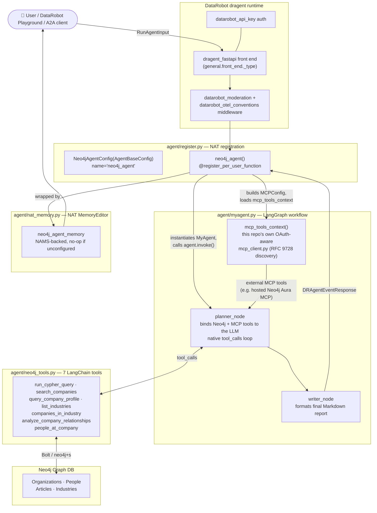

# DataRobot + Neo4j Integration

## Overview

This integration packages a **Neo4j-backed research agent** for DataRobot, built on
DataRobot's official [`af-component-agent`](https://github.com/datarobot-community/af-component-agent)
copier template (`base` framework), with Neo4j-specific tools and memory applied on top.

> **Why this structure?** An earlier version of this PR shipped **three different,
> partially-overlapping agent implementations** side by side (a deprecated DRUM
> custom-model entrypoint, an unwired LangGraph agent, and a standalone NAT
> tool-calling workflow) — reviewed by the DataRobot team (`tsdaemon`,
> `jpclemens0`, `rabih-datarobot`), who asked that this be rebuilt from
> DataRobot's official template instead of "evolving" the old structure
> further, applying Neo4j's tools/memory specifics on top of it. This is that
> rebuild: there is now **exactly one agent implementation**, wired the way
> the template expects.

## Architecture



**How this maps to the reviewer's ask:**

| Reviewer's complaint | Resolution |
|---|---|
| `agent.py`/`custom.py` (DRUM, deprecated) still present | **Removed** — `agent/agent.py`, `agent/custom.py`, `agent/model-metadata.yaml`, `agent/server.py`, `run_local.py`, `infra/agent.py`, `infra/workload.py`, `Dockerfile` are all deleted. |
| `myagent.py` "looks more modern, but isn't hooked up anywhere" — needs `register.py` + `workflow.yaml` wiring | **Fixed** — `agent/register.py` (new) wires `myagent.py`'s `MyAgent` into NAT via `register_per_user_function`, exactly matching the template's `register_base.py.j2` pattern. |
| `workflow.yaml` implements a NAT-native agent but isn't using the `dragent` frontend | **Fixed** — `general.front_end._type: dragent_fastapi` in `workflow.yaml`. |
| "Use the template ... apply Neo4j specifics onto it: tools and memory" | Template scaffolded via `copier` (`agent_template_framework: base`); Neo4j tools (`neo4j_tools.py`, `mcp_client.py`) and NAMS memory (`nat_memory.py`) applied on top, unchanged in their core logic. |

## Files

```
datarobot/
├── .env.example
├── README.md
├── requirements.txt        ← single dependency set (Neo4j tools + NAT/dragent runtime)
├── pyproject.toml          ← packages agent/ as an installable NAT plugin
├── Taskfile.yml            ← task install / task dev / task test / task run / task validate
├── dev.py                  ← IDE-friendly dev server entrypoint (nat dragent serve, in-process)
├── datarobot_agent.ipynb   ← (removed — was built entirely around the deprecated custom.py/
│                              infra/agent.py deploy flow; no longer applicable)
├── agent/
│   ├── __init__.py
│   ├── myagent.py          ← the single agent: LangGraph planner/writer + MCP tool loading
│   ├── register.py         ← NAT registration wiring MyAgent into the dragent runtime
│   ├── workflow.yaml        ← NAT/dragent workflow config (front end, LLM, memory, agent)
│   ├── neo4j_tools.py      ← 7 LangChain-compatible Neo4j tools (parameterized Cypher)
│   ├── mcp_client.py       ← OAuth-aware (RFC 9728) MCP client for external MCP servers
│   ├── memory.py           ← low-level NAMS HTTP client (used by nat_memory.py)
│   ├── nat_memory.py       ← NAT MemoryEditor plugin (neo4j_agent_memory), NAMS-backed
│   └── nat_tools.py        ← optional: same Neo4j tools registered as native NAT functions
│                              (independently MCP-servable; not wired into the primary agent)
├── scripts/
│   └── test_mcp_connection.py  ← standalone MCP connectivity smoke test
└── tests/
    ├── test_mcp_oauth.py   ← OAuth 2.0 client-credentials + RFC 9728 discovery (17 tests)
    ├── test_register.py    ← NAT registration wiring/structure tests
    └── test_myagent_mcp.py ← MCP tool-loading helper tests
```

---

## Quick Start (local)

```bash
cd datarobot
task install          # creates .venv, installs requirements.txt, pip install -e .
cp .env.example .env
# fill in DATAROBOT_ENDPOINT/DATAROBOT_API_TOKEN, Neo4j creds (demo DB works out of the box),
# optionally MEMORY_API_KEY/MEMORY_WORKSPACE_ID, MCP_SERVER_URL

task validate          # schema-checks agent/workflow.yaml, no live calls
task run -- "Tell me about Neo4j the company"   # one-shot run against a real input
task dev               # nat dragent serve --reload, for iterative local development
```

Don't have [Task](https://taskfile.dev) installed? Every `task` target is a thin wrapper
around a plain command — run them directly instead:

```bash
python3 -m venv .venv && source .venv/bin/activate
pip install --prefer-binary -r requirements.txt
pip install -e .    # registers agent/register.py + nat_tools.py + nat_memory.py as a NAT plugin

nat validate --config_file agent/workflow.yaml
nat run --config_file agent/workflow.yaml --input "Tell me about Neo4j the company"
nat dragent serve --config_file agent/workflow.yaml --reload true --port 8842
```

> **`--prefer-binary` matters**: `litellm` (a `datarobot-genai` transitive dependency) ships a
> Rust extension that some corporate proxies can't build from source (`crates.io` access
> blocked), even though a prebuilt wheel is available on PyPI.

> **Verified end-to-end** (this session, against a real DataRobot org + live Neo4j Aura
> credentials): `nat validate` passes; `nat run` builds every component (auth, middleware, LLM,
> memory, the `neo4j_agent` function, the `streaming_memory_agent` workflow), loads MCP tools
> (or gracefully no-ops), invokes the LangGraph pipeline, and reaches the real DataRobot LLM
> Gateway with a correctly-authenticated request. The only remaining blocker hit in this session
> was `litellm.APIConnectionError: ... Required feature flag GENAI_EXPERIMENTATION is not
> enabled` — a **DataRobot org-level entitlement**, not a bug in this code (confirmed: the
> feature-flag check happens server-side, nothing in the installed client packages references
> it). Ask your DataRobot account team to enable `GENAI_EXPERIMENTATION` for your org, then
> `task run` should complete and return a real synthesized answer.

> **Troubleshooting: `neo4j.exceptions.ServiceUnavailable: Unable to retrieve routing
> information`** — this means the driver connected but couldn't complete its routing-table
> handshake, common in GitHub Codespaces / devcontainers / restrictive corporate networks where
> the `ROUTE` bolt message is blocked/mangled even though a direct connection on port 7687 works
> fine. Fix by switching the URI scheme from routing (`neo4j+s://`) to direct (`bolt+s://`) in
> `.env`:
> ```
> NEO4J_URI=bolt+s://demo.neo4jlabs.com:7687
> ```

> **Troubleshooting: `ssl.SSLCertVerificationError: certificate verify failed: unable to get
> local issuer certificate`** when reaching `app.datarobot.com` — this is a corporate TLS-
> inspecting proxy (e.g. Zscaler) whose intercept root CA isn't in Python's bundled `certifi`
> trust store, even though the OS trusts it (so `curl`/browsers work fine). Fix locally by
> pointing Python at a CA bundle that includes your OS's trust store, e.g.:
> ```bash
> python -c "import certifi; print(certifi.where())"           # find certifi's bundle
> security find-certificate -a -p /System/Library/Keychains/SystemRootCertificates.keychain \
>   > /tmp/system-roots.pem                                      # macOS only
> cat "$(python -c 'import certifi; print(certifi.where())')" /tmp/system-roots.pem \
>   > /tmp/combined-ca-bundle.pem
> export SSL_CERT_FILE=/tmp/combined-ca-bundle.pem
> export REQUESTS_CA_BUNDLE=/tmp/combined-ca-bundle.pem
> ```
> This is an environment/network configuration issue, not something this repo's code can fix.

---

## Neo4j Agent Memory (NAMS)

Memory is implemented as a NAT `MemoryEditor` plugin (`agent/nat_memory.py`, `neo4j_agent_memory`
type), wrapping the same NAMS session-cache logic as before, and wired into `workflow.yaml`'s
`streaming_memory_agent` workflow — the retrieve-context → enrich-prompt → run-agent →
save-results flow, modeled on DataRobot's own `dr_mem0_memory` reference implementation
(including its no-op fallback when unconfigured).

```bash
# Get a free key at https://memory.neo4jlabs.com
MEMORY_API_KEY=nams_... MEMORY_WORKSPACE_ID=<workspace-id> task run -- "Tell me about Apple"
# Next run in the same session/thread will have context from the first one
```

Memory is **non-blocking** — if `MEMORY_API_KEY`/`MEMORY_WORKSPACE_ID` are absent, or a NAMS call
fails, `nat_memory.py` logs a warning and the workflow completes normally without memory rather
than crashing.

> **`MEMORY_WORKSPACE_ID`** is a real workspace ID issued by NAMS (sent as the `X-Workspace-Id`
> header) — it is **not** reliably derivable from the key string itself; get it from the NAMS
> dashboard/console. A `403`/`503 workspace_not_provisioned` usually means this value is wrong or
> the workspace isn't provisioned yet.

---

## MCP Integration

`agent/myagent.py`'s `mcp_tools_context()` loads external MCP tools using this repo's own
OAuth-aware client (`agent/mcp_client.py`), *not* `datarobot_genai`'s built-in MCP adapter — the
built-in one expects auth headers already resolved by DataRobot's own internal MCP
function-group mechanism, which doesn't apply to an external server like a hosted Neo4j Aura
MCP endpoint.

```bash
# Neo4j MCP official server (uses NEO4J_USERNAME/PASSWORD for Basic auth automatically)
MCP_SERVER_URL=https://neo4j-mcp-official-1008050579172.us-central1.run.app/mcp \
  task run -- "What schema does my Neo4j database have?"

# Any HTTP MCP server with a Bearer token
MCP_AUTH_TOKEN=my-bearer-token \
MCP_SERVER_URL=https://my-mcp-server.example.com/mcp \
  task run -- "..."

# Hosted Neo4j Aura MCP (OAuth 2.0 client-credentials) — see below
MCP_SERVER_URL=<aura-agent-or-aura-database-mcp-endpoint> \
MCP_OAUTH_CLIENT_ID=<client-id> \
MCP_OAUTH_CLIENT_SECRET=<client-secret> \
  task run -- "What tools does my Aura Agent expose?"
```

**Supported transports** (auto-detected): Streamable HTTP (tried first) → SSE (fallback) → stdio
(any other string, treated as a shell command).

**Authentication** (checked in this priority order):

| Priority | Condition | Header sent |
|---|---|---|
| 1 | `MCP_OAUTH_CLIENT_ID` + `MCP_OAUTH_CLIENT_SECRET` set | OAuth 2.0 client-credentials grant → `Authorization: Bearer <token>` |
| 2 | `MCP_AUTH_TOKEN` set | `Authorization: Bearer <token>` |
| 3 | `NEO4J_USERNAME` + `NEO4J_PASSWORD` set | `Authorization: Basic <b64(user:pass)>` |
| 4 | None of the above | No auth header (open servers) |

### Hosted Neo4j Aura MCP (Aura Agents / Aura hosted database)

Two hosted Aura paths are supported by pointing `MCP_SERVER_URL` at the right endpoint. **Both
require OAuth 2.0 client-credentials** — confirmed via live testing against a real Aura
hosted-database MCP instance that it rejects unauthenticated requests (`401` with a
`WWW-Authenticate: Bearer` header). Neither path uses Basic auth / database username-password.

1. **Aura Agents** — an Aura Agent's public MCP endpoint URL. Since the Aura Agents `/invoke` API
   doesn't publish RFC 9728 discovery metadata, the client falls back to
   `MCP_OAUTH_TOKEN_URL` (default `https://api.neo4j.io/oauth/token`). Override
   `MCP_OAUTH_TOKEN_URL`/`MCP_OAUTH_SCOPE`/`MCP_OAUTH_AUDIENCE` if your setup differs.
2. **Hosted database** (URL from the Aura Console "Inspect" tab, e.g.
   `https://<id>.mcp-instances.neo4j.io`) — the client auto-discovers the correct token endpoint
   and audience from RFC 9728 Protected Resource Metadata + OIDC discovery (a region-specific
   Auth0 tenant) — no `MCP_OAUTH_TOKEN_URL` override needed.

Both are covered by `tests/test_mcp_oauth.py` (17 tests, mocked HTTP — no live Aura access
needed to run them).

MCP is **non-blocking** — if `MCP_SERVER_URL` is absent or the `mcp` package isn't importable
(requires Python ≥3.10), the agent runs with only its Neo4j tools.

---

## Neo4j tools (`agent/neo4j_tools.py`)

| Tool | Description |
|---|---|
| `run_cypher_query` | Execute any raw Cypher query |
| `search_companies` | Full-text company lookup |
| `query_company_profile` | Company profile — summary, industries, locations, leadership |
| `list_industries` | List all industry categories |
| `companies_in_industry` | Companies in a specific industry |
| `analyze_company_relationships` | Org-to-org graph traversal (depth 1–4) |
| `people_at_company` | Executives and board members |

All parameterized (no string-interpolated Cypher) — verified with adversarial inputs against the
live database. `agent/nat_tools.py` registers the same logic as native NAT functions
(independently servable via `nat mcp serve`, not wired into the primary agent by default).

> **These tools assume the Neo4jLabs "companies" demo graph schema.** If you point `NEO4J_URI`/
> `NEO4J_DATABASE` at your own Neo4j instance without a matching fulltext/vector index, tool
> calls that depend on it will return a Cypher error back to the LLM as a tool result (handled
> gracefully) rather than crashing the agent — but the query itself needs adapting to your schema.

---

## Runtime / environment variables

| Variable | Purpose | Default |
|---|---|---|
| `DATAROBOT_ENDPOINT` | DataRobot API base URL | `https://app.datarobot.com` |
| `DATAROBOT_API_TOKEN` | DataRobot API token — used by `datarobot_auth` and the `datarobot_llm` component | _(required)_ |
| `NEO4J_URI` | Neo4j connection string | `neo4j+s://demo.neo4jlabs.com:7687` |
| `NEO4J_USERNAME` | Neo4j username | `companies` |
| `NEO4J_PASSWORD` | Neo4j password | _(required)_ |
| `NEO4J_DATABASE` | Neo4j database | `companies` |
| `MEMORY_API_KEY` | NAMS key — leave blank to disable memory | _(optional)_ |
| `MEMORY_WORKSPACE_ID` | NAMS workspace ID (from the NAMS dashboard, not derived from the key) | _(optional)_ |
| `MCP_SERVER_URL` | External MCP server URL — leave blank to skip | _(optional)_ |
| `MCP_OAUTH_CLIENT_ID` / `MCP_OAUTH_CLIENT_SECRET` | OAuth client-credentials for hosted Aura MCP | _(optional)_ |
| `MCP_AUTH_TOKEN` | Static bearer token for other MCP servers | _(optional)_ |
| `NEO4J_AGENT_PORT` | Local dev server port (`task dev`/`dev.py`) | `8842` |

See `.env.example` for the full annotated list, including MCP OAuth discovery overrides.

---

## Notes

- **`agent/register.py`'s `NameError: name 'Streaming' is not defined` bug, found and fixed
  during end-to-end testing this session**: the file initially carried
  `from __future__ import annotations` (copy-pasted habit from other modules in this repo), which
  turns `Annotated[..., Streaming(...)]` into a *string* annotation. NAT's `FunctionInfo.from_fn`
  resolves that string via `typing.get_type_hints()` at registration time, but `Streaming` is
  only imported inside the function body (matching the official template exactly) — not at
  module scope — so the string couldn't be resolved, and `nat run`/`nat validate` failed with
  `NameError: name 'Streaming' is not defined`. Fixed by removing the future-annotations import,
  matching the template's own `register.py` (which doesn't use it either). Covered by a
  regression test in `tests/test_register.py`.
- **Full end-to-end validation performed this session** against a real DataRobot org and live
  Neo4j Aura credentials: `nat validate --config_file agent/workflow.yaml` passes; `nat run`
  builds every component in `workflow.yaml` (auth, middleware, LLM, memory, the `neo4j_agent`
  function, the `streaming_memory_agent` workflow) and reaches DataRobot's live LLM Gateway with
  a correctly-authenticated request. The only failure encountered was the `GENAI_EXPERIMENTATION`
  feature-flag entitlement described above — a DataRobot account-level setting, not a code issue.
- The previously-existing `datarobot_agent.ipynb` notebook, `run_local.py`, `infra/agent.py`,
  `infra/workload.py`, `agent/agent.py`, `agent/custom.py`, `agent/server.py`,
  `agent/model-metadata.yaml`, and the standalone `Dockerfile` were all built entirely around the
  now-removed DRUM/Workload API paths and have been deleted rather than kept as unmaintained dead
  code, per the reviewer's explicit ask not to keep evolving that architecture.
- `neo4j-agent-memory` and `mcp` both require Python ≥3.10 (same as `datarobot-genai[dragent]`'s
  own `nvidia-nat` dependency, so this is not an additional constraint versus what the template
  already requires).
