# Teaching DataRobot to Think in Graphs: A Memory-Enabled Neo4j Agent, Four Ways to Deploy

*How we took a single-file DataRobot custom model idea and turned it into a fully tested, memory-enabled, MCP-compatible, cloud-hosted Neo4j research agent — stress-tested it end-to-end twice — and what we learned integrating with a partner platform we don't fully control.*

---

## Why this project exists

DataRobot lets you deploy arbitrary Python "custom models" and, more recently, full agentic workflows, as production-grade endpoints with autoscaling, monitoring, and governance built in. Neo4j is where a lot of enterprises already keep their most valuable *connected* data — organizations, people, relationships, supply chains, fraud rings, knowledge graphs.

Put those two together and you get something genuinely useful: an LLM agent that can reason over live graph data, running on infrastructure an enterprise already trusts. That's what this integration delivers — a **Neo4j-backed research agent that runs inside DataRobot**, with tool-calling, cross-session memory, and pluggable external tools via MCP.

This post walks through the full journey: the architecture, the four different deployment "paths" we ended up supporting, the real bugs we found and fixed during review, and — the part I'm most excited about — a live, hosted demo you can hit right now.



---

## The core idea: one agent, four ways to run it

At the heart of everything is a single, reusable piece of logic: an OpenAI tool-calling loop wired up with Neo4j tools. Whether that logic runs inside DataRobot's DRUM runtime, behind a FastAPI server, or inside NVIDIA's NeMo Agent Toolkit, **the agent behavior itself doesn't change** — only the transport around it does.

We ended up building and testing four distinct deployment paths, because DataRobot's own deployment story evolved *during* this project (DRUM-based custom models are being phased out in favor of newer mechanisms), and because different consumers of this integration have different needs:



- **Path A — DRUM custom model.** The original, classic DataRobot deployment shape: `custom.py` with `load_model()` / `chat()` entry points, deployed via DRUM. Good for teams already standardized on Custom Model Workshop.
- **Path B — `datarobot-agent-application` template.** Uses DataRobot's own agent scaffolding (`myagent.py`) with LangChain-flavored Neo4j tools, for teams that want to stay inside DataRobot's opinionated agent framework.
- **Path C — Workload API.** DataRobot's newer, more general-purpose deployment mechanism: package the agent as a plain container (FastAPI + Dockerfile), and deploy it as a managed, autoscaling workload via a REST API — no DRUM runtime required at all. This is the path we containerized and, as you'll see below, is now **live on Google Cloud Run** as a public demo.
- **Path D — NeMo Agent Toolkit (NAT).** Because DRUM-based Custom Models are on a deprecation path, we built a fourth option using NVIDIA's NeMo Agent Toolkit: a declarative `workflow.yaml` plus thin tool wrappers (`nat_tools.py`, `nat_memory.py`). This gets you a standardized, config-driven workflow definition, a CLI (`nat run`), and — notably — the ability to **host the whole thing as its own MCP server** (`nat mcp serve`), turning our Neo4j tools into tools *other* agents can call.

Having all four paths tested and working means the integration isn't locked to one specific DataRobot product surface — it can meet a team wherever they are in DataRobot's own platform evolution.

---

## Two extensions that make the agent actually useful in production: Memory and MCP

A tool-calling loop that queries a graph is useful. A tool-calling loop that *remembers* previous conversations and can pull in tools from *other* systems is a lot more useful. We built both as **optional, fail-silent extensions** — if you don't configure them, the agent behaves exactly as before; nothing breaks.

### Agent Memory (NAMS)

We integrated [Neo4j Agent Memory (NAMS)](https://github.com/neo4j-labs/agent-memory) — a hosted memory service backed by its own Neo4j graph — so the agent can:

1. **`get_context()`** at the start of a turn — pull relevant short-term and long-term memory for the current workspace/session.
2. Run the agent as normal, now with that context available.
3. **`save_turn()`** at the end — persist the new exchange back to memory, so the *next* conversation (even a brand-new DataRobot session) has continuity.

Getting this right meant reading the actual TypeScript package that was recently merged into `agent-memory` and matching its expected request/response shapes exactly — not just approximating them. Two real bugs surfaced from doing this carefully:

- **Conversation IDs are server-assigned, not client-chosen.** An earlier version of our integration invented its own conversation ID client-side; NAMS actually issues one on first save and expects you to reuse *that* one on subsequent calls. Fixed to respect server-assigned IDs.
- **Silently swallowing memory failures is worse than surfacing them.** If the memory API is down or misconfigured, you want to know — not have your agent quietly run "context-free" without any signal. We changed failures to surface as warnings rather than vanish.

### Model Context Protocol (MCP)

The agent can also connect to **any** MCP server — the NAMS memory server (16 memory-management tools), the official Neo4j MCP server, or a fully custom one — and its tools become available to the tool-calling loop *automatically*, indistinguishable from the built-in Neo4j tools. This is handled by an optional `mcp_client.py` that:

- Calls `list_tools()` once at startup to discover what's available.
- Routes tool-calls through `call_tool()` at runtime.
- Supports both HTTP/SSE and stdio transports.
- Is a complete no-op if the `mcp` package isn't installed or `MCP_SERVER_URL` isn't set — zero risk to existing deployments.

Because Path D (NeMo Agent Toolkit) can *also* host our own tools as an MCP server (`nat mcp serve`), we get a nice symmetry: this integration can be either an MCP **client** (pulling in someone else's tools) or an MCP **server** (exposing Neo4j tools to someone else's agent) — same underlying tool implementations either way.

---

## Real bugs found and fixed during review

An integration is only as good as its weakest edge case, and a few genuinely important issues came up during testing and code review that were fixed before this was considered production-ready:

- **Cypher injection.** Six tool functions in the LangChain-based tools (`search_companies`, `query_company_profile`, `list_industries`, `companies_in_industry`, `analyze_company_relationships`, `people_at_company`) were building Cypher queries by string-interpolating user-controlled tool-call arguments directly into query text, using naive quote-escaping. This is bypassable. All six were rewritten to use Neo4j's native parameterized queries (`graph.query(query, params={...})`) instead — verified against the live database with actual adversarial payloads (`x' OR 1=1 //`, `Apple' OR '1'='1`, and Cypher-specific injection attempts like `x'}) DETACH DELETE n //`), confirming each is now treated as inert literal text. The one exception is `max_depth` in variable-length relationship patterns, which Cypher genuinely cannot parameterize — that value is instead coerced to `int` and clamped to a safe range (1–4) before use.
- **A silently broken runtime parameter.** `OPENAI_BASE_URL` — needed to point the agent at an LLM gateway/proxy or Azure OpenAI instead of the public OpenAI API — was declared as a configurable field in DataRobot's `model-metadata.yaml`, but was missing from the internal list DRUM uses to actually copy runtime parameters into the process environment. The field existed in the UI; setting it did *literally nothing*. Fixed by adding it to that list.
- **Tool exceptions crashing whole agent runs.** A single built-in tool throwing an unhandled exception used to take down the entire agent turn. Tool calls are now individually wrapped so one bad tool call degrades gracefully instead of failing the whole request.
- **CodeQL alerts** for clear-text logging of potentially sensitive values in the deployment/workload scripts — resolved by redacting/removing the offending log statements.

None of these were hypothetical — each was caught by either automated security scanning (CodeQL) or careful adversarial testing against a live database, and each is now fixed and re-verified.

---

## Hosting a real, live demo

Testing locally proves the logic works. It doesn't prove the integration is *usable* by someone who isn't sitting at your terminal. So the last piece of this project was standing up a real, publicly reachable deployment.

We took Path C — the Workload API container (`agent/server.py`, a thin FastAPI wrapper around the same `custom.py::chat()` logic used everywhere else, plus its `Dockerfile`) — and deployed it to **Google Cloud Run**.



A few deliberate choices here:

- **Secrets via Secret Manager**, not plaintext environment variables — `OPENAI_API_KEY`, `NEO4J_PASSWORD`, and `MEMORY_API_KEY` are all injected as Cloud Run secret references, never visible in the service's plain env var listing.
- **Bearer-token authentication only** (`--no-allow-unauthenticated`) — every request must carry a valid Google-issued identity token in the `Authorization` header, checked against Cloud Run's own IAM invoker permissions. No custom auth code needed, and no anonymous access to something touching OpenAI/Neo4j credentials.
- **The exact same Dockerfile used for DataRobot's Workload API worked unmodified on Cloud Run** — both platforms expect `linux/amd64` containers, so there was no new container to build for this deployment.

The result, verified live:

- `GET /readyz` → `200 {"status": "ready"}`
- `POST /v1/chat/completions` → a real, correct, Neo4j-graph-grounded answer from `gpt-4o-mini`, citing actual company/industry data from the graph, in the same OpenAI-compatible schema the rest of the integration already speaks.

(One small, purely cosmetic finding along the way: `GET /healthz` returns a 404 when hit through Cloud Run's public edge, even though it's defined identically to `/readyz` in the FastAPI app and works fine locally. Checking the container's own request logs confirmed the request never even reaches the app — `/`, `/readyz`, `/docs`, and the chat endpoint all show up in-container, `/healthz` never does. It's a Cloud Run edge-routing quirk on that specific path, not an application bug, and `/readyz` serves the same purpose reliably.)

**Live demo:** `https://neo4j-datarobot-agent-1008050579172.us-central1.run.app`. Every request needs a Google-issued Bearer token in the `Authorization` header:

```bash
TOKEN=$(gcloud auth print-identity-token)
curl -s https://neo4j-datarobot-agent-1008050579172.us-central1.run.app/v1/chat/completions \
  -H "Authorization: Bearer $TOKEN" \
  -H "Content-Type: application/json" \
  -d '{"messages":[{"role":"user","content":"What companies are in the AI industry?"}]}'
```

Full setup and auth details live in the repo's [`datarobot/README.md`](https://github.com/neo4j-labs/neo4j-agent-integrations/blob/main/datarobot/README.md#hosted-demo-google-cloud-run).

---

## "It's not working" — the re-test that almost wasn't

Here's the part that doesn't usually make it into engineering blog posts: some time after this integration merged, a colleague reported it wasn't working. That's an uncomfortable sentence to hear about something you already shipped and tested. So instead of patching the one thing that was reported broken and calling it done, we went back and re-tested **every single path, end-to-end, against live credentials, a second time** — plus every edge case we could think of.

The honest findings:

- **Path A (DRUM custom model)** — still solid. Re-ran the basic prompt, `--json` output mode, an empty prompt, an invalid OpenAI key (confirmed the resulting crash is DRUM's own *intended* error-handling behavior, not a bug), an unreachable MCP server URL (clean, non-fatal fallback), and a full round-trip against a real, live MCP server. All passed.
- **Path B (the `datarobot-agent-application` template, `myagent.py`)** — this one had quietly never been exercised end-to-end locally, because installing its dependencies (`litellm`, transitively) had been failing on a Rust build step. Once that was fixed (see below), Path B's LangGraph workflow compiled and ran a real query against the live graph for the first time. That's a real gap closed, not just a re-confirmation.
- **Path C (the live Cloud Run demo)** — re-tested the happy path plus three deliberately adversarial edge cases: a malformed JSON body (clean `422`, not a crash), an empty `messages` array (graceful fallback instead of an error), and a request with no auth header at all (a clean `403` from Cloud Run's own IAM layer, before the request ever reaches the app).
- **Path D (NeMo Agent Toolkit)** — this is where the real, previously-invisible bug was hiding: **`requirements-nat.txt` pinned a version range for `nvidia-nat` that was *impossible to install*.** Every published version of the underlying `datarobot-genai[dragent]` package hard-requires an exact different version. Anyone following the README from a clean environment would have hit a wall of dependency-resolver errors before ever running a line of agent code — which lines up uncomfortably well with "it's not working." Pinning the exact compatible version fixed it, and as a bonus, unblocked Path B's dependencies too, since they overlap.

We also went back and independently re-verified a subtler, easy-to-miss detail: `model-metadata.yaml` declares its target type in lowercase (`agenticworkflow`), while the DataRobot REST API used by our deploy script expects PascalCase (`AgenticWorkflow`). Cross-checking against DataRobot's own published agent templates confirmed the lowercase form in `model-metadata.yaml` is correct as-is — a DRUM-specific convention, unrelated to (and easy to confuse with) the REST API's enum. Worth documenting explicitly so the next person doesn't "fix" something that isn't broken.

The one thing that's still genuinely out of our hands: deploying to a live DataRobot org via `infra/agent.py deploy` now runs cleanly all the way up until DataRobot's own API rejects it with a `422`, because this specific tenant doesn't have the `AgenticWorkflow` custom-model entitlement enabled. That's a support-ticket problem, not a code problem — everything downstream of that API call is implemented and dry-run-verified, ready to go the moment the entitlement is granted.

**The lesson**: "it works on my machine, once, during initial development" and "it works, reproducibly, for a stranger following the README from scratch six months later" are two different bars. The gap between them is exactly where dependency pins rot, template paths go unexercised, and support requests like "it's not working" come from. Re-testing the whole surface area — not just the reported symptom — is what actually closes that gap.

---

## What we'd tell the DataRobot team

If there's one honest takeaway from this whole project, it's this: **we built and tested as much as we possibly could with the information and access we had, then used the DataRobot team's own review feedback as the mechanism to close the remaining gaps** — rather than guessing at internals of a platform we don't fully control. Cypher injection, a broken runtime parameter, and CodeQL alerts were all found and fixed because of that feedback loop, not despite it. The four deployment paths exist precisely so the integration adapts to wherever DataRobot's own recommended deployment mechanism lands, rather than betting on just one.

---

## Try it yourself

The whole integration — all four paths, memory, MCP, and the hosted Cloud Run demo — is documented in the `datarobot/` directory of [neo4j-agent-integrations](https://github.com/neo4j-labs/neo4j-agent-integrations), including exact `curl` examples for the live demo endpoint and step-by-step instructions for each deployment path.

If you're evaluating Neo4j + DataRobot for your own agentic workflows, or you're building something similar on top of MCP or NeMo Agent Toolkit, we'd love to hear what you build.
