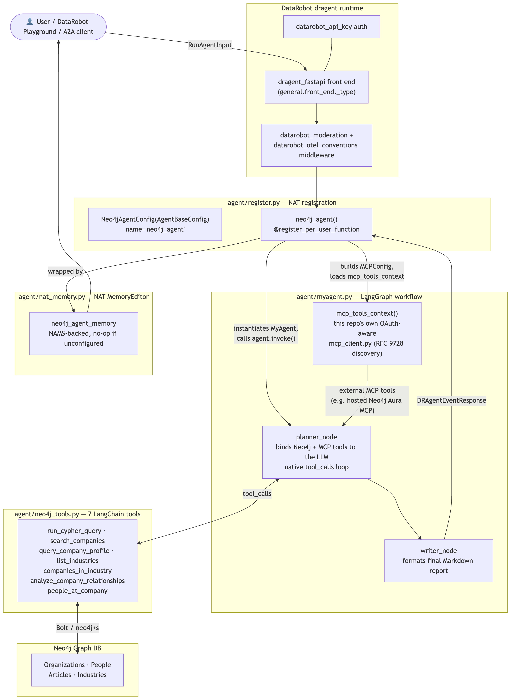

# The Agent That Remembers: Wiring Neo4j's Knowledge Graphs Into DataRobot, One Hard Lesson at a Time

*What it actually took to wire a Neo4j knowledge-graph agent into a partner platform we don't fully control — memory, MCP, a security bug hiding in working code, and the lessons that shaped the final design.*

---

## Why this project exists

DataRobot lets you deploy agentic workflows as production-grade endpoints with autoscaling, monitoring, and governance built in. Neo4j is where a lot of enterprises already keep their most valuable *connected* data — organizations, people, relationships, supply chains, fraud rings, knowledge graphs.

Put those two together and you get something genuinely useful: an LLM agent that can reason over live graph data, running on infrastructure an enterprise already trusts. That's what this integration delivers — a **Neo4j-backed research agent that runs inside DataRobot's `dragent` runtime**, built on DataRobot's own official [`af-component-agent`](https://github.com/datarobot-community/af-component-agent) template, with tool-calling, cross-session memory, and pluggable external tools via MCP.



**What's in this picture:** a request authenticated by `datarobot_api_key` hits the `dragent_fastapi` front end, passes through DataRobot's own moderation and OpenTelemetry middleware, and lands on `neo4j_agent()` — the single function NAT's registration system routes to. From there it instantiates `MyAgent`, whose `planner_node` binds seven Neo4j tools *and* any configured MCP tools (including a hosted Neo4j Aura MCP server) to the LLM in one native tool-calling loop, before a `writer_node` formats the final Markdown report and NAT wraps it back into a `DRAgentEventResponse`. Memory sits off to the side deliberately — a `neo4j_agent_memory` module wrapping NAMS, consulted but never required, which is the point of Lesson 3 below.

At the core of this sits one registration function. Everything else in this post is really commentary on the lessons we learned building the scaffolding *around* it:

```python
# agent/register.py — the one entry point, wired into DataRobot's dragent runtime
@register_per_user_function
def neo4j_agent() -> Neo4jAgentConfig:
    return Neo4jAgentConfig(
        name="neo4j_agent",
        description="Neo4j knowledge-graph research agent with memory and MCP tools",
    )
```

Register the agent → the planner node binds tools (Neo4j + optional MCP) → the writer node formats the answer → NAT wraps it back into DataRobot's response shape. That four-step shape is the whole product. The rest of this post is what it took to make that shape *actually work* in production, and to make it something a stranger could pick up and trust.

---

## Lesson 1: Build on the platform's official integration surface, not your own scaffolding

Early on, this integration grew three parallel ways to plug into DataRobot: a DRUM-based custom model, a LangGraph agent that wasn't wired into anything, and a declarative NAT workflow definition. Each looked reasonable in isolation, and each had been built to survive a different phase of DataRobot's own evolving deployment story. In practice, that meant a fresh reader had no reliable way to tell which of the three was actually live versus which were partially-finished experiments — and that ambiguity is a worse outcome than any one of the three implementations being imperfect on its own.

The fix was to stop maintaining parallel integration paths and consolidate everything onto DataRobot's own official [`af-component-agent`](https://github.com/datarobot-community/af-component-agent) template, scaffolded via `copier` (`agent_template_framework: base`), with the Neo4j-specific pieces — tools, memory, the MCP client — layered on top of that scaffold instead of built as their own competing structure:

```python
# agent/register.py — the one true entry point, wired into DataRobot's dragent runtime
@register_per_user_function
def neo4j_agent() -> Neo4jAgentConfig:
    return Neo4jAgentConfig(name="neo4j_agent", description="...")
```

Everything downstream — the LangGraph `planner_node`/`writer_node` loop, the seven Neo4j tools, the NAMS-backed memory editor, the OAuth-aware MCP client — now hangs off this single registration point instead of being spread across multiple, only-one-of-which-is-real implementations. `workflow.yaml` declares `general.front_end._type: dragent_fastapi`, so the NAT-native workflow is actually served through DataRobot's `dragent` frontend rather than sitting disconnected from it.

The generalizable lesson: **when the platform owner publishes an official scaffold, that scaffold is a stronger signal about "how this platform actually wants to be integrated with" than anything you can infer from documentation or your own working code.** Multiple plausible-looking implementations that can't be told apart is a worse deliverable than one implementation that's obviously the only one — even if the alternatives represent real engineering effort. Designing the core agent logic (tools, memory, prompt construction) so it doesn't care about its transport is still the right instinct; the mistake was building multiple transports ourselves instead of adopting the one the platform already provides.

---

## Lesson 2: Read the actual protocol, not your assumption of it

We integrated [Neo4j Agent Memory (NAMS)](https://github.com/neo4j-labs/agent-memory) so the agent remembers past conversations across sessions — even a brand-new DataRobot deployment. The interface is simple on paper:

```python
memory_context = await editor.get_context(thread_id, user_message)
# ... run the agent with memory_context injected as a system message ...
await editor.save_turn(thread_id, user_message, result)
```

But "simple on paper" hid a protocol detail that only became visible once we traced an actual conversation end-to-end:


**What's in this picture:** the `dragent_fastapi` front end hands a `RunAgentInput` to `neo4j_agent()`, which first asks the `neo4j_agent_memory` module (`nat_memory.py`, NAT's `MemoryEditor` interface) to retrieve context for the current thread. If `MEMORY_API_KEY` is configured, that call goes out to the real NAMS API and returns prior turns; if it isn't, the module no-ops and returns an empty context — no network call attempted at all. Only after that resolution does the enriched prompt get handed to `MyAgent`'s `planner_node → writer_node` loop, and only after a final answer comes back does the turn get saved — as a non-blocking call that logs and continues on failure rather than ever blocking the response to the user.

The lesson came from what's *underneath* that simple call. Our first implementation assumed we could pick our own conversation identifier client-side and use it consistently. We were wrong — NAMS's `POST /conversations` **ignores whatever id you pass** and always mints a fresh server-side UUID. We only found this by reading the actual TypeScript SDK in `agent-memory`, not by guessing at the API shape from documentation. The fix was to keep a small local cache mapping our own session key to the real, server-assigned UUID:

```python
async def _resolve_conversation_id(client, local_key: str) -> str:
    """Map our local session key to a real NAMS conversation UUID, creating one if needed."""
    cache = _load_conversation_cache()
    if local_key in cache:
        return cache[local_key]

    conv = await client.short_term.create_conversation(local_key, user_identifier=local_key)
    cache[local_key] = str(conv.id)
    _save_conversation_cache(cache)
    return cache[local_key]
```

The broader lesson: **when you integrate against someone else's service, the source of truth is the actual request/response contract their SDK implements, not the mental model you built from the README.** We also decided that a silently swallowed memory failure is worse than a visible one — if NAMS is unreachable or misconfigured, the agent still works, but it now logs a clear warning instead of quietly degrading with no signal at all.

---

## Lesson 3: Optional features should be *provably* optional

Both memory and MCP tool-loading are designed so that if you don't configure them, the agent behaves exactly as it would without either feature — no crashes, no missing imports, no partial states. The clearest illustration of this is the MCP tool-loading path, since it also has to juggle four different authentication modes for a hosted Neo4j Aura MCP server:


**What's in this picture:** two decision trees that both terminate at the same place — "the agent runs regardless." If `MCP_SERVER_URL` isn't set, or the `mcp` package isn't importable, `mcp_tools_context` immediately yields an empty tool list; `planner_node` then runs with Neo4j tools only. If it is configured, the client picks between four auth paths — OAuth client-credentials with RFC 9728 protected-resource discovery (for a hosted Neo4j Aura MCP server), a static bearer token, Neo4j Basic auth, or no auth at all — connects over Streamable HTTP (falling back through SSE to stdio), discovers tools via `alist_tools()`, and converts each one into a LangChain `BaseTool` before yielding it to the planner. Any failure along that path — auth, discovery, or connection — falls back to an empty tool list with a logged warning rather than crashing startup:

```python
async def alist_tools(self) -> list[dict]:
    """Discover tools once at startup. Returns [] if unreachable — never raises."""
    if not self._server_url:
        return []
    try:
        async with self._session() as session:
            result = await session.list_tools()
            return [self._to_openai_tool(t) for t in result.tools]
    except Exception as exc:
        logger.warning("MCP list_tools failed (non-fatal): %s", _unwrap_exception(exc))
        return []
```

The lesson generalizes well beyond this project: **an integration that degrades gracefully when a dependency is absent is far more valuable than one that assumes the dependency is always there.** Every optional feature in this codebase was tested by deliberately *not* configuring it, and separately by configuring it and then making it unreachable — not just by configuring it correctly and stopping there.

---

## Lesson 4: Trust boundaries deserve as much attention as functionality

The most important thing we found wasn't a missing feature — it was a security bug hiding inside working code. Several tool functions built Cypher queries by interpolating user-controlled arguments directly into the query text:

```python
# Before — vulnerable to Cypher injection via the `search` argument
query = f"""
    CALL db.index.fulltext.queryNodes('entity', '{search}', {{limit: {limit}}})
    YIELD node AS c, score
    RETURN c.name AS name, score
"""
```

It ran fine on every normal input we threw at it in development — which is exactly the trap. Naive string-escaping isn't a defense; it's a false sense of one. The fix was to route every user-controlled value through Neo4j's native query parameters instead of the query text:

```python
# After — the search term can never alter query structure, no matter what it contains
query = """
    CALL db.index.fulltext.queryNodes('entity', $search, {limit: $limit})
    YIELD node AS c, score
    RETURN c.name AS name, score
"""
graph.query(query, params={"search": search, "limit": safe_limit})
```


**What's in this picture:** the same user-controlled input taking two different paths through the same trust boundary. On the left branch (the bug), that input becomes part of the query's *text* — so anything shaped like Cypher syntax inside it changes what the query actually does. On the right branch (the fix), the input never touches the query text at all; it's handed to the driver separately as a named parameter, and Neo4j's own parser guarantees a parameter value can only ever be interpreted as a value, never as syntax. Everything to the left of "trust boundary" is attacker-controlled, and the only safe designs are ones where attacker-controlled data can never influence the shape of what runs on the right.

We verified the fix against actual adversarial payloads (`x' OR 1=1 //`, `x'}) DETACH DELETE n //`) run through the live tool — each is now treated as inert literal search text rather than altering the query. The one case Cypher genuinely can't parameterize is a variable-length relationship depth (`-[*1..N]-`), which we instead coerce to an integer and clamp to a safe range before use.

**The lesson**: review that only asks "does this work" will pass code like the vulnerable version above every time, because it *does* work — for well-behaved input. The question that actually matters is "what happens on adversarial input," and that question has to be asked explicitly, not left to hope.

---

## Lesson 5: A feature that silently does nothing is worse than one that errors

One of the quieter bugs we found early on: a runtime configuration value used to point the agent at an alternate LLM gateway was declared as a configurable field in the deployment schema, and the deployment UI happily let you set it — but the internal list the runtime used to actually copy configured values into the process environment didn't include it.

```python
# The bug: a configured field was declared in the deployment schema and read
# by the agent, but missing from the list actually copied into the environment.
RUNTIME_PARAMETER_KEYS = (
    "OPENAI_API_KEY", "NEO4J_URI", "NEO4J_USERNAME", "NEO4J_PASSWORD",
    "NEO4J_DATABASE", "MEMORY_API_KEY", "MCP_SERVER_URL",
    # "OPENAI_BASE_URL" — missing. Setting it in the UI did nothing.
)
```

Someone could set that field in the deployment UI, deploy successfully, see no errors anywhere, and simply... not get the behavior they configured. That's a uniquely hard class of bug to notice, because nothing fails — it just quietly doesn't do what the UI implies it does. The fix was one line, but finding it required cross-checking every field declared in the deployment schema against the code path that actually consumes it, not just testing the fields we remembered to test.

---

## Lesson 6: A dependency pin is a promise you have to keep

The most instructive bug of this whole project didn't come from staring at a diff — it came from someone saying "it's not working" well after this had already been merged and believed to be done. Going back and re-testing from a clean environment (rather than trusting that "it worked before" still meant "it works now") surfaced a real, 100%-reproducible problem: a requirements file pinned a version range for a NAT-related dependency that was **impossible to install**, because the underlying `datarobot-genai[dragent]` package hard-requires a different exact version:

```
# Before — unsatisfiable; pip's resolver fails with ResolutionImpossible
nvidia-nat>=1.8.0

# After — pinned to the version datarobot-genai[dragent] actually requires
nvidia-nat==1.7.0
```

Anyone following the README from scratch would have hit a wall of dependency-resolver errors before running a single line of agent code. That lines up uncomfortably well with "it's not working" — and it's the kind of failure that's invisible to the original author, because their local environment already had the dependency resolved from before the conflict existed.

**The lesson**: "it worked when I built it" and "it works, reproducibly, for a stranger following the README from a clean environment months later" are two different bars, and the gap between them is exactly where dependency pins quietly rot. The only way to catch that gap is to periodically re-test the whole surface area from zero — not just re-run the parts someone reported as broken.

---

## Lesson 7: Test the deployment story, not just the code

Testing locally proves the logic works. It doesn't prove the integration is usable by someone who isn't sitting at your terminal. The actual path from a local checkout to a live DataRobot endpoint has its own set of steps worth getting right:


**What's in this picture:** local development happens through a small set of `task` targets (`install`, `validate`, `dev`, `run`) that mirror what CI and a fresh clone both go through. Packaging starts with `task create-docker-context`, which downloads DataRobot's own reference Dockerfile from `datarobot-user-models` rather than maintaining a bespoke one — reducing the surface area that could drift out of sync with how DataRobot actually expects images to be built. `task build-docker-context` then builds that image with the project's own `pyproject.toml`/`requirements.txt` copied in. The resulting image is registered as a DataRobot Custom Model / Agentic Workflow using `workflow.yaml` plus `register.py`, and deployment serves it through the `dragent` runtime — the same runtime, and the same code path, that `task dev` exercises locally.

The deliberate choice here matters as much as the code itself: reusing DataRobot's own Dockerfile instead of hand-rolling one means packaging stays aligned with how the platform's own tooling expects an image to look, rather than quietly drifting apart from it over time. **The lesson**: the steps between "the code runs on my machine" and "the code runs as a deployed endpoint" are not incidental — they deserve the same scrutiny as the application logic itself, because that's usually where an integration silently stops working for everyone except the person who already has a working local setup.

---

## Lesson 8: A log statement can leak a secret even without printing it

The last finding came from GitHub's own CodeQL scanner — two "clear-text logging of sensitive information" alerts on the OAuth token-fetch path the MCP client uses to authenticate against a hosted Neo4j Aura MCP server. The flagged code didn't look dangerous at a glance:

```python
# Before — CodeQL flags both of these as clear-text logging, even though
# neither line prints a token, a password, or the client secret directly
except httpx.HTTPError as exc:
    logger.warning("OAuth token request failed: %s", exc)   # (1) logs the exception object
    ...
if "access_token" not in payload:
    logger.error("Token response missing access_token: keys=%s", list(payload.keys()))  # (2) logs only key names
```

Neither line logs a secret value. Line (1) logs an exception object; line (2) logs a list of JSON key names, not the values behind them. Our first reaction was that this looked like a false positive — until we understood what CodeQL is actually tracking. It doesn't scan for secret-shaped strings in your log calls; it does taint tracking on the data flowing into them. Both `exc` and `payload` were produced by a call that carried a client secret (`client.post(token_url, data=data, auth=(client_id, client_secret))`), so anything derived from that call — including an exception's string representation, or a dictionary's key list, either of which could under some code path leak fragments of the request or response — is tainted for the rest of its life, regardless of what it superficially "contains."

The fix wasn't to escape or truncate anything; it was to stop passing tainted objects to the logger at all, and use only values that are structurally guaranteed to carry no data from the secret-bearing call:

```python
# After — logs carry zero data derived from the tainted OAuth response
except httpx.HTTPError as exc:
    logger.warning("OAuth token request failed: %s", type(exc).__name__)  # class name only, e.g. "ConnectError"
    ...
if "access_token" not in payload:
    logger.error("Token response missing access_token field")  # static string, no payload data at all
```

`type(exc).__name__` is a hardcoded string that ships with the `httpx` library itself — it can never contain anything an attacker (or an accidental secret) put into the request or response. A fixed log message needs no data from `payload` at all, because the only thing worth logging here is *that* the field was missing, not what else was present instead.

**The lesson**: "does this log statement print a secret" is the wrong question to ask when reviewing your own logging code — the right question is "did any value in this log statement originate, however many steps removed, from a call that also carried a secret." If the answer is yes, the only reliably safe fix is to stop passing that value (or anything derived from it) to the logger, full stop — not to redact it, hash it, or log "part of" it. Static analysis tools are worth taking at face value here even when the flagged line looks harmless on a human read, because taint tracking catches a category of leak (secrets reachable through a logged object, not contained in it) that manual review consistently misses.

---

## Final thoughts

If there's one honest takeaway from this whole project, it's this: **we built and tested as much as we possibly could, then kept re-testing from a stranger's-eye view instead of trusting that "it worked before" still meant "it works now."** The Cypher injection fix, the broken runtime parameter, the dependency pin bug, the clear-text-logging alert, and the eventual consolidation onto a single official template were all found — or made — because we treated our own familiarity with the code as a liability to check against, not a guarantee to lean on. The final architecture isn't the one we sketched on day one; it's the one that survived several rounds of "here's what's actually wrong with this," which is exactly how an integration into a platform you don't fully control is supposed to go.

---

## Try it yourself

The whole integration — a single agent built on DataRobot's official template, live tool-calling over Neo4j, cross-session memory via NAMS, hosted Neo4j Aura MCP support, and the security hardening above — is documented and open source.

- **Main repository**: [neo4j-labs/neo4j-agent-integrations](https://github.com/neo4j-labs/neo4j-agent-integrations)
- **DataRobot integration source**: [`datarobot/` directory](https://github.com/neo4j-labs/neo4j-agent-integrations/tree/agents/datarobot-neo4j-integration/datarobot) — the consolidated agent, setup instructions, and architecture diagrams for every request flow
- **Pull request with full history**: [PR #67](https://github.com/neo4j-labs/neo4j-agent-integrations/pull/67)
- **DataRobot's official agent template**: [datarobot-community/af-component-agent](https://github.com/datarobot-community/af-component-agent)
- **Neo4j Agent Memory (NAMS)**: [neo4j-labs/agent-memory](https://github.com/neo4j-labs/agent-memory)
- **Model Context Protocol**: [modelcontextprotocol.io](https://modelcontextprotocol.io/)

If you're evaluating Neo4j + DataRobot for your own agentic workflows, or building something similar on top of MCP, we'd love to hear what you build.
