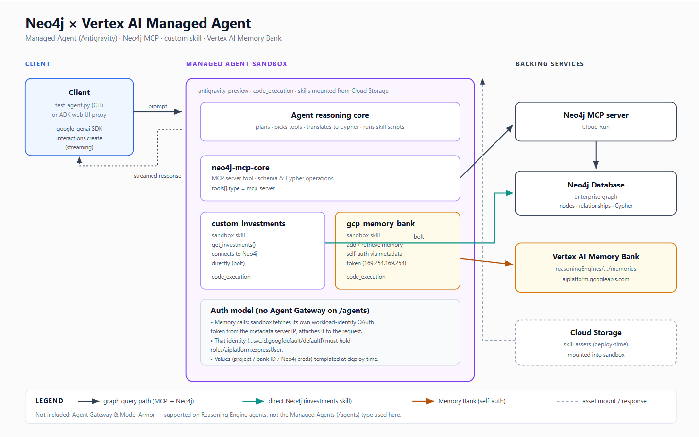

# Neo4j & Vertex AI Managed Agent Platform

This repository provides a declarative, infrastructure-led blueprint for deploying a secure, serverless graph database analyst using the Vertex AI Managed Agent platform (Antigravity engine) connected to an enterprise Neo4j Graph Database.

---

## 1. Architecture & System Flow

The platform decouples application logic from security boundaries, enforcing content safety at the ingress perimeter and network control at the egress perimeter.



- **Managed Agent Sandbox:** Each turn runs in an on-demand sandbox. Skills are mounted from Cloud Storage into `/workspace/.agent/skills/`. The agent uses `code_execution` to run skill scripts.
- **Neo4j access (two paths):** General graph queries route to an external Cloud Run MCP server (`get-schema`, `cypher`). Portfolio lookups run locally via the `custom_investments` skill connecting to Neo4j directly.
- **Memory (Vertex AI Memory Bank):** The `gcp_memory_bank` skill records and recalls user-scoped facts. It authenticates using the sandbox's own workload identity (see Setup Step 3).

---

## 2. Project Directory Structure

```text
.
├── .env.example                  # Config template (copy to .env)
├── .gitignore
├── deploy_platform.sh            # Renders values into skills + deploys the agent
├── test_agent.py                 # CLI streaming verification client
├── config/
│   └── agent_config.json         # Managed-agent definition (schema-supported fields only)
├── skills/
│   ├── custom_investments/
│   │   ├── main.py               # Neo4j portfolio lookup (values templated at deploy)
│   │   └── SKILL.md
│   └── gcp_memory_bank/
│       ├── gcp_vertex_client.py  # Memory Bank client (values templated at deploy)
│       └── SKILL.md
└── adk_proxy_ui/                 # Optional local web UI (adk web)
    ├── requirements.txt
    ├── __init__.py
    └── agent.py
```

---

## 3. Prerequisites

- A GCP project with the Vertex AI API enabled.
- `gcloud` authenticated: `gcloud auth login` and `gcloud auth application-default login`.
- A Cloud Storage bucket to stage skill assets.
- A Neo4j instance and (optionally) a Neo4j MCP server deployed on Cloud Run.
- A Vertex AI Memory Bank instance (a Reasoning Engine). Create one with:

```python
import vertexai
client = vertexai.Client(project="YOUR_PROJECT", location="global")
mb = client.agent_engines.create()
print(mb.api_resource.name)   # note the trailing numeric ID -> MEMORY_BANK_ID
```
or create with script in repo
```shell
python create_memory_bank.py
```
---

## 4. Backend Deployment & Verification

### Step 1: Configure Environment Variables

Copy the template configuration file to a local active `.env` file and fill out your live project coordinates, bucket destinations, and Neo4j connection keys:

```bash
cp example.env .env
```

### Step 2: Grant Storage Access to the Sandbox Runtime

Grant `Storage Object Viewer` (`roles/storage.objectViewer`) on your bucket to the Vertex AI Reasoning Engine service agent so the sandbox can fetch skill assets.

### Step 3: Run the Automated Deployment Script

Execute the deployment script to upload local skill modules to Cloud Storage, register the workspace manifests, compute basic authentication hashes on the fly, and build the persistent Managed Agent configuration via the Vertex API:

```bash
./deploy_platform.sh
```

### Step 3b: Grant Memory Permissions (required for Memory Bank)

This is the one manual step every new user must do, and it can only be done after the first deploy, because the identity doesn't exist until the agent runs.

1. Trigger one memory attempt (it will fail with `403`):

    ```bash
    python3 test_agent.py "Remember that I am John Doe and working with Acme Corp" --verbose
    ```

2. Read the sandbox's identity from the audit log:

    ```bash
    gcloud logging read \
      'protoPayload.methodName="google.cloud.aiplatform.v1beta1.MemoryBankService.CreateMemory" protoPayload.authorizationInfo.granted=false' \
      --project=YOUR_PROJECT --limit=1 \
      --format="value(protoPayload.authenticationInfo.principalSubject)"
    ```

    It looks like `serviceAccount:...svc.id.goog[default/default]`.

3. Grant it the runtime memory role (needs an IAM admin / project owner):

    ```bash
    gcloud projects add-iam-policy-binding YOUR_PROJECT \
      --member="PRINCIPAL_FROM_STEP_2" \
      --role="roles/aiplatform.expressUser"
    ```

4. Wait ~1–2 minutes for propagation, then re-run the memory test. It should return `"status": "success"`.

### Step 4: Verify

```bash
pip install google-genai

python3 test_agent.py "How many Organization nodes are in the graph?"
python3 test_agent.py "Remember I am John Doe and researching on AI related Companies" --verbose
python3 test_agent.py "What is my research interest" --verbose
```

---

## 5. Visual Developer Interface (ADK Proxy Setup)

The backend Managed Agent runs completely serverless in the cloud and exposes an API endpoint without a native graphic UI. To showcase its performance inside a visual chat interface without writing a custom web frontend, you can deploy the optional local ADK Proxy UI.

### How it Works

The Google Agent Development Kit framework includes a visual workspace canvas (`adk web`). We initialize a local `root_agent` using `gemini-3.5-flash` to host this UI layout. When a message is entered into the browser chat bubble, the local agent catches the text and forwards it to the `query_managed_agent` function. This function initializes the enterprise SDK client, executes the query directly against your secure, cloud-hosted Managed Agent, and returns the live cloud response tokens directly back to the UI interface.

### Running the UI

1. Install the required client-side interface packages:

    ```bash
    pip install -r adk_proxy_ui/requirements.txt
    ```

2. Navigate to your parent project directory context and start up the local developer server:

    ```bash
    adk web --port 8085
    ```

3. Open your browser and navigate to `http://localhost:8085` to interact with your secure cloud platform integration visually.

---

## 6. Official References & Documentation

For deeper configuration details regarding the underlying frameworks used in this deployment, refer to the official documentation channels:

- **Vertex AI Managed Agents & Sandboxes:** [Google Cloud Vertex AI Agent Platform Documentation](https://cloud.google.com/vertex-ai/docs/agents/overview)
- **Model Context Protocol (MCP):** [Official MCP Specification and Core Ecosystem](https://modelcontextprotocol.io/)
- **Google Agent Development Kit (ADK):** [Google ADK Session & Memory Management Reference](https://adk.dev/sessions/memory/)
- **Google GenAI Python SDK:** [Official `google-genai` GitHub Repository & SDK Guide](https://github.com/googleapis/python-genai)
- **Neo4j Python Integration:** [Neo4j Graph Database Driver Manual for Python Developers](https://neo4j.com/docs/python-manual/current/)
