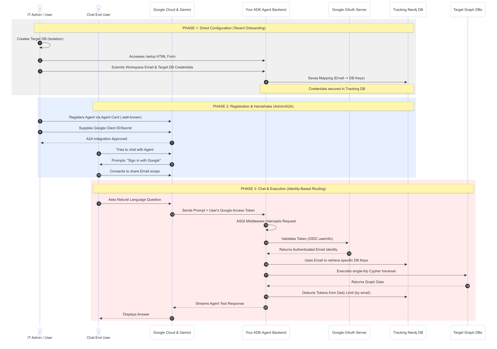

# Neo4j Graph Agent for Gemini Enterprise

This repository contains a production-ready AI Agent that connects organization-specific Neo4j Graph Databases to Google Gemini Enterprise. Utilizing the Agent-to-Agent (A2A) protocol and Google's Agent Development Kit (ADK), it enables users to securely query their enterprise graph data using natural language.

This application acts as a standalone microservice, leveraging native Google Workspace authentication to provide secure, multi-tenant database access without the need for custom password management.

---

### Architecture Overview


---

## :bulb: How It Works (TL;DR)

This service acts as a secure, intelligent bridge between Google's infrastructure and your Neo4j databases. 

It operates completely serverless on Google Cloud Run. To get started, a user visits a hosted `/setup` page to securely input their target Neo4j credentials, which are mapped to their Google Workspace email address. 

When the user chats with the agent in Gemini, Gemini prompts them to "Sign in with Google." The application's custom ASGI middleware intercepts the request, validates the Google OAuth token, extracts the user's email, retrieves their database credentials, and securely executes their natural language query against the graph using the Google ADK.

---

## :sparkles: Core Features


**Seamless Google Authentication:** Offloads identity management entirely to Google Workspace. Users authenticate via standard OAuth 2.0, meaning no custom passwords or custom JWT infrastructure to maintain.  
**Email-Based Multi-Tenancy:** Dynamically routes natural language queries to different target Neo4j databases based on the authenticated user's email address.  
**Smart Graph Reasoning (Compute Pushdown):** Utilizes the ADK's `BuiltInPlanner` to force the agent to read the database schema and architect efficient, single-trip Cypher queries before executing them, eliminating expensive LLM "hallucination loops."  
**Cost Control & Throttling:** Uses ADK callbacks to intercept exact LLM token usage per turn, deducting them from the user's allocated daily limit stored in the internal tracking database.  
**Circuit Breakers:** Implements strict `RunConfig` guardrails (`max_llm_calls`) to prevent infinite retries on syntax errors, ensuring fast failures and low latency.  


---

## :arrows_counterclockwise: Lifecycle Breakdown


**Configuration:** The user visits the `/setup` portal, enters their Workspace email, and provides their target Neo4j URI and credentials. The application securely saves this mapping in an internal tracking database.  
**Registration:** An admin adds the Agent to the Gemini Enterprise UI via the auto-generated Agent Card (`/.well-known/agent.json`), supplying standard Google Cloud OAuth credentials.  
**Authorization:** When a user interacts with the agent, Gemini initiates a native Google OAuth flow. Gemini receives a Google Access Token and forwards it to the application.  
**Validation:** The Starlette `OAuthValidationMiddleware` intercepts the request, pings the Google `userinfo` endpoint to verify the token, and extracts the user's email into the session context.  
**Execution:** The `AgentExecutor` retrieves the user's specific database credentials from the tracking database, formulates a plan, securely connects to their graph, and streams the queried results back to the Gemini UI.  


---

## :rocket: Deployment & Hosting

This application is containerized and designed to be deployed on **Google Cloud Run**. Sensitive credentials must be stored in Google Secret Manager and mounted to the container at runtime.  

**Create Required Secrets:**
Store sensitive variables (like `TRACKING_NEO4J_PASS`) in Secret Manager.  
`gcloud secrets create TRACKING_NEO4J_PASS --data-file=path/to/password.txt`  

**Deploy to Cloud Run (Mapping Secrets to Environment Variables):**
```bash
gcloud run deploy neo4j-a2a-agent \
  --source . \
  --platform managed \
  --region us-central1 \
  --allow-unauthenticated \
  --set-env-vars="SERVICE_URL=https://...,TRACKING_NEO4J_URI=neo4j+s://...,GEMINI_MODEL=gemini-2.5-pro" \
  --set-secrets="TRACKING_NEO4J_PASS=TRACKING_NEO4J_PASS:latest"
```
---

## :gear: Prerequisites & Environment Setup

Ensure the following are configured in your Google Cloud Project:  

### 1. Enable GCP APIs
**Cloud Run API:** To host the Starlette application.  
**Vertex AI API:** To allow the ADK agent to call Gemini.  
**Secret Manager API:** To securely store and retrieve sensitive configuration data.  

### 2. Google Cloud OAuth Setup
You must create OAuth 2.0 Client IDs (Web Application) in your GCP console. Ensure the following Authorized Redirect URIs are added so Gemini can complete the login flow:  
• https://vertexaisearch.cloud.google.com/oauth-redirect  
• https://vertexaisearch.cloud.google.com/static/oauth/oauth.html  

### 3. Environment Variables
**`SERVICE_URL`**: The literal public base URL of your Cloud Run app where traffic is routed.     
**`TRACKING_NEO4J_URI`**: URI for the internal Neo4j instance used for billing, token tracking, and storing tenant routing credentials.  
**`TRACKING_NEO4J_USER`**: Tracking DB username.  
**`TRACKING_NEO4J_PASS`**: Tracking DB password.  
**`GEMINI_MODEL`**: The LLM model string (e.g., `gemini-2.5-pro`).  
**`TRACK_TOKEN_USAGE`**: Boolean string (`True`/`False`) to toggle the token billing/limiting logic.  

---
## :open_file_folder: Project Structure

```text
├── main.py                  # Uvicorn entry point, Starlette app assembly, and Root 301 Redirect
├── requirements.txt         # Python dependencies
├── Dockerfile               # Production-ready container definition
├── architecture.png         # System architecture diagram
└── app/
    ├── api/
    │   ├── marketplace.py   # Setup URL handling
    │   └── middleware.py    # validating Google Access Tokens
    ├── core/
    │   ├── config.py        # Environment variables, Agent Card definition, and Base64 Icons
    │   └── context.py       # ContextVars for multi-tenant state management
    ├── services/
    │   ├── agent_executor.py # Core ADK execution, dynamic DB routing, and Guardrails
    │   ├── custom_tools.py  # Custom Neo4j Python functions
    │   └── token_manager.py # Graph-backed OAuth, Billing, and User State engine
    └── templates/           # Jinja2 HTML templates
        ├── authorize.html   # Custom OAuth consent screen
        ├── setup.html       # Customer DB configuration form
        └── success.html     # Setup completion confirmation
```
---
## Referral Documentation

ADK agent
• [Agent Development Kit](https://docs.cloud.google.com/agent-builder/agent-development-kit/overview)

A2A Protocol 
• [A2A Protocol](https://a2a-protocol.org/latest/)

Gemini Enterprise & Agents
• [Gemini for Google Workspace / Enterprise](https://cloud.google.com/gemini/enterprise)
