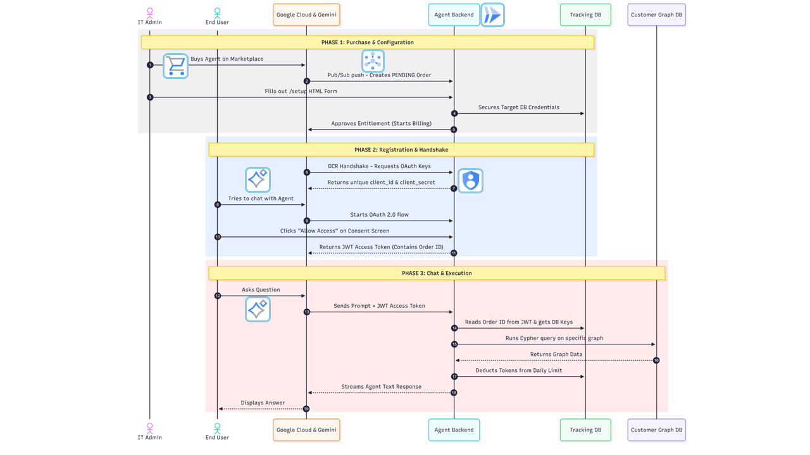

# Neo4j Agent-as-a-Service (AaaS) for Gemini Enterprise

This repository contains a production-ready AI Agent that connects organization-specific Neo4j Graph Databases to Google Gemini Enterprise. Utilizing the Agent-to-Agent (A2A) protocol and Google's Agent Development Kit (ADK), it allows users to securely query their enterprise graph data using natural language.

Designed natively for the **Google Cloud Marketplace** as an Agent-as-a-Service (AaaS), this application features full multi-tenant isolation, automated billing lifecycle management, and Dynamic Client Registration (DCR).

---


### Architecture Overview


---

## :bulb: How It Works (TL;DR)

This service acts as a secure, intelligent bridge between Google's infrastructure and your customers' Neo4j databases.  
It operates completely serverless on Google Cloud Run. When a customer purchases the agent, Google sends a background Pub/Sub event to register them.  
The customer then visits a hosted setup page to securely provide their Neo4j credentials.  
Finally, when the customer chats with Gemini, this service intercepts the natural language query, validates their specific OAuth token, converts the prompt into Cypher using the ADK, executes the query against their isolated Neo4j instance, and returns the streamed results back to the Gemini UI.

---

## :sparkles: Core Features

**True Multi-Tenancy:** Dynamically routes natural language queries to different target Neo4j databases per customer based on their secure, cryptographically verified Marketplace Identity.  
**Frictionless Onboarding:** Hosts a custom HTML setup portal for IT Admins to securely input database credentials without requiring complex GCP Procurement IDs.  
**Dynamic Client Registration (DCR):** Automatically provisions custom OAuth 2.0 credentials when Gemini connects to the agent, tying the connection strictly to the approved Marketplace Entitlement.  
**Custom OAuth 2.0 Provider:** Acts as its own authorization server, featuring a custom consent UI to prevent browser race conditions and securely issue JWTs.  
**Throttling & Billing:** Uses ADK callbacks to intercept exact LLM token usage per turn, deducting them from the customer's allocated daily limit stored in the internal tracking database.  

---

## :satellite: Marketplace & Pub/Sub Integration

To automate billing and tenant provisioning, this application listens to the standard Google Cloud Marketplace Pub/Sub topic. A push subscription routes these events directly to the `/pubsub` endpoint.

| Event Type | System Action |
| :--- | :--- |
| **`ENTITLEMENT_CREATION_REQUESTED`** | Extracts the Account ID and Entitlement ID, creating a `PENDING` user record in the internal tracking database. |
| **`ENTITLEMENT_ACTIVE`** | Confirms the customer has completed the `/setup` configuration and billing has officially commenced. |
| **`ENTITLEMENT_PLAN_CHANGED`** | Adjusts the customer's daily LLM token limits based on their newly selected tier. |
| **`ENTITLEMENT_CANCELLED`** | Immediately revokes OAuth access, deletes the target database credentials, and stops billing. |

---

## :arrows_counterclockwise: Lifecycle Breakdown

**Purchase:** A customer buys the Agent. The Pub/Sub event triggers the creation of their internal tracking profile.  
**Configuration:** The customer is redirected to the `/setup` portal to input their target Neo4j URI and credentials. The app securely saves these and pings the GCP Procurement API to start billing.  
**Registration:** The customer adds the Agent to their Gemini UI. Gemini calls `/dcr` to receive dynamically generated OAuth credentials.  
**Authorization:** When a user chats with the agent, Gemini initiates an OAuth flow against `/auth/authorize`. The app issues a signed JWT token via `/auth/token` mapping the session to the customer's Order ID.  
**Execution:** The Starlette Middleware extracts the Order ID. The `Neo4jADKExecutor` retrieves the tenant's specific database credentials, securely connects to their graph, and executes the query.  

---

## :rocket: Deployment & Hosting

This application is containerized and designed to be deployed on **Google Cloud Run**. Sensitive credentials must be stored in Google Secret Manager and mounted to the container at runtime.

**Create Required Secrets:**
Store sensitive variables (like `INTERNAL_SECRET_KEY` and `TRACKING_NEO4J_PASS`) in Secret Manager.
`gcloud secrets create TRACKING_NEO4J_PASS --data-file=path/to/password.txt`


**Deploy to Cloud Run (Mapping Secrets to Environment Variables):**
```bash
gcloud run deploy neo4j-adk-agent \
  --image gcr.io/YOUR_PROJECT_ID/neo4j-adk-agent \
  --platform managed \
  --region us-central1 \
  --allow-unauthenticated \
  --set-env-vars="SERVICE_URL=https://...,TRACKING_NEO4J_URI=neo4j+s://...,GEMINI_MODEL=gemini-2.5-pro" \
  --set-secrets="TRACKING_NEO4J_PASS=TRACKING_NEO4J_PASS:latest,INTERNAL_SECRET_KEY=INTERNAL_SECRET_KEY:latest"
```

**Configure Pub/Sub Push Subscription:**
In the GCP Console, create a Push Subscription for your Marketplace topic and point the endpoint URL to `https://YOUR_CLOUD_RUN_URL/pubsub`.

---

## :gear: Prerequisites & Environment Setup

Ensure the following are configured in your Google Cloud Project:

### 1. Enable GCP APIs
**Cloud Run API:** To host the Starlette application.  
**Vertex AI API:** To allow the ADK agent to call Gemini.  
**Secret Manager API:** To securely store and retrieve sensitive configuration data.  
**Cloud Commerce Partner Procurement API:** To approve Marketplace purchases and manage entitlements.  

### 2. IAM Permissions (For the Cloud Run Service Account)
`Vertex AI User`  
`Commerce Partner Editor` (or equivalent for Procurement API access)  
`Pub/Sub Subscriber`  
`Secret Manager Secret Accessor`  

### 3. Environment Variables
**`SERVICE_URL`**: The literal public base URL of your Cloud Run app where traffic is routed.  
**`PROVIDER_URL`**: The logical audience identifier configured in the GCP Agent Card (e.g., `https://neo4j.com`). Used strictly for JWT verification during DCR.  
**`MARKETPLACE_PROVIDER_ID`**: Your Google Cloud Partner ID (used to approve billing).  
**`INTERNAL_SECRET_KEY`**: A secure, random string used to sign your custom OAuth JWT Access Tokens.  
**`TRACKING_NEO4J_URI`**: URI for the internal Neo4j instance used for billing, token tracking, and storing tenant routing credentials.  
**`TRACKING_NEO4J_USER`**: Tracking DB username.  
**`TRACKING_NEO4J_PASS`**: Tracking DB password.  
**`GEMINI_MODEL`**: The LLM model string (e.g., `gemini-2.5-pro`).  
**`TRACK_TOKEN_USAGE`**: Boolean string (`True`/`False`) to toggle the token billing/limiting logic.  

---

## :open_file_folder: Project Structure

```text
├── main.py                  # Uvicorn entry point, Starlette app assembly, and Root 301 Redirect
├── requirements.txt         # Python dependencies
├── Dockerfile               # Production-ready container definition
├── architecture.png         # System architecture diagram
└── app/
    ├── api/
    │   ├── auth_routes.py   # DCR and Custom OAuth 2.0 endpoints
    │   ├── marketplace.py   # Pub/Sub listeners, API approvals, and HTML form handlers
    │   └── middleware.py    # JWT validation interceptor
    ├── core/
    │   ├── config.py        # Environment variables, Agent Card definition, and Base64 Icons
    │   └── context.py       # ContextVars for multi-tenant state management
    ├── services/
    │   ├── agent_executor.py # Core ADK execution, dynamic DB routing, and Guardrails
    │   ├── custom_tools.py  # Custom Neo4j Python functions
    │   └── token_manager.py # Graph-backed OAuth, Billing, and User State engine
    └── templates/           # Jinja2 HTML templates
        ├── authorize.html   # Custom OAuth consent screen
        ├── setup.html       # Customer DB configuration form
        └── success.html     # Setup completion confirmation
```
---

## Referral Documentation

ADK agent
• [Agent Development Kit](https://docs.cloud.google.com/agent-builder/agent-development-kit/overview)

A2A Protocol 
• [A2A Protocol](https://a2a-protocol.org/latest/)

Gemini Enterprise & Agents
• [Gemini for Google Workspace / Enterprise](https://cloud.google.com/gemini/enterprise)