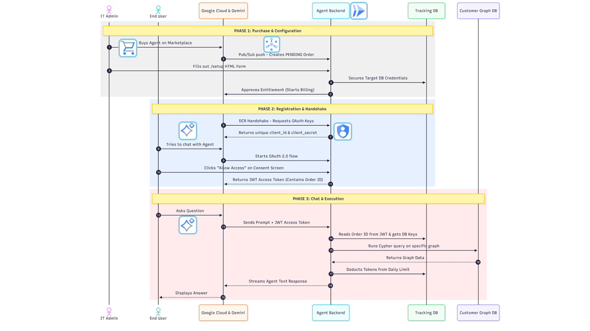

# Neo4j Agent-as-a-Service (AaaS) for Gemini Enterprise

**👋 ARE YOU A CUSTOMER?** > If you are an IT Admin or user looking to install and configure this agent for your organization, follow our **[Customer Setup Guide](customer_guide.md)**.

This repository contains an enterprise-grade AI Agent that bridges organization-specific Neo4j Graph Databases with Google Gemini Enterprise. Built on the Agent-to-Agent (A2A) protocol and the Google Agent Development Kit (ADK), it enables secure, natural language querying of complex graph data at scale.

Designed natively as an **Agent-as-a-Service (AaaS)** for the Google Cloud Marketplace, the architecture provides robust multi-tenant isolation, automated billing lifecycle management, and verified federated identity.

---

### Architecture Overview


---

## 💡 How It Works

The service operates as a serverless gateway on Google Cloud Run. It manages a sophisticated "one-to-many" relationship model where a single Marketplace **Order** (representing a company) can support multiple **Users** (employees) and **App Instances**, each with isolated token quotas and conversation histories.

The system utilizes [context.py](app/core/context.py) to maintain strict cryptographic separation between the human user's identity (email) and the corporate database credentials throughout the execution lifecycle.

---

## ✨ Core Features

* **Dual-Mode Authentication (OIDC & A2A M2M):** 
* **Interactive UI:** Uses Google Workspace OIDC (`authorization_code`) to verify human emails and enforce individual user token quotas in the Gemini Enterprise UI.
* **Headless A2A Protocol:** Supports OAuth 2.0 `client_credentials` for direct Agent-to-Agent delegations, automatically attributing background execution tokens to the parent Order.
**Federated Identity (OIDC):** Integrates directly with Google Workspace Identity. The agent uses a secure [Federated OAuth Flow](app/api/auth_routes.py) to verify the user's corporate email, ensuring token limits follow the individual across any Gemini app they use.  
**True Multi-Tenancy:** Dynamically routes queries to isolated target Neo4j databases. The [TokenManager](app/services/token_manager.py) resolves the correct encrypted credentials for each specific Marketplace Order ID.  
**Granular Token Economics:** Implements a dual-bucket tracking system. It monitors both **Daily Limits** (enforcing quotas) and **Lifetime Cumulative Usage** (for long-term analytics) at the individual user level.  
**Dynamic Client Registration (DCR):** Automatically provisions unique OAuth 2.0 credentials when Gemini connects to a new app instance, binding the connection strictly to an active Marketplace Entitlement.  
**Semantic Guardrails:** Features an [integrated security layer](app/services/agent_executor.py) that inspects every natural language query for prompt injection or malicious Cypher patterns before they reach the graph engine.  


---

## 🏛️ Internal Tracking Graph (State Management)

Because this is a multi-tenant application, it relies on its own internal Neo4j database to manage routing and state. The graph schema connects Marketplace procurement with identities:


**`(:ProcurementAccount)`**: The master Google Cloud Billing account node representing the purchasing organization. Linked to one or more Orders via `HAS_SUBSCRIPTION`.
**`(:Order)`**: Represents a specific Marketplace Entitlement/Subscription. Holds the target Neo4j URI and Secret Manager password references.
**`(:User)`**: The human employee (identified by email) or synthetic service account. Linked to an Order via `HAS_USER`. Tracks `tokens_used_today` and `total_tokens_used`.
**`(:OAuthClient)`**: The specific Gemini App or A2A client installation. Linked to the Order via `HAS_CLIENT`.
**`(:RefreshToken)`**: Bound to the User and OAuthClient for session persistence across token renewals.  


---

## 🛰️ Marketplace & Pub/Sub Integration

To automate provisioning, the application processes real-time events via a [Pub/Sub Handler](app/api/marketplace.py). This ensures the internal state in Neo4j always matches the customer's current billing status on the Google Cloud Marketplace.  

| Event Type | System Action |
| :--- | :--- |
| **`ENTITLEMENT_CREATION_REQUESTED`** | Provisions a `PENDING` Order node and sets up initial quota structures. |
| **`ENTITLEMENT_ACTIVE`** | Activates the tenant routing after the admin completes the secure setup. |
| **`ENTITLEMENT_PLAN_CHANGED`** | Dynamically updates user-level token limits in the tracking database. |
| **`ENTITLEMENT_CANCELLED`** | Revokes all OAuth Client IDs and wipes target database credentials. |

---

## 🔄 Lifecycle Breakdown


**Purchase & Ingestion:** A customer subscribes on Google Cloud Marketplace. Pub/Sub pushes lifecycle events (`ACCOUNT_ACTIVE`, `ENTITLEMENT_CREATION_REQUESTED`) to `marketplace.py`, which records the pending tenant graph asynchronously and acknowledges immediately (`200 OK`) to avoid delivery loops.
**Configuration & Procurement Approval:** The IT Admin completes the `/setup` portal. Credentials are stored securely in Google Secret Manager, and the service executes deferred Google Procurement API approvals (`approve_marketplace_account` and `approve_marketplace_entitlement`) in background worker threads to activate billing. 
**Registration:** Gemini calls the `/dcr` endpoint in [auth_routes.py](app/api/auth_routes.py) to generate unique credentials for a specific agent installation.  
**Authorization (Federated):** When a user chats, the [authorize_handler](app/api/auth_routes.py) redirects them to a native Google Login. Once verified, the user's email is cryptographically bound to an internal JWT.  
**Execution:** The [OAuthValidationMiddleware](app/api/middleware.py) extracts the identity. The [Neo4jADKExecutor](app/services/agent_executor.py) then loads the specific tenant tools and executes the query against the graph.  


---

## ⚙️ Prerequisites & Environment Setup

Ensure the following are configured in your Google Cloud Project:

### 1. Enable GCP APIs

**Cloud Run API:** To host the Starlette application.   
**Vertex AI API:** To allow the ADK agent to call Gemini.  
**Secret Manager API:** To securely store and retrieve sensitive configuration data.  
**Cloud Commerce Partner Procurement API:** To approve Marketplace purchases and manage entitlements.  


### 2. IAM Permissions (For the Cloud Run Service Account)

`Vertex AI User`  
`Commerce Partner Editor` (or equivalent for Procurement API access)  
`Pub/Sub Subscriber`  
`Secret Manager Secret Accessor`  


### 3. Environment Variables
The application is configured via [app/core/config.py](app/core/config.py). Ensure the following variables are set in your environment:

**`SERVICE_URL`**: The literal public base URL of your Cloud Run app where traffic is routed.  
**`PROVIDER_URL`**: The logical audience identifier configured in the GCP Agent Card (e.g., `https://neo4j.com`). Used strictly for JWT verification during DCR.  
**`MARKETPLACE_PROVIDER_ID`**: Your Google Cloud Partner ID (used to approve billing).  
**`TRACKING_NEO4J_URI`**: URI for the internal Neo4j instance used for billing, token tracking, and storing tenant routing credentials.  
**`TRACKING_NEO4J_USER`**: Tracking DB username.   
**`GEMINI_MODEL`**: The LLM model string (e.g., `gemini-2.5-pro`).  
**`TRACK_TOKEN_USAGE`**: Boolean string (`True`/`False`) to toggle the token billing/limiting logic.  


### 4. Secret Manager
Add the following secrets to Google Secret Manager:

**`GOOGLE_CLIENT_ID` / `GOOGLE_CLIENT_SECRET`**: Your Google OIDC credentials.  
**`INTERNAL_SECRET_KEY`**: A cryptographically secure string used to sign the internal AaaS JWT tokens.  
**`TRACKING_NEO4J_PASS`**: Password for the internal billing and routing database.  


---

## 🚀 Deployment & Hosting

### 1. Configure Google Identity (OAuth Consent Screen)
To enable Federated Login, you must configure the **OAuth consent screen** in the GCP Console:


**User Type:** Select **External** (Required for Marketplace apps).  
**Scopes:** Explicitly add the `openid` and `.../auth/userinfo.email` scopes.  
**Credentials:** Create an OAuth 2.0 Web Client ID and add `https://[YOUR_SERVICE_URL]/auth/google/callback` to the Authorized Redirect URIs.  


### 2. Deploy to Cloud Run
```bash
gcloud run deploy SERVICE_NAME \
  --source . \
  --region us-central1 \
  --allow-unauthenticated \
  --set-secrets="TRACKING_NEO4J_PASS=TRACKING_NEO4J_PASS:latest,INTERNAL_SECRET_KEY=INTERNAL_SECRET_KEY:latest,GOOGLE_CLIENT_SECRET=GOOGLE_CLIENT_SECRET:latest"
```
---

## Referral Documentation

ADK agent
• [Agent Development Kit](https://docs.cloud.google.com/agent-builder/agent-development-kit/overview)

A2A Protocol 
• [A2A Protocol](https://a2a-protocol.org/latest/)

Gemini Enterprise & Agents
• [Gemini for Google Workspace / Enterprise](https://cloud.google.com/gemini/enterprise)
