# Neo4j Agent-as-a-Service: Customer Setup Guide

Welcome to the Neo4j Agent-as-a-Service (AaaS) for Gemini Enterprise. This guide is designed for IT Administrators and End-Users to easily procure, connect, and use the agent within their corporate environment.

**🔗 Quick Link:** If you have already purchased the agent on the Google Cloud Marketplace, head directly to the secure setup portal to link your database: [https://graphrag-gcp.neo4j.agency/setup](https://graphrag-gcp.neo4j.agency/setup)

---

## Phase 1: Administrator Setup

To get started, your organization's billing administrator needs to procure the service and link it to your target Neo4j database.

**Subscribe via GCP Marketplace:** Purchase the Neo4j AaaS subscription through the Google Cloud Marketplace. This provisions your billing account and generates your unique organization Order ID.
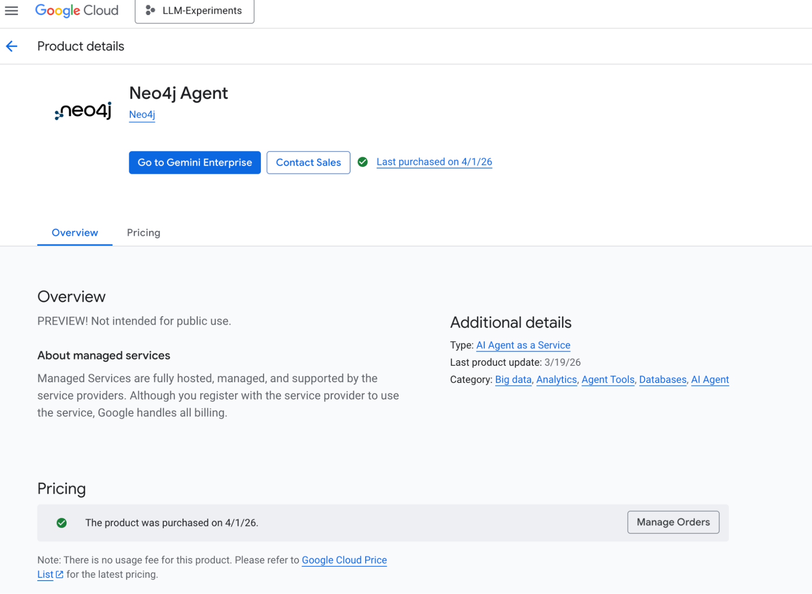

**Link Your Database:** Navigate to our secure provisioning portal at [https://graphrag-gcp.neo4j.agency/setup](https://graphrag-gcp.neo4j.agency/setup).
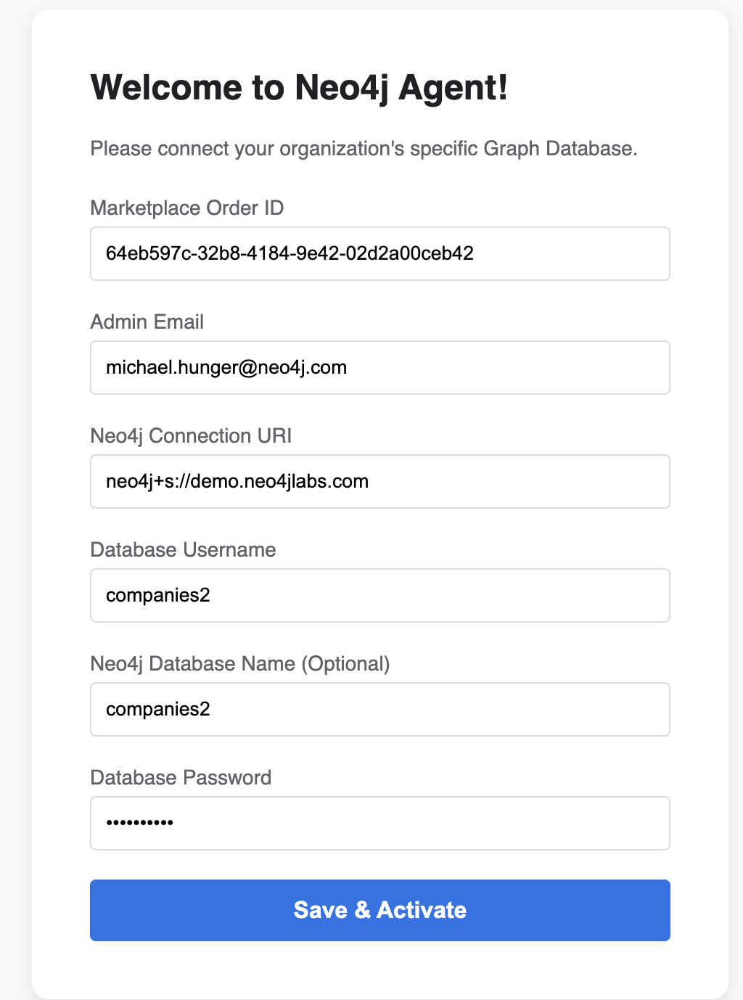

**Configure Credentials:** Enter your Marketplace Order ID alongside the URI, username, and password for your target Neo4j database. 
   *Security Note: These credentials are encrypted and stored safely in Google Secret Manager, physically isolated from all other tenants.*

---

## Phase 2: Gemini Integration

Once the database is successfully linked, your Workspace Administrator must expose the agent to your employees via the Gemini Enterprise UI.

**Add the Agent:** Open your Gemini Enterprise Console. Select the option to **"Add custom agent via marketplace"**.
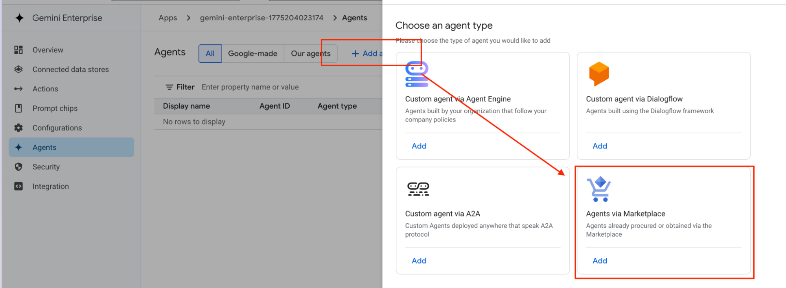

**Select the Agent:** If procurement was successful, the Neo4j agent will appear in your available list. Select it to proceed.
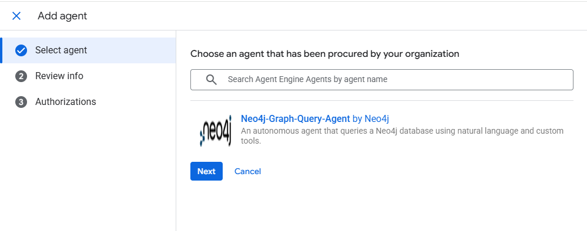

**Review Configuration:** Review the agent's details and capabilities on the confirmation page.
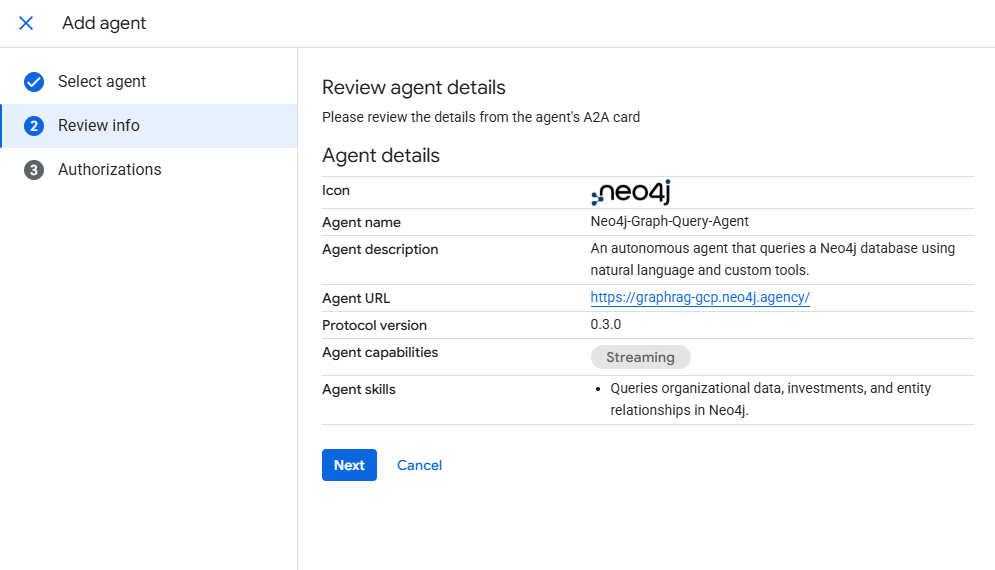

**Authorize the Handshake:** Select **DCR (Dynamic Client Registration)** for authorization. Gemini will automatically perform a secure cryptographic handshake behind the scenes to register your specific app instance. Once complete, your tenant status will be marked as "Active".
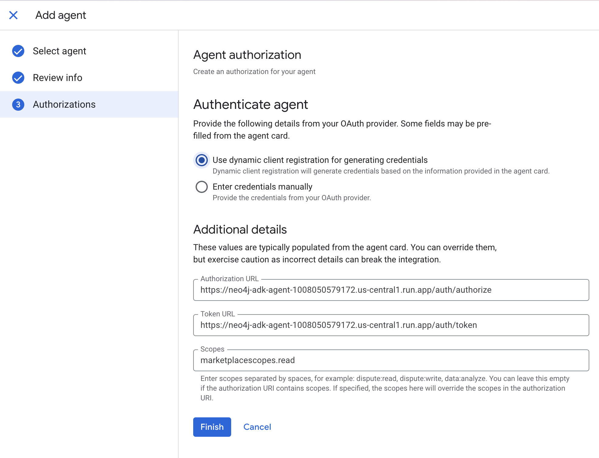

---

## Phase 3: Start Chatting

With the agent registered, authorized users within your organization can now interact with your Neo4j graph directly from the Gemini UI using natural language!

**Access the Agent:** Navigate to the "Agents" section of your Gemini Enterprise application.
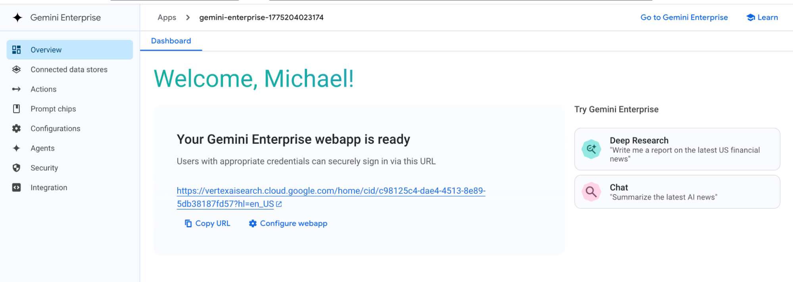

**Pin for Quick Access:** Pin the Neo4j agent to your sidebar so you can access it instantly during your daily workflows.
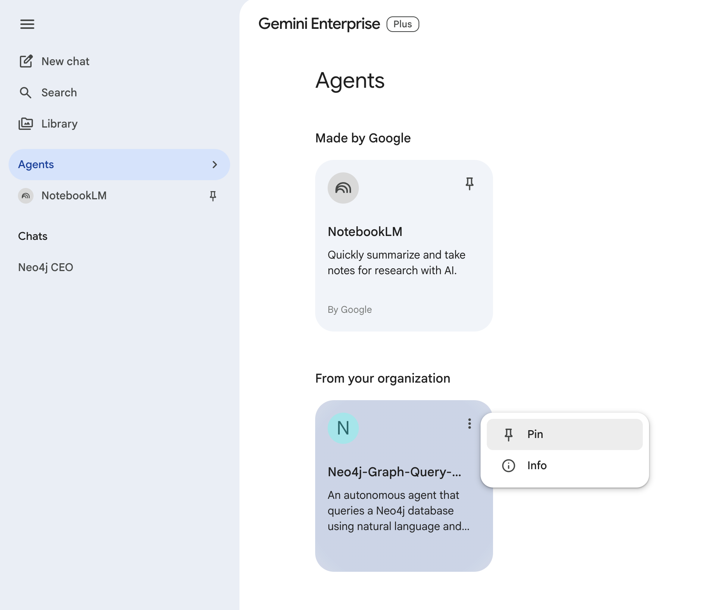

**Secure Login:** Upon sending your first prompt, you will be securely redirected to authenticate via **Google Workspace**. 
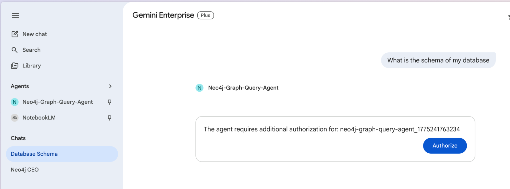

**Grant Access:** A secure pop-up window will request authorization to link your Google Workspace account. Click "Allow" to verify your corporate identity.
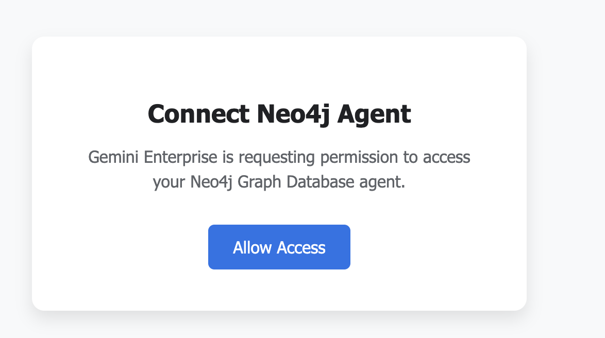

**Start Querying:** Once authenticated, simply ask your questions! The agent will translate your natural language into Cypher, execute it against your isolated database, and return the insights.
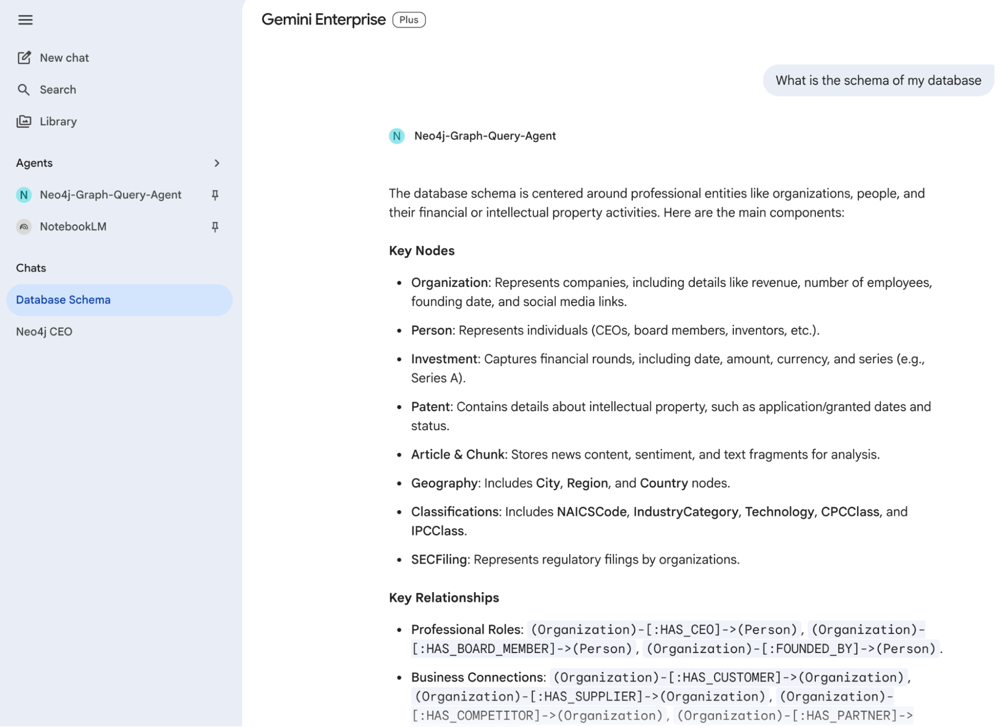

**Token Tracking & Limits:** This OIDC flow ensures your token usage is correctly tracked against your organization's daily limits. If you exceed your individual daily token allowance, the system will politely notify you with the response: *"You have reached your daily token limit. Please try again tomorrow."*
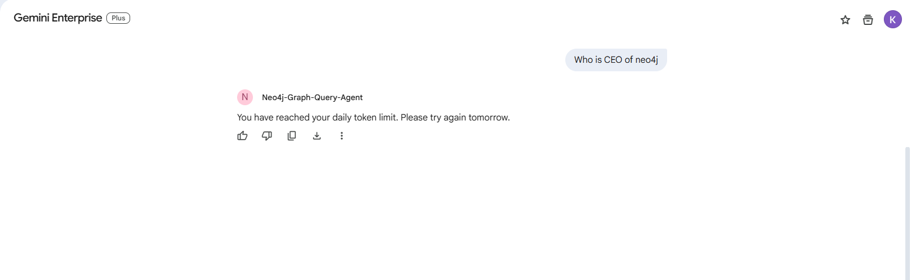