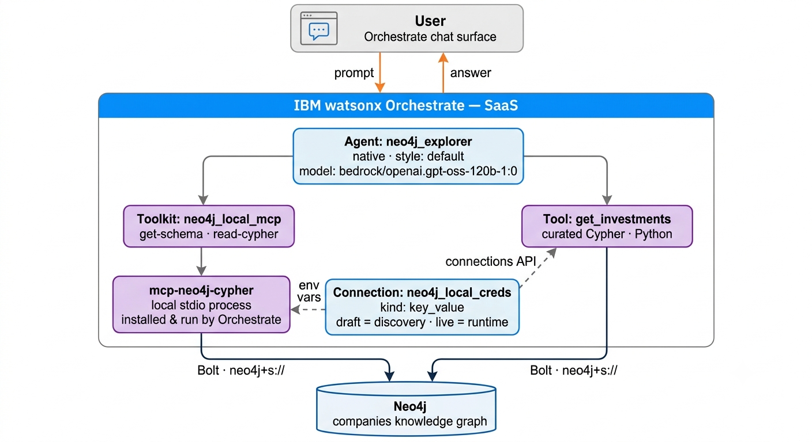

# IBM watsonx Orchestrate + Neo4j Integration

Build watsonx Orchestrate agents that use a Neo4j knowledge graph as their knowledge layer, through the Model Context Protocol (MCP).

This integration contains two agents:

1. **`neo4j_explorer`** — a native Orchestrate agent that inspects the graph schema, generates Cypher, and answers questions about companies, people, and investments. Graph access comes from the official Neo4j MCP server (`neo4j-mcp-server`), registered as a **local (stdio) toolkit** that Orchestrate installs and runs inside its own runtime, plus one curated Python tool.
2. **`memory_agent`** — a LangGraph agent imported into Orchestrate that adds **long-term, cross-session memory** through the Neo4j Agent Memory Service (NAMS), and queries the companies graph when a question needs it.

Both agents are set up entirely from the command line.

---

## Background

**IBM watsonx Orchestrate** is IBM's platform for building and running AI agents. Unlike a code-first framework where the agent lives in your own process, an Orchestrate agent lives on the platform: you describe it declaratively — a model, a style, instructions, and a toolset — and Orchestrate runs it, gives it a chat surface, and manages its lifecycle across draft and live environments. Orchestrate can also run code-based agents: LangGraph agents can be imported into its runtime, which is how the memory agent here is built.

**Neo4j** is a graph database. Instead of rows and joins, it stores entities as nodes and relationships as first-class connections between them, which makes multi-hop questions — "which people sit on the boards of two different companies," "what connects these two organizations" — cheap to express and fast to answer. That property is exactly what makes a graph a strong knowledge layer for an agent: the hard questions for a normal database are the natural ones for a graph.

**The Model Context Protocol (MCP)** is the open standard that connects the two. An MCP server exposes a set of tools over a common interface; an MCP client — here, watsonx Orchestrate — discovers those tools and lets the agent call them. Neo4j publishes an official MCP server, [`neo4j-mcp-server`](https://pypi.org/project/neo4j-mcp-server/), that exposes graph operations as tools: `get-schema`, `read-cypher`, `write-cypher`, and `list-gds-procedures`. Because the contract is standardized, the same server that works in Claude Desktop or VS Code works in Orchestrate with no changes.

**How the pieces fit.** Orchestrate can consume an MCP server in two ways: a **remote** server reached over HTTPS that you host yourself, or a **local (stdio)** server that Orchestrate installs and runs inside its own runtime. This integration uses the local option, because it removes hosting entirely — no container, no deployment, no public endpoint, no inbound authentication layer. Orchestrate installs `neo4j-mcp-server`, runs it as a subprocess, and passes the Neo4j credentials into that process as environment variables. The server then connects outbound to Neo4j over Bolt. Note that Orchestrate's own built-in knowledge feature is vector-based RAG (backed by stores such as Milvus or Elasticsearch); there is no native graph retriever, so graph access is provided through MCP tools rather than a knowledge base.

---

## Architecture



The runtime execution flow functions along the following boundaries:

**Agent Runtime.** The user prompt is received by the Orchestrate-hosted chat surface and passed to the native agent `neo4j_explorer` (model `bedrock/openai.gpt-oss-120b-1:0`). The agent's instructions govern tool selection, schema-first querying, and result limits.

**Tool Resolution.** The agent's toolset resolves to the MCP tools of the `neo4j_local_mcp` toolkit and the Python tool `get_investments`. Orchestrate performs tool discovery and schema validation at import time using the **draft** credentials, and executes tools at runtime using the **live** credentials.

**MCP Execution.** Orchestrate installs the `neo4j-mcp-server` package and runs it as a local stdio process within its own runtime. The `neo4j_local_creds` connection is injected into that process as environment variables (`NEO4J_MCP_URI`, `NEO4J_MCP_USERNAME`, `NEO4J_MCP_PASSWORD`, `NEO4J_MCP_DATABASE`, `NEO4J_MCP_READ_ONLY`, `NEO4J_MCP_TELEMETRY`). No inbound network exposure or HTTP authentication layer is involved.

**Graph Execution.** The MCP server connects outbound to Neo4j over Bolt (`neo4j+s://`) and executes `get-schema`, `read-cypher`, or `list-gds-procedures` against the companies knowledge graph, returning structured results to the agent for synthesis. `NEO4J_MCP_READ_ONLY=true` disables `write-cypher` at the server level, so it is not exposed to the agent.

The connection is the only place credentials live. It carries two sets of keys: `NEO4J_MCP_*` for the MCP server, and `NEO4J_*` for the `get_investments` Python tool, which reads them through the connections API.

---

## Prerequisites

- watsonx Orchestrate instance (the free trial is sufficient)
- Python 3.11+, macOS or Linux (use WSL2 on Windows)
- Network access to a Neo4j instance

The defaults target the public Neo4j **companies** demo database, so no database setup is required. Point the `NEO4J_*` values in `.env` at an Aura or self-managed instance to use your own graph — nothing else in the setup changes.

---

## Quickstart

```bash
cd ibm-watsonx
python3.11 -m venv venv && source venv/bin/activate
pip install -U ibm-watsonx-orchestrate

cp .env.example .env      # then fill in WO_ENV_NAME and WO_INSTANCE_URL
make all
```

`make all` registers the environment, creates the connection, adds the MCP toolkit, imports the Python tool, and imports the agent. It will prompt once for your API key. When it finishes, open **Agent Builder** in the Orchestrate console and chat with `neo4j_explorer`.

Prefer building the agent in the UI? The walkthrough in [`docs/console-agent-setup.md`](docs/console-agent-setup.md) creates the same agent from the same connection, toolkit, and tool.

### Getting your credentials

In the Orchestrate console, click your profile icon and go to **Settings → API details**. Copy the **service instance URL** into `WO_INSTANCE_URL`.

To create the API key, click **Generate API key**. On AWS-hosted instances this opens **Access management** in the IBM SaaS console, where the key is created; copy it when it is shown, as it cannot be retrieved later. Use this key, not an IBM Cloud IAM key — an IAM key produces a misleading `Scope not found` error.

API sessions expire. If a command fails with an authentication error, run `orchestrate env activate <env-name>` again.

---

## What each step does

| Target | Command | Effect |
|---|---|---|
| `make env` | `orchestrate env add` | Registers and activates the instance |
| `make connections` | `orchestrate connections …` | Creates `neo4j_local_creds` (`key_value`) for draft and live, with `NEO4J_MCP_*` and `NEO4J_*` keys |
| `make mcp-toolkit` | `orchestrate toolkits add --kind mcp` | Installs and registers `neo4j-mcp-server` as a local stdio server |
| `make custom-tool` | `orchestrate tools import -k python` | Imports `get_investments` with its pinned dependencies |
| `make agent` | `orchestrate agents import` | Imports `neo4j_explorer` from `agents/neo4j_explorer.yaml` |
| `make verify` | — | Lists toolkits, tools, models, and agents |

Individual scripts live in [`scripts/`](scripts/) if you would rather run the commands one at a time.

### Referencing MCP tools in the agent

The agent lists each MCP tool individually under `tools:`, using the `<toolkit>:<tool>` name shown by `orchestrate tools list`:

```yaml
tools:
  - get_investments
  - neo4j_local_mcp:get-schema
  - neo4j_local_mcp:read-cypher
  - neo4j_local_mcp:list-gds-procedures
```

Referencing the whole toolkit with a `toolkits:` key instead fails on CLI import with *"Toolkits are only supported for experimental_customer_care style agents"*. See [`docs/known-issues.md`](docs/known-issues.md).

---

## Trying it

In the Agent Builder preview chat for `neo4j_explorer`:

| Prompt | Expected tool |
|---|---|
| What is in this graph? | `get-schema` |
| List 5 companies in the semiconductor industry | `read-cypher` |
| Who invested in Databricks? | `get_investments` |
| Are there board members shared between two companies? | `read-cypher`, multi-hop |

A multi-hop question is trivial Cypher and awkward for most other retrieval strategies, which is the clearest argument for a graph as an agent's knowledge layer. Expand the tool-call trace on each answer to see which tool the agent selected.

---

## Notes on the custom tool

`get_investments` is deliberately minimal — one query, one clear docstring. Three things about it are worth copying into your own tools:

**Credentials come from the connection.** The `@tool` decorator declares `expected_credentials` with type `key_value_creds`, and the tool reads the values with `connections.key_value(...)`. Note the spelling differs from the CLI, where the connection kind is `key_value`.

**Dependencies are installed server-side and must be pinned exactly.** `neo4j==5.28.1`, never `neo4j>=5`. Packages are also checked against a tenant-specific allowlist at import time. The first call after import may return *"We are configuring your tool in the background"* — that is the install running; wait a few minutes and retry.

**The docstring is the routing signal.** Orchestrate derives the tool description and argument descriptions from a Google-style docstring, and the model chooses tools from those descriptions. A vague docstring means the agent falls back to `read-cypher` and your curated query never runs.

---

## Memory + graph agent (cross-session, LangGraph)

The `memory-agent/` folder contains a second, independent agent that adds two capabilities a native YAML agent cannot: **long-term memory** and **LLM-routed graph queries**, in one code-based agent. It is a **LangGraph agent imported into Orchestrate** (running inside the platform runtime) that uses Neo4j as *both* layers — the **Neo4j Agent Memory Service (NAMS)** for what it remembers, and the companies graph for what it knows.

### How it works

The agent runs a single graph node that performs three steps per turn:

```
recall   → search the NAMS entity graph for facts relevant to the question
respond  → LLM answers, calling graph tools in an internal loop if needed
persist  → send the user's message to NAMS for background entity extraction
```

Memory is recalled every turn and injected into the prompt. The **companies graph is queried only when the LLM decides it is needed**: the graph is exposed as two tools (`get_graph_schema`, `run_graph_query`) bound to the model, and they run only when the model emits a tool call. A question answerable from memory alone runs no graph query; a company question does; a question needing both pulls the preference from memory and filters the graph query accordingly.

The tool-calling loop runs inside the node, and the node returns exactly **one plain assistant message** to Orchestrate. Imported LangGraph agents run behind an A2A protocol layer, and returning internal tool-call and tool-result messages causes that layer to fail with `argument of type 'NoneType' is not iterable` after the agent has completed.

Memory lives in NAMS rather than the agent's own state, which matters because imported LangGraph agents only persist messages between turns, not custom state. Because memory is external and workspace-scoped, it carries across separate chat sessions.

### Setup

Three connections supply credentials. Orchestrate injects them into the agent as `{app_id}_{credential_type}`. The companies graph uses the public Neo4j demo database and needs no connection.

| Connection | Injected key | Value |
|---|---|---|
| `nams_api` | `nams_api_api_key` | NAMS API key (memory.neo4jlabs.com/dashboard) |
| `nams_workspace` | `nams_workspace_api_key` | NAMS workspace id (`X-Workspace-Id`) |
| `llm_openai` | `llm_openai_api_key` | OpenAI API key for the agent's LLM |

```bash
cd memory-agent
export NAMS_API_KEY=...
export NAMS_WORKSPACE_ID=...
export OPENAI_API_KEY=...
./setup.sh
```

`setup.sh` creates the connections, imports the agent with `orchestrate agents import --package-root .`, and attaches the connections with `orchestrate agents connect -n memory_agent -a <app-id>`.

### Demonstrating it

Memory works **across sessions**, so use two separate chats:

1. **Session A** — state a fact: *"Remember that John is only interested in cyber security companies."* The agent acknowledges it.
2. **Wait.** NAMS extracts entities asynchronously — a few seconds to a few minutes. You can watch entities appear in the NAMS dashboard.
3. **Session B** (new chat) — ask: *"Which companies should John look at?"* The agent recalls John's cyber security interest and queries the companies graph accordingly — memory and graph together.

### A note on consistency

Writes are acknowledged immediately, but entity extraction runs in the background, so memory is **eventually consistent** — a fact is not always retrievable in the same turn it was stated. This is a characteristic of the NAMS extraction pipeline, not of watsonx Orchestrate or the agent. The cross-session demo is unaffected, since time passes between sessions.

---

## Layout

```
.
├── Makefile                      one target per setup step
├── .env.example                  configuration template
├── agents/
│   └── neo4j_explorer.yaml       agent definition (imported by `make agent`)
├── tools/
│   ├── get_investments.py        curated Python tool
│   └── requirements.txt          exact-pinned dependencies
├── scripts/                      01_env … 05_agent
├── memory-agent/                 LangGraph memory + graph agent
│   ├── agent.py                  recall → respond (+ graph tools) → persist
│   ├── agent.yaml                agent package definition
│   ├── requirements.txt
│   └── setup.sh                  connections + import + connect
└── docs/
    ├── console-agent-setup.md    optional: build the agent in the UI
    ├── known-issues.md           errors and their causes
    └── images/                   console screenshots
```

---

## Verified against

watsonx Orchestrate trial (AWS) · ADK `2.17.0` · Python 3.11 · `neo4j-mcp-server` 1.6.0 (local stdio) · Neo4j companies demo database · `bedrock/openai.gpt-oss-120b-1:0`

---

## Resources

**watsonx Orchestrate**
- Product: https://www.ibm.com/products/watsonx-orchestrate
- ADK developer docs: https://developer.watson-orchestrate.ibm.com
- ADK repository: https://github.com/IBM/ibm-watsonx-orchestrate-adk

**Neo4j**
- Neo4j MCP server (`neo4j-mcp-server`): https://pypi.org/project/neo4j-mcp-server/
- Neo4j MCP documentation: https://neo4j.com/docs/mcp/current/
- Neo4j Agent Memory: https://neo4j.com/labs/agent-memory/

**Model Context Protocol**
- Specification: https://modelcontextprotocol.io
