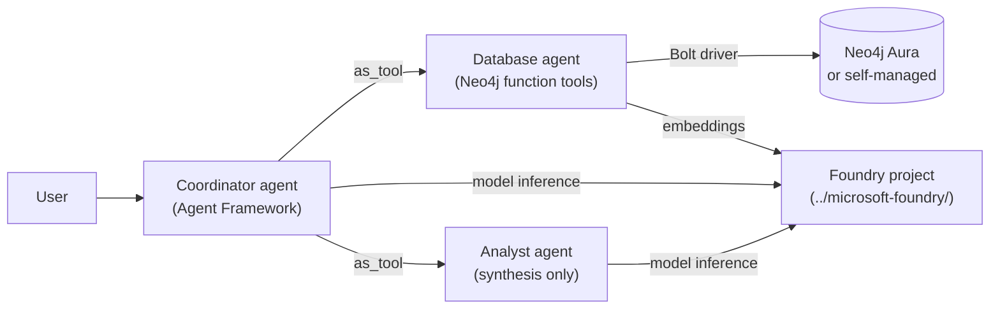

# Microsoft Agent Framework + Neo4j

Microsoft Agent Framework is Microsoft's open-source SDK for building production AI agents in Python and .NET — single agents, multi-agent workflows, and hosted-agent deployment.
Neo4j is the graph database and knowledge layer that grounds those agents in connected enterprise data — relationships, hierarchies, and multi-hop paths the model can actually reason over.

Better together: Agent Framework gives you agents that **collaborate**. Neo4j gives those agents **shaped, connected context** instead of flattened retrieval.

> Agent Framework is cross-vendor — Azure OpenAI, OpenAI, Anthropic, local models, and more. Both examples below use the Microsoft Foundry deployment from [`../microsoft-foundry/`](../microsoft-foundry/) — the local example calls the project endpoint directly, the hosted example registers a containerised agent against the same project. One deployment, one `.env`, both use cases.

## Why multi-agent + graph

Investment research is multi-step: discover, profile, traverse the network, read the news, synthesize. This example follows the repo-wide [`EXAMPLE_AGENT.md`](../EXAMPLE_AGENT.md) pattern: a coordinator delegates graph retrieval to a Neo4j database agent, then passes the grounded results to an analyst.

## Architecture



Both examples implement the same coordinator/database-agent/analyst graph. The local example runs it from your shell; the hosted example packages it as a Foundry hosted agent and runs it in Foundry's managed runtime.

## Prerequisites

- [Azure CLI (`az`)](https://learn.microsoft.com/cli/azure/install-azure-cli)
- [Azure Developer CLI (`azd`)](https://learn.microsoft.com/azure/developer/azure-developer-cli/install-azd)
- [Python 3.11+](https://www.python.org/downloads/)
- [`uv`](https://docs.astral.sh/uv/)
- An Azure subscription you can deploy to

For Azure provisioning of the shared Neo4j MCP server and Foundry project, use the streamlined setup in [`../microsoft-foundry/infra/README.md`](../microsoft-foundry/infra/README.md).

## Quick start

```bash
git clone https://github.com/neo4j-labs/neo4j-agent-integrations.git
cd neo4j-agent-integrations
azd config set auth.useAzCliAuth true    # one-time: let azd reuse az's session
az login
cd microsoft-foundry/infra && ./deploy.sh    # one-time, provisions Foundry
cd ../../microsoft-agent-framework/examples/multi-agent && uv run multi_agent_neo4j.py
```

Defaults connect to the public `companies` Neo4j demo graph and use the Foundry project provisioned by `deploy.sh`.

## Examples

| Example | What it shows | Folder |
| --- | --- | --- |
| **Multi-agent (local)** | Coordinator with `database_agent.as_tool()` and `analyst.as_tool()` | [`examples/multi-agent`](./examples/multi-agent/) |
| **Foundry-hosted multi-agent** | Same agent graph packaged as a Foundry hosted agent | [`examples/foundry-hosted`](./examples/foundry-hosted/) |
| **Aura-hosted MCP over OAuth** | Connect to Aura's built-in MCP via OAuth 2.0 DCR (no static credentials) | [`examples/aura-mcp-oauth`](./examples/aura-mcp-oauth/) |

## Why host on Foundry?

Hosted agents in Foundry Agent Service let you ship the same Agent Framework code to a managed runtime. From the [official hosted-agents concepts page](https://learn.microsoft.com/azure/foundry/agents/concepts/hosted-agents):

- **Bring your own code** — Agent Framework, LangGraph, Semantic Kernel, or custom; the platform doesn't care.
- **Dedicated agent identity** — a Microsoft Entra ID is auto-created at deploy and used by your agent at runtime to call models, tools, and downstream Azure services.
- **Per-session VM-isolated sandboxes** — `$HOME` and `/files` persist across turns and idle (15-min idle timeout, 30-day session lifetime).
- **Versioning** — immutable agent versions with weighted traffic split for canary and blue-green rollouts.
- **Scale-to-zero** — the platform handles container lifecycle, scaling, and observability via Application Insights.
- **Foundry portal integration** — playground, version management, and traces, with no extra wiring.

## References

### Microsoft Agent Framework
- [Microsoft Agent Framework overview](https://learn.microsoft.com/agent-framework/overview/)
- [Microsoft Foundry provider](https://learn.microsoft.com/agent-framework/agents/providers/microsoft-foundry)
- [Agents as tools](https://learn.microsoft.com/agent-framework/journey/agents-as-tools)
- [Hosted agents concepts](https://learn.microsoft.com/azure/foundry/agents/concepts/hosted-agents)
- [Hosted agents quickstart](https://learn.microsoft.com/azure/foundry/agents/quickstarts/quickstart-hosted-agent)

### Neo4j
- [Neo4j Knowledge Graph](https://neo4j.com/product/) — graph database and knowledge layer for AI
- [Neo4j Python driver](https://neo4j.com/docs/python-manual/current/)
