# Microsoft Copilot Studio + Neo4j

Microsoft Copilot Studio is a low-code platform for building, testing, and publishing agents across Microsoft 365 and other channels.
Neo4j provides the graph database and knowledge layer that grounds those agents in connected enterprise data: relationships, hierarchies, multi-hop paths, and graph-shaped facts.

## Why Graph

Copilot Studio agents often need to answer relationship questions: which companies compete in the same industry, who runs them, what articles mention them, and how organizations are connected. Neo4j keeps those relationships queryable. With the Neo4j MCP server, Copilot Studio can call graph tools such as `get-schema` and `read-cypher` instead of relying only on flattened document retrieval.

## Architecture

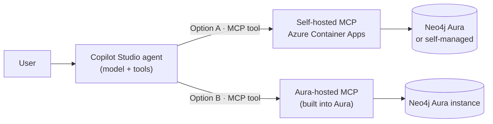

Two ways to attach the Neo4j MCP server as a tool — pick one:

- **[Option A — Self-hosted on Azure](#option-a-self-hosted-mcp)** — deploy the MCP server to your own subscription. Works with the public `companies` demo graph.
- **[Option B — Aura-hosted](#option-b-neo4j-aura-hosted-mcp)** — use the MCP endpoint built into your Neo4j Aura instance. No infrastructure.

You'll need a [Microsoft Copilot Studio](https://copilotstudio.microsoft.com) environment (a trial works) either way.

## Option A: Self-hosted MCP

Deploy the Neo4j MCP server to your Azure subscription following [`../microsoft-foundry/infra`](../microsoft-foundry/infra/). It writes `../microsoft-foundry/.env` — use **`NEO4J_MCP_ENDPOINT`** as the Copilot Studio **Server URL** in [Step 4](#4-create-the-mcp-server). For the public `companies` demo graph, set the connection's **Header name** to `Authorization` and its **Header value** to `Basic Y29tcGFuaWVzOmNvbXBhbmllcw==` (generate your own with `printf '%s:%s' <user> <pass> | base64 | tr -d '\n'`, or use a `Bearer <token>` value for SSO/OIDC).

### 1. Create a blank agent

Open [Copilot Studio](https://copilotstudio.microsoft.com) and go to **Agents**. Select **Create blank agent**.

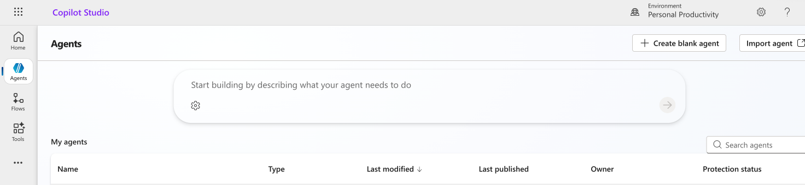

Name the agent `neo4j-mcp`, then create it.

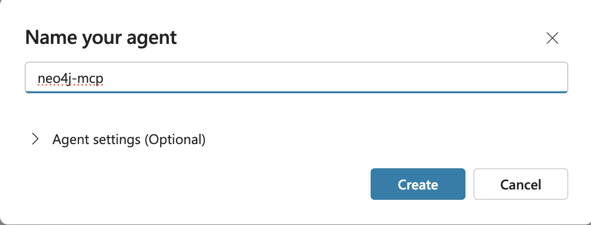

After the agent is created, Copilot Studio opens the agent workspace with the test panel available.

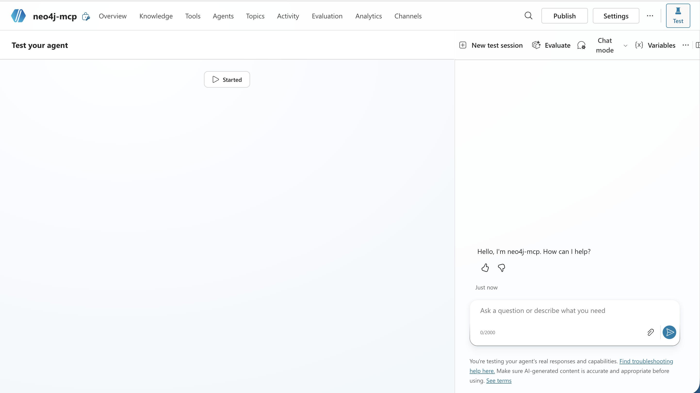

Open the **Overview** tab. Choose the model for the agent and add graph-grounded instructions.

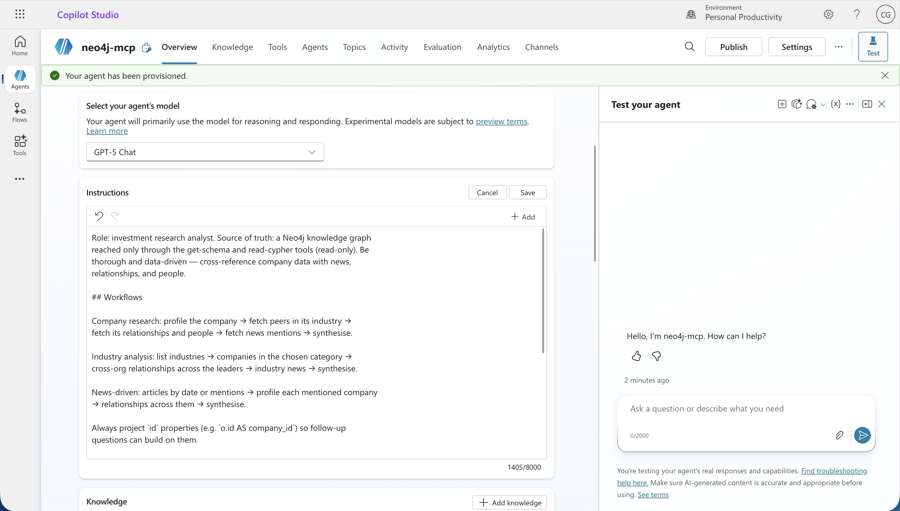

Example instructions:

```text
Role: investment research analyst. Source of truth: a Neo4j knowledge graph
reached only through the get-schema and read-cypher tools (read-only). Be
thorough and data-driven — cross-reference company data with news,
relationships, and people.

## Workflows

Company research: profile the company → fetch peers in its industry →
fetch its relationships and people → fetch news mentions → synthesise.

Industry analysis: list industries → companies in the chosen category →
cross-org relationships across the leaders → industry news → synthesise.

News-driven: articles by date or mentions → profile each mentioned company
→ relationships across them → synthesise.

Always project `id` properties (e.g. `o.id AS company_id`) so follow-up
questions can build on them.

## Output

Cite every company_id and article_id. Use tables when comparing multiple
entities, bullet lists for attributes of a single entity. Connect the dots
— highlight patterns, anomalies, network position, sentiment trends.

## Grounding

Call get-schema once per conversation (pass an empty properties object:
get-schema({"properties": {}})). You MUST call read-cypher before any
factual claim about a company, person, industry, location, or article.
get-schema alone is not data. Answer only from read-cypher rows. Never use
prior knowledge. If read-cypher returns nothing, reply "the graph doesn't
contain that". Use modern Cypher (`WHERE x IS NOT NULL`).
```

### 2. Open the Tools tab

Go to the agent's **Tools** tab. For a new agent, Copilot Studio shows the empty tools state. Select **Add a tool**.

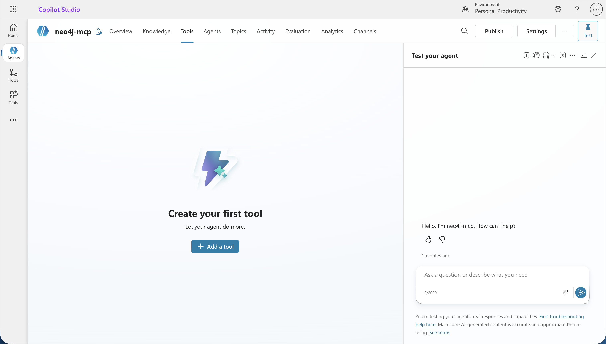

### 3. Select Model Context Protocol

In the **Add tool** catalog, select **Model Context Protocol**. You can use the category filter or the MCP tile in the create-new row.

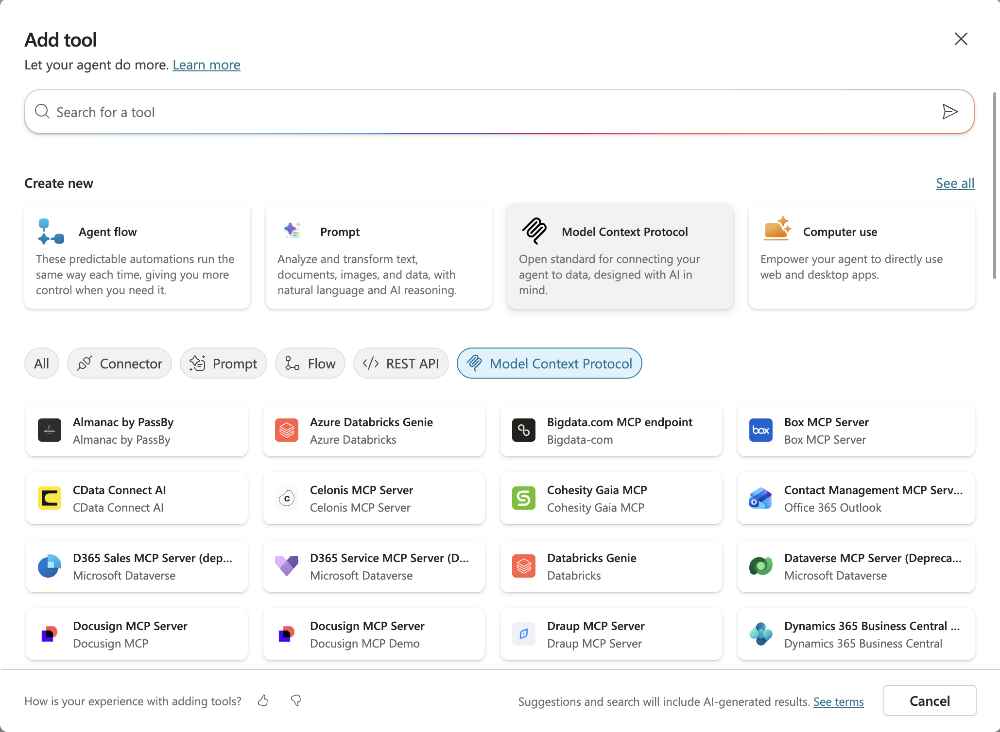

### 4. Create the MCP server

Fill in the MCP server form with the shared Neo4j MCP endpoint from `../microsoft-foundry/.env`.

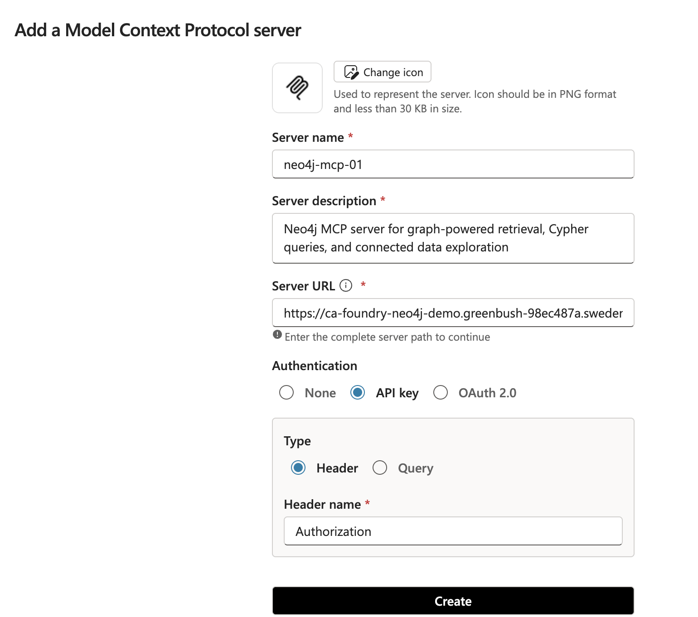

Use these values:

| Field | Value |
| --- | --- |
| **Server name** | `neo4j-mcp-01` |
| **Server description** | `Neo4j MCP server for graph-powered retrieval, Cypher queries, and connected data exploration` |
| **Server URL** | `NEO4J_MCP_ENDPOINT` from `../microsoft-foundry/.env` |
| **Authentication** | **API key** |
| **Type** | **Header** |
| **Header name** | `Authorization` |
| **Header value** | `Basic <base64(username:password)>` |

Create the MCP server.

### 5. Create or pick the connection

If no connection exists yet, open the connection dropdown and select **Create new connection**.

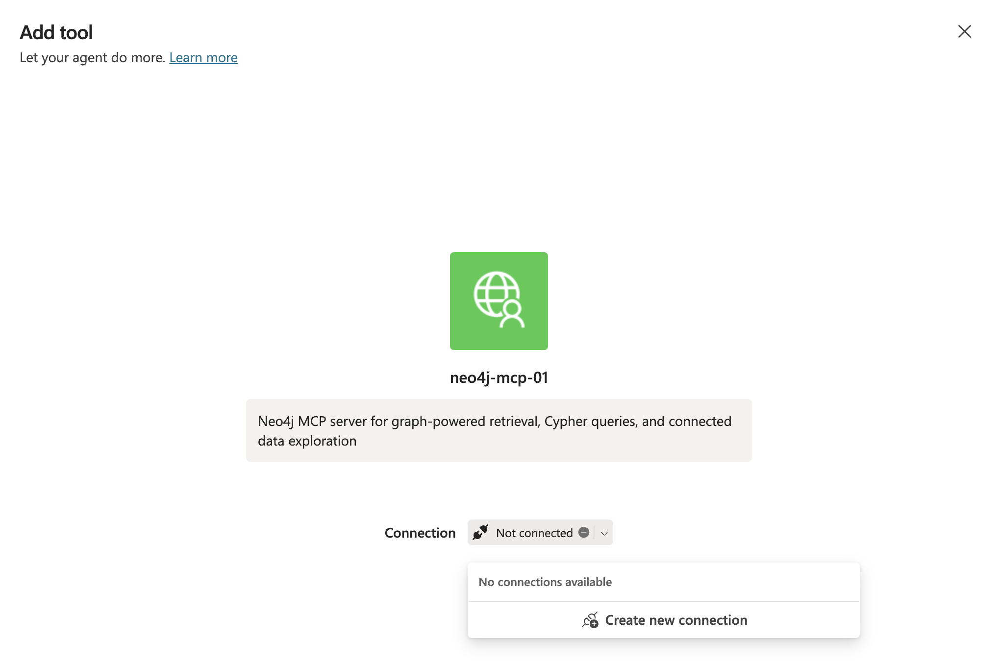

Pick the `neo4j-mcp-01` connection and submit it.

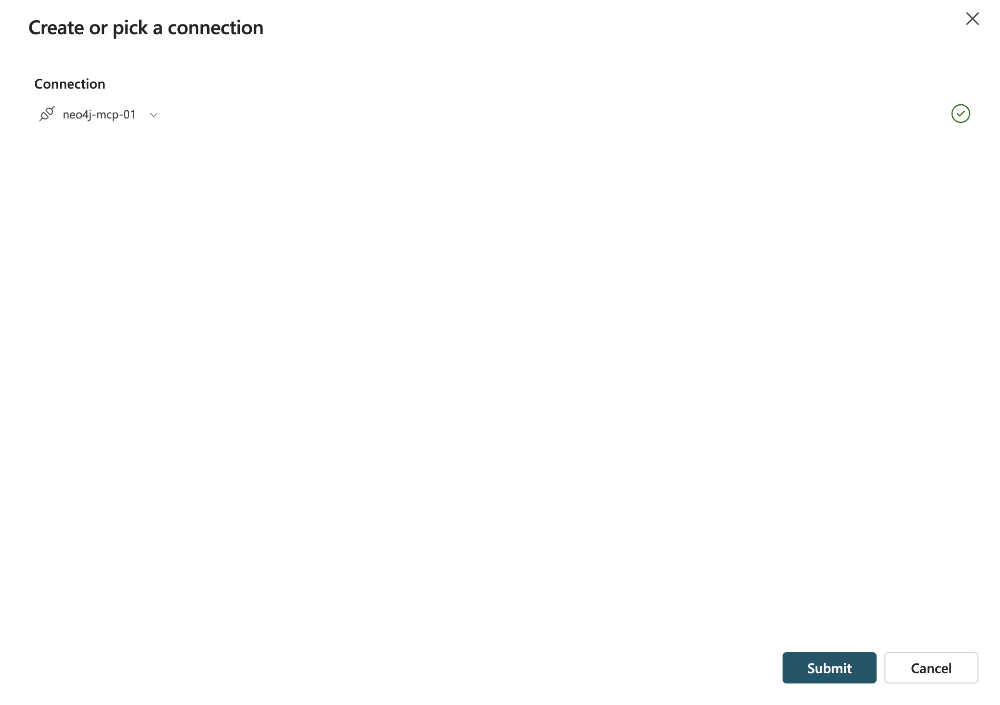

Once the connection is selected and healthy, select **Add and configure**.

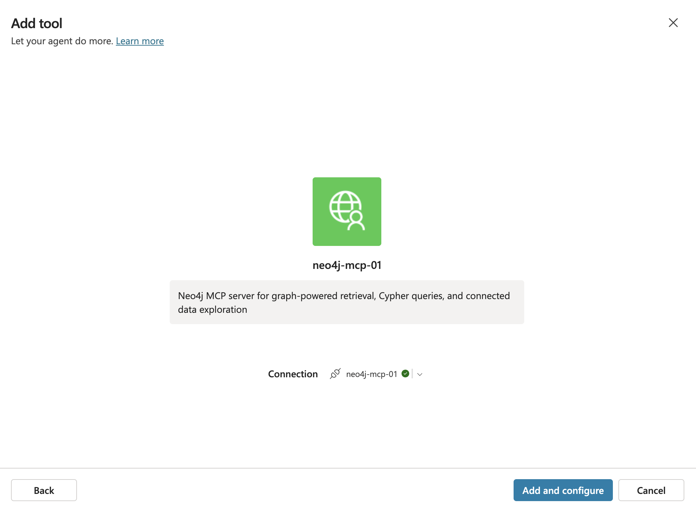

### 6. Verify the MCP tool

The configured tool should be enabled and connected to `neo4j-mcp-01`. The detail page shows the server, connection, and the agent that can use it.

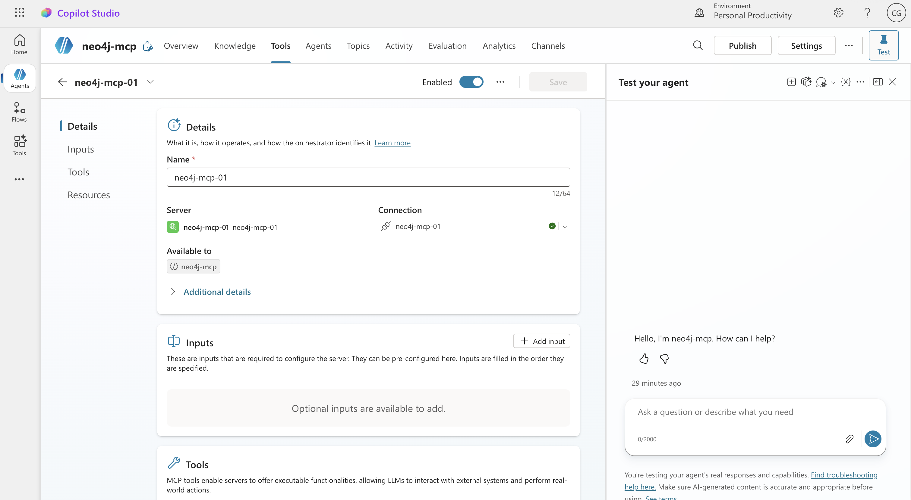

After setup, Copilot Studio should show the Neo4j MCP server with a connected status. The expected tools are:

- `get-schema`
- `read-cypher`

### 7. Test the agent

Open **Test your agent** and try:

```text
Find three companies that compete in the same industry as Microsoft.
```

The agent should call `get-schema`, then `read-cypher`, and return graph-grounded peer companies from the Neo4j `companies` database.

Copilot Studio may ask you to verify the connection before the first tool call succeeds.

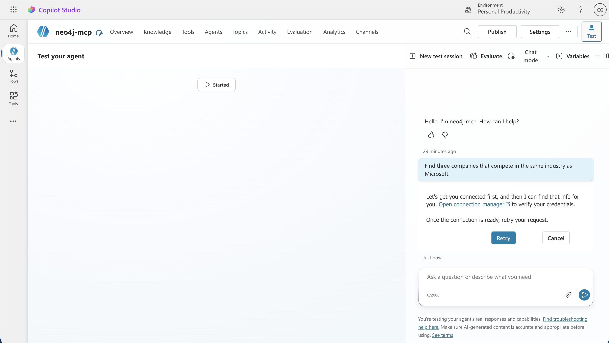

Open the connection manager and find `neo4j-mcp-01`. If the status is **Not Connected**, select **Connect**.

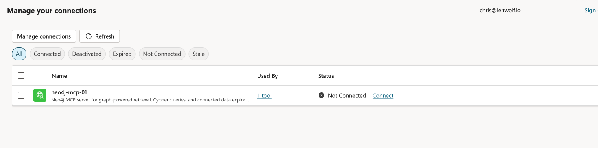

Enter the required API key value for the `Authorization` header, then create the connection.

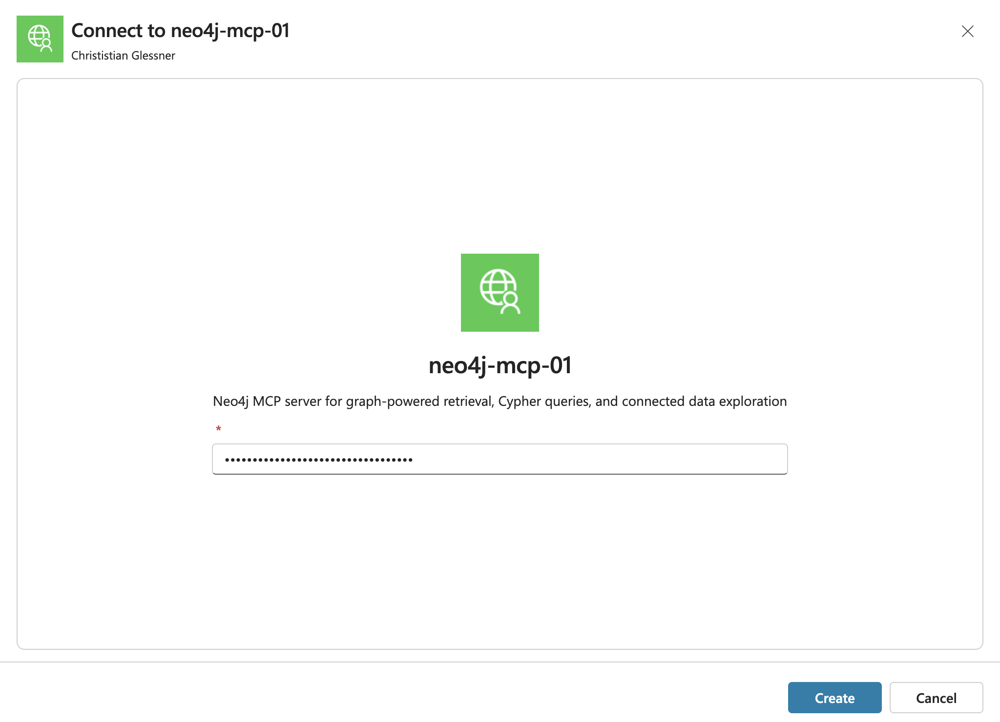

Return to the agent test panel and retry the same prompt.

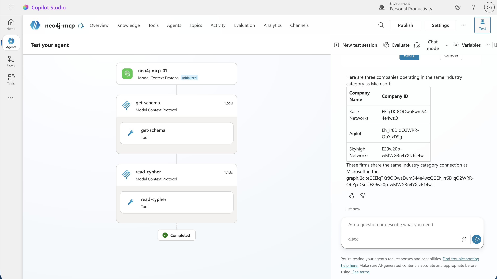


## Option B: Neo4j Aura-hosted MCP

[Neo4j Aura](https://neo4j.com/docs/mcp/current/mcp-for-aura/) ships a **built-in MCP endpoint for every instance** — nothing to deploy, no Azure. You connect Copilot Studio straight to your Aura database over OAuth.

It runs against your own Aura instance, so the public `companies` demo graph isn't available here. Starting fresh? [Create an Aura instance](https://neo4j.com/docs/aura/getting-started/create-instance/) (the Free tier works) and pick the built-in **Movies** sample dataset so you have data to query.

### Enable and connect

1. Turn on the MCP server for your Aura instance and copy its endpoint — see the [Aura MCP documentation](https://neo4j.com/docs/mcp/current/mcp-for-aura/). The URL looks like `https://<INSTANCE_ID>.mcp-instances.neo4j.io`.
2. Follow the [Option A steps](#option-a-self-hosted-mcp) as-is — **the only difference is Step 4 (Create the MCP server)**. Use these values instead:

   | Field | Value |
   | --- | --- |
   | **Server name** | `neo4j-aura-mcp` |
   | **Server description** | `Neo4j Aura hosted MCP connecting your instance` |
   | **Server URL** | `https://<INSTANCE_ID>.mcp-instances.neo4j.io` |
   | **Authentication** | **OAuth 2.0** |
   | **Type** | **Dynamic discovery** |

   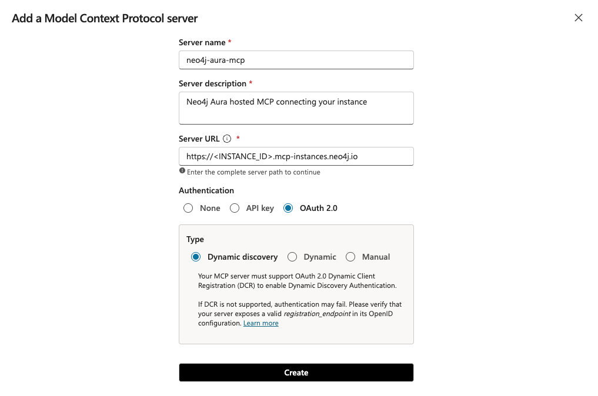

   Dynamic discovery relies on the server exposing a valid `registration_endpoint` in its OpenID configuration — the Aura-hosted MCP does, so no client secret or header is required. Create the server, then complete the OAuth sign-in when Copilot Studio prompts on the first tool call.

Everything else — adding the tool, verifying the connection, and testing — is identical to Option A. Adjust the agent instructions and the test prompt to match your own graph (for the Movies sample dataset, try *"Which actors have worked with the most directors?"*).


## References

- [Microsoft Copilot Studio](https://www.microsoft.com/microsoft-copilot/microsoft-copilot-studio)
- [Neo4j MCP server](https://github.com/neo4j/mcp)
- [Neo4j MCP configuration](https://neo4j.com/docs/mcp/current/configuration/)
- [Neo4j Aura-hosted MCP](https://neo4j.com/docs/mcp/current/mcp-for-aura/)
- [Shared Azure MCP deployment](../microsoft-foundry/infra/)
