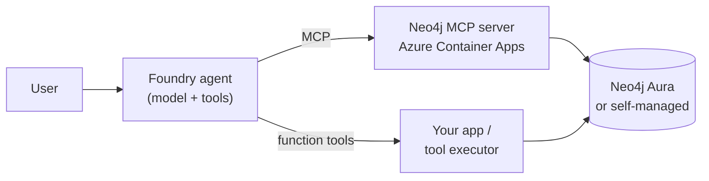

# Microsoft Foundry + Neo4j

Microsoft Foundry is a unified platform for building, deploying, and operating enterprise AI agents and applications.
Neo4j is the graph database and knowledge layer that grounds those agents in connected enterprise data — relationships, hierarchies, and multi-hop paths the model can actually reason over.

## Why Graph

Most enterprise research questions are relationship questions: which companies compete in this industry, who runs them, what does the news say, where do they operate, and how are any two of them connected. Vector search and document retrieval flatten those connections; a graph keeps them. Neo4j gives Foundry agents a tool that follows relationships, traverses hierarchies, and returns shaped results — bounded by Cypher, not by token budget.

## Architecture



The MCP path is shared infrastructure: deploy once, attach from Foundry, Copilot Studio, Microsoft Agent Framework, or any MCP client. The function-tool path keeps Neo4j access inside your application boundary when you need tighter control over Cypher, secrets, and audit.

> **Neo4j Aura-hosted MCP.** [Aura](https://neo4j.com/docs/mcp/current/mcp-for-aura/) now ships a built-in MCP endpoint per instance — no self-hosting needed. It authenticates with OAuth 2.0 Dynamic Client Registration (DCR), which the Foundry **portal** doesn't support for MCP tools yet. Attach it from [Microsoft Agent Framework](../microsoft-agent-framework/examples/aura-mcp-oauth/) (a runnable DCR example); in the Foundry portal, use the self-hosted MCP here.

## Quick Start

```bash
git clone https://github.com/neo4j-labs/neo4j-agent-integrations.git
cd neo4j-agent-integrations
azd config set auth.useAzCliAuth true    # one-time: let azd reuse az's session
az login
cd microsoft-foundry/infra
./deploy.sh
./test-mcp.sh "$(azd env get-value mcpEndpoint)"
```

Defaults connect to the public `companies` Neo4j demo graph and provision a Microsoft Foundry account, project, `gpt-5-mini` model deployment, and a Foundry User role assignment on the project for you. `deploy.sh` writes a shared `microsoft-foundry/.env` that every example sources.

Full deploy guide and configuration knobs: [`infra/README.md`](./infra/README.md). BYO-Foundry/BYO-Neo4j env schema: [`.env.example`](./.env.example).

## Integration Paths

| Path | When to use | Folder |
| --- | --- | --- |
| **MCP** | Reusable Neo4j MCP for one or many Foundry agents. | [`examples/mcp`](./examples/mcp/) |
| **Foundry SDK** | Your app runs with more control over tools and Cypher queries | [`examples/foundry-sdk`](./examples/foundry-sdk/) |

## References

### Microsoft Foundry
- [What is Microsoft Foundry?](https://learn.microsoft.com/azure/foundry/what-is-foundry)
- [Model Context Protocol tools](https://learn.microsoft.com/azure/foundry/agents/how-to/tools/model-context-protocol)
- [Function calling](https://learn.microsoft.com/azure/foundry/agents/how-to/tools/function-calling)

### Neo4j
- [Neo4j MCP server](https://github.com/neo4j/mcp)
- [Neo4j MCP configuration](https://neo4j.com/docs/mcp/current/configuration/)