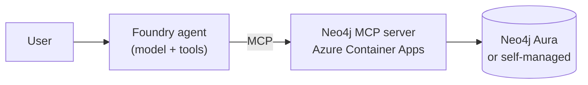

# Microsoft Foundry + Neo4j

Microsoft Foundry is a unified platform for building, deploying, and operating enterprise AI agents and applications.
Neo4j makes those agents smarter by grounding them in a knowledge graph of relationships, paths, and hierarchies that flat retrieval misses.

## Why Graph

Most enterprise questions are relationship questions: which customers does this account own, which suppliers feed this product, which incidents share a root cause, which permissions does this user inherit. Vector search and document retrieval flatten those connections; a graph keeps them. Neo4j gives Foundry agents a tool that follows relationships, traverses hierarchies, and returns shaped results — bounded by Cypher, not by token budget.

## Integration Paths

Choose the integration pattern that matches where you want the agent and query control to live. This README stays at the summary level; each example folder has the full path-specific walkthrough.

### MCP — shared server

Recommended default. Deploy the official Neo4j MCP server once to Azure Container Apps, then attach it as a reusable tool to one or many Foundry agents.

Read the full guide in [examples/mcp](./examples/mcp/README.md).

#### MCP Architecture



The MCP path is shared infrastructure: deploy once, attach from Foundry, Copilot Studio, Microsoft Agent Framework, or any MCP client.

#### Quick Start

You need the [Azure Developer CLI (`azd`)](https://learn.microsoft.com/azure/developer/azure-developer-cli/install-azd), the [Azure CLI (`az`)](https://learn.microsoft.com/cli/azure/install-azure-cli), and an Azure subscription. Sign in once:

```bash
az login
```

`az login` covers most setups. If your `azd` is configured in standalone auth mode (`azd auth login` doesn't print a warning about `az cli`), run that instead. If unsure, run both.

Then deploy the official Neo4j MCP server to Azure Container Apps and get a public HTTPS endpoint you can attach to any Foundry agent:

```bash
cd microsoft-foundry/infra
./deploy.sh
./test-mcp.sh "$(azd env get-value mcpEndpoint)"
```

`deploy.sh` runs `azd up` (which prompts for environment name, subscription, and region on first run, plus an opt-in for Foundry provisioning), then writes a shared `microsoft-foundry/.env` so every example script in this section can pick up the deployed `NEO4J_MCP_ENDPOINT`, the Neo4j connection settings, and — when you opt in — the provisioned Foundry account, project, model deployment, and an Azure AI Developer role assignment for you. See [`.env.example`](./.env.example) for the full schema.

No Foundry auth secrets live in the `.env`. Examples authenticate to Foundry with [`DefaultAzureCredential`](https://learn.microsoft.com/azure/developer/python/sdk/authentication/credential-chains#defaultazurecredential-overview), so `azd auth login` (or `az login`) is enough.

If you already have your own Foundry project and Neo4j and just want to point the examples at them, copy `.env.example` to `.env` instead and edit it directly. You can also edit `.env` after `./deploy.sh` has written it — re-running `./deploy.sh` preserves any non-empty values you've set.

Defaults connect to the public `companies` Neo4j demo graph. The smoke test should list two tools: `get-schema` and `read-cypher`. Attach the endpoint in Foundry as an [MCP tool](https://learn.microsoft.com/azure/foundry/agents/how-to/tools/model-context-protocol) with an `Authorization: Basic <base64(user:pass)>` header.

To tear everything down:

```bash
cd microsoft-foundry/infra
azd down --force --purge
```

`--force` skips the confirmation prompt; `--purge` empties soft-delete buckets (Log Analytics workspace) so the same environment name can be redeployed cleanly.

#### MCP Authentication

The official Neo4j MCP server runs **stateless** in HTTP mode. It does not hold credentials at startup; every request must carry one of:

```text
Authorization: Basic <base64(username:password)>
Authorization: Bearer <token>
```

Use Basic for username/password databases (the demo graph, most Aura instances). Use Bearer when the target Neo4j is configured for SSO/OIDC — the MCP server forwards the token to Neo4j and does not run an OAuth flow itself.

In Foundry, store the header in a [project connection](https://learn.microsoft.com/azure/foundry/agents/how-to/tools/model-context-protocol) and attach the MCP server as a custom MCP tool. For OAuth client-credentials, user delegation, policy, or token exchange in front of Neo4j, put Azure API Management or another gateway between Foundry and the MCP server.

### Foundry SDK — direct tools

Use this when your application drives the loop and should keep tight control over which graph queries exist, how they are parameterized, and what results go back to the model.

Read the full guide in [examples/foundry-sdk](./examples/foundry-sdk/README.md).

## References

**Microsoft Foundry**
- [What is Microsoft Foundry?](https://learn.microsoft.com/azure/foundry/what-is-foundry)
- [Model Context Protocol tools](https://learn.microsoft.com/azure/foundry/agents/how-to/tools/model-context-protocol)
- [Function calling](https://learn.microsoft.com/azure/foundry/agents/how-to/tools/function-calling)

**Neo4j**
- [Neo4j MCP server](https://github.com/neo4j/mcp)
- [Neo4j MCP configuration](https://neo4j.com/docs/mcp/current/configuration/)
- [Neo4j Aura Agent](https://neo4j.com/docs/aura/aura-agent/)
