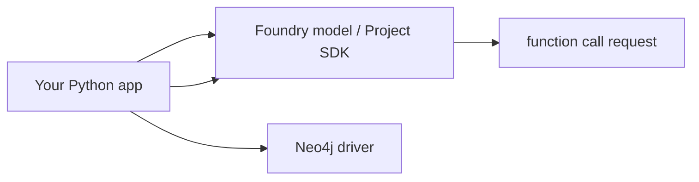

# Project SDK: Direct Neo4j Tools

Use this when your application owns the tool execution loop and should query Neo4j directly.

This pattern gives you the most control:

- validate and parameterize Cypher in code
- shape graph results before the model sees them
- keep Neo4j credentials in your app environment or Key Vault
- avoid exposing a general-purpose Cypher tool

## Shape



## Coming Soon

This example will cover:

1. Creates a Foundry client from `FOUNDRY_PROJECT_ENDPOINT`.
2. Defines narrow Neo4j functions such as `find_company` and `list_competitors`.
3. Lets the model request function calls.
4. Executes Cypher through the Neo4j Python driver.
5. Submits function outputs back to Foundry.

Keep tools narrow. Do not expose arbitrary Cypher here unless that is explicitly the goal.

## Environment

```bash
FOUNDRY_PROJECT_ENDPOINT=https://<account>.services.ai.azure.com/api/projects/<project>
FOUNDRY_MODEL_DEPLOYMENT_NAME=gpt-4o-mini
NEO4J_URI=neo4j+s://demo.neo4jlabs.com:7687
NEO4J_DATABASE=companies
NEO4J_USERNAME=companies
NEO4J_PASSWORD=companies
```
