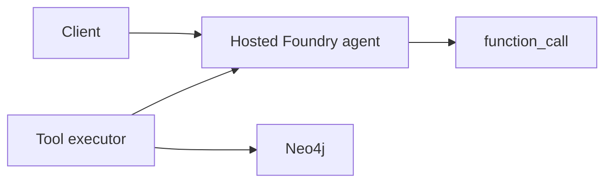

# Hosted Foundry Agent with Neo4j Tools

Use this when the agent should live in Foundry and use Neo4j through function tools.

This is different from the Project SDK direct-tools pattern:

- Project SDK direct tools: your app drives the conversation and executes tools.
- Hosted agent tools: Foundry hosts the agent definition; your app still handles function-call execution and returns outputs.

## Shape



## Coming Soon

This example will cover:

1. Creates an agent version with function tools such as `find_company`.
2. Invokes the hosted agent through the Responses API.
3. Handles returned `function_call` items.
4. Executes Neo4j queries in a tool executor.
5. Sends `function_call_output` back to the response.

This is the right place for production-oriented patterns: tool validation, tracing, retries, and least-privilege Neo4j users.

## Environment

```bash
FOUNDRY_PROJECT_ENDPOINT=https://<account>.services.ai.azure.com/api/projects/<project>
FOUNDRY_MODEL_DEPLOYMENT_NAME=gpt-4o-mini
NEO4J_URI=neo4j+s://demo.neo4jlabs.com:7687
NEO4J_DATABASE=companies
NEO4J_USERNAME=companies
NEO4J_PASSWORD=companies
```
