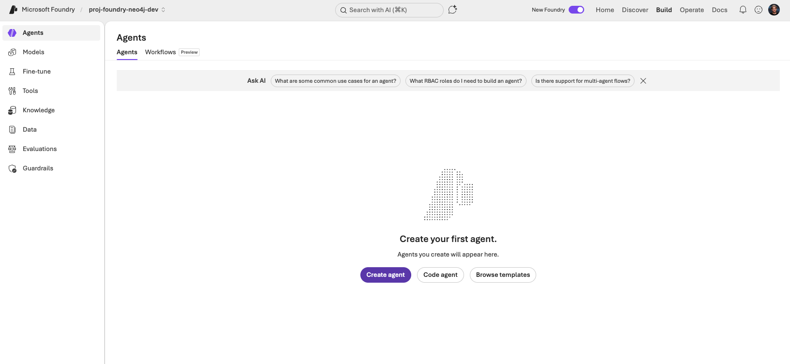
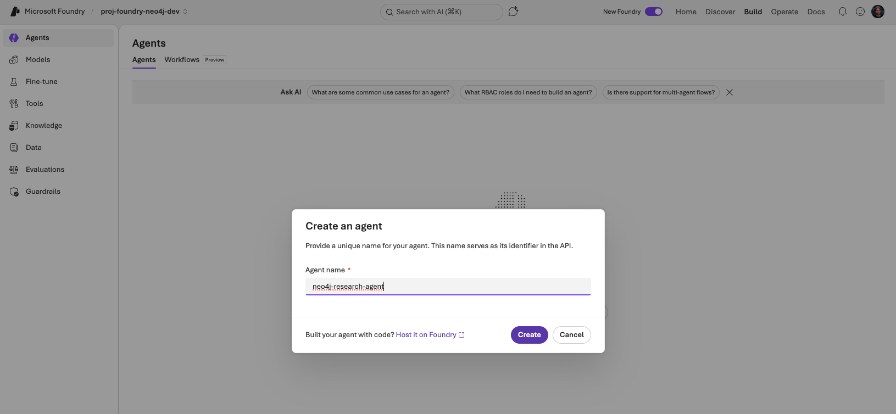
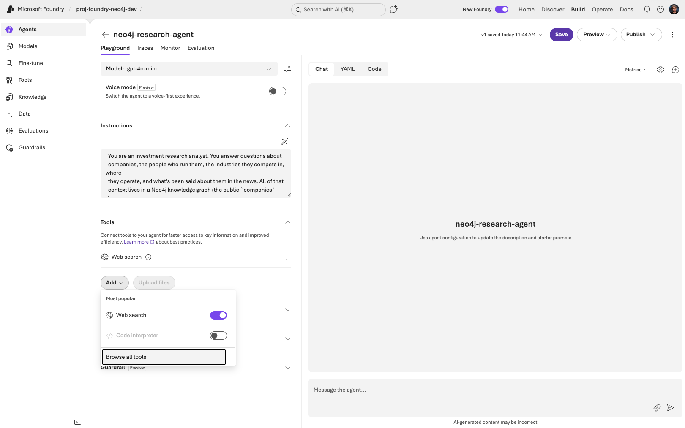
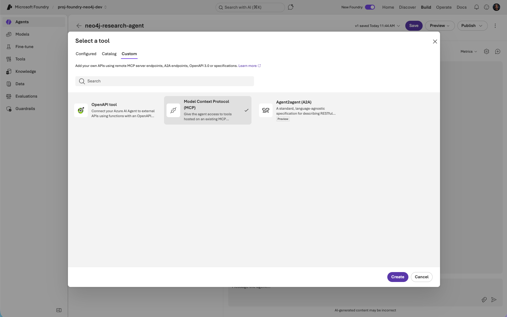
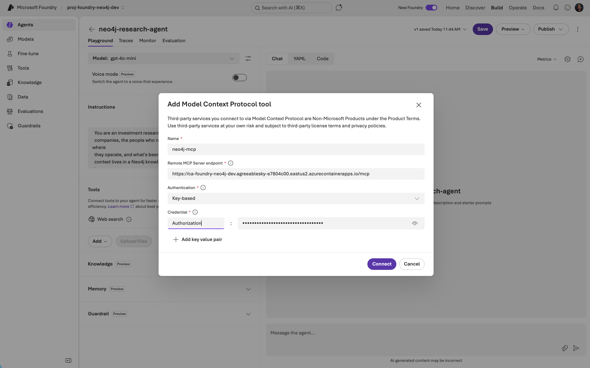
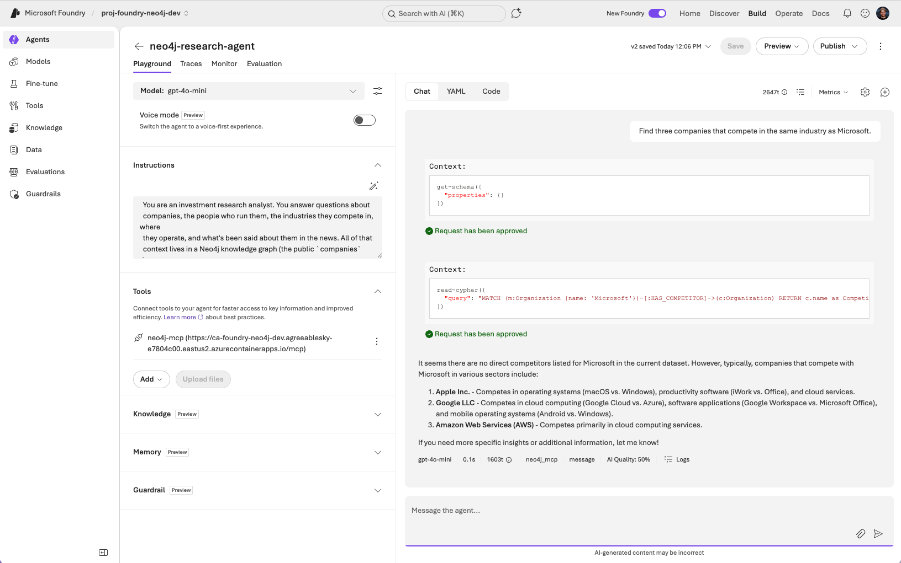

# Neo4j MCP as a Foundry Tool — Portal Walkthrough

Add the deployed Neo4j MCP server as a tool on a Foundry agent, then chat with it in the portal Playground. **No code.** Five minutes start to finish.

## 1. Deploy the infra

If you haven't already:

```bash
cd microsoft-foundry/infra
./deploy.sh                    
# answer "Y" at the Foundry prompt
```

That gives you:

- A public Neo4j MCP endpoint on Azure Container Apps.
- A Foundry account, project, and `gpt-5-mini` model deployment.
- A Foundry User role assignment on the project for your user.
- A populated `microsoft-foundry/.env` — you'll need one value from it: `NEO4J_MCP_ENDPOINT`.

## 2. Open the project in Foundry portal

Open [https://ai.azure.com](https://ai.azure.com) and pick the Foundry project that `deploy.sh` created. It's `proj-foundry-neo4j-<env>` under `aif-foundry-neo4j-<env>-<hash>`.

## 3. Create the investment research agent

In the left nav: **Agents → Create agent**.



Name it `neo4j-research-agent` and click **Create**.



You land on the agent's Playground page. Fill in the **Instructions**.

Instructions:

```text
Role: investment research analyst. Source of truth: a Neo4j knowledge graph
reached only through the get-schema and read-cypher tools (read-only). Be
thorough and data-driven — cross-reference company data with news,
relationships, and people.

## Workflows

Company research: profile the company → fetch peers in its industry →
fetch its relationships and people → fetch news mentions → synthesise.

Industry analysis: list industries → companies in the chosen category →
cross-org relationships across the leaders → industry news → synthesise.

News-driven: articles by date or mentions → profile each mentioned company
→ relationships across them → synthesise.

Always project `id` properties (e.g. `o.id AS company_id`) so follow-up
questions can build on them.

## Output

Cite every company_id and article_id. Use tables when comparing multiple
entities, bullet lists for attributes of a single entity. Connect the dots
— highlight patterns, anomalies, network position, sentiment trends.

## Grounding

Call get-schema once per conversation. You MUST call read-cypher before any
factual claim about a company, person, industry, location, or article.
get-schema alone is not data. Answer only from read-cypher rows. Never use
prior knowledge. If read-cypher returns nothing, reply "the graph doesn't
contain that". Use modern Cypher (`WHERE x IS NOT NULL`).
```



## 4. Add the Neo4j MCP server as a tool

Tools panel → **Add → Browse all tools → Custom tab → Model Context Protocol (MCP) → Create**.



Fill the form:

| Field | Value |
| --- | --- |
| **Name** | `neo4j-mcp` |
| **Remote MCP Server endpoint** | `NEO4J_MCP_ENDPOINT` from `microsoft-foundry/.env` |
| **Authentication** | **Custom** |
| **Credential — Name** | `Authorization` |
| **Credential — Value** | `Basic <base64(user:pass)>` — for the demo graph: `Basic Y29tcGFuaWVzOmNvbXBhbmllcw==` |

Generate the demo header value yourself:

```bash
printf '%s:%s' companies companies | base64
```

For real Aura/Neo4j Enterprise databases swap the demo creds for yours. Use `Bearer <token>` for SSO/OIDC databases — the MCP server forwards whatever you set.

Click **Connect**. After the connection succeeds, restrict the **Allowed tools** to `get-schema` and `read-cypher` and set **Approval** to **Never** for both, then **Save** the agent.



## 5. Chat with the agent in Playground

On the agent's page: **Playground**. Try a multi-hop research question:

```text
Tell me about Microsoft — what industry it competes in,
who runs it, and where it's headquartered.
```

You should see the agent:

1. Call `get-schema` (once) so it knows the labels and relationships in the `companies` graph.
2. Call `read-cypher` with a single traversal that joins `(:Organization)-[:HAS_CATEGORY]->(:IndustryCategory)`, `(:Organization)-[:IN_CITY]->(:City)` / `[:IN_COUNTRY]->(:Country)`, and `(:Organization)-[:HAS_CEO]->(:Person)` / `[:HAS_BOARD_MEMBER]->(:Person)`.
3. Summarise the result: industry categories, key people with titles, locations.

Follow up with a peer-discovery question to show the graph paying off again:

```text
Find three companies that compete in the same industry as Microsoft.
```

The agent should reuse the schema knowledge and call `read-cypher` with a `(:Organization)-[:HAS_CATEGORY]->(:IndustryCategory)<-[:HAS_CATEGORY]-(:Organization)` traversal.

Finally, a news angle:

```text
What recent articles mention Microsoft, and what topics do they cover?
```

This pulls `(:Article)-[:MENTIONS]->(:Organization {name: 'Microsoft'})`.

Each of these would be expensive or impossible with vector search alone — the relationships are the answer.



## 6. Tear down

When done, run `azd down --force --purge` from `microsoft-foundry/infra/` to delete the MCP server, Foundry account, and everything else this deployment created.
