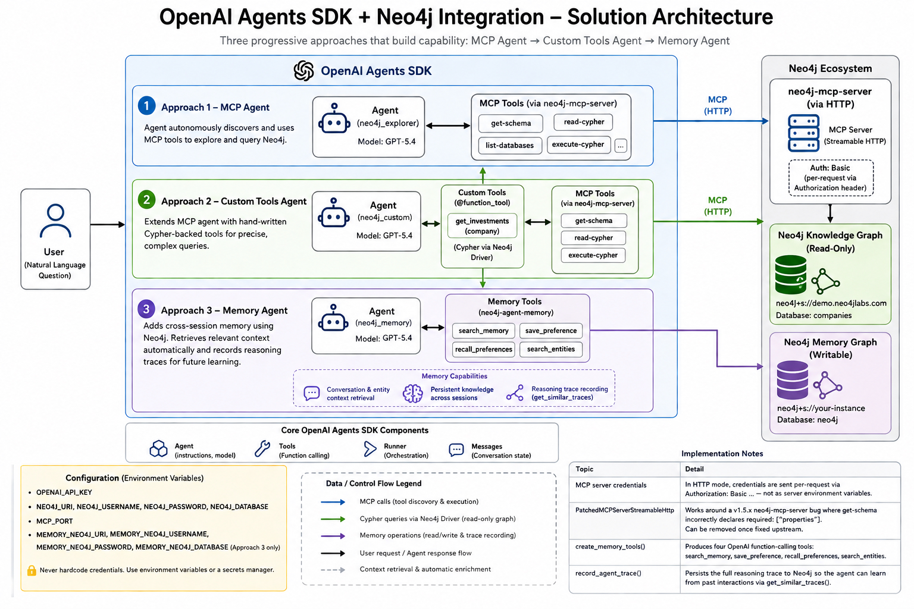

# OpenAI Agents SDK + Neo4j Integration

This folder demonstrates five approaches for integrating **Neo4j** with the [OpenAI Agents SDK](https://openai.github.io/openai-agents-python/). The first three build on each other, adding more capability; the last two cover retrieval over unstructured content and delegating to a hosted Neo4j agent.

| Notebook | Description |
|----------|-------------|
| [openai_agents.ipynb](openai_agents.ipynb) | End-to-end walkthrough of the MCP, custom tools, and memory approaches with working examples |
| [openai_graphrag.ipynb](openai_graphrag.ipynb) | GraphRAG retrieval with `neo4j-graphrag`: pairing embedding models with vector indexes, vector, hybrid and graph-traversal retrievers, exposed as function tools and as specialist agents with handoffs |
| [openai_aura_agent.ipynb](openai_aura_agent.ipynb) | Connect a hosted Neo4j Aura Agent over MCP as a sub-agent: machine-to-machine authentication, token caching, and `as_tool()` orchestration alongside local tools |

## Overview

The demo uses the publicly accessible **Neo4j companies knowledge graph** — `Organization` nodes linked to `Article` nodes via `[:MENTIONS]` relationships.

## Architecture



The diagram shows three progressive approaches that build on each other: MCP Agent → Custom Tools Agent → Memory Agent. Each approach adds more capability while sharing the same Neo4j knowledge graph backend.

## Prerequisites

- Python 3.10+
- An OpenAI API key
- A running Neo4j instance (the notebook uses the public read-only `companies` demo database)

## Installation

```bash
pip install --upgrade openai-agents "neo4j-agent-memory[openai-agents]"
pip install --ignore-requires-python neo4j-mcp-server
```

For the GraphRAG retrieval examples:

```bash
pip install --upgrade openai-agents neo4j-graphrag neo4j
```

## Configuration

Set the following environment variables before running the notebook:

```bash
# OpenAI
export OPENAI_API_KEY="sk-..."

# Neo4j Knowledge Graph (public read-only demo — no changes needed)
export NEO4J_URI="neo4j+s://demo.neo4jlabs.com:7687"
export NEO4J_USERNAME="companies"
export NEO4J_PASSWORD="companies"
export NEO4J_DATABASE="companies"

# MCP server port
export MCP_PORT="8443"

# Neo4j Memory DB — only required for Approach 3 (must be writable)
export MEMORY_NEO4J_URI="neo4j+s://your-instance.databases.neo4j.io"
export MEMORY_NEO4J_USERNAME="neo4j"
export MEMORY_NEO4J_PASSWORD="your-password"
export MEMORY_NEO4J_DATABASE="neo4j"

# Aura Agent MCP — only required for Approach 5
export AURA_MCP_CLIENT_ID="..."
export AURA_MCP_CLIENT_SECRET="..."
export AURA_AGENT_MCP_URL="https://mcp.neo4j.io/agent?project_id=...&agent_id=..."
```

> **Security:** Never hardcode credentials in notebook cells or commit them to source control. Use environment variables or a secrets manager.

---

## Approach 1 — MCP Agent

Connect an OpenAI agent to Neo4j via the [Model Context Protocol](https://openai.github.io/openai-agents-python/mcp/). The agent automatically decides which MCP tools to call (`get-schema`, `read-cypher`, etc.) to answer natural-language questions.

**Key APIs:** `MCPServerStreamableHttp`, `Agent`, `Runner`

```python
from agents import Agent, Runner
from agents.mcp import MCPServerStreamableHttp

mcp_server = MCPServerStreamableHttp(
    params={
        "url":     f"http://localhost:{MCP_PORT}/mcp",
        "headers": {"Authorization": f"Basic {creds}"},
    },
    name="neo4j",
)
await mcp_server.connect()

agent = Agent(
    name="neo4j_explorer",
    instructions="You are a graph database assistant ...",
    mcp_servers=[mcp_server],
    model="gpt-5.4",
)

result = await Runner.run(agent, "How many organizations are in the database?")
print(result.final_output)
```

**Example output:**

```
Query: How many organizations are in the database?

Result: There are 46,088 organizations in the database.
```

**When to use:** You want a fully autonomous agent that can explore and query any Neo4j graph without writing Cypher yourself.

---

## Approach 2 — Custom Tools Agent

Extend the MCP agent with hand-written Cypher-backed tools using the `@function_tool` decorator. Custom tools and MCP tools are passed to the same agent — the framework routes each call to the correct handler.

**Key APIs:** `@function_tool`, `Agent(tools=[...], mcp_servers=[...])`

```python
from agents import Agent, Runner, function_tool
import neo4j as _neo4j

driver = _neo4j.AsyncGraphDatabase.driver(
    os.environ["NEO4J_URI"],
    auth=(os.environ["NEO4J_USERNAME"], os.environ["NEO4J_PASSWORD"]),
)

@function_tool
async def get_investments(company: str) -> list:
    """Returns investments made by a company — ids, names, and types."""
    result = await driver.execute_query(
        """MATCH (o:Organization)-[:HAS_INVESTOR]->(i)
           WHERE o.name = $company
           RETURN i.id AS id, i.name AS name, head(labels(i)) AS type""",
        company=company,
        database_=os.environ["NEO4J_DATABASE"],
    )
    return [record.data() for record in result.records]

agent = Agent(
    name="neo4j_custom",
    instructions="You are a helpful assistant with access to a Neo4j graph database ...",
    tools=[get_investments],
    mcp_servers=[mcp_server],
    model="gpt-5.4",
)

result = await Runner.run(agent, "Which companies did Google invest in?")
print(result.final_output)
```

**Example output:**

```
Query: Which companies did Google invest in?

Result: Google has invested in the following companies:

1. Ionic Security
2. Avere Systems
3. FlexiDAO
4. Cloudflare
5. Trifacta
```

**When to use:** You need precise control over specific queries (e.g., complex multi-hop Cypher) while still leveraging the MCP server for general graph exploration.

---

## Approach 3 — Memory Agent

Add cross-session persistent memory to the agent using [`neo4j-agent-memory`](https://pypi.org/project/neo4j-agent-memory/). The agent stores conversation history and entity knowledge in a Neo4j graph and retrieves relevant context automatically on each turn.

**Key APIs:** `Neo4jOpenAIMemory`, `create_memory_tools()`, `execute_memory_tool()`, `record_agent_trace()`

> **Prerequisite:** This approach requires a **writable** Neo4j instance. Set the `MEMORY_NEO4J_*` environment variables described in the Configuration section.

```python
from neo4j_agent_memory import MemoryClient, MemorySettings, Neo4jConfig
from neo4j_agent_memory.integrations.openai_agents import (
    Neo4jOpenAIMemory, create_memory_tools, record_agent_trace,
)
from neo4j_agent_memory.integrations.openai_agents.memory import execute_memory_tool

# Initialise memory
mem_client = MemoryClient(settings)
memory = Neo4jOpenAIMemory(memory_client=mem_client, session_id="demo-session")

# Turn 1 — establish research context
await run_turn(memory, "I am conducting a competitive analysis of 'Google'. ...")

# Turn 2 — memory context from Turn 1 is surfaced automatically via get_context()
await run_turn(memory, "What are the main risks in the supply chain for the company I am currently tracking?")

# Persist the reasoning trace for future learning
await record_agent_trace(memory=memory, messages=conversation, task="...", success=True)
```

**Example output:**

```
[USER]: I am conducting a competitive analysis of 'Google'. I am specifically
        worried about their subsidiaries and who their top-tier competitors are in the AI space.

[AGENT]: Google's key subsidiaries include DeepMind, Waymo, and Verily.
         Top AI competitors include Microsoft (OpenAI partnership), Meta AI, Amazon (AWS AI), and Apple.

--- Indexing memory (5s)... ---

[USER]: What are the main risks in the supply chain for the company I am currently tracking?

[AGENT]: For Google, key supply chain risks include dependency on TSMC/Samsung for custom TPU chips,
         rare earth material sourcing for hardware, and hyperscale data centre power constraints.

  [Trace] Agent reasoning trace recorded to Neo4j.
```

**When to use:** You need agents that remember context across multiple sessions or conversations — ideal for research assistants, customer-facing agents, or any long-running workflow.

---

## Approach 4 — GraphRAG Retrieval

Give the agent semantic search over unstructured content in the graph using [`neo4j-graphrag`](https://neo4j.com/docs/neo4j-graphrag-python/current/). Its retrievers combine vector similarity with graph traversal, so retrieved text arrives with its source article, dates, and related entities rather than as a bare passage.

**Key APIs:** `VectorRetriever`, `VectorCypherRetriever`, `HybridCypherRetriever`, `@function_tool`, `Agent(handoffs=[...])`

```python
from agents import Agent, Runner, function_tool
from neo4j_graphrag.embeddings import OpenAIEmbeddings
from neo4j_graphrag.retrievers import HybridCypherRetriever

# `node` and `score` are in scope: continue into the graph from each vector hit.
RETRIEVAL_QUERY = """
WITH node AS chunk, score
MATCH (article:Article)-[:HAS_CHUNK]->(chunk)
OPTIONAL MATCH (article)-[:MENTIONS]->(org:Organization)
RETURN chunk.text AS text, article.id AS article_id, article.title AS title,
       collect(DISTINCT org.name)[..5] AS companies, score
"""

retriever = HybridCypherRetriever(
    driver=driver,
    vector_index_name="news",
    fulltext_index_name="news_fulltext",
    retrieval_query=RETRIEVAL_QUERY,
    embedder=OpenAIEmbeddings(),
)

@function_tool
async def search_news_with_context(question: str) -> str:
    """Search news by meaning and return the source article and companies mentioned."""
    result = retriever.search(query_text=question, top_k=5)
    return json.dumps([item.content for item in result.items])

agent = Agent(
    name="news_analyst",
    instructions="Answer questions about companies using the news graph ...",
    tools=[search_news_with_context],
    model="gpt-5.4",
)
```

The notebook also shows the same retrievers behind **specialist agents with handoffs** — a triage agent routes the question and transfers control, so each specialist carries only the prompt and the single retriever it needs:

```python
triage_agent = Agent(
    name="retrieval_triage",
    instructions="Route news questions to the right specialist. Do not answer yourself.",
    handoffs=[theme_specialist, analysis_specialist, entity_specialist],
    model="gpt-5.4",
)

result = await Runner.run(triage_agent, query)
print(result.last_agent.name)   # which specialist finished the turn
```

> The embedding model must match the model that built the vector index. A mismatch does not raise an error — it silently returns meaningless results. Re-embed a stored chunk and compare against its saved vector to confirm the pairing.

**When to use:** Your graph holds unstructured text (articles, documents, notes) and answers need both semantic recall and the structured relationships around each match. Use tools when one agent should stay in charge; use handoffs when the specialists need materially different instructions.

---

## Approach 5 — Hosted Aura Agent

An [Aura Agent](https://neo4j.com/docs/aura/aura-agent/) is a managed agent configured and hosted in the Aura Console. It reasons over the graph using its own ontology and tools, and returns an answer rather than rows. Exposed over MCP, it becomes a sub-agent your orchestrator can call — so graph logic stays with the graph and changes in the Console take effect without a code change.

**Key APIs:** `MCPServerStreamableHttp`, `Agent.as_tool()`, `client_credentials` grant

```python
import requests
from agents import Agent, Runner
from agents.mcp import MCPServerStreamableHttp

# Machine-to-machine token. Cache it: the endpoint allows 15 requests/hour per client.
token = requests.post(
    "https://mcp.neo4j.io/oauth/token",
    headers={"Content-Type": "application/x-www-form-urlencoded"},
    data={
        "grant_type": "client_credentials",
        "client_id": os.environ["AURA_MCP_CLIENT_ID"],
        "client_secret": os.environ["AURA_MCP_CLIENT_SECRET"],
        "audience": "https://agent-mcp.neo4j.io",
    },
).json()["access_token"]

aura_mcp = MCPServerStreamableHttp(
    params={
        "url": os.environ["AURA_AGENT_MCP_URL"],
        "headers": {"Authorization": f"Bearer {token}"},
        "timeout": 120,          # hosted agents reason before answering
    },
    name="aura-agent",
    cache_tools_list=True,
)
await aura_mcp.connect()

# The hosted agent, wrapped as a local specialist the orchestrator can call.
graph_specialist = Agent(
    name="graph_specialist",
    instructions="Answer questions about companies using the Aura Agent's tools ...",
    mcp_servers=[aura_mcp],
    model="gpt-5.4",
)

orchestrator = Agent(
    name="research_assistant",
    instructions="Use ask_knowledge_graph for graph questions, local tools for calculations.",
    tools=[
        graph_specialist.as_tool(
            tool_name="ask_knowledge_graph",
            tool_description="Ask the hosted Neo4j knowledge graph agent about companies and relationships.",
        ),
        portfolio_weight,
    ],
    model="gpt-5.4",
)
```

> **Credentials:** These come from **Account settings → Client credentials → Aura Agent & MCP** in the Aura Console. They are not Aura API keys — those authenticate against `api.neo4j.io` and belong to the agent's REST endpoint rather than its MCP endpoint.

**When to use:** The graph reasoning is already built and maintained in Aura, and your application needs to consult it alongside its own tools without duplicating schema knowledge or Cypher in your codebase.

---

## Implementation Notes

| Topic | Detail |
|-------|--------|
| **MCP server credentials** | In HTTP mode, credentials are sent per-request via `Authorization: Basic ...` — not as server environment variables. |
| **`PatchedMCPServerStreamableHttp`** | Works around a v1.5.x `neo4j-mcp-server` bug where `get-schema` incorrectly declares `required: ["properties"]`. Can be removed once fixed upstream. |
| **`create_memory_tools()`** | Produces four OpenAI function-calling tools: `search_memory`, `save_preference`, `recall_preferences`, `search_entities`. |
| **`record_agent_trace()`** | Persists the full reasoning trace to Neo4j so the agent can learn from past interactions via `get_similar_traces()`. |
| **Index pairing** | The embedding model must match the model that built the vector index. A mismatch returns meaningless results without raising an error — re-embed a stored chunk and compare against its saved vector to confirm. |
| **Cypher 25** | `neo4j-graphrag` emits the Cypher 25 `SEARCH` clause. Databases that still default to Cypher 5 need the generated queries prefixed with `CYPHER 25`. |
| **Aura Agent token quota** | `https://mcp.neo4j.io/oauth/token` is rate-limited to 15 requests per hour per client ID. Cache each token for its full `expires_in` window. |
| **Token expiry** | `MCPServerStreamableHttp` captures its headers at construction, so tokens do not refresh themselves. Rebuild the connection on refresh, or front the endpoint with a proxy that injects a current token per request. |

## Resources

- [OpenAI Agents SDK Documentation](https://openai.github.io/openai-agents-python/)
- [OpenAI Agents SDK — MCP Support](https://openai.github.io/openai-agents-python/mcp/)
- [OpenAI Agents SDK — Handoffs](https://openai.github.io/openai-agents-python/handoffs/)
- [Neo4j Agent Memory — OpenAI Integration](https://neo4j.com/labs/agent-memory/how-to/integrations/openai-agents/)
- [neo4j-graphrag for Python](https://neo4j.com/docs/neo4j-graphrag-python/current/)
- [Neo4j Aura Agent](https://neo4j.com/docs/aura/aura-agent/)
- [neo4j-mcp-server on PyPI](https://pypi.org/project/neo4j-mcp-server/)
- [neo4j-agent-memory on PyPI](https://pypi.org/project/neo4j-agent-memory/)
- [Neo4j Python Driver Documentation](https://neo4j.com/docs/python-manual/current/)
