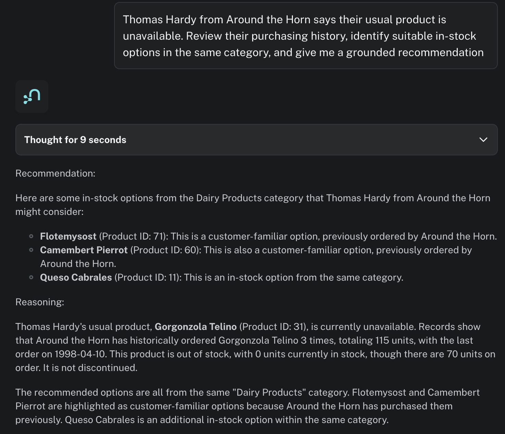
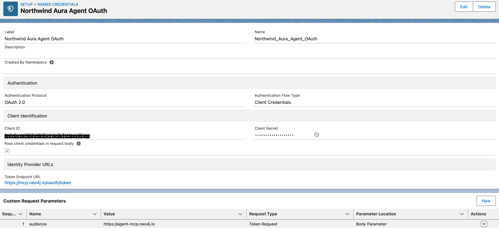
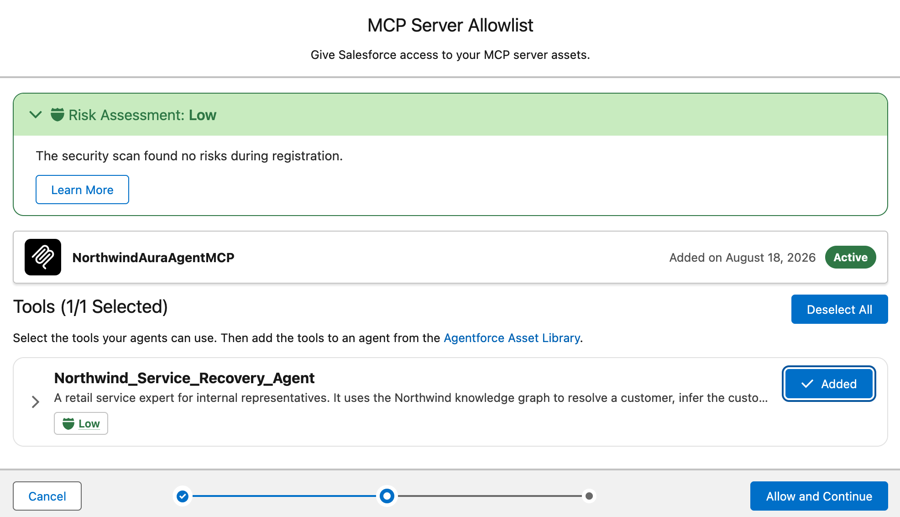
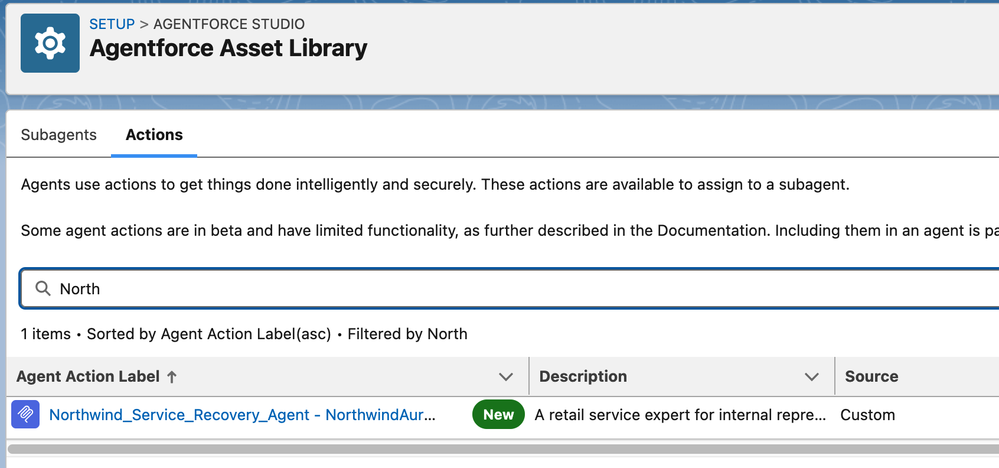

# Agentforce integration with Neo4j Aura Agent over MCP

Build a no-custom-code product-recovery assistant with Salesforce Agentforce, Neo4j Aura Agent, based on the Northwind example dataset knowledge graph.

## Overview

This guide builds an internal Agentforce Employee Agent that helps a service representative respond when a customer's usual product is unavailable. The representative supplies the contact and/or company names; Neo4j Aura Agent resolves the customer, infers the usual unavailable product from purchase history, finds in-stock products from the same category, and returns a recommendation with supporting order and inventory evidence.

Salesforce owns the employee conversation, routing, MCP registration, and tool governance, while Neo4j owns the graph data, retrieval logic, and grounded response. The systems connect directly over Aura Agent's hosted MCP endpoint using machine-to-machine OAuth. The design requires no Apex, Flow, proxy, or copied Northwind data in Salesforce.

This guide is intended to showcase bundling knowledge graph capabilities with Agentforce assistants, with minimum possible integration effort. 

## What you will build

An internal service representative asks an Agentforce Employee Agent:

> Thomas Hardy from the company `Around the Horn` says their usual product is unavailable. Review their purchasing history, identify suitable in-stock options in the same category, and give me a grounded recommendation.

Agentforce delegates the graph-specific question to a Neo4j Aura Agent over Model Context Protocol (MCP). Aura Agent resolves the customer, infers the usual unavailable product from order history, finds available options, and returns a short recommendation with its evidence.

No Apex, Flow, External Service, Salesforce custom object, or duplicate copy of Northwind is required.

## The architecture boundary

The most important design decision is not the query. It is the separation of responsibilities.

### Salesforce owns the employee experience and workflow

Salesforce is responsible for:

- The internal chat experience and authenticated Salesforce user.
- Top-level intent routing.
- Deciding when a Northwind service-recovery request should be delegated.
- Registering and governing the external MCP server.
- Allowlisting the MCP tool and attaching the generated action to the Employee Agent.
- Presenting the returned recommendation to the representative.
- Any future CRM reads or writes, such as opening or updating a Case.

This example deliberately does not add CRM enrichment or writes.

### Neo4j owns connected retail context

Neo4j is responsible for:

- The Northwind graph and its domain relationships.
- Resolving a customer from contact and company names.
- Traversing customer → order → product → category relationships.
- Defining the business-safe retrieval operation in a parameterized Cypher Template.
- Inferring the most frequently ordered product that is currently unavailable.
- Returning inventory and purchase evidence for the recommendation.
- Generating a concise, grounded answer through Aura Agent.

The implementation is intentionally read-only. Aura Agent currently executes read-only queries, which is a good match for an employee-facing recommendation workflow.

### MCP owns the interoperability boundary

MCP replaces the integration-specific Apex, OpenAPI, or proxy layer used in earlier Agentforce–Neo4j patterns. Salesforce discovers the tool exposed by the Aura Agent MCP server and turns the allowlisted tool into an Agentforce action. The MCP rationale was covered in details in the [Agentforce integration with Neo4j over MCP](./agentforce-mcp.md) guide - here the focus is on separation of concerns and seamless integration logic with machine to machine authentication, provided by OAuth.

## Prerequisites

This guide assumes relevant access to Neo4j Aura and Salesforce is available. 

## Part 1: Import and verify the Northwind data

> Restoring from a backup is a destructive operation and it overwrites every node, relationship, index, and constraint currently stored in the target AuraDB database

### Download the current Northwind dump and restore into AuraDB

For this demo, we will use the the [Northwind repository](https://github.com/neo4j-graph-examples/northwind), which contains several dumps under [`data/`](https://github.com/neo4j-graph-examples/northwind/tree/main/data) folder. Use the latest `northwind-2026-05.dump` to import data. 

In Aura Console:

1. Create or select the AuraDB instance that will hold Northwind and wait until its status is **Running**.
2. From the instance card's **…** menu, select **Restore from the File**.
4. Drag `northwind-2026-05.dump` into the upload area, or browse to the downloaded file.
6. Start the restore and wait for Aura to finish loading the dump and return the instance to **Running** (from **Loading**).

### Verify the imported graph

Open the Aura **Query** tool for the restored instance. First verify node counts:

```cypher
MATCH (n)
UNWIND labels(n) AS label
RETURN label, count(*) AS nodes
ORDER BY label;
```

Next, verify relationship counts:

```cypher
MATCH ()-[r]->()
RETURN type(r) AS relationshipType, count(*) AS relationships
ORDER BY relationshipType;
```

### Verify the demonstration customer and evidence

Next, we will resolve the customer using the same two identity fields that the Aura Agent will require (which gets us back and closer to the initial idea of the demo):

```cypher
MATCH (c:Customer)
WHERE c.contactName = 'Thomas Hardy'
  AND c.companyName = 'Around the Horn'
RETURN c.customerID, c.contactName, c.companyName;
```

Expected customer ID: `AROUT`.

Finally, verify that the graph can identify historically purchased products that are currently unavailable:

```cypher
MATCH (c:Customer {customerID: 'AROUT'})-[:PURCHASED]->(o:Order)-[line:ORDERS]->(p:Product)
WHERE p.unitsInStock = 0 OR p.discontinued = true
RETURN p.productName,
       count(DISTINCT o) AS orderCount,
       sum(line.quantity) AS quantity,
       p.unitsInStock,
       p.unitsOnOrder,
       p.discontinued
ORDER BY orderCount DESC, quantity DESC;
```

The Gorgonzola Telino appears to be the most popular product: three orders, more than 100 units purchased, zero units in stock, 70 units on order. What is more, the product is not discontinued (`discontinued = false`), which makes a perfect example for our scenario. This is the evidence that the Aura Agent later uses to infer the customer's “usual unavailable product.”

## Part 2: Create the Aura Agent

### Create Aura Agent from scratch

In the Aura Console:

1. Open **Agents**.
2. Select **Create from scratch**.
3. Select the AuraDB instance containing Northwind and contunie to **Configure**.

We can call our agent `Northwind Service Recovery Agent`, with a detailed description: _"A retail service expert for internal representatives. It uses the Northwind knowledge graph to resolve a customer, infer the customer's usual unavailable product from order history, and recommend customer-familiar, in-stock products from the same category with concise supporting evidence."_


We need to provide the agent a detailed **system prompt instruction**:

```text
You are a Northwind service-recovery expert for internal customer
service representatives.

For a product-recovery request:
1. Require both the contact name and company name. Never guess a customer.
2. Call Recommend customer-familiar product options with those two values.
3. If the tool returns no result, ask the representative to verify the exact
   contact and company names. Do not return information about another customer.
4. Treat the usual unavailable product returned by the tool as the inferred
   product. Explain the evidence: distinct historical orders and total quantity.
5. Explain whether the product is out of stock, discontinued, or both. Mention
   units on order, but never invent an arrival or restock date.
6. Recommend no more than three returned options. Prefer options marked
   previouslyPurchased. If customer-familiar options exist, recommend those
   before unfamiliar same-category options.
7. Describe results as in-stock options or customer-familiar options. Do not
   claim that same-category products are equivalent substitutes.
8. Return two short sections: Recommendation and Reasoning.
9. Use only facts returned by the tool. Never expose customer addresses, phone
   numbers, fax numbers, or information about unrelated customers.
```

We want our agent to be External and we want a MCP server enabled - as this is the backbone of the planned Salesforce integration. 


### Add one Cypher Template tool

Select **Add tool → Cypher Template**.

Name the tool: `Recommend customer-familiar product options` and provide a detailed description

**Tool description**

```text
Use when supplied both a customer's contact name and company name and asked about the usual unavailable product.
The tool requires an exact case-insensitive match on both names. It identifies the historically most frequently ordered product that is now out of stock or discontinued, then returns up to three active, in-stock products from the same category, prioritizing products the customer previously ordered. Do not use for customer searches that omit either name or for unrelated Northwind questions.
```

Add two parameters:

| Parameter | Type | Description |
|---|---|---|
| `contactName` | String | Exact customer contact name supplied by the representative, for example `Thomas Hardy`. |
| `companyName` | String | Exact company name supplied by the representative, for example `Around the Horn`. |

Use this Cypher query:

```cypher
MATCH (customer:Customer)
WHERE toLower(trim(customer.contactName)) = toLower(trim($contactName))
  AND toLower(trim(customer.companyName)) = toLower(trim($companyName))
WITH collect(customer) AS customerMatches
WHERE size(customerMatches) = 1
WITH head(customerMatches) AS customer
MATCH (customer)-[:PURCHASED]->(sourceOrder:Order)-[sourceLine:ORDERS]->(source:Product)
WHERE source.unitsInStock = 0 OR source.discontinued = true
WITH customer,
     source,
     count(DISTINCT sourceOrder) AS sourceOrderCount,
     sum(sourceLine.quantity) AS sourceQuantity,
     max(sourceOrder.orderDate) AS lastSourceOrderDate
ORDER BY sourceOrderCount DESC,
         sourceQuantity DESC,
         lastSourceOrderDate DESC,
         source.productName ASC
WITH customer,
     collect({
       product: source,
       orderCount: sourceOrderCount,
       quantity: sourceQuantity,
       lastOrderDate: lastSourceOrderDate
     })[0] AS usual
WITH customer, usual, usual.product AS source
MATCH (source)-[:PART_OF]->(category:Category)<-[:PART_OF]-(candidate:Product)
WHERE candidate <> source
  AND candidate.unitsInStock > 0
  AND candidate.discontinued = false
OPTIONAL MATCH (customer)-[:PURCHASED]->(candidateOrder:Order)-[candidateLine:ORDERS]->(candidate)
WITH customer,
     usual,
     source,
     category,
     candidate,
     count(DISTINCT candidateOrder) AS candidateOrderCount,
     coalesce(sum(candidateLine.quantity), 0) AS candidateQuantity,
     max(candidateOrder.orderDate) AS lastCandidateOrderDate
ORDER BY CASE WHEN candidateOrderCount > 0 THEN 0 ELSE 1 END,
         candidateOrderCount DESC,
         lastCandidateOrderDate DESC,
         abs(candidate.unitPrice - source.unitPrice) ASC,
         candidate.unitsInStock DESC,
         candidate.productName ASC
WITH customer,
     usual,
     category,
     collect({
       productId: candidate.productID,
       productName: candidate.productName,
       quantityPerUnit: candidate.quantityPerUnit,
       unitPrice: candidate.unitPrice,
       unitsInStock: candidate.unitsInStock,
       unitsOnOrder: candidate.unitsOnOrder,
       previouslyPurchased: candidateOrderCount > 0,
       customerOrderCount: candidateOrderCount,
       customerQuantity: candidateQuantity,
       lastCustomerOrderDate: lastCandidateOrderDate
     })[0..3] AS options
RETURN customer.customerID AS customerId,
       customer.contactName AS contactName,
       customer.companyName AS companyName,
       usual.product.productID AS usualProductId,
       usual.product.productName AS usualProductName,
       usual.product.quantityPerUnit AS usualQuantityPerUnit,
       usual.product.unitPrice AS usualUnitPrice,
       usual.product.unitsInStock AS usualUnitsInStock,
       usual.product.unitsOnOrder AS usualUnitsOnOrder,
       usual.product.discontinued AS usualDiscontinued,
       usual.orderCount AS usualProductOrderCount,
       usual.quantity AS usualProductQuantity,
       usual.lastOrderDate AS usualProductLastOrderDate,
       category.categoryName AS category,
       options
```

### Test inside Aura

Save the tool and test the internal agent with:

```text
Thomas Hardy from the company Around the Horn says their usual product is
unavailable. Review their purchasing history, identify suitable in-stock options
in the same category, and give me a grounded recommendation.
```

Inspect the reasoning panel and confirm:

- The agent selected the Cypher Template.
- `contactName` is `Thomas Hardy`.
- `companyName` is `Around the Horn`.
- Gorgonzola Telino was inferred from three orders and 115 units.
- Current inventory is zero and 70 units are on order.
- Flotemysost and Camembert Pierrot are marked as previously purchased.
- The answer does not claim product equivalence or invent a restock date.

An acceptable answer is:

```text
Recommendation
Gorgonzola Telino is Around the Horn's usual unavailable product. It is active
but currently out of stock. Offer Flotemysost first, followed by Camembert
Pierrot; Around the Horn has ordered both before and both are currently in stock.

Reasoning
Around the Horn ordered Gorgonzola Telino in 3 orders, 115 units in total. Its
current stock is 0, with 70 units on order. Flotemysost has 26 units in stock and
Camembert Pierrot has 19. These are customer-familiar Dairy Products, not
guaranteed equivalent substitutes.
```



Also test a mismatched identity:

```text
Thomas Hardy from Ernst Handel needs an alternative to their usual product.
```

The agent must ask for corrected identity information and must not return either customer's history.

## Part 3: Publish the Aura Agent as an MCP server

Once created the agent is available externally. From the agent's actions menu (**…** menu), copy the MCP endpoint.

The endpoint has this shape (including both query parameters):

```text
https://mcp.neo4j.io/agent?project_id=<PROJECT_ID>&agent_id=<AGENT_ID>
```

### Create machine-to-machine credentials

In Aura Console:

1. Open the profile menu.
2. Select **Account settings**.
3. Open **Client credentials → Aura Agent & MCP**.
4. Create a credential with a descriptive name such as `salesforce-northwind`.
6. Save the generated client ID and client secret securely. The secret cannot be recovered later.

Aura Agent MCP uses a different token endpoint and audience from the general Aura API:

| Field | Value |
|---|---|
| Token endpoint | `https://mcp.neo4j.io/oauth/token` |
| Grant type | `client_credentials` |
| Audience | `https://agent-mcp.neo4j.io` |
| MCP endpoint | The complete copied `/agent?project_id=...&agent_id=...` URL |

Neo4j documents this [machine-to-machine authorization flow](https://neo4j.com/docs/aura/aura-agent/#_machine_to_machine_authorization_flow). The token endpoint is limited to 15 requests per hour per client ID, so clients must reuse the token for its full lifetime rather than request one for every tool call - but this is fully covered by the Salesforce external API governance, which we conver next. 

## Part 4: Register the Aura Agent MCP server in Salesforce

Aura Agent's M2M flow is implemented through Auth0. Its token request requires `audience=https://agent-mcp.neo4j.io` in addition to the standard client-credentials fields. This is a token-request body parameter—not a header sent to the Aura Agent MCP API.

The built-in **OAuth 2.0** registration form doesn't expose that custom parameter. Configure the Salesforce authentication stack first, then select it with the newer **Use External Credentials** option during MCP server registration. In **Setup → MCP Servers**, choose **Add MCP Server → Register External MCP Server**. 

In the setup form, choose **Use External Credentials** as the Authentication Method and in the refreshed form go to **New External Credentials**.

### Create an External Auth Identity Provider

Creating new credentials can be accessed from the MCP server configuration as well as from the standard setup menu. 
In **Setup → Security → Named Credentials → External Auth Identity Providers**, select **New** and use:

| Field | Value |
|---|---|
| Label | `Northwind Aura Agent OAuth` |
| Name | `Northwind_Aura_Agent_OAuth` |
| Authentication Protocol | OAuth 2.0 |
| Authentication Flow Type | Client Credentials |
| Client ID | Aura Agent & MCP client ID |
| Client Secret | Aura Agent & MCP client secret |
| Token Endpoint URL | `https://mcp.neo4j.io/oauth/token` |
| Pass client credentials in request body | Enabled |

Aura documents `client_id` and `client_secret` in the form body, so enable **Pass client credentials in request body**.

Add this custom request parameter, which let us directly supports custom token parameters such as `audience`:

| Field | Value |
|---|---|
| Name | `audience` |
| Value | `https://agent-mcp.neo4j.io` |
| Request Type | Token Request |
| Parameter Location | Body Parameter |



### Create the reusable External Credential

1. Open **Setup → Named Credentials → External Credentials**.
2. Select **New**.
3. Set **Label** to `Northwind Aura Agent MCP` and **Name** to `Northwind_Aura_Agent_MCP`.
4. Set **Authentication Protocol** to **OAuth 2.0**.
5. Set **Authentication Flow Type** to **Configured in an External Auth Identity Provider**.
6. Select `Northwind Aura Agent OAuth` as the External Auth Identity Provider.
7. Leave **Scope** blank unless Neo4j supplies a scope for your credential.
8. Save the External Credential.

This External Credential now owns the Auth0-specific token exchange. It is reusable by the MCP registration without exposing the Aura client secret in the Agentforce Registry form.

Additionally, Salesforce requires to setup a principal. In the `Northwind Aura Agent MCP` External Credential view, scroll to **Principals** and select **New**. Name your parameter (for example: `AuraAgentM2M`) and save. 

Salesforce identifies this principal in the permission sets. Salesforce uses it at runtime,to check access before using the External Credentials.

### Register the server with Use External Credentials

Now, let's get back to the MCP Server registration. 

1. In **Setup**, search for **MCP Servers** and choose **Add MCP Server → Register External MCP Server**. 
2. Select **New**.
3. Enter the server name `NorthwindAuraAgentMCP` and a short description.
4. Enter the exact MCP endpoint copied from Aura:

```text
https://mcp.neo4j.io/agent?project_id=<PROJECT_ID>&agent_id=<AGENT_ID>
```

5. For **Authentication Method**, select **Use External Credentials**.
6. Select the `Northwind Aura Agent MCP` External Credential.
7. Select **Create and Continue**.



In the next screen add the tool (defined within the Aura Agent) and continue. 

Salesforce creates an Agentforce action using the naming pattern `<Tool Name> <Server Name>`. Verify it under **Setup → Agentforce → Agentforce Assets → Actions**. 



## Part 5: Configure the Agentforce Employee Agent

Finally, we can create an agent (or add the action to an existing agent). The defined action works best as a focused subagent.

### Create one focused subagent

Create a subagent named:

```text
Order Recovery
```

**Routing description**

```text
Handles questions about a named customer, their purchase history, their usual unavailable product, current product inventory, and in-stock same-category options. Use when the user supplies both a contact name and company name.
```

**Subagent instructions**

```text
1. Require a contact name and company name. If either is missing, ask for it.
2. Invoke the Northwind Aura Agent MCP action with the representative's complete
   product-recovery question.
3. Invoke the action once. If it reports that the identity cannot be matched,
   ask the representative to verify the names; do not guess.
4. Present the returned Recommendation and Reasoning concisely.
5. Preserve inventory, purchase-count, and limitation statements from the Aura
   response. Do not add unsupported product claims or restock dates.
```

### Attach the MCP action

1. Open the subagent's **Actions**.
2. Select **Add from Asset Library**.
3. Add the action generated from `Northwind Aura Agent`.
4. Save the subagent.
5. In Script view, verify that the action appears in both the subagent's `actions` block and its reasoning actions.
6. Verify the Agent Router can transition to the subagent.

### Preview and activate

Open **Preview** and submit:

```text
Thomas Hardy from the company Around the Horn says their usual product is
unavailable. Review their purchasing history, identify suitable in-stock options
in the same category, and give me a grounded recommendation.
```

When agent provides a respone, the Interaction Details provides a verifiable path:

1. Agent Router selected `Order Recovery`.
2. The subagent selected the MCP action.
3. The action passed the request to Aura Agent.
4. The returned answer identifies Gorgonzola Telino and cites the purchase and inventory evidence.

## Example summary

This demonstration is intentionally small, but the boundary is production-relevant:

- Agentforce remains the employee-facing orchestrator.
- Aura Agent remains the graph-grounded domain expert.
- A Cypher Template keeps business retrieval deterministic.
- MCP turns the external expert into a governed Salesforce action.
- OAuth client credentials provide machine-to-machine access without Apex or a custom proxy.

The next useful extension is not more integration code. It is a second narrow graph capability—for example, supplier impact or delayed-order analysis—added as another Aura Agent tool only after this first action is measured and understood.

This examples wraps up all the previous examples into a single scenario, which fully utilizes features as well as avoids any bespoke integration. Therefore addresses all security and governance concerns; the Salesforce-to-Aura connection authenticates the integration, not the representative. No individual user identity is passed to an external MCP server, as well as no destructive (write) action can be triggered on the Neo4j side. 

## References

- [Neo4j Aura Agent documentation](https://neo4j.com/docs/aura/aura-agent/)
- [Neo4j Aura Agent getting-started tutorial](https://neo4j.com/developer/genai-ecosystem/aura-agent-getting-started/)
- [Northwind graph example](https://github.com/neo4j-graph-examples/northwind)
- [Salesforce: Register a Third-Party MCP Server](https://help.salesforce.com/s/articleView?id=ai.agent_mcp_connect_register.htm&language=en_US&type=5)
- [Salesforce: MCP for Agentforce considerations](https://help.salesforce.com/s/articleView?id=ai.agent_mcp_considerations.htm&language=en_US&type=5)
- [Salesforce: Advanced client-credentials authentication for MCP](https://help.salesforce.com/s/articleView?id=ai.agent_mcp_connecting_register_oauth21.htm&language=en_US&type=5)
- [Salesforce: Client-credentials External Credential managed by an External Auth Identity Provider](https://help.salesforce.com/s/articleView?id=xcloud.nc_create_edit_oath_client_cred_xidp_ext_cred.htm&language=en_US&type=5)
- [Salesforce: Enable External Credential Principals](https://help.salesforce.com/s/articleView?id=sf.nc_enable_ext_cred_principal.htm&language=en_US&type=5)
- [Salesforce Prompt Builder](https://help.salesforce.com/s/articleView?id=ai.prompt_builder_intro.htm&language=en_US)
- [Neo4j Labs: Salesforce Agentforce + Neo4j Integration](https://neo4j.com/labs/genai-ecosystem/genai-frameworks/salesforce-agentforce/)
