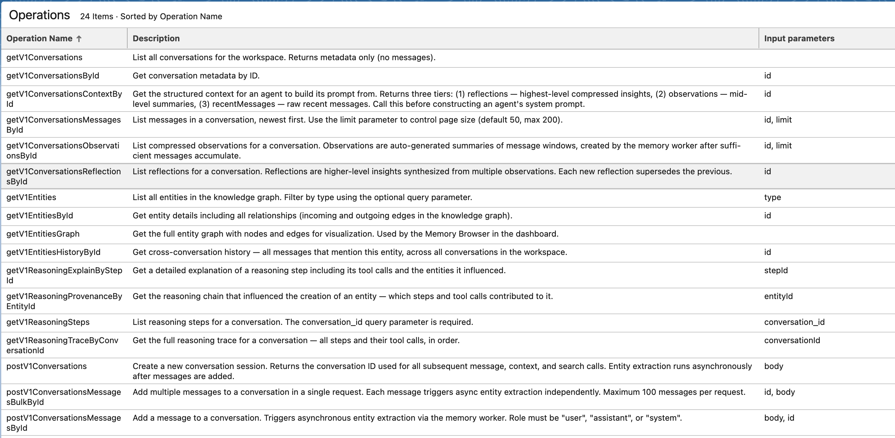
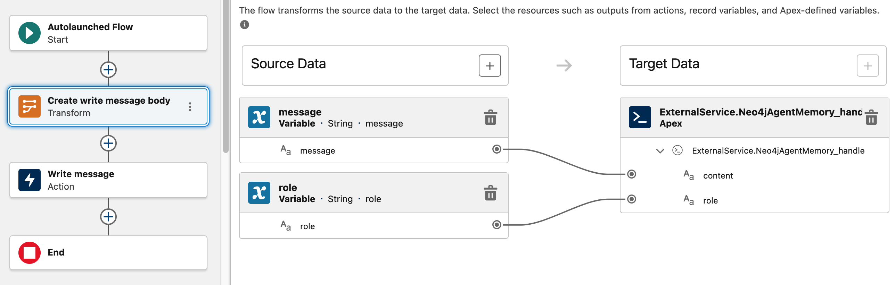
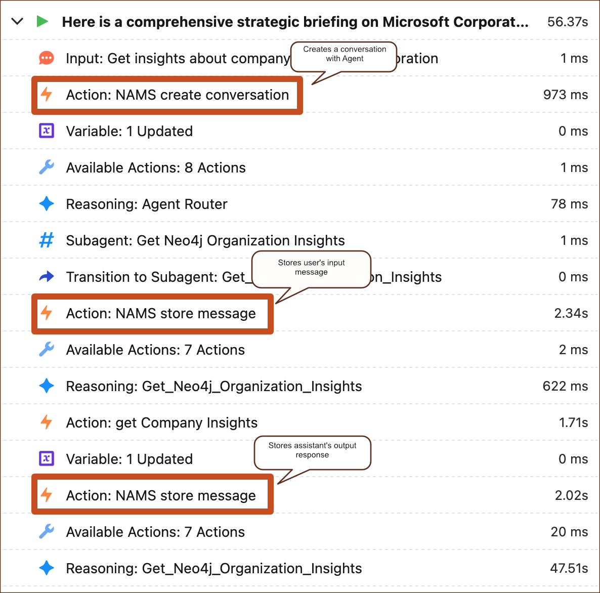
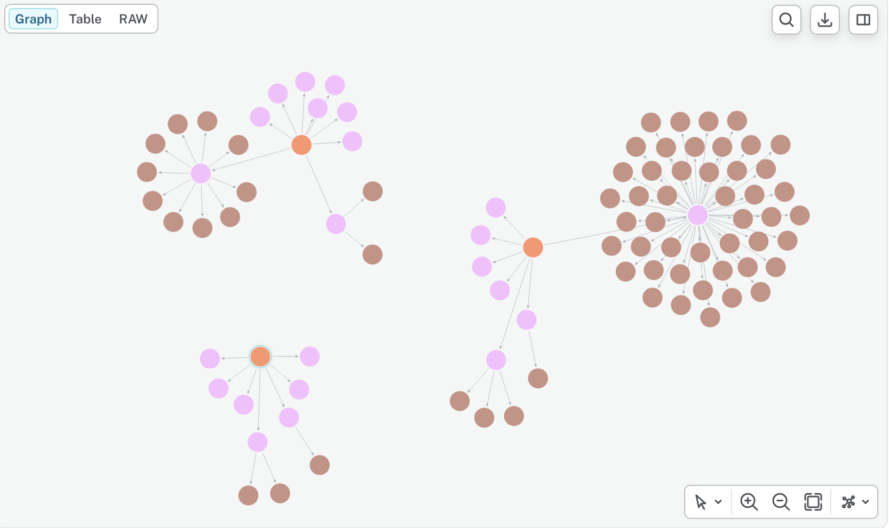

# Agentforce integration with Neo4j Agent Memory

## Overview

Agentforce agents can complete single-turn tasks without external memory, but longer business workflows need durable context: prior user requests, decisions, entities, observations, and reasoning traces. When building more complex Agentforce agents, it's visible that grounding can start to drop after multiple turns, especially when a conversation crosses topics or actions. The common workaround is to persist key data points such as account IDs, issue types, user intent, or prior decisions in session state, a custom object, or an external store, then inject that context back into prompts and actions when it is needed. This is exactly when a structured memory with semantic information (like the Neo4j Agent Memory Service) starts to shine. 

This guide shows how to connect Agentforce to the [Neo4j Agent Memory Service (NAMS)](https://memory.neo4jlabs.com) using a declarative Salesforce implementation: External Services, Flow, Agent Actions, Custom Variables, and agent/topic instructions. It extends the [Get company insights](README.md#get-company-insights--implementation) use case from the main Agentforce integration guide with graph-backed memory.

NAMS exposes a [REST API](https://memory.neo4jlabs.com/docs) for short-term conversations, long-term entity memory, reasoning traces, and observations. The memory is backed by Neo4j Aura and semantic search, so Agentforce can write important interaction state to a graph-native memory layer and recall relevant context after the active prompt history is no longer enough.

For this demo, the Agentforce agent is an employee agent bound to a single user context. That maps cleanly to a NAMS workspace: the workspace API key is stored in Salesforce as a credential, every memory call uses that workspace, and all conversation memory for the demo is persisted in the workspace's Neo4j-backed memory store.

## Integration approach

The declarative path is the focus of this guide:

1. Register the NAMS OpenAPI schema as a Salesforce External Service.
2. Store the NAMS workspace API key in a Salesforce Named Credential.
3. Wrap each memory operation in a no-UI Flow.
4. Expose the Flows as Agent Actions.
5. Use a Custom Variable to hold the active NAMS `conversation_id`.
6. Update agent/topic instructions so the agent recalls context before work and stores messages after work.

External Services are Salesforce's no-code/low-code way to integrate REST APIs described by OpenAPI specifications. Salesforce generates invocable Apex classes behind the scenes, making the API operations available to Flow and Apex without hand-written HTTP code.

Use this path for rapid, declarative integration. Use Apex instead when you need complex request shaping, custom retry logic, specialized HTTP headers, response normalization, advanced error handling, or high-volume integration behavior.

Minimal Apex escape hatch:

```apex
@InvocableMethod(label='Call NAMS')
public static List<Response> callMemory(List<Request> requests) {
    // Use Apex only when External Services and Flow are not enough.
}
```

## Target architecture

```text
Agentforce Employee Agent
  |
  | agent/topic instructions
  v
Custom Variable: conversationId
  |
  | invokes
  v
Agent Actions
  |
  | backed by
  v
Salesforce Flows
  |
  | call External Service operations
  v
NAMS REST API
  |
  v
Neo4j-backed Agent Memory
```

Agentforce does not provide a universal pre-turn or post-turn memory hook. The memory behavior is therefore embedded in the agent logic: create a conversation once, recall context before a business action, and store relevant user and agent messages after the action completes.

## Prerequisites

This guide assumes the following elements: 

- Salesforce org with Agentforce, Agent Builder or Agent Studio, Flow, Named Credentials, and External Services enabled.
- NAMS workspace and API key.
- NAMS OpenAPI schema available at [https://memory.neo4jlabs.com/openapi.json](https://memory.neo4jlabs.com/openapi.json).
- The base Agentforce + Neo4j company insights implementation from [README.md](README.md).

## Memory operations

Keep the first version small. The agent only needs the operations required to maintain a conversation and retrieve useful context.

| Logical action | NAMS purpose | Agentforce wrapper |
| --- | --- | --- |
| Create conversation | Create one `conversation_id` for the current Agentforce session. | `NAMS_create_conversation` Flow |
| Recall context | Retrieve recent messages, entities, observations, and related memory for the current conversation. | `NAMS_recall_context` Flow |
| Store message | Persist user and agent utterances. | `NAMS_store_message` Flow |
| Store reasoning | Persist notable reasoning traces or decisions when useful for later recall. | `NAMS_store_reasoning` Flow |

The key invariant is simple: create one `conversation_id` once, then reuse it for every memory call in the same Agentforce conversation. Do not recreate it mid-conversation.

## Agentforce implementation

### 1. Configure authentication

Create an External Credential and Named Credential for NAMS. Store the workspace API key as a bearer token and use the Named Credential in the External Service registration.

Conceptually:

```text
Named Credential
  URL: https://memory.neo4jlabs.com
  Authentication: Bearer token
  Token: <NAMS workspace API key>
```

### 2. Register the External Service

Register the NAMS OpenAPI schema in Salesforce:

```text
Setup -> Integrations -> External Services -> New
Schema: https://memory.neo4jlabs.com/openapi.json
Credential: NAMS Named Credential
```

After registration, Salesforce exposes the selected NAMS operations to Flow. Keep the imported operation set narrow at first: conversation creation, context recall, message storage, and reasoning storage.



### 3. Add the conversation variable

Create a mutable Custom Variable on the agent:

```yaml
conversationId: mutable string
  label: conversationId
  description: Stores the active Neo4j Agent Memory conversation ID.
```

This variable is the bridge between Agentforce's current session and the NAMS conversation.

### 4. Create Flow wrappers

Create one no-UI Flow per logical memory action. Each Flow should call the matching External Service operation and expose clean inputs and outputs for Agent Actions.

Recommended Flow contracts:

| Flow | Inputs | Outputs |
| --- | --- | --- |
| `NAMS_create_conversation` | optional `metadata` | `conversationId` |
| `NAMS_recall_context` | `conversationId`, optional `query` | `context` |
| `NAMS_store_message` | `conversationId`, `role`, `content` | `success` |
| `NAMS_store_reasoning` | `conversationId`, `content`, optional `metadata` | `success` |

Keep the Flow names and output fields stable. Agent instructions are easier to maintain when every memory action has a predictable contract.

Be aware, flows might need some additional mapping from primitive Salesforce variable types - to Apex. Like in the example below, where a raw test message is transformed to an Apex defined, autogenerated by an External Service class (`ExternalService.Neo4jAgentMemory_handlersx2eaddMessageRequest`)


### 5. Expose Flows as Agent Actions

Expose each Flow as an Agent Action with clear LLM-facing names and descriptions.

Example descriptions:

```text
NAMS_create_conversation
Create a Neo4j Agent Memory conversation for the current Agentforce session. Use only when conversationId is empty.

NAMS_recall_context
Retrieve relevant memory for the current user request and active conversationId before answering or calling business actions.

NAMS_store_message
Store a user or assistant message in Neo4j Agent Memory for the active conversationId.
```

### 6. Initialize memory in the agent router

The most significant integration (plumbing) is performed in the agent_router. This is a subagent evaluation on every user's message and give a nice interface to create conversation, capture user's input, etc. 

Firstly, NAMS is instructed to create a NAMS conversation before routing if `conversationId` is empty. Once created, or if present, a user's message is added to the conversation.
Based on the user's input, the memory recall is performed so NAMS can return relevant messages, entities, and observations. The recalled context can help resolve follow-ups such as "compare it with the supplier we discussed earlier" or "use the same region as before."

Finally, the agent is transferred to the company insights subagent (or any other subagent which is meaningful to the conversation). 

```yaml
start_agent agent_router:
    label: "Agent Router"
    description: "Welcome the user and determine the appropriate subagent based on user input"
    model_config:
        model: "model://sfdc_ai__DefaultEinsteinHyperClassifier"
    reasoning:
        instructions: Select the best tool to call based on conversation history and user's intent.
            if @variables.conversationId is None:
                run @actions.NAMS_create_conversation
                    set @variables.conversationId = @outputs.conversationId
            if @variables.conversationId is not None:
                run @actions.NAMS_store_message
                    with conversationId = @variables.conversationId
                    with message = @system_variables.user_input
                    with role = @variables.userRole
                run @actions.NAMS_recall_context
                    with conversationId = @variables.conversationId
                    with query = @system_variables.user_input
        actions:
            go_to_off_topic: @utils.transition to @subagent.off_topic
            go_to_ambiguous_question: @utils.transition to @subagent.ambiguous_question
            go_to_Get_Neo4j_Organization_Insights: @utils.transition to @subagent.Get_Neo4j_Organization_Insights
                description: "When user asks for insights about a company or organization"

```

### 7. Store user and agent messages

Simple message storage can be done based on the `@system_variables.user_input` before the business action is derived.

Additionally, after the company insights action completes, store the user request and final agent answer.

```yaml
subagent Get_Neo4j_Organization_Insights:
    label: "Get_Neo4j_Organization_Insights"
    description: "Present a summarized view of all available data points to the user in a single, professional response."
    reasoning:
        instructions: ->
            |Calls the action "get_Company_Insights" to retrieve and display organization insights for a specified company, returning all available data in a structured format
             Your goal is to provide a comprehensive strategic briefing on an organization. To achieve this, you must use the get_Company_Insights action to gather data on competitors, suppliers, subsidiaries and news. Present a summarized view of all available data points to the user in a single, professional response.
             If the user names a company, call the insights action immediately; only clarify if the name is ambiguous.
             When the user requests insights about a named company, immediately call get_Company_Insights.
             Only ask clarifying questions if the company name is missing or ambiguous. Do not ask about competitors, suppliers, subsidiaries, or news unless explicitly requested or after returning base insights.
        actions:
            get_Company_Insights: @actions.get_Company_Insights
                with Org = ...
                run @utils.transition to @subagent.NAMS_store_assistant_message
                    description: "transition_and_store_NAMS_message"

```

Storing the agent's message can be more problematic, but this is where Prompt Builder and its templates come into play. Salesforce Prompt Builder is a way to communicate with a large language model (LLM) and use generative AI, such as ChatGPT, in the backend. The main tool in the box is a prompt template, a structured framework or guideline for creating prompts that generate specific responses or outputs, particularly in contexts like artificial intelligence or writing.

When the agent's action is a Prompt Template -> Flow (and not just calling Flow directly), the output of the action is an already formulated, natural language response, based on the grounded data from the integration (like the Neo4j "Get company insights" use case). Therefore, the assistant's message can be directly persisted in memory - which is exactly what we need. 

## Validation

Validate the integration one layer at a time:

1. Test the Named Credential connection.
2. Test selected NAMS operations from External Services.
3. Run each Flow in Flow Debug with sample inputs.
4. Confirm each Flow appears as an Agent Action.
5. Start an Agentforce test conversation and verify `conversationId` is created once.
6. Ask for company insights, then ask a follow-up that depends on earlier context.
7. Confirm messages are stored in the NAMS workspace.



## Summary

After multiple interactions with the agent, the knowledge graph starts to look promising. While the integration is possible, it's cumbersome and explicit, due to lack of native memory hooks in Agentforce and due to lack of MCP support. Either of those would allow a seamless integration split from the agent's "business logic" - definitions of operations it performs. Memory feels like a technical concept and it would be ideal if it were handled natively by the platform.



## Resources

- [Salesforce Agentforce + Neo4j Integration](README.md)
- [Get company insights implementation](README.md#get-company-insights--implementation)
- [NAMS OpenAPI schema](https://memory.neo4jlabs.com/openapi.json)
- [Salesforce External Services](https://help.salesforce.com/s/articleView?id=platform.external_services.htm&type=5)
