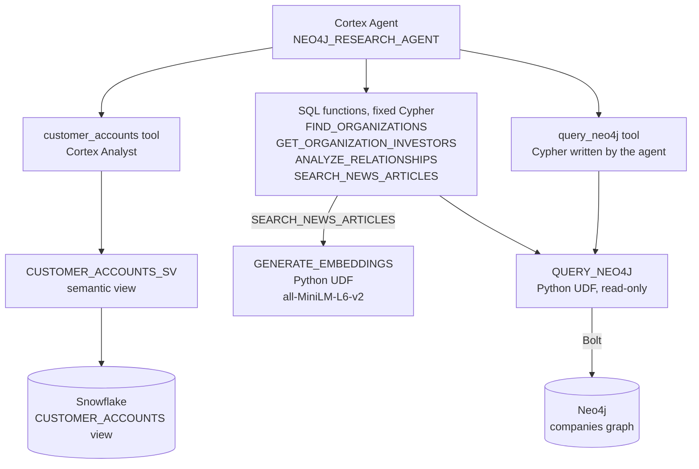

# Snowflake Cortex Agents + Neo4j Integration

This sample builds a Cortex agent in Snowflake. The agent answers questions about companies by combining two sources:

- customer accounts, stored in Snowflake
- company knowledge (investors, competitors, news), stored in the Neo4j `companies` demo graph at `neo4j+s://demo.neo4jlabs.com:7687`

It shows three things:

- A Cortex agent can query Neo4j from inside Snowflake.
- One answer can join data from both sources. The join key is the Neo4j organization ID.
- Graph tools come in two kinds. Fixed Cypher queries are predictable. [Free-form Cypher](#free-form-cypher) is flexible but needs guards.

See also the [Cortex Agents documentation](https://docs.snowflake.com/en/user-guide/snowflake-cortex/cortex-agents).

## Architecture



| Object | Role |
| --- | --- |
| `QUERY_NEO4J` | Reads the Neo4j login from a Snowflake secret and connects through an external access integration. |
| `GENERATE_EMBEDDINGS` | Turns the search topic into a vector. `SEARCH_NEWS_ARTICLES` ranks news by similarity to it. |
| `customer_accounts` tool | Cortex Analyst writes the SQL from the semantic view. |

Semantic views are Snowflake's [recommended way](https://www.snowflake.com/en/developers/guides/best-practices-semantic-views-cortex-analyst/) to give agents structured data. The semantic view knows nothing about Neo4j. The tool description in the agent spec explains how its IDs map to the graph.

### Joining Snowflake and Neo4j

Each account has an `ORGANIZATION_ID`. It is the company's `Organization.id` in the graph. The Neo4j tools take and return these IDs, so the agent can pass them from one source to the other.

The join uses IDs, not names, for two reasons:

- Names are not unique in the graph. There are 8 `Red Hat` nodes, and only one has investors.
- `Organization.id` has a unique index. A lookup by name scans every organization.

For a company that is not an account, the agent gets the ID from `find_organizations`.

| Question | Tools the agent calls |
| --- | --- |
| *Who are the investors of our accounts in Red health?* | `customer_accounts`, then `get_organization_investors` for each Red account |
| *Which of our accounts renewing in the next 45 days compete with another of our accounts?* | `customer_accounts`, then `query_neo4j`. No fixed query finds competitors. |
| *Who are the investors of Neo4j?* | `find_organizations`, then `get_organization_investors` |

## Free-form Cypher

> [!WARNING]
> **The `query_neo4j` tool runs Cypher that the LLM writes.** Prompt injection can steer that Cypher, for example through article text the agent reads. Give the Neo4j user access only to data the agent may see.

`QUERY_NEO4J` checks every query, including the fixed ones:

| Check | What it stops |
| --- | --- |
| A denylist: `LOAD CSV`, `dbms.*`, `apoc.load/import/export/cypher/periodic/trigger/systemdb` | Reads beyond the graph: files, URLs, dynamic Cypher and DBMS internals. `EXPLAIN` reports these as reads. |
| `EXPLAIN` runs first. The query type must be `r`. | Writes (`w`, `rw`) and schema or admin commands (`s`) |
| The query runs in read access mode (`routing_=READ`). | Any write the server detects |

A rejected query returns `{"error": ...}`. The agent reads the error and fixes its next query. The checks do not limit cost: an unbounded query runs until the tool's 60-second `query_timeout`. To allow fixed queries only, remove `query_neo4j` from the agent spec.

The tool passes only `cypher`, so the agent writes all values into the query. Custom tools cannot pass `OBJECT` arguments, and `PARAMS` defaults to `{}`.

## MCP instead of UDFs

- Cortex Agents can call external MCP servers through [MCP connectors](https://docs.snowflake.com/en/user-guide/snowflake-cortex/cortex-agents-mcp-connectors). These connectors support only OAuth.
- The self-hosted [Neo4j MCP server](https://github.com/neo4j/mcp) has no OAuth, so it does not work with them. The public demo graph is also not on Aura.
- The [Aura-hosted MCP](https://neo4j.com/docs/mcp/current/mcp-for-aura/) supports OAuth and works with MCP connectors. [Sample 3](samples/3-aura-mcp/README.md) connects an agent to it. Every user signs in with their own Aura account.

## Samples

| Sample | What it does |
| --- | --- |
| [1-terraform](samples/1-terraform/README.md) | Creates the whole stack with Terraform. |
| [2-snowsight](samples/2-snowsight/README.md) | Builds the same stack by hand in Snowsight. |
| [3-aura-mcp](samples/3-aura-mcp/README.md) | Connects an agent to the Aura-hosted MCP server, without UDFs. |

Samples 1 and 2 use the same Python handlers, SQL bodies and agent tools from [`shared/`](shared).

You can also watch Sample 2 step by step [on YouTube](https://youtu.be/5w1wxf3WfYQ).

[](https://youtu.be/5w1wxf3WfYQ)

## Repository layout

```
snowflake-cortex/
├── shared/                  # used by samples 1 and 2
│   ├── functions/           # Python UDF handlers
│   ├── sql/                 # SQL function bodies, accounts view, semantic view
│   ├── agent/               # agent spec template
│   └── model/minilm/        # all-MiniLM-L6-v2 files (downloaded, gitignored)
└── samples/
    ├── 1-terraform/         # Terraform config, bootstrap SQL
    ├── 2-snowsight/         # Snowsight guide, screenshots
    └── 3-aura-mcp/          # Aura MCP guide, screenshots
```

## Running the agent

The agent is `NEO4J_AGENT.NEO4J_AGENT_SCHEMA.NEO4J_RESEARCH_AGENT`. You can call it from Snowsight or through the Cortex Agents REST API. Its tools also work as plain SQL:

```sql
SELECT * FROM SEMANTIC_VIEW(NEO4J_AGENT.NEO4J_AGENT_SCHEMA.CUSTOMER_ACCOUNTS_SV
  DIMENSIONS ACCOUNTS.ACCOUNT_NAME, ACCOUNTS.ORGANIZATION_ID, ACCOUNTS.HEALTH);

SELECT NEO4J_AGENT.NEO4J_AGENT_SCHEMA.FIND_ORGANIZATIONS('Uniphore');  -- organization_id Es6d5vh20OoKzKwm8upOW-Q

SELECT NEO4J_AGENT.NEO4J_AGENT_SCHEMA.GET_ORGANIZATION_INVESTORS('Es6d5vh20OoKzKwm8upOW-Q');

SELECT NEO4J_AGENT.NEO4J_AGENT_SCHEMA.ANALYZE_RELATIONSHIPS('Es6d5vh20OoKzKwm8upOW-Q', 10, 2);

SELECT NEO4J_AGENT.NEO4J_AGENT_SCHEMA.SEARCH_NEWS_ARTICLES('Es6d5vh20OoKzKwm8upOW-Q', 'Roberto Pieraccini', 3);

SELECT NEO4J_AGENT.NEO4J_AGENT_SCHEMA.QUERY_NEO4J(
  'MATCH (o:Organization {id: "E_j7i1alEOA6VKxhkV_yn5Q"})-[:HAS_COMPETITOR]-(c) RETURN DISTINCT c.id, c.name LIMIT 10');
```
