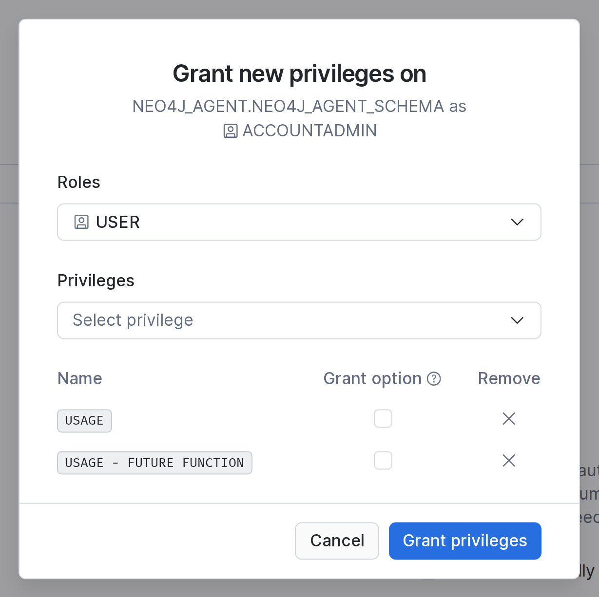
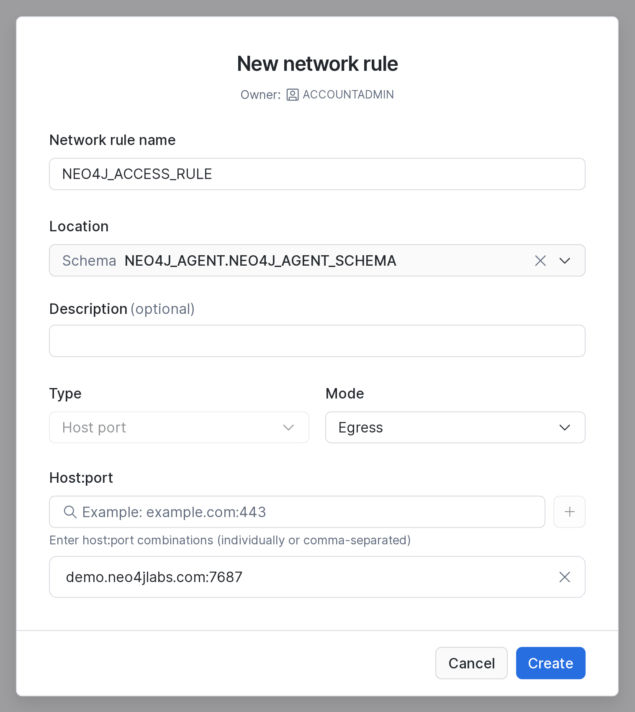
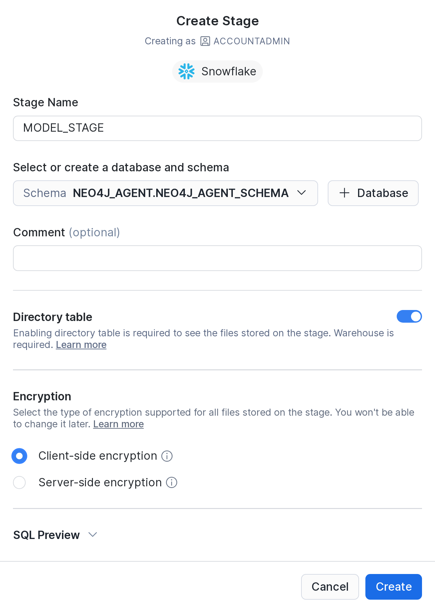
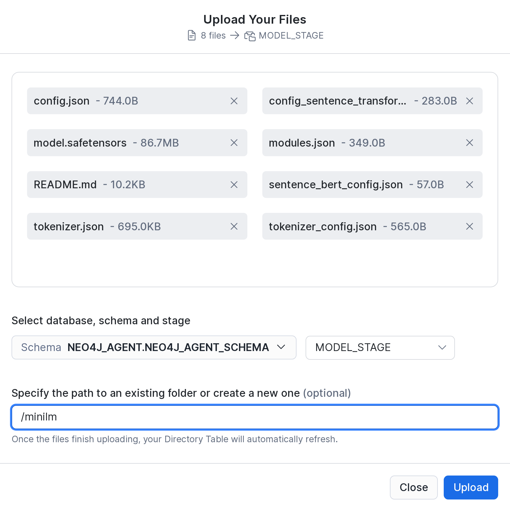
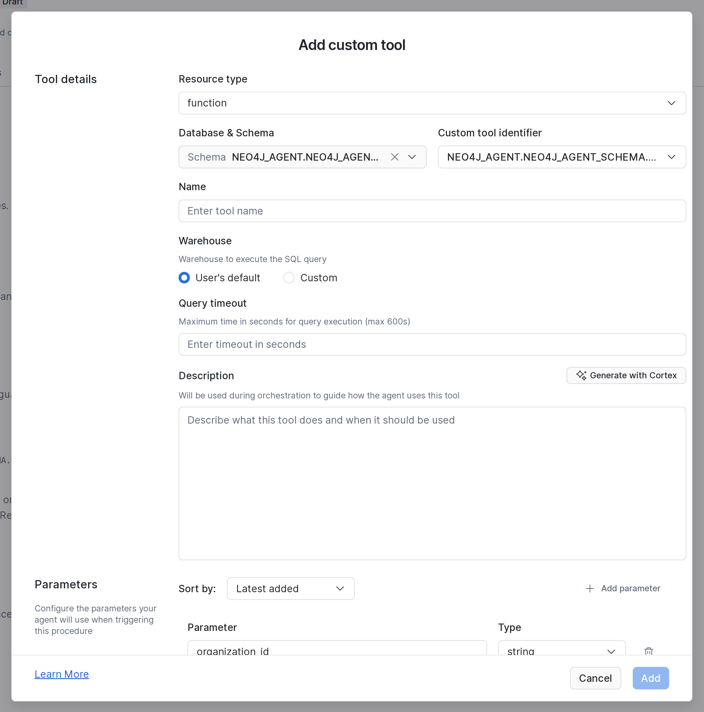
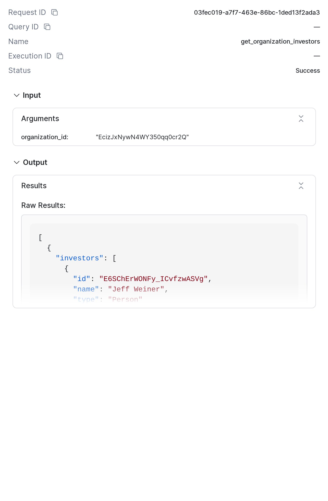

# Sample 2: Snowsight

This guide builds the [overview](../../README.md) stack by hand in Snowsight. The result is a Cortex agent that combines customer accounts in Snowflake with the Neo4j `companies` demo graph. [Sample 1](../1-terraform/README.md) creates the same stack with Terraform.

[](https://youtu.be/QWc3SBc5sUE)

## What you build

| Step | Object | What it is |
| --- | --- | --- |
| [1](#1-database-and-schema) | `NEO4J_AGENT`, `NEO4J_AGENT_SCHEMA` | The database and schema. All other objects live in them. |
| [2](#2-role) | `USER` | The role for people who chat with the agent. |
| [4](#4-secret) | `NEO4J_CREDENTIALS` | A secret that holds the Neo4j login. |
| [5](#5-network-rule) | `NEO4J_ACCESS_RULE` | A network rule that allows traffic to Neo4j. |
| [6](#6-external-access-integration) | `NEO4J_ACCESS_INTEGRATION` | An account-level integration. It gives UDFs the network rule and the secret. |
| [7](#7-model-stage) | `MODEL_STAGE` | A stage with the `all-MiniLM-L6-v2` model files. |
| [8](#8-python-udfs) | `QUERY_NEO4J`, `GENERATE_EMBEDDINGS` | Python UDFs. One runs read-only Cypher, the other turns text into a vector. |
| [9](#9-tool-functions) | `FIND_ORGANIZATIONS`, `GET_ORGANIZATION_INVESTORS`, `ANALYZE_RELATIONSHIPS`, `SEARCH_NEWS_ARTICLES` | SQL functions. They are the agent's fixed Neo4j tools. |
| [9](#customer-accounts) | `CUSTOMER_ACCOUNTS`, `CUSTOMER_ACCOUNTS_SV` | A view with sample CRM data, and a semantic view on it. The agent's Snowflake tool reads them. |
| [10](#10-agent) | `NEO4J_RESEARCH_AGENT` | The Cortex agent. |

## Before you start

- You need a Snowflake account with the `ACCOUNTADMIN` role and a warehouse. X-Small is enough.
- The guide uses the public Neo4j demo database `neo4j+s://demo.neo4jlabs.com:7687`. Its login is `companies`/`companies`.
- Download the model files into `./minilm`:

  ```bash
  pip install sentence-transformers
  python3 -c "from sentence_transformers import SentenceTransformer; SentenceTransformer('all-MiniLM-L6-v2').save('./minilm')"
  ```

- Create a workspace SQL file for the SQL statements: **Projects > Workspaces > + Add new > SQL file**. Select your warehouse in it.

Each UI step also shows the SQL that does the same. Use one or the other.

## 1. Database and schema

1. Go to **Catalog > Databases**, click **+ Database**, enter `NEO4J_AGENT` and click **Create**.
2. Open `NEO4J_AGENT`, click **+ Schema**, enter `NEO4J_AGENT_SCHEMA` and click **Create**.

Or use SQL:

```sql
CREATE DATABASE IF NOT EXISTS NEO4J_AGENT;
CREATE SCHEMA IF NOT EXISTS NEO4J_AGENT.NEO4J_AGENT_SCHEMA;
```

## 2. Role

People who chat with the agent get their own role, so they don't need `ACCOUNTADMIN`.

1. Go to **Governance & security > Users & roles**, open the **Roles** tab, click **+ Role**, enter `USER` and click **Create Role**.
2. Click the `USER` row, click **Grant to User**, pick your user and click **Grant**.
3. Reload Snowsight. Role pickers show `USER` only after a reload.

Or use SQL:

```sql
CREATE ROLE IF NOT EXISTS "USER";
GRANT ROLE "USER" TO USER <your_user>;  -- SELECT CURRENT_USER();
```

## 3. Grants

1. Go to **Catalog > Databases > NEO4J_AGENT** and open the **Access** tab. Click **+ Privilege**, pick role `USER` and privilege `USAGE`, and click **Grant privileges**.
2. On the **Overview** tab, open `NEO4J_AGENT_SCHEMA` and its **Access** tab. Click **+ Privilege**, pick role `USER` and the privileges `USAGE` and `USAGE - FUTURE FUNCTION`, and click **Grant privileges**. Type in the list to filter it.
3. Grant `USAGE` on your warehouse as well, because the agent's tools run on the user's default warehouse. Use the warehouse's privileges page or the SQL below.



The future grant covers every function that you create in the schema later. That includes `QUERY_NEO4J`, which the agent calls directly, and the helper `GENERATE_EMBEDDINGS`. The Terraform sample grants only the functions that the agent calls.

Or use SQL:

```sql
GRANT USAGE ON DATABASE NEO4J_AGENT TO ROLE "USER";
GRANT USAGE ON SCHEMA NEO4J_AGENT.NEO4J_AGENT_SCHEMA TO ROLE "USER";
GRANT USAGE ON FUTURE FUNCTIONS IN SCHEMA NEO4J_AGENT.NEO4J_AGENT_SCHEMA TO ROLE "USER";
GRANT USAGE ON WAREHOUSE <warehouse> TO ROLE "USER";
```

Check the result:

```sql
SHOW GRANTS TO ROLE "USER";
SHOW FUTURE GRANTS IN SCHEMA NEO4J_AGENT.NEO4J_AGENT_SCHEMA;
```

## 4. Secret

This step is SQL only, because Snowsight has no dialog for secrets. `companies`/`companies` is the public login of the demo database.

<!-- code: SECRET_SQL -->
```sql
CREATE OR REPLACE SECRET NEO4J_AGENT.NEO4J_AGENT_SCHEMA.NEO4J_CREDENTIALS
  TYPE     = PASSWORD
  USERNAME = 'companies'
  PASSWORD = 'companies';
```
<!-- /code -->

## 5. Network rule

Snowflake blocks outbound traffic by default. The network rule allows one host and port.

1. Go to **Governance & security > Network policies**, open the **Network Rules** tab and click **+ Network Rule**.
2. Enter the name `NEO4J_ACCESS_RULE`, pick the location `NEO4J_AGENT.NEO4J_AGENT_SCHEMA`, the type **Host port** and the mode **Egress**. Egress is the default.
3. Enter `demo.neo4jlabs.com:7687` under **Host:port** and click **+**. The host must then appear in the list below.
4. Click **Create**.



Or use SQL:

```sql
CREATE NETWORK RULE NEO4J_AGENT.NEO4J_AGENT_SCHEMA.NEO4J_ACCESS_RULE
  MODE = EGRESS
  TYPE = HOST_PORT
  VALUE_LIST = ('demo.neo4jlabs.com:7687');
```

To use your own Neo4j, change the host here. Also change the URI and the database name in [`QUERY_NEO4J`](#8-python-udfs).

## 6. External access integration

This step is SQL only. The integration combines the network rule and the secret. A UDF can reach only the hosts and secrets that its integration allows. The integration is an account-level object, so you need `ACCOUNTADMIN` or the `CREATE INTEGRATION` privilege.

<!-- code: INTEGRATION_SQL -->
```sql
CREATE OR REPLACE EXTERNAL ACCESS INTEGRATION NEO4J_ACCESS_INTEGRATION
  ALLOWED_NETWORK_RULES          = (NEO4J_AGENT.NEO4J_AGENT_SCHEMA.NEO4J_ACCESS_RULE)
  ALLOWED_AUTHENTICATION_SECRETS = (NEO4J_AGENT.NEO4J_AGENT_SCHEMA.NEO4J_CREDENTIALS)
  ENABLED                        = TRUE;
```
<!-- /code -->

## 7. Model stage

The article chunks in the graph have `embedding_sbert` vectors with 384 dimensions. They were made with `all-MiniLM-L6-v2`. To search them, Snowflake must embed the search text with the same model.

1. Go to **Catalog > Databases > NEO4J_AGENT > NEO4J_AGENT_SCHEMA** and click **Create > Stage > Snowflake Managed**.
2. Enter the name `MODEL_STAGE`, switch on **Directory table** and pick **Client-side encryption**. You can't change the encryption later, and **Create** stays disabled until you pick one. Click **Create**.
3. Click **Upload Files**, add the files directly in `minilm/`, enter the path `minilm` and click **Upload**. The files are about 90 MB.
4. Upload `minilm/1_Pooling/config.json` the same way, with the path `minilm/1_Pooling`. The dialog takes one folder per upload. You can skip `2_Normalize/`, because it is empty.





Or use SQL. The upload uses the [Snowflake CLI](https://docs.snowflake.com/en/developer-guide/snowflake-cli/installation/installation); run it in the folder that contains `minilm/`:

```sql
CREATE STAGE NEO4J_AGENT.NEO4J_AGENT_SCHEMA.MODEL_STAGE
  ENCRYPTION = (TYPE = 'SNOWFLAKE_FULL')
  DIRECTORY = (ENABLE = TRUE);
```

```bash
snow stage copy minilm @NEO4J_AGENT.NEO4J_AGENT_SCHEMA.MODEL_STAGE/minilm --recursive --overwrite --no-auto-compress
```

Upload the files uncompressed. Snowflake can't load gzipped model files.

Check that the list includes `minilm/model.safetensors` and `minilm/1_Pooling/config.json`:

```sql
LIST @NEO4J_AGENT.NEO4J_AGENT_SCHEMA.MODEL_STAGE/minilm;
```

## 8. Python UDFs

Run both statements in the workspace. Each one builds its package environment, which takes about a minute.

`QUERY_NEO4J(cypher[, params])` runs read-only Cypher against Neo4j. It returns the records as a `VARIANT`.

<!-- code: QUERY_NEO4J_SQL -->
```sql
CREATE OR REPLACE FUNCTION NEO4J_AGENT.NEO4J_AGENT_SCHEMA.QUERY_NEO4J(CYPHER VARCHAR, PARAMS OBJECT DEFAULT {})
RETURNS VARIANT
LANGUAGE PYTHON
RUNTIME_VERSION = 3.13
PACKAGES = ('neo4j', 'sentence-transformers')
IMPORTS  = ('@NEO4J_AGENT.NEO4J_AGENT_SCHEMA.MODEL_STAGE/minilm/')
EXTERNAL_ACCESS_INTEGRATIONS = (NEO4J_ACCESS_INTEGRATION)
SECRETS = ('cred' = NEO4J_AGENT.NEO4J_AGENT_SCHEMA.NEO4J_CREDENTIALS)
HANDLER = 'query_neo4j'
COMMENT = 'Executes a read-only Cypher query against the Neo4j database'
AS $$
from neo4j import GraphDatabase, RoutingControl
import math
import re
import socket
import _snowflake

# Snowflake reuses the UDF's process across calls, so all calls share one driver.
# The connection closes when the process ends.
_driver = None

# EXPLAIN reports these calls as reads, but they reach beyond the graph:
# files, URLs, dynamic Cypher and DBMS internals.
DENIED = re.compile(
    r"\bLOAD\s+CSV\b|\bapoc\.(load|import|export|cypher|periodic|trigger|systemdb)\b|\bdbms\.",
    re.IGNORECASE,
)


def get_driver():
    global _driver
    if _driver is None:
        credentials = _snowflake.get_username_password('cred')
        _driver = GraphDatabase.driver(
            "neo4j+s://demo.neo4jlabs.com:7687",
            auth=(credentials.username, credentials.password)
        )
    return _driver


def execute(cypher, params):
    # In READ access mode, the server rejects any write.
    return get_driver().execute_query(
        cypher,
        parameters_=params,
        database_="companies",
        routing_=RoutingControl.READ
    )


def query_neo4j(cypher, params):
    from neo4j.time import DateTime, Date, Time, Duration

    def serialize_neo4j(obj):
        if isinstance(obj, (DateTime, Date, Time, Duration)):
            return obj.iso_format()
        if isinstance(obj, float) and math.isnan(obj):
            return None  # NaN is not valid JSON. Some Article.sentiment values are NaN.
        if isinstance(obj, list):
            return [serialize_neo4j(i) for i in obj]
        if isinstance(obj, dict):
            return {k: serialize_neo4j(v) for k, v in obj.items()}
        return obj

    # Errors are returned, not raised, so the agent can read them and fix its query.
    if DENIED.search(cypher):
        return {"error": "Rejected: LOAD CSV, dbms.* and apoc.load/import/export/cypher/periodic/trigger/systemdb are not allowed."}
    try:
        _, plan, _ = execute("EXPLAIN " + cypher, params)
        if plan.query_type != "r":
            return {"error": f"Rejected: only read-only queries are allowed, this one is of type '{plan.query_type}'."}
        records, summary, keys = execute(cypher, params)
        return [serialize_neo4j(record.data()) for record in records] if records else []
    except (socket.gaierror, ValueError) as e:
        return {"error": f"Could not resolve Neo4j address: {str(e)}"}
    except Exception as e:
        return {"error": f"Neo4j query failed: {str(e)}"}
$$;
```
<!-- /code -->

- Without `EXTERNAL_ACCESS_INTEGRATIONS`, Snowflake blocks every outbound connection.
- `SECRETS = ('cred' = ...)` gives the code the secret. The code reads the login with `get_username_password('cred')`, so the login never appears in the source.
- `IMPORTS` points to the model stage. Only `GENERATE_EMBEDDINGS` needs it, but identical settings let both UDFs share one Python runtime.
- To use your own Neo4j, change `neo4j+s://demo.neo4jlabs.com:7687` and `database_="companies"`. The code creates the driver once per Python process.
- `PARAMS` is optional (`DEFAULT {}`). The agent's `query_neo4j` tool passes only the Cypher, because custom tools can't pass `OBJECT` arguments.
- `DENIED`, `EXPLAIN` and `routing_=RoutingControl.READ` make sure that every query is a read. See [Free-form Cypher](../../README.md#free-form-cypher). A rejected query returns `{"error": ...}`.

`GENERATE_EMBEDDINGS(input_text)` loads the model from the stage. It returns a vector with 384 numbers.

<!-- code: GENERATE_EMBEDDINGS_SQL -->
```sql
CREATE OR REPLACE FUNCTION NEO4J_AGENT.NEO4J_AGENT_SCHEMA.GENERATE_EMBEDDINGS(INPUT_TEXT VARCHAR)
RETURNS VARIANT
LANGUAGE PYTHON
RUNTIME_VERSION = 3.13
PACKAGES = ('neo4j', 'sentence-transformers')
IMPORTS  = ('@NEO4J_AGENT.NEO4J_AGENT_SCHEMA.MODEL_STAGE/minilm/')
EXTERNAL_ACCESS_INTEGRATIONS = (NEO4J_ACCESS_INTEGRATION)
SECRETS = ('cred' = NEO4J_AGENT.NEO4J_AGENT_SCHEMA.NEO4J_CREDENTIALS)
HANDLER = 'generate_embeddings'
COMMENT = 'Embedding function using sentence transformers'
AS $$
import os
import sys

# Snowflake reuses the UDF's process across calls, so the model loads only once.
_model = None


def get_model():
    global _model
    if _model is None:
        from sentence_transformers import SentenceTransformer
        # noinspection PyTypeChecker
        import_dir: str = sys._xoptions.get('snowflake_import_directory')
        model_path = os.path.join(import_dir, 'minilm/')
        _model = SentenceTransformer(model_path)
    return _model


def generate_embeddings(input_text: str) -> list:
    model = get_model()
    embedding = model.encode(input_text)
    return embedding.tolist()
$$;
```
<!-- /code -->

- `snowflake_import_directory` is where `IMPORTS` puts the stage files. The model loads from its `minilm/` folder once per process.
- Snowflake passes arguments to the handler by position. So `INPUT_TEXT` arrives as `input_text`, and `CYPHER` and `PARAMS` arrive as `cypher` and `params`.

Check the result:

```sql
SELECT NEO4J_AGENT.NEO4J_AGENT_SCHEMA.QUERY_NEO4J('RETURN 1 AS ok');  -- [{"ok": 1}]
SELECT ARRAY_SIZE(NEO4J_AGENT.NEO4J_AGENT_SCHEMA.GENERATE_EMBEDDINGS('graph databases'));  -- 384
```

## 9. Tool functions

Each of these functions runs one fixed Cypher query. The agent can only fill in the parameters, so it can ask only what you planned for. This keeps answers predictable. For all other questions, the agent gets `QUERY_NEO4J` itself as a tool in step 11.

The functions identify organizations by `Organization.id`. Names are not unique in the graph: there are 8 `Red Hat` nodes, and only one has investors. The `id` also has a unique index. The functions take an `organization_id` and return IDs with the names, so the agent can pass the IDs on.

`FIND_ORGANIZATIONS(name)` finds organizations whose name contains `name`. It returns their IDs, most connected first. The agent uses it for companies named in a question.

<!-- code: FIND_ORGANIZATIONS_SQL -->
```sql
CREATE OR REPLACE FUNCTION NEO4J_AGENT.NEO4J_AGENT_SCHEMA.FIND_ORGANIZATIONS(NAME VARCHAR)
RETURNS VARIANT
COMMENT = 'Finds organizations by name; returns their ids'
AS $$
NEO4J_AGENT.NEO4J_AGENT_SCHEMA.QUERY_NEO4J(
    'MATCH (o:Organization)
     WHERE toLower(o.name) CONTAINS toLower($name)
     RETURN o.id as organization_id,
            o.name as name,
            left(o.summary, 120) as summary,
            count{(o)--()} as relationships
     ORDER BY relationships DESC
     LIMIT 10',
    {'name': NAME}
)
$$;
```
<!-- /code -->

`GET_ORGANIZATION_INVESTORS(organization_id)` returns an organization's investors. Investors can be people or organizations. The query follows one `HAS_INVESTOR` relationship.

<!-- code: GET_ORGANIZATION_INVESTORS_SQL -->
```sql
CREATE OR REPLACE FUNCTION NEO4J_AGENT.NEO4J_AGENT_SCHEMA.GET_ORGANIZATION_INVESTORS(ORGANIZATION_ID VARCHAR)
RETURNS VARIANT
COMMENT = 'Returns investors for a given organization'
AS $$
NEO4J_AGENT.NEO4J_AGENT_SCHEMA.QUERY_NEO4J(
    'MATCH (o:Organization {id: $organization_id})
     RETURN o.id as organization_id,
            o.name as name,
            [(o)-[:HAS_INVESTOR]->(i) | i {.id, .name, type: labels(i)[0]}] as investors',
    {'organization_id': ORGANIZATION_ID}
)
$$;
```
<!-- /code -->

`ANALYZE_RELATIONSHIPS(organization_id, limit, max_depth)` returns the organizations within `max_depth` hops. For each one, it returns the chain of relationships and the distance.

<!-- code: ANALYZE_RELATIONSHIPS_SQL -->
```sql
CREATE OR REPLACE FUNCTION NEO4J_AGENT.NEO4J_AGENT_SCHEMA.ANALYZE_RELATIONSHIPS(ORGANIZATION_ID VARCHAR, "LIMIT" NUMBER DEFAULT 20, MAX_DEPTH INT DEFAULT 2)
RETURNS VARIANT
COMMENT = 'Analyzes relationship paths between organizations'
AS $$
NEO4J_AGENT.NEO4J_AGENT_SCHEMA.QUERY_NEO4J(
    CONCAT('MATCH path = (o1:Organization {id: $organization_id})-[]-{1,', MAX_DEPTH, '}(o2:Organization)
    WHERE o1 <> o2
    RETURN DISTINCT o2.id as organization_id,
           o2.name as organization,
           [r in relationships(path) | type(r)] as relationships,
           length(path) as distance
    ORDER BY distance
    LIMIT $limit'),
    {'organization_id': ORGANIZATION_ID, 'limit': "LIMIT"}
)
$$;
```
<!-- /code -->

- `-[]-{1,n}` is a quantified path pattern. It follows any relationship in either direction, up to `MAX_DEPTH` hops. `CONCAT` writes the limit into the query, because Cypher takes no parameter there.
- `LIMIT` is a reserved word, so the function quotes it everywhere. The agent still calls the parameter `limit`.

`SEARCH_NEWS_ARTICLES(organization_id, topic, limit)` returns the organization's news chunks, ranked by how similar they are to `topic`.

<!-- code: SEARCH_NEWS_ARTICLES_SQL -->
```sql
CREATE OR REPLACE FUNCTION NEO4J_AGENT.NEO4J_AGENT_SCHEMA.SEARCH_NEWS_ARTICLES(ORGANIZATION_ID VARCHAR, TOPIC VARCHAR, "LIMIT" NUMBER DEFAULT 20)
RETURNS VARIANT
COMMENT = 'Finds news about an organization that has content about the given topic'
AS $$
NEO4J_AGENT.NEO4J_AGENT_SCHEMA.QUERY_NEO4J('
    MATCH (o:Organization {id: $organization_id})<-[:MENTIONS]-(a:Article)-[:HAS_CHUNK]->(c:Chunk)
    WHERE c.embedding_sbert IS NOT NULL
    WITH DISTINCT a, c, vector.similarity.cosine(c.embedding_sbert, $embedding) AS score
    RETURN a.title as title,
           a.date as date,
           c.text as text,
           score
    ORDER BY score DESC
    LIMIT $limit',
    {
      'organization_id': ORGANIZATION_ID,
      'limit': "LIMIT",
      'embedding': NEO4J_AGENT.NEO4J_AGENT_SCHEMA.GENERATE_EMBEDDINGS(TOPIC)
    })
$$;
```
<!-- /code -->

- `GENERATE_EMBEDDINGS(TOPIC)` turns the topic into a vector, which the query gets as `$embedding`.
- The graph limits the search to chunks of articles that mention the organization. `vector.similarity.cosine` ranks these chunks against the topic's vector.

Test the chain from Snowflake to Neo4j:

<!-- code: SMOKE_TEST_SQL -->
```sql
SELECT NEO4J_AGENT.NEO4J_AGENT_SCHEMA.FIND_ORGANIZATIONS('Neo4j') AS organizations;
```
<!-- /code -->

```sql
SELECT NEO4J_AGENT.NEO4J_AGENT_SCHEMA.GET_ORGANIZATION_INVESTORS('Ee3Wn9kzHNf2TmXB0gpqx-w');
-- [{"investors": [{"id": ..., "name": "Rod Johnson", "type": "Person"}], "name": "Neo4j", "organization_id": "Ee3Wn9kzHNf2TmXB0gpqx-w"}]
SELECT NEO4J_AGENT.NEO4J_AGENT_SCHEMA.ANALYZE_RELATIONSHIPS('Ee3Wn9kzHNf2TmXB0gpqx-w', 5, 2);
-- [{"distance": 1, "organization": "Microsoft Corporation", "organization_id": ..., "relationships": ["HAS_SUPPLIER"]}, ...]
SELECT NEO4J_AGENT.NEO4J_AGENT_SCHEMA.SEARCH_NEWS_ARTICLES('Ee3Wn9kzHNf2TmXB0gpqx-w', 'funding', 2);
-- [{"date": ..., "score": 0.61, "text": ..., "title": ...}, ...]
SELECT NEO4J_AGENT.NEO4J_AGENT_SCHEMA.QUERY_NEO4J('CREATE (x:Test)');
-- {"error": "Rejected: only read-only queries are allowed, this one is of type 'w'."}
```

### Customer accounts

The sample CRM data is a view over `VALUES`. `ORGANIZATION_ID` is the company's `Organization.id` in the graph, and the agent joins on it. `ACCOUNT_NAME` is for display only.

<!-- code: CUSTOMER_ACCOUNTS_SQL -->
```sql
CREATE OR REPLACE VIEW NEO4J_AGENT.NEO4J_AGENT_SCHEMA.CUSTOMER_ACCOUNTS
COMMENT = 'Sample CRM accounts; ORGANIZATION_ID is Organization.id in Neo4j'
AS
SELECT column1 AS ACCOUNT_ID,
       column2 AS ORGANIZATION_ID,
       column3 AS ACCOUNT_NAME,
       column4 AS SEGMENT,
       column5 AS ARR_USD,
       DATEADD(day, column6, CURRENT_DATE()) AS RENEWAL_DATE,
       column7 AS HEALTH
FROM VALUES
    ('ACC-1001', 'Es6d5vh20OoKzKwm8upOW-Q', 'Uniphore',      'Mid-market',  180000,  25, 'Green'),
    ('ACC-1002', 'EIv355L_XOrKU8mD10lyyeQ', 'Slack',         'Enterprise', 1200000,  40, 'Amber'),
    ('ACC-1003', 'E_j7i1alEOA6VKxhkV_yn5Q', 'Docker',        'Enterprise',  650000,  75, 'Green'),
    ('ACC-1004', 'EcizJxNywN4WY350qq0cr2Q', 'Cloudera',      'Enterprise',  420000,  20, 'Red'),
    ('ACC-1005', 'EoS12ey09M1SH2H43ucoMpQ', 'Okta',          'Enterprise',  900000, 150, 'Green'),
    ('ACC-1006', 'EIATbb7uwOhSYiGqLBPUD0w', 'Red Hat',       'Enterprise', 1500000,  60, 'Amber'),
    ('ACC-1007', 'EUSMLFV8NNIe22mVSEhJzCw', 'VMware',        'Enterprise', 2100000, 200, 'Red'),
    ('ACC-1008', 'EHyKUS1G-OwiHlrdVGmiUFA', 'Workday, Inc.', 'Enterprise',  780000,  85, 'Green');
```
<!-- /code -->

- `DATEADD(..., CURRENT_DATE())` keeps the renewal dates in the future.

A semantic view describes the data for Cortex Analyst. Analyst turns the agent's questions into SQL, so you don't need a function per table. Semantic views are Snowflake's recommended way to give agents structured data. The alternative is one custom tool per query, like the Neo4j functions above.

<!-- code: CUSTOMER_ACCOUNTS_SV_SQL -->
```sql
CREATE OR REPLACE SEMANTIC VIEW NEO4J_AGENT.NEO4J_AGENT_SCHEMA.CUSTOMER_ACCOUNTS_SV
  TABLES (
    accounts AS NEO4J_AGENT.NEO4J_AGENT_SCHEMA.CUSTOMER_ACCOUNTS
      PRIMARY KEY (ACCOUNT_ID)
      COMMENT = 'Our customer accounts'
  )
  FACTS (
    accounts.arr_usd AS ARR_USD COMMENT = 'Annual recurring revenue in USD'
  )
  DIMENSIONS (
    accounts.account_id AS ACCOUNT_ID COMMENT = 'Account ID in the CRM',
    accounts.organization_id AS ORGANIZATION_ID COMMENT = 'The company''s organization ID',
    accounts.account_name AS ACCOUNT_NAME COMMENT = 'Company name',
    accounts.segment AS SEGMENT,
    accounts.renewal_date AS RENEWAL_DATE COMMENT = 'Next contract renewal',
    accounts.health AS HEALTH COMMENT = 'Account health: Green, Amber or Red'
  )
  METRICS (
    accounts.total_arr AS SUM(accounts.arr_usd) COMMENT = 'Total annual recurring revenue in USD'
  )
  COMMENT = 'Customer accounts for Cortex Analyst';

GRANT SELECT ON SEMANTIC VIEW NEO4J_AGENT.NEO4J_AGENT_SCHEMA.CUSTOMER_ACCOUNTS_SV TO ROLE "USER";
```
<!-- /code -->

- The comments tell Analyst what each column means. The semantic view says nothing about Neo4j. The agent's tool description in step 11 explains how the IDs map to the graph.
- The `USER` role needs `SELECT` on the semantic view only. It needs no grant on the view underneath.

Check the result:

```sql
SELECT * FROM SEMANTIC_VIEW(NEO4J_AGENT.NEO4J_AGENT_SCHEMA.CUSTOMER_ACCOUNTS_SV
  DIMENSIONS ACCOUNTS.ACCOUNT_NAME, ACCOUNTS.ORGANIZATION_ID, ACCOUNTS.HEALTH);
-- ACCOUNT_NAME | ORGANIZATION_ID         | HEALTH
-- Uniphore     | Es6d5vh20OoKzKwm8upOW-Q | Green ...
```

## 10. Agent

1. Go to **AI & ML > Agents** and click **Create agent**.
2. Pick the database and schema `NEO4J_AGENT.NEO4J_AGENT_SCHEMA`. Enter the object name `NEO4J_RESEARCH_AGENT`, which becomes part of the REST URL, and the display name `Neo4j research agent`. Click **Create agent**.
3. Go to **Configuration > Instructions** and leave **Model** on `auto`. The model picks the tools and their arguments, and it writes the answer.
4. Enter these **Orchestration instructions**. They tell the agent how the two sources join:

<!-- code: instructions:orchestration -->
```text
Customer accounts are in Snowflake (customer_accounts). Company knowledge is in Neo4j (all other tools).
Join them on ORGANIZATION_ID, which is Organization.id in the graph. Never join on names, because names are not unique.
For a company that is not an account, get its organization_id from find_organizations.
Prefer the dedicated Neo4j tools. Use query_neo4j only when none of them fits the question.
Answer in the chat only. Never write files or create skills.
```
<!-- /code -->

Creating the agent commits `VERSION$1`, which has no tools. The steps below edit the live version. Snowsight marks it as **Draft** until you publish it in step 12.

## 11. Tools

The agent picks a tool by its description alone, so enter the texts below exactly. All tools are on **Configuration > Tools**. Click **Save** after you have added all six.

Switch off the **Code Execution tool**. New agents have it on by default, but this agent needs only its own tools. With it on, the agent can write files to your workspace without being asked.

### `customer_accounts` (Cortex Analyst)

1. Under **Query structured data**, click **Add semantic view > Add semantic view**.
2. Pick the database `NEO4J_AGENT.NEO4J_AGENT_SCHEMA` and the semantic view `CUSTOMER_ACCOUNTS_SV`.
3. Enter the name `customer_accounts` and the description below. Leave **Warehouse** on **User's default** and set **Query timeout** to `60`.
4. Click **Add**.

<!-- code: tool:customer_accounts -->
```text
Our customer accounts in Snowflake: account ID, organization ID, name, segment, annual recurring revenue,
renewal date and account health (Green, Amber, Red).
ORGANIZATION_ID is Organization.id in the Neo4j graph: select it and pass it to the Neo4j tools.
ACCOUNT_NAME is for display only.

USAGE SCENARIOS:
- Questions about our customers, renewals, revenue or account health
- The organization IDs to pass to the Neo4j tools
```
<!-- /code -->

### Custom tools

Add each custom tool with **Custom tools > + Add**:

1. Set **Resource type** to `function`. The default is procedure.
2. Pick `NEO4J_AGENT.NEO4J_AGENT_SCHEMA` under **Database & Schema**, then pick the **Custom tool identifier**. Snowsight adds one parameter row per argument.
3. Enter the **Name** and **Description** from the tool's section below. Leave **Warehouse** on **User's default** and set **Query timeout** to `60`.
4. Enter a description for each parameter. Untick **Required** where the section says so; the SQL defaults then apply.
5. Click **Add**.



#### `find_organizations` (identifier `FIND_ORGANIZATIONS`)

<!-- code: tool:find_organizations -->
```text
Finds organizations in the Neo4j graph by name (case-insensitive, partial match) and returns their
organization_id, name, a short summary and their number of relationships, most connected first.
Names are not unique: pick by summary and relationships.

USAGE SCENARIOS:
- Getting the organization_id of a company named in the question, for the other Neo4j tools
```
<!-- /code -->

<!-- text: params:find_organizations -->
- `name`: The company name, or part of it
<!-- /text -->

#### `get_organization_investors` (identifier `GET_ORGANIZATION_INVESTORS`)

<!-- code: tool:get_organization_investors -->
```text
Returns an organization's investors from the Neo4j graph: people and organizations, each with id, name and type.

USAGE SCENARIOS:
- Retrieving investor information for company profile pages or reports
- Performing due diligence research on company ownership and investment relationships
```
<!-- /code -->

<!-- text: params:get_organization_investors -->
- `organization_id`: Organization.id in the graph
<!-- /text -->

#### `analyze_relationships` (identifier `ANALYZE_RELATIONSHIPS`)

<!-- code: tool:analyze_relationships -->
```text
Analyzes relationship paths from an organization in the Neo4j graph.
Returns related organizations with their organization_id, relationship types and path distance.

USAGE SCENARIOS:
- Mapping organizational networks
- Exploring indirect connections between companies
- Supporting due diligence and risk analysis
```
<!-- /code -->

<!-- text: params:analyze_relationships -->
- `organization_id`: Organization.id in the graph
- `limit`: Maximum number of results to return (untick **Required**)
- `max_depth`: Maximum path length to search (untick **Required**)
<!-- /text -->

#### `search_news_articles` (identifier `SEARCH_NEWS_ARTICLES`)

<!-- code: tool:search_news_articles -->
```text
Finds news articles about an organization that are relevant to a topic, using semantic search over article content.

USAGE SCENARIOS:
- Retrieving news coverage for a company filtered by topic
- Supporting research and media monitoring workflows
```
<!-- /code -->

<!-- text: params:search_news_articles -->
- `organization_id`: Organization.id in the graph
- `topic`: What the articles should be about, in plain words
- `limit`: Maximum number of articles to return (untick **Required**)
<!-- /text -->

#### `query_neo4j` (identifier `QUERY_NEO4J`)

> [!WARNING]
> **The LLM writes the Cypher for this tool.** Read [Free-form Cypher](../../README.md#free-form-cypher) before you add it. Skip it to allow the fixed queries only.

Delete the pre-filled `params` row, because the tool passes only the Cypher.

<!-- code: tool:query_neo4j -->
```text
Runs a read-only Cypher query against the Neo4j companies graph and returns the records.
Write queries, LOAD CSV, dbms.* and most APOC procedures are rejected with an error: read it and fix the query.
Always add a LIMIT (at most 50) or aggregate.

GRAPH SCHEMA:
- (:Organization {id, name, summary, isPublic: boolean, nbrEmployees: integer, revenue: float, isDissolved: boolean})
- (:Person {id, name, summary}), (:IndustryCategory {name}), (:City {name}), (:Country {name})
- (:Article {title, date: DATE_TIME, author, siteName, sentiment: float, summary}), (:Chunk {text})
- (Organization)-[:HAS_INVESTOR]->(Person|Organization)
- (Organization)-[:HAS_CEO|HAS_BOARD_MEMBER]->(Person)
- (Organization)-[:HAS_COMPETITOR|HAS_SUBSIDIARY|HAS_SUPPLIER]->(Organization)
- (Organization)-[:HAS_CATEGORY]->(IndustryCategory)
- (Organization)-[:IN_CITY]->(City)-[:IN_COUNTRY]->(Country)
- (Article)-[:MENTIONS]->(Organization), (Article)-[:HAS_CHUNK]->(Chunk)
Properties without a type are strings; relationships have no properties.
Organization.id is unique and indexed: match organizations on id, and return ids with names.
Article.sentiment ranges from -1 (negative) to 1 (positive) and can be NaN.
Compare dates with datetime(), e.g. a.date >= datetime('2023-01-01').

USAGE SCENARIOS:
- Questions the other Neo4j tools don't cover, e.g. competitors, CEOs, board members, subsidiaries, locations
- Combining several graph lookups into one query, e.g. for a list of companies
```
<!-- /code -->

<!-- text: params:query_neo4j -->
- `cypher`: The read-only Cypher query; inline all values
<!-- /text -->

## 12. Publish

1. Click **Publish** and confirm. This commits the live version as `VERSION$2`. Apps and the REST API use the latest committed version. The clock icon at the top right lists all versions.
2. Let the `USER` role use the agent, on the agent's **Access** tab or in SQL:

```sql
GRANT USAGE ON AGENT NEO4J_AGENT.NEO4J_AGENT_SCHEMA.NEO4J_RESEARCH_AGENT TO ROLE "USER";
SHOW AGENTS IN SCHEMA NEO4J_AGENT.NEO4J_AGENT_SCHEMA;
```

## 13. Try it

### Snowflake and Neo4j combined

1. On the **Preview** tab, ask `Who are the investors of our accounts in Red health?` The answer takes about 20 seconds. It names the investors of **Cloudera** (Diane Greene, Jeff Weiner, ...) and **VMware** (Pivotal, JFROG, ...).
2. Hover over the icon under the answer until **Show Traces** appears, and click it. The spans show the join:
   - **SQL Execution** shows the SQL that Cortex Analyst wrote from the semantic view. Its result has the `ORGANIZATION_ID` of each Red account.
   - **Custom Tool** shows one `get_organization_investors` call per Red account. **Input > Arguments** has the `organization_id` from the Snowflake result. **Output > Results** has the record from Neo4j. **Open in fullscreen** shows the whole record.



Neither source can answer this alone. Account health is only in Snowflake, and investors are only in the graph.

More questions to try: `Who are the investors of Neo4j?`, `What organizations are connected to Neo4j through indirect relationships?` and `What recent news is there about our Amber accounts?` For Neo4j, the agent calls `find_organizations` first.

### Free-form Cypher

1. Ask `Which of our accounts renewing in the next 45 days compete with another of our accounts?` The answer names **Slack**, which competes with Workday, Inc., and **Cloudera**, which competes with Docker.
2. Open **Show Traces**. After the **SQL Execution** span for the renewals comes a **Custom Tool** span for `query_neo4j`. No fixed tool finds competitors, so the agent wrote its own Cypher from the schema in the tool description. **Arguments** shows it, for example:

   ```cypher
   MATCH (o:Organization)-[:HAS_COMPETITOR]-(c:Organization)
   WHERE o.id IN ['EcizJxNywN4WY350qq0cr2Q', 'Es6d5vh20OoKzKwm8upOW-Q', 'EIv355L_XOrKU8mD10lyyeQ']
   RETURN o.id AS renewing_id, o.name AS renewing_name, c.id AS competitor_id, c.name AS competitor_name
   ```

   The Cypher differs from run to run, but the answer should stay the same.

More free-form questions to try: `Who are the CEOs of our Red accounts?` and `Which of our accounts had the most negative news since 2023?`

To check the grants, switch to the `USER` role in the account menu (**Switch role**) and ask again.

## Troubleshooting

| Symptom | Cause and fix |
| --- | --- |
| `USER` missing from a role picker | The role list is cached. Reload Snowsight. |
| Function missing from **Custom tool identifier** | The object list is cached. Reload the page and open the dialog again. |
| `{"error": "Could not resolve Neo4j address: ..."}` | The network rule or the integration is wrong. The host must match the URI in `QUERY_NEO4J`. |
| `{"error": "Neo4j query failed: ..."}` with an auth message | The username or password in the secret is wrong. |
| `GENERATE_EMBEDDINGS` fails to load the model | Files are missing on the stage, or they were uploaded gzipped. |
| `{"error": "Rejected: ..."}` | `QUERY_NEO4J` refused a write or a denied call. The agent usually tries again with a fixed query. |
| `named arguments [CYPHER] do not match any signature` | `QUERY_NEO4J` was created with quoted lowercase argument names. |
| `query_neo4j` fails with `argument type object which is not supported` | The `params` row was not deleted from the tool. |

`QUERY_NEO4J` returns errors as `{"error": ...}` values. It does not raise SQL errors.

## Clean up

<!-- code: CLEANUP_SQL -->
```sql
DROP DATABASE IF EXISTS NEO4J_AGENT CASCADE;
DROP INTEGRATION IF EXISTS NEO4J_ACCESS_INTEGRATION;
DROP ROLE IF EXISTS "USER";
```
<!-- /code -->
