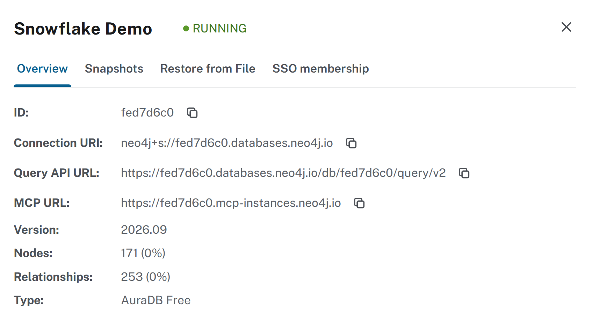
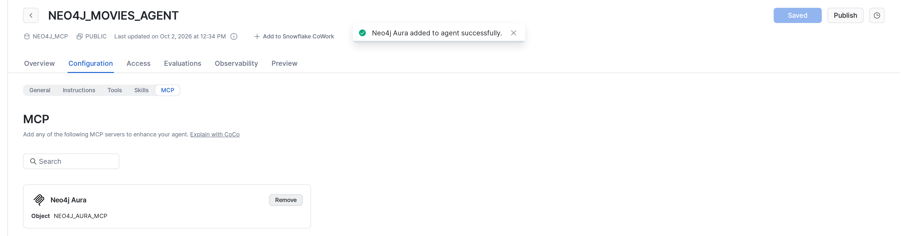
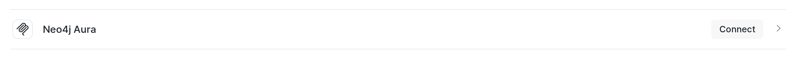
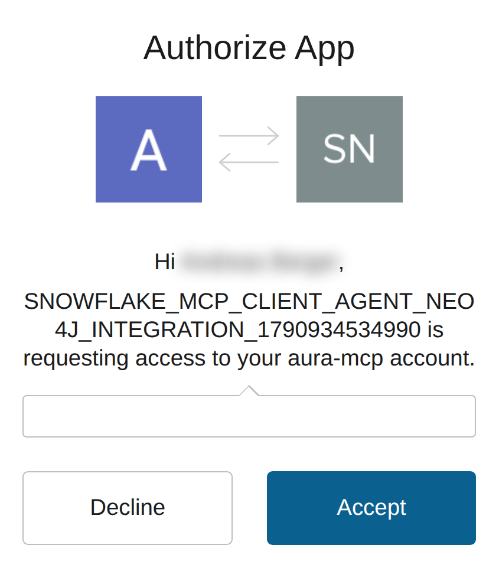
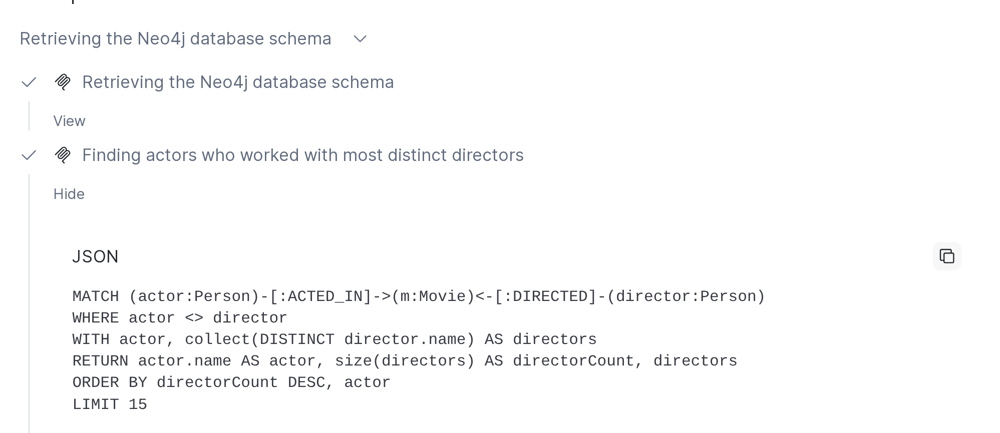

# Sample 3: Aura MCP

This guide connects a Cortex agent to the MCP server that Neo4j Aura runs for every instance. The agent uses the server's tools to read the graph schema and run its own Cypher. Unlike the [Terraform sample](../1-terraform/README.md) and the [Snowsight sample](../2-snowsight/README.md), it needs no UDFs, secrets or network rules.

You can also watch this guide step by step [on YouTube](https://youtu.be/y7-blfjETFw).

[](https://youtu.be/y7-blfjETFw)

## What you build

| Step | Object | What it is |
| --- | --- | --- |
| [1. MCP URL](#1-mcp-url) | MCP URL | The address of the MCP server of your Aura instance. |
| [2. Database](#2-database) | `NEO4J_MCP` | Holds the MCP server object and the agent. |
| [3. API integration](#3-api-integration) | `NEO4J_AURA_MCP_INTEGRATION` | Lets Snowflake call the Aura MCP server and sign users in with OAuth. |
| [4. MCP server](#4-mcp-server) | `NEO4J_MCP.PUBLIC.NEO4J_AURA_MCP` | The MCP server object that agents use. |
| [5. Agent](#5-agent) | `NEO4J_MOVIES_AGENT` | The Cortex agent with the MCP server attached. |

## Before you start

- You need a Snowflake account with the `ACCOUNTADMIN` role and a warehouse. X-Small is enough.
- You need a running [Aura instance](https://neo4j.com/docs/aura/getting-started/create-instance/). A free instance is enough. This guide uses the **Movies** sample dataset, which you can pick when you create the instance.
- MCP connectors support only OAuth. Every user who chats with the agent signs in with their own Aura account, so each user needs access to the Aura project.
- Create a workspace SQL file for the SQL statements: **Projects > Workspaces > + Add new > SQL file**. Select your warehouse in it.

## 1. MCP URL

1. Open the Aura console at [console.neo4j.io](https://console.neo4j.io).
2. Open the **...** menu of your instance and click **Inspect**.
3. Copy the **MCP URL** from the **Overview** tab. It has the form `https://<INSTANCE_ID>.mcp-instances.neo4j.io`. It is not the connection URI or the Query API URL.



## 2. Database

The next steps run in Snowsight at [app.snowflake.com](https://app.snowflake.com).

<!-- code: DATABASE_SQL -->
```sql
CREATE DATABASE NEO4J_MCP;
```
<!-- /code -->

## 3. API integration

Snowflake calls external MCP servers through an API integration. It defines which URLs Snowflake may call and how users sign in.

Replace `<INSTANCE_ID>` with your Aura instance ID:

<!-- code: INTEGRATION_SQL -->
```sql
CREATE API INTEGRATION NEO4J_AURA_MCP_INTEGRATION
  API_PROVIDER = external_mcp
  API_ALLOWED_PREFIXES = ('https://<INSTANCE_ID>.mcp-instances.neo4j.io')
  API_USER_AUTHENTICATION = (
    TYPE = OAUTH_DYNAMIC_CLIENT,
    OAUTH_RESOURCE_URL = 'https://<INSTANCE_ID>.mcp-instances.neo4j.io'
  )
  ENABLED = TRUE;
```
<!-- /code -->

| Setting | Effect |
| --- | --- |
| `API_PROVIDER = external_mcp` | Makes it an integration for MCP connectors. |
| `API_ALLOWED_PREFIXES` | Limits calls to URLs that start with the MCP URL. |
| `TYPE = OAUTH_DYNAMIC_CLIENT` | Snowflake registers itself with Aura's authorization server. You don't copy a client ID or secret. |
| `OAUTH_RESOURCE_URL` | Snowflake reads the OAuth metadata from this URL to find where users sign in. |

The integration stores no credentials.

## 4. MCP server

<!-- code: MCP_SERVER_SQL -->
```sql
CREATE EXTERNAL MCP SERVER NEO4J_MCP.PUBLIC.NEO4J_AURA_MCP
  WITH DISPLAY_NAME = 'Neo4j Aura'
  URL = 'https://<INSTANCE_ID>.mcp-instances.neo4j.io'
  API_INTEGRATION = NEO4J_AURA_MCP_INTEGRATION;
```
<!-- /code -->

Agent Studio and CoWork show the server under its display name.

## 5. Agent

1. Go to **AI & ML > Agent Studio** and click **Create agent**.
2. Pick `NEO4J_MCP` and `PUBLIC`. Enter `NEO4J_MOVIES_AGENT` as the object name and `Neo4j movies agent` as the display name. Click **Create agent**.
3. On the **Configuration** tab, open **MCP**. It lists every MCP server your role can use.
4. Click **Add to agent** on **Neo4j Aura**. This saves the draft.
5. Click **Publish**.



Or use SQL:

```sql
ALTER AGENT NEO4J_MCP.PUBLIC.NEO4J_MOVIES_AGENT ADD MCP_SERVER = 'NEO4J_MCP.PUBLIC.NEO4J_AURA_MCP';
```

Roles other than `ACCOUNTADMIN` need these grants to use the agent. Each user of such a role still connects the server once, see [6. Connect](#6-connect).

<!-- code: GRANT_SQL -->
```sql
GRANT USAGE ON DATABASE NEO4J_MCP TO ROLE <ROLE>;
GRANT USAGE ON SCHEMA NEO4J_MCP.PUBLIC TO ROLE <ROLE>;
GRANT USAGE ON WAREHOUSE <WAREHOUSE> TO ROLE <ROLE>;
GRANT USAGE ON AGENT NEO4J_MCP.PUBLIC.NEO4J_MOVIES_AGENT TO ROLE <ROLE>;
GRANT USAGE ON EXTERNAL MCP SERVER NEO4J_MCP.PUBLIC.NEO4J_AURA_MCP TO ROLE <ROLE>;
GRANT USAGE ON INTEGRATION NEO4J_AURA_MCP_INTEGRATION TO ROLE <ROLE>;
```
<!-- /code -->

## 6. Connect

Each user connects the MCP server once, in Snowflake CoWork at [ai.snowflake.com](https://ai.snowflake.com). Snowsight links to it under **AI & ML > Snowflake CoWork**.

1. Click **Capabilities** and open the **MCP Connectors** tab.
2. Click **Connect** on **Neo4j Aura**. Aura's sign-in opens in a popup.
3. Click **Continue with Neo4j Aura** and sign in with your Aura account.
4. The first time you connect, Aura asks whether Snowflake may access your account. Click **Accept**.





Snowflake stores the token for your user only. **Disconnect** removes it.

## 7. Try it

In CoWork at [ai.snowflake.com](https://ai.snowflake.com), click **New chat**, pick **Neo4j movies agent** and ask:

<!-- code: AGENT_QUESTION -->
```text
Which actors have worked with the most different directors?
```
<!-- /code -->

The answer names **Tom Hanks** with 10 different directors, followed by **Keanu Reeves** and **Jack Nicholson**.

1. Click the line under the agent's first sentence. It lists the MCP calls: `get-schema`, then `read-cypher`.
2. Click **View** on the `read-cypher` call. It shows the Cypher the agent wrote from the schema.

```cypher
MATCH (actor:Person)-[:ACTED_IN]->(m:Movie)<-[:DIRECTED]-(director:Person)
WHERE actor <> director
WITH actor, collect(DISTINCT director.name) AS directors
RETURN actor.name AS actor, size(directors) AS directorCount, directors
ORDER BY directorCount DESC, actor
LIMIT 10
```

The Cypher can differ from run to run, but the answer should stay the same.



## Troubleshooting

| Symptom | Cause and fix |
| --- | --- |
| The agent asks you to authenticate the connector | The server is not connected for your user. See [6. Connect](#6-connect). |
| `Insufficient privileges to operate on schema` on `CREATE EXTERNAL MCP SERVER` | Your role lacks `CREATE EXTERNAL MCP SERVER` on the schema, for example because another role owns it. Grant it, or use your own database as in [2. Database](#2-database). |
| The agent or the MCP server is missing for a role | The role lacks one of the grants. See [5. Agent](#5-agent). |

## Clean up

<!-- code: CLEANUP_SQL -->
```sql
DROP DATABASE IF EXISTS NEO4J_MCP CASCADE;
DROP INTEGRATION IF EXISTS NEO4J_AURA_MCP_INTEGRATION;
```
<!-- /code -->
