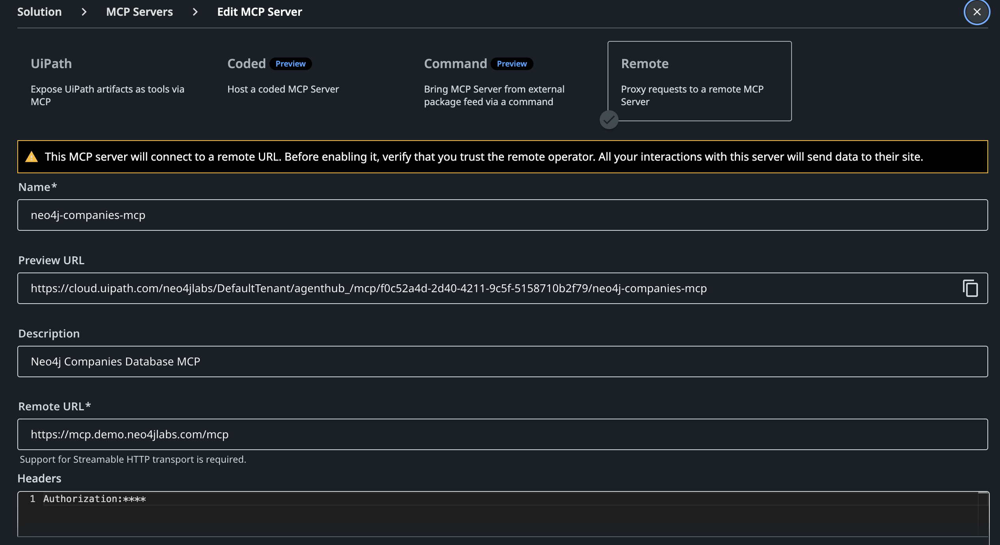

# UiPath AI Agent + Neo4j Integration

## Overview

**UiPath** is a leading enterprise automation platform that combines Robotic Process Automation (RPA) with AI. UiPath's **Agentic Automation** and **Autopilot** capabilities enable AI agents to execute complex business processes dynamically, orchestrating models to plan, execute, and adapt workflows. 

These agents leverage powerful underlying LLMs (such as **Anthropic Claude**, seamlessly integrated natively via the UiPath Integration Service or AI experiences) to reason, synthesize answers, and orchestrate Model Context Protocol (MCP) tool calls natively within automations.

**Key Features:**

- Enterprise-grade Robotic Process Automation (RPA)
- Integration Service with hundreds of pre-built connectors
- Native Agentic Automation capabilities (UiPath Autopilot) backed by powerful LLMs for planning and reasoning
- Native Model Context Protocol (MCP) server support through UiPath Orchestrator

**Official Resources:**

- Website: [uipath.com](https://www.uipath.com/)
- Documentation: [UiPath Documentation](https://docs.uipath.com/)
- MCP/Integration docs: [About MCP Servers in UiPath](https://docs.uipath.com/orchestrator/automation-cloud/latest/user-guide/about-mcp-servers)

## MCP Integration Integration

The UiPath Platform offers full native MCP support natively through UiPath Orchestrator, enabling you to bring external tools directly into your automation workflows and expose them to your AI Agents.

UiPath supports several MCP Server connection types:

- **Remote:** Connect to remote MCP Servers outside UiPath via secure tunneling. This is ideal for connecting to an externally hosted Neo4j MCP Server. **This is the preferred approach for integration**
- **Coded (Preview):** Host a custom-coded MCP Server within UiPath's package management. Given that UiPath's platform is built on.NET, all activities take the form of a Nuget package (this is the `.nupkg` file that feeds in UiPath Studio's package manager).
- **Command (Preview):** Bring an MCP Server from an external package feed (e.g., NPM or PyPI) and start it as an external process. You can use npx commands for Node.js projects or uvx for Python projects. 
Unfortunately, Neo4j MPC is build in golang
- **UiPath:** Expose UiPath artifacts as tools via MCP - which is not relevant for the integration discussed here.

### Connecting a Neo4j MCP Server (Remote Type)

The recommended approach to integrate Neo4j is by connecting a remote Neo4j MCP Server using the **Remote** connection type.

**Setup Instructions:**

1. **Host the Neo4j MCP Server:** 
   Deploy the official Neo4j MCP server (`neo4j-mcp`). Because UiPath connects over the network, you must run the server in **HTTP mode** instead of the default STDIO mode.   
   Example starting the server via Docker:

   ```bash
   docker run -p 8080:8080 -e NEO4J_TRANSPORT_MODE=http neo4j/mcp
   ```

   Or via binary:

   ```bash
   neo4j-mcp --neo4j-transport-mode http --neo4j-http-port 8080
   ```

   *Note: Ensure your server is accessible from UiPath Cloud (e.g., via a public IP, secure tunnel, or API Gateway).*
2. **Navigate to Orchestrator:** Go to your UiPath Automation Cloud and open the Orchestrator.
3. **Add MCP Server:** Navigate to the **MCP Servers** page and choose to add a new server.
4. **Configure Remote Connection:**
   - **Type:** Select `Remote`.
   - **Name:** e.g., "Neo4j MCP Server".
   - **Endpoint:** Provide the URL of your Neo4j MCP Server (e.g., `https://your-domain.com/mcp` or `https://your-domain.com/sse`).
   - **Authentication:** In HTTP mode, `neo4j-mcp` accepts credentials dynamically. Configure the HTTP headers to pass either Basic Auth or a Bearer Token corresponding to your Neo4j database credentials. In the remote MCP configuration additional auth headers can be provided: `Authorization: Bearer <token>`.
5. **Assign to Agent:** Once connected, the tools exposed by the Neo4j MCP server (e.g., `read_cypher`) will be available for UiPath AI Agents or Agentic processes to invoke directly within workflows.

## Industry Research Agent Example

### Scenario

A UiPath Agentic Process uses the connected Neo4j MCP Server to query a Company News Knowledge Graph.

1. The agent receives a request to research a specific company.
2. It automatically uses the `read_cypher` tool (provided by the Neo4j MCP server).
3. The agent passes parameters for the target company to retrieve its leadership and recent news.
4. The results are synthesized into a final report using UiPath's generative capabilities.

### Example Agent Configuration

You can find a complete, production-ready system prompt for the Industry Research Agent in the [examples/system_prompt.md](examples/system_prompt.md) file. This prompt explicitly defines tool rules, the mandatory `get_schema` -> `read-cypher` workflow, and robust fallbacks to UiPath's Web Search tools.

The MCP server configuration, provided in the [examples/configuration.json](examples/configuration.json), is a snapshot of MCP tools configuration within UIPath. 

### Dataset Setup

**Company News Knowledge Graph (Read-Only Access):**
```bash
NEO4J_URI = "neo4j+s://demo.neo4jlabs.com:7687"
NEO4J_USERNAME = "companies"
NEO4J_PASSWORD = "companies"
NEO4J_DATABASE = "companies"
```

**Data Model:**
```cypher
(:Organization)-[:HAS_CEO]->(:Person)
(:Organization)-[:HAS_COMPETITOR|HAS_SUPPLIER|HAS_SUBSIDIARY]->(:Person)
(:Article)-[:MENTIONS]->(:Organization)
```

### Implementation

1. **Deploy Neo4j MCP Server:** 
   Deploy the official Neo4j MCP server in HTTP mode.
   
   ```bash
   neo4j-mcp --neo4j-transport-mode http \
             --neo4j-http-port 8080
   ```

2. **Connect via Orchestrator:**
   In UiPath Orchestrator -> MCP Servers -> Add Server:
   - **Name**: Neo4j Research Tools
   - **Type**: Remote
   - **Endpoint**: `https://your-neo4j-mcp-server.com/mcp` or `https://mcp.demo.neo4jlabs.com/mcp` to use the demo environment
   - **Authentication**: Add HTTP header `Authorization: Basic <base64(companies:companies)>` or pass the Bearer token.
   

3. **Agent Workflow:**
   In UiPath Studio or Autopilot interface, create a new Agent.
   Add the newly created "Neo4j Research Tools" to the agent's available tools.
   Prompt the Agent: *"Research the leadership team and recent news for {CompanyName}."*
   The agent will independently format the Cypher query, call the `read_cypher` tool, and summarize the returned JSON.

### Prompt Engineering & Tool Calling Best Practices

When configuring the UiPath Agent's system prompt, you may encounter strict schema validation errors or hallucinated queries from the LLM. Based on testing with UiPath GenAI Activities, ensure your agent's system prompt explicitly enforces the following patterns:

1. **Explicit Schema Fetching (Avoid `Required properties ["properties"] are not present` Error):**
   The UiPath LLM might try to call the no-argument `get-schema` tool with an empty JSON object `{}`, which fails MCP schema validation.
   * **Prompt Fix:** Add a strict rule: *"Always invoke `get-schema` with exactly `{ "properties": {} }`. Never call it with `{}` or omit properties."*

2. **Correct Cypher Argument Name (Avoid `Query parameter is required` Error):**
   The LLM frequently hallucinates the argument name for `read-cypher`, passing `{ "statement": "MATCH..." }` instead of the expected `query` parameter.
   * **Prompt Fix:** Add a strict rule: *"When calling `read-cypher`, always pass the query using the `query` attribute, e.g., `{ "query": "MATCH..." }`."*

3. **Mandatory Query Workflow:**
   To prevent invalid queries, explicitly enforce the order of operations in the prompt:
   To prevent invalid queries, explicitly enforce the order of operations in the prompt:
   * **Step 1:** Call `get-schema` to understand node labels, properties, and relationships.
   * **Step 2:** Formulate a read-only Cypher query based *strictly* on the retrieved schema.
   * **Step 3:** Call `read-cypher` to execute the query.

4. **Web Search Fallbacks:**
   If the Graph Database yields no results, configure the agent to gracefully fall back to web search tools (like UiPath's Web Search and Web Summary).
   * **Prompt Fix:** *"If `read-cypher` returns empty results, immediately fall back to Web Search to source the data live. Label the output clearly so the user knows if the data came from the Neo4j Knowledge Graph or the web."*

## Additional Integration Opportunities

### 1. Graph-Powered RPA Workflows

Instead of only using Neo4j for analytical AI research, UiPath RPA bots can use the Neo4j MCP server to read dynamic routing rules, dependency graphs, or process orchestration definitions stored in a graph database, making classic automation more flexible.

### 2. Agent Memory / Context Graph

Neo4j can serve as a persistent, long-term memory store for UiPath AI Agents. The agents can use tools to write back context, user preferences, and execution history into the graph, enabling cross-session awareness.
