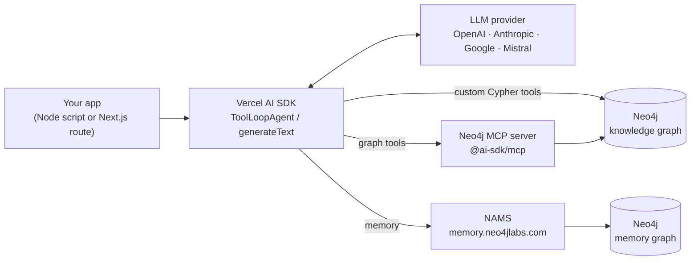

# Vercel AI SDK + Neo4j

The [Vercel AI SDK](https://ai-sdk.dev) is a TypeScript toolkit for building model-agnostic agents — one `tool()` / `ToolLoopAgent` surface across OpenAI, Anthropic, Google, Mistral, and others, with first-class MCP support and streaming built in.

Neo4j plugs into it at two distinct layers:

- **Knowledge** — the graph the agent queries, reached over MCP or through custom Cypher tools.
- **Memory** — what the agent remembers between turns and across sessions, backed by [NAMS](https://memory.neo4jlabs.com) (Neo4j Agent Memory Service).

This folder covers both, twice: once as small Node.js scripts you can read top to bottom, and once as a production-shaped Next.js app.

## Contents

| Sample | Runtime | AI SDK | What it shows |
|---|---|---|---|
| **[notebook/](./notebook/)** | Node.js `.mjs` scripts | **v7** | Five progressive scripts: direct driver query → MCP agent → MCP + custom Cypher tools → low-level memory client → NAMS provider. Multi-LLM (OpenAI / Gemini / Anthropic / Mistral). |
| **[vercel_Nams_demo/](./vercel_Nams_demo/)** | Next.js 16 app | **v7** | Full chat app: three NAMS integration modes, live MCP graph access, memory + reasoning-trace panels, route-level tests. |

Start with `notebook/` to understand the wiring; go to `vercel_Nams_demo/` for the shape of a real application.

## Architecture



The two Neo4j boxes are independent. The knowledge graph is read-only demo data; the memory graph is managed for you by NAMS. You can adopt either half on its own.

## Integration Paths

| Path | Package | Use when | Sample |
|---|---|---|---|
| **MCP tools** | `@ai-sdk/mcp` → `createMCPClient()` | You want schema discovery and Cypher execution as standard tools, shareable with any MCP client | [`1-mcp-agent.mjs`](./notebook/1-mcp-agent.mjs), [`lib/neo4j-mcp.ts`](./vercel_Nams_demo/lib/neo4j-mcp.ts) |
| **Custom Cypher tools** | `neo4j-driver` + `tool()` | You need tight control over the queries, secrets, and result shape inside your own boundary | [`2-custom-tools-agent.mjs`](./notebook/2-custom-tools-agent.mjs) |
| **Low-level memory** | `@neo4j-labs/agent-memory` | You want to own the retrieve-before / persist-after hooks explicitly | [`3-memory-agent.mjs`](./notebook/3-memory-agent.mjs) |
| **NAMS provider** | `@neo4j-labs/nams-ai-provider` | You want memory wired into the SDK for you — as a provider, a model wrapper, or as tools | [`4-nams-provider-agent.mjs`](./notebook/4-nams-provider-agent.mjs), [`app/api/chat/route.ts`](./vercel_Nams_demo/app/api/chat/route.ts) |

The NAMS package exposes the same backend three ways — pick based on where memory should sit in your control flow:

| Mode | Call | Memory handling | Visible to the model |
|---|---|---|---|
| `provider` | `createNamsProvider({ baseProvider, scope }).languageModel(id)` | Middleware injected by the provider | No |
| `middleware` | `createNams(cfg).wrap(model, scope)` | Same middleware, on an already-resolved model | No |
| `tools` | `createNams(cfg).toolsWithMcp(scope, mcpConfig)` | `query_memory` / `store_memory` tool calls | Yes |

Both samples implement all three, switched by `NAMS_MODE`.

## AI SDK v6 vs v7

Both samples run **AI SDK v7** on identical dependency versions, so what you learn in one transfers to the other. The v6 material below is kept because plenty of existing apps are still on that line.

### What both samples pin

| Package | Version | Notes |
|---|---|---|
| `ai` | `^7.0.70` | |
| `@ai-sdk/openai` | `^4.0.44` | |
| `@ai-sdk/mcp` | `^2.0.34` | |
| `@ai-sdk/react` | `^4.0.73` | demo only |
| `@ai-sdk/provider` | `4.0.7` (resolved) | `LanguageModelV4` / `ProviderV4` |
| `@neo4j-labs/nams-ai-provider` | `^0.2.1` | the v7-targeted build |
| `@neo4j-labs/agent-memory` | `^0.4.1` | |
| `zod` | `^3.25.76` | held on zod 3; `nams-ai-provider` peers accept `^4.1.8` too |

The demo adds its own framework layer, which the scripts have no equivalent for:

| Package | Version | Notes |
|---|---|---|
| `next` | `^16.3.1` | demo only |
| `react` / `react-dom` | `^19.2.8` | demo only; React 19 is what `@neo4j-ndl/react` requires |
| `vitest` | `^4.1.11` | demo only, dev |

The `ai` major, the `@ai-sdk/*` majors, and the provider spec version move in lockstep. You cannot mix them within one install — this is a per-application choice, not a per-file one.

### Coming from v6

| Change | v6 | v7 | Impact on code like these samples |
|---|---|---|---|
| Stop conditions | `stepCountIs(n)` | renamed `isStepCount(n)`; `stepCountIs` kept as a literal export alias (`isStepCount as stepCountIs`) | **None.** Existing `stepCountIs` imports keep working — same function object |
| `StopCondition` | `StopCondition<any>` | `StopCondition<any, any>` | Types only |
| `tool()` generics | `tool<INPUT, OUTPUT>` | `tool<INPUT, OUTPUT, CONTEXT extends Context>` | **TypeScript only.** An explicit two-argument `tool<In, Out>` now binds the `tool<INPUT, CONTEXT>` overload and infers `OUTPUT = never` — it surfaces on `execute` as *"not assignable to type `undefined`"*, not as an arity error. Add the third parameter, or drop the generics and let `inputSchema` infer |
| `ToolLoopAgent` generics | `<CALL_OPTIONS, TOOLS, OUTPUT>` | `<CALL_OPTIONS, TOOLS, RUNTIME_CONTEXT, OUTPUT>` | Types only, unless you pass explicit generics |
| MCP client | `@ai-sdk/mcp@1` | `@ai-sdk/mcp@2` | **None.** `createMCPClient(config)` is unchanged, and `experimental_createMCPClient` is still an alias in both. The major is a lockstep bump |

Every break above is in the type layer. Moving this folder's Next.js demo from v6 to v7 required no source changes at all — only the dependency pins — and the plain-JavaScript scripts were unaffected by construction. The generics are the part that bites a TypeScript codebase.

### NAMS package pairing

`@neo4j-labs/nams-ai-provider` tracks the SDK line through its peer dependencies:

| Version | Peers |
|---|---|
| `0.1.x` | `ai ~6.0.0`, `@ai-sdk/mcp ~1.0.0`, `@ai-sdk/provider ~3.0.0` |
| `0.2.x` | `ai ^7.0.0`, `@ai-sdk/mcp ^2.0.0`, `@ai-sdk/provider ^4.0.0` |

At runtime the NAMS wrapper is spec-version agnostic — `wrap()` and `createNamsProvider().languageModel()` delegate `specificationVersion` straight through from the base model. What the pairing actually governs is npm's peer resolution and the TypeScript types the package ships, so mismatching the two is a build-time and install-time problem rather than a silent runtime one.

### Staying on v6

Nothing in the Neo4j integration requires v7. To keep an existing v6 app as it is, pin the matching set:

```jsonc
"ai":                           "~6.0.0",
"@ai-sdk/openai":               "^3.0.0",
"@ai-sdk/mcp":                  "^1.0.0",
"@neo4j-labs/nams-ai-provider": "~0.1.0"   // the v6-targeted build
```

Pairing `nams-ai-provider@0.2.x` with `ai@6` is the one combination to avoid: `npm install` fails peer resolution (`@ai-sdk/mcp@^2.0.0` against a v1 install) unless it is masked with `legacy-peer-deps`.

## Quick Start

Both samples default to the public read-only `companies` demo graph and need a free NAMS key from [memory.neo4jlabs.com](https://memory.neo4jlabs.com) for the memory examples.

**Scripts:**

```bash
git clone https://github.com/neo4j-labs/neo4j-agent-integrations.git
cd neo4j-agent-integrations/vercel-agent/notebook

cp .env.example .env      # OPENAI_API_KEY + MEMORY_API_KEY at minimum
npm install

node 0-direct-query.mjs                                # verify Neo4j connectivity, no LLM
node 4-nams-provider-agent.mjs                         # NAMS_MODE=provider (default)
NAMS_MODE=tools node 4-nams-provider-agent.mjs         # memory as visible tool calls
```

**Next.js app:**

```bash
cd neo4j-agent-integrations/vercel-agent/vercel_Nams_demo

npm install                          # no flags needed
cp .env.local.example .env.local     # MEMORY_API_KEY + OPENAI_API_KEY at minimum

npm run dev                          # http://localhost:3000
npm test                             # route tests, fully mocked — no credentials needed
```

Neither sample needs `--legacy-peer-deps`: both install cleanly under npm's strict peer resolution.

The demo used to require it. It ran React 18 on Next.js 14, which violated `@neo4j-ndl/react`'s `react >=19.0.0` peer, and a `legacy-peer-deps=true` `.npmrc` masked the conflict. Moving to React 19 on Next.js 16 satisfies the peer honestly and the `.npmrc` is gone. The AI SDK was never the cause — `@ai-sdk/react@4` accepts `react ^18 || ~19.0.1 || ~19.1.2 || ^19.2.1`, so it was satisfied by both.

## Configuration

Both samples read the same variable names, so one set of MCP and NAMS credentials serves both.

| Variable | Used by | Description |
|---|---|---|
| `OPENAI_API_KEY` | both | LLM key. The scripts also accept `AI_PROVIDER` = `openai` \| `google` \| `anthropic` \| `mistral` with the matching key |
| `MEMORY_API_KEY` | memory samples | Free NAMS key from [memory.neo4jlabs.com](https://memory.neo4jlabs.com). Missing → the demo's `/api/chat` returns **503** |
| `MEMORY_WORKSPACE_ID` | optional | Pin to a NAMS workspace; blank uses the key's default |
| `NAMS_MODE` | both | `provider` (default) \| `middleware` \| `tools` |
| `NEO4J_URI` / `NEO4J_USERNAME` / `NEO4J_PASSWORD` / `NEO4J_DATABASE` | direct-driver scripts | Defaults to the public `companies` demo graph |
| `MCP_URL` *or* `MCP_PORT` | MCP samples | Hosted endpoint, or `http://localhost:{MCP_PORT}/mcp` for a local server |
| `MCP_BEARER_TOKEN` | MCP auth | `Authorization: Bearer` — takes precedence |
| `MCP_NEO4J_USERNAME` / `MCP_NEO4J_PASSWORD` | MCP auth | `Authorization: Basic` |

Full tables, including the demo-only options, are in [`notebook/README.md`](./notebook/README.md#environment-variables) and [`vercel_Nams_demo/README.md`](./vercel_Nams_demo/README.md#environment-variables).

### MCP authentication

MCP stays disabled unless an endpoint **and** one complete auth pair are set.

| Server | Set |
|---|---|
| Hosted Aura / NeoCompanion (OAuth 2.1) | `MCP_BEARER_TOKEN` |
| Self-hosted `mcp-neo4j-cypher` behind Basic auth | `MCP_NEO4J_USERNAME` + `MCP_NEO4J_PASSWORD` |

Unsure which your server wants? `curl -i -X POST $MCP_URL` and read `WWW-Authenticate`: `Bearer …` means a token, `Basic …` means user/password. Both samples re-probe the endpoint on a 401 and report the challenge, so a scheme mismatch says so instead of surfacing a bare transport error.

## Demo Database

```bash
NEO4J_URI=neo4j+s://demo.neo4jlabs.com:7687
NEO4J_USERNAME=companies
NEO4J_PASSWORD=companies
NEO4J_DATABASE=companies
```

250k entities from Diffbot's knowledge graph — organizations, people, locations, industries, and news articles with vector embeddings. See the [repository README](../README.md#demo-database) for the data model.

## Resources

- [Vercel AI SDK docs](https://ai-sdk.dev/docs) · [v7 migration guide](https://ai-sdk.dev/docs/migration-guides)
- [Neo4j Agent Memory Service](https://memory.neo4jlabs.com)
- [`@neo4j-labs/nams-ai-provider`](https://www.npmjs.com/package/@neo4j-labs/nams-ai-provider) — [source](https://github.com/neo4j-labs/agent-memory/tree/main/typescript/packages/vercel-ai-provider)
- [`@neo4j-labs/agent-memory`](https://www.npmjs.com/package/@neo4j-labs/agent-memory)
- [Neo4j MCP server](https://github.com/neo4j/mcp)
