# Vercel AI SDK + Neo4j Integration

## Overview

**[Vercel AI SDK](https://sdk.vercel.ai)** is a TypeScript-first, provider-agnostic toolkit for building AI-powered applications and agents. It supports streaming, structured output, and multi-step agentic tool loops with a unified interface across OpenAI, Google Gemini, Anthropic, Mistral, and more.

**Key Features:**
- `generateText` / `streamText` for one-shot and streaming LLM calls
- Multi-step agentic loops via `stopWhen: stepCountIs(N)` (AI SDK v6+)
- `tool()` helper with `jsonSchema()` for type-safe tool definitions (no Zod required)
- Provider-agnostic — swap LLMs with a single environment variable change
- MCP client support via `@ai-sdk/mcp`

**Official Resources:**
- Website: [sdk.vercel.ai](https://sdk.vercel.ai)
- Documentation: [sdk.vercel.ai/docs](https://sdk.vercel.ai/docs)
- MCP client docs: [sdk.vercel.ai/docs/ai-sdk-core/mcp-clients](https://sdk.vercel.ai/docs/ai-sdk-core/mcp-clients)

## Architecture

**Before** (original — 3 extension points, AI SDK v5/v6):


**After** (current — 4 extension points, AI SDK v7, NAMS, demo app):




## Code Examples

### Node.js Scripts — [`notebook/`](./notebook/)

Step-by-step agent scripts that progress from a raw Neo4j query to NAMS-backed multi-session memory. All scripts target **AI SDK v7** (`ai@^7`, `@ai-sdk/mcp@^2`).

| Script | Description |
|--------|-------------|
| `0-direct-query.mjs` | Direct Neo4j query — sanity check, no AI |
| `1-mcp-agent.mjs` | MCP agent via `createMCPClient` (stable v7 API) |
| `2-custom-tools-agent.mjs` | MCP + custom Cypher tools merged in one `generateText` call |
| `3-memory-agent.mjs` | Memory using raw `@neo4j-labs/agent-memory` client (manual before/after hooks) |
| `4-nams-provider-agent.mjs` | Memory via `@neo4j-labs/nams-ai-provider` — provider / middleware / tools modes |

See [`notebook/README.md`](./notebook/README.md) for full setup and env-var reference.

### Next.js Chat App — [`vercel_Nams_demo/`](./vercel_Nams_demo/)

A production-ready Next.js 16 / React 19 chat application showing all three **NAMS** (Neo4j Agent Memory System) modes with a live reasoning-trace UI. Uses `ToolLoopAgent` from AI SDK v7, `@neo4j-labs/nams-ai-provider@^0.2`, and optionally Neo4j MCP for live graph queries.

| Mode (`NAMS_MODE`) | How memory is handled |
|--------------------|----------------------|
| `provider` (default) | `createNamsProvider()` wraps the provider — transparent middleware, no tool calls visible |
| `middleware` | `createNams().wrap(model, scope)` — same behaviour applied to an already-resolved model |
| `tools` | `createNams().toolsWithMcp()` — `query_memory` / `store_memory` driven by the model; `enforceQueryMemory()` guards the read |

See [`vercel_Nams_demo/README.md`](./vercel_Nams_demo/README.md) for architecture, integration-mode deep-dives, and setup.

## Extension Points

### 1. MCP Integration

The Vercel AI SDK supports MCP via the `@ai-sdk/mcp` package. `createMCPClient` (stable since AI SDK v7 / `@ai-sdk/mcp@^2`) connects to any MCP server over HTTP or SSE transport, and `mcpClient.tools()` returns a tools object ready for `generateText`.

```bash
npm install @ai-sdk/mcp
```

```js
import { generateText, stepCountIs } from 'ai';
import { createMCPClient } from '@ai-sdk/mcp';

// Credentials passed per-request via Basic Auth header
const creds = Buffer.from(`${process.env.NEO4J_USERNAME}:${process.env.NEO4J_PASSWORD}`)
  .toString('base64');

const mcpClient = await createMCPClient({
  transport: {
    type:    'http',
    url:     `http://localhost:${process.env.MCP_PORT}/mcp`,
    headers: { Authorization: `Basic ${creds}` },
  },
});

const mcpTools = await mcpClient.tools();  // get-schema, read-cypher, write-cypher, ...

const { text, steps } = await generateText({
  model,
  system:   'You are a graph database assistant. Run get-schema first if unfamiliar.',
  prompt:   'How many organizations are in the database?',
  tools:    mcpTools,
  stopWhen: stepCountIs(10),   // AI SDK v6+ — replaces the removed maxSteps
});

await mcpClient.close();
```

**Example output:**
```
Connected to Neo4j MCP ✓
Available tools: get-schema, list-gds-procedures, read-cypher, write-cypher

Query: How many organizations are in the database?

Result: There are 46,088 organizations in the database.
[Completed in 3 step(s)]
```

**When to use:** Start here. Covers most graph queries with zero Cypher knowledge required — the agent uses `get-schema` + `read-cypher` autonomously.

---

### 2. Direct Neo4j Integration

For queries that need hand-tuned Cypher or access patterns the MCP server doesn't expose, use the `neo4j-driver` directly. Custom tools are defined with `tool()` + `jsonSchema()` and can be **merged with MCP tools** in the same `generateText` call.

```bash
npm install neo4j-driver
```

```js
import { generateText, tool, jsonSchema, stepCountIs } from 'ai';
import neo4j from 'neo4j-driver';

const driver = neo4j.driver(
  process.env.NEO4J_URI,
  neo4j.auth.basic(process.env.NEO4J_USERNAME, process.env.NEO4J_PASSWORD),
  { disableLosslessIntegers: true }
);

const getInvestments = tool({
  description: 'Returns investments made by a company.',
  inputSchema: jsonSchema({
    type: 'object',
    properties: {
      company: { type: 'string', description: 'Company or organization name' },
    },
    required: ['company'],
  }),
  execute: async ({ company }) => {
    const { records } = await driver.executeQuery(
      `MATCH (o:Organization)-[:HAS_INVESTOR]->(i)
       WHERE o.name = $company
       RETURN i.id AS id, i.name AS name, head(labels(i)) AS type`,
      { company },
      { database: process.env.NEO4J_DATABASE }
    );
    return records.map(r => r.toObject());
  },
});

// Merge custom tool with MCP tools — the framework routes each call automatically
const { text } = await generateText({
  model,
  prompt:   'Which companies did Google invest in?',
  tools:    { ...mcpTools, getInvestments },
  stopWhen: stepCountIs(10),
});

await driver.close();
```

**Example output:**
```
Result: Google has made investments in several notable companies:
- Ionic Security
- Avere Systems
- FlexiDAO
- Cloudflare
- Trifacta
[Completed in 4 step(s)]
```

**When to use:** When you need precise Cypher beyond what the MCP server provides, or want to mix domain-specific tools (e.g. custom aggregations, write operations) with MCP tools in a single agent.

---

### 3. Custom Tools / Persistent Memory

Memory is stored directly in Neo4j using `neo4j-driver` — no additional packages needed. The pattern wraps `generateText` with two hooks:

- **Before hook** (`injectMemoryContext`) — queries recent messages from Neo4j and injects them into the system prompt
- **After hook** (`saveInteraction`) — saves the interaction as `(:MemoryMessage)` nodes for future recall

Memory schema:
```
(:MemorySession {id})-[:HAS_MESSAGE]->(:MemoryMessage {role, content, timestamp})
```

```js
import neo4j from 'neo4j-driver';

const memDriver = neo4j.driver(MEMORY_URI, neo4j.auth.basic(MEMORY_USER, MEMORY_PASS));

async function getRecentMessages(limit = 10) {
  const { records } = await memDriver.executeQuery(
    `MATCH (s:MemorySession {id: $sessionId})-[:HAS_MESSAGE]->(m:MemoryMessage)
     RETURN m.role AS role, m.content AS content
     ORDER BY m.timestamp ASC LIMIT $limit`,
    { sessionId: SESSION_ID, limit },
    { database: MEMORY_DB }
  );
  return records.map(r => `${r.get('role').toUpperCase()}: ${r.get('content')}`);
}

async function runWithMemory(query) {
  // BEFORE: inject conversation history into system prompt
  const history = await getRecentMessages();
  const systemWithContext = history.length
    ? `${SYSTEM_PROMPT}\n\n--- CONVERSATION HISTORY ---\n${history.join('\n')}\n----------------------------`
    : SYSTEM_PROMPT;

  const { text } = await generateText({
    model,
    system:   systemWithContext,
    prompt:   query,
    tools:    mcpTools,
    stopWhen: stepCountIs(10),
  });

  // AFTER: save interaction to memory graph
  await memDriver.executeQuery(
    `MERGE (s:MemorySession {id: $sessionId})
     CREATE (m:MemoryMessage {role: $role, content: $content, timestamp: datetime()})
     CREATE (s)-[:HAS_MESSAGE]->(m)`,
    { sessionId: SESSION_ID, role: 'user', content: query },
    { database: MEMORY_DB }
  );
  return text;
}
```

**Example output (two-turn demo):**
```
[USER]: I am conducting a competitive analysis of 'Google'. I am specifically
        worried about their subsidiaries and top-tier competitors in the AI space.
[AGENT]: Understood. I've noted that we're tracking Google for competitive intelligence...
 [Hook] Saving interaction to Neo4j memory graph...

--- Indexing memory (5s)... ---

[USER]: What are the main risks in the supply chain for the company I am currently tracking?
 ↳ Injecting 1 memories into context.
   Memory 1: Conducting competitive analysis of Google — focused on subsidiaries and AI competitors...
[AGENT]: Based on our ongoing analysis of Google, the main supply chain risks include...
```

**When to use:** Multi-session agents that need to remember past queries, user context, or analysis state. Particularly useful for research assistants and monitoring agents.

---

### 4. NAMS Provider — `@neo4j-labs/nams-ai-provider`

[NAMS](https://memory.neo4jlabs.com) is a hosted memory service backed by Neo4j. The `@neo4j-labs/nams-ai-provider` package wraps the Vercel AI SDK with persistent memory retrieval and storage — no self-managed Neo4j instance required for memory. It supports the same three modes as the demo:

```bash
npm install @neo4j-labs/nams-ai-provider
```

**Provider mode (transparent — recommended starting point):**

```js
import { createNamsProvider } from '@neo4j-labs/nams-ai-provider';
import { openai } from '@ai-sdk/openai';
import { generateText, stepCountIs } from 'ai';

const model = createNamsProvider({
  apiKey:       process.env.MEMORY_API_KEY,
  baseProvider: openai,
  scope:        { userId: 'user-1', conversationId: 'session-1' },
}).languageModel('gpt-5.4-mini');

const { text } = await generateText({
  model,
  prompt:   'What were the Google supply-chain risks we discussed before?',
  tools:    mcpTools,         // optional — add MCP or custom tools
  stopWhen: stepCountIs(10),
});
```

Memory is retrieved and injected before each call and the turn is persisted after — no before/after hooks to write. The model sees memories as part of its system prompt context.

**Tools mode (model-driven — visible reasoning trace):**

```js
import { createNams, enforceQueryMemory } from '@neo4j-labs/nams-ai-provider';
import { ToolLoopAgent, stepCountIs } from 'ai';   // ToolLoopAgent is v7+

const { tools, close } = await createNams({ apiKey: process.env.MEMORY_API_KEY })
  .toolsWithMcp(
    { userId: 'user-1', conversationId: 'session-1' },
    mcpConfig,   // optional — merges MCP tools alongside query_memory / store_memory
  );

const agent = new ToolLoopAgent({
  model:       openai('gpt-5.4-mini'),
  tools,
  prepareStep: enforceQueryMemory({ graceSteps: 2 }),  // forces read if model skips it
  stopWhen:    stepCountIs(10),
  onFinish:    async () => { await close(); },
});

const result = await agent.run('Which companies did Google invest in?');
```

`enforceQueryMemory` guarantees `query_memory` is called in the first steps. `ensureStored()` (used in the demo's `onFinish`) closes the write-side gap for models that answer without calling `store_memory`.

**Middleware mode:**

```js
import { createNams } from '@neo4j-labs/nams-ai-provider';

const nams  = createNams({ apiKey: process.env.MEMORY_API_KEY });
const model = nams.wrap(openai('gpt-5.4-mini'), { userId: 'user-1', conversationId: 'session-1' });
```

Identical to provider mode but applied to an already-resolved model instance — useful when the base model isn't always the same provider.

**When to use:** Production agents that need cross-session memory without managing a dedicated Neo4j memory database. The demo ([`vercel_Nams_demo/`](./vercel_Nams_demo/)) is the reference client for all three modes; the notebook ([`notebook/4-nams-provider-agent.mjs`](./notebook/4-nams-provider-agent.mjs)) is the minimal script version.

---

## MCP Authentication

**Supported Mechanisms:**

✅ **HTTP Headers (HTTP transport)** — Pass credentials via the `headers` parameter of `createMCPClient`. Used to authenticate per-request against `neo4j-mcp-server` running in HTTP mode.

```js
const creds = Buffer.from(`${NEO4J_USERNAME}:${NEO4J_PASSWORD}`).toString('base64');

const mcpClient = await createMCPClient({
  transport: {
    type:    'http',
    url:     'http://localhost:8443/mcp',
    headers: { Authorization: `Basic ${creds}` },
  },
});
```

> **Important:** Do **not** export `NEO4J_USERNAME` / `NEO4J_PASSWORD` as environment variables when running `neo4j-mcp-server` in HTTP mode — the server will pick them up for its own connection and the per-request auth will not work correctly. Pass credentials only via the `Authorization` header inside your JS code.

## LLM Provider Configuration

All three agent files import `getModel()` from [`providers.mjs`](providers.mjs), which selects the LLM based on the `AI_PROVIDER` environment variable. No code changes are needed to switch providers.

| Provider | `AI_PROVIDER` | API Key Variable | Extra install |
|----------|--------------|-----------------|---------------|
| **OpenAI** (default) | `openai` | `OPENAI_API_KEY` | — |
| **Google Gemini** | `google` | `GOOGLE_GENERATIVE_AI_API_KEY` | `npm install @ai-sdk/google` |
| **Anthropic Claude** | `anthropic` | `ANTHROPIC_API_KEY` | `npm install @ai-sdk/anthropic` |
| **Mistral** | `mistral` | `MISTRAL_API_KEY` | `npm install @ai-sdk/mistral` |

## AI SDK Version Notes (v6 vs v7)

The notebook and demo target **AI SDK v7** (`ai@^7`, `@ai-sdk/mcp@^2`). The table below summarises every breaking or renamed API from v6.

| Area | v6 | v7 |
|------|----|----|
| MCP client import | `experimental_createMCPClient` from `@ai-sdk/mcp@^1` | `createMCPClient` (stable) from `@ai-sdk/mcp@^2` |
| Multi-step control | `stopWhen: stepCountIs(N)` (replaces removed `maxSteps`) | `stopWhen: stepCountIs(N)` still works — `stepCountIs` is a literal alias for the new `isStepCount` export |
| Agentic loop class | Not available — use `generateText` with `stopWhen` | `ToolLoopAgent` class with `prepareStep`, `onFinish`, `onStepFinish` hooks |
| `tool()` generics (TypeScript) | `tool<INPUT, OUTPUT>` | `tool<INPUT, OUTPUT, CONTEXT>` — a two-arg call now binds to `tool<INPUT, CONTEXT>` and infers `OUTPUT = never`, surfacing as a type error on `execute`. Add the third param or drop explicit generics |
| `@ai-sdk/mcp` peer | `ai@^5` / `ai@^6` | `ai@^7` |

> **Upgrading from v6 scripts:** replace `experimental_createMCPClient` with `createMCPClient` and bump `@ai-sdk/mcp` to `^2`. No other changes are needed for the patterns shown here.

## Challenges and Gaps

| Area | Detail |
|------|--------|
| **JavaScript only** | The Vercel AI SDK has no Python support — all agent code runs in Node.js |
| **`maxSteps` removed** | Silently removed in AI SDK v6 — passing it does nothing. Use `stopWhen: stepCountIs(N)` |
| **MCP transport type** | `neo4j-mcp-server` HTTP mode requires `type: 'http'`, not `type: 'sse'` |
| **Memory DB (manual)** | Extension Point 3 uses `neo4j-driver` directly — requires a separate writable Neo4j instance; Extension Point 4 (NAMS) removes this requirement |
| **Edge runtime** | Neo4j driver needs persistent TCP — incompatible with Vercel edge functions; use Node.js serverless runtime |
| **NAMS `enforceQueryMemory`** | Only guards the read side — use `ensureStored()` in `onFinish` to guarantee write-back when the model skips `store_memory` |

## Resources

- [Vercel AI SDK Documentation](https://sdk.vercel.ai/docs)
- [Vercel AI SDK — Tool Use](https://sdk.vercel.ai/docs/ai-sdk-core/tools-and-tool-calling)
- [Vercel AI SDK — MCP Clients](https://sdk.vercel.ai/docs/ai-sdk-core/mcp-clients)
- [`@ai-sdk/mcp` on npm](https://www.npmjs.com/package/@ai-sdk/mcp)
- [Neo4j Agent Memory (Python)](https://github.com/neo4j-labs/agent-memory)
- [Neo4j MCP Server](https://github.com/neo4j-contrib/mcp-neo4j)
- [Neo4j JavaScript Driver Documentation](https://neo4j.com/docs/javascript-manual/current/)