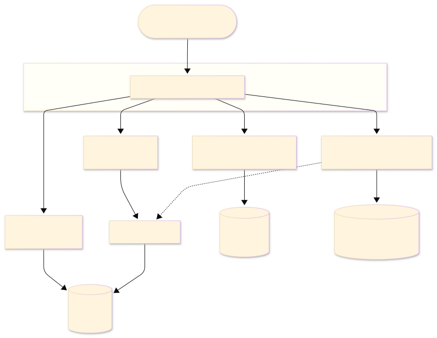

# Vercel AI SDK + Neo4j Integration

## Overview

**[Vercel AI SDK](https://ai-sdk.dev)** is a TypeScript-first, provider-agnostic toolkit for building AI-powered applications and agents. It supports streaming, structured output, and multi-step agentic tool loops with a unified interface across OpenAI, Google Gemini, Anthropic, Mistral, and more.

**Key Features:**
- `generateText` / `streamText` for one-shot and streaming LLM calls
- Multi-step agentic loops via `stopWhen: stepCountIs(N)` (AI SDK v6+)
- `tool()` helper with `jsonSchema()` for type-safe tool definitions (no Zod required)
- Provider-agnostic — swap LLMs with a single environment variable change
- MCP client support via `@ai-sdk/mcp`

**Official Resources:**
- Website: [ai-sdk.dev](https://ai-sdk.dev)
- Documentation: [ai-sdk.dev/docs](https://ai-sdk.dev/docs)
- MCP client docs: [ai-sdk.dev/docs/ai-sdk-core/mcp-tools](https://ai-sdk.dev/docs/ai-sdk-core/mcp-tools)

## Architecture

Four extension points on AI SDK v7, with NAMS as the memory backend:


**After** (current — 4 extension points, AI SDK v7, NAMS, demo app):




## Code Examples

There are three projects here. They all use the same memory service, NAMS (Neo4j Agent Memory System).

### A) Node.js scripts — [`notebook/`](./notebook/)

Five small scripts. Each adds one idea, from a plain database query up to an agent that remembers you between runs.

| Script | What it shows |
|--------|---------------|
| `0-direct-query.mjs` | Talk to Neo4j directly, no AI |
| `1-mcp-agent.mjs` | An AI agent that queries Neo4j through an MCP server |
| `2-custom-tools-agent.mjs` | The same agent plus your own Cypher tools |
| `3-memory-agent.mjs` | Memory done by hand: load before the answer, save after |
| `4-nams-provider-agent.mjs` | Memory done by the `nams-ai-provider` package, in any of its four modes (`NAMS_MODE`) |

Setup and settings: [`notebook/README.md`](./notebook/README.md).

### B) Next.js chat app — [`vercel_Nams_demo/`](./vercel_Nams_demo/)

A chat app that remembers you after a page reload. It can switch between all four memory modes with `NAMS_MODE`:

| `NAMS_MODE` | Who takes care of memory |
|-------------|--------------------------|
| `provider` (default) | A wrapper around the AI model: adds memories before each answer, saves the turn after |
| `middleware` | The same wrapper, placed on a model you already have |
| `tools` | The model itself, by calling `query_memory` and `store_memory` |
| `hooks` | The app's own code: loads the saved chat before each answer, saves every turn after |

It can also query your Neo4j database through MCP. Setup: [`vercel_Nams_demo/README.md`](./vercel_Nams_demo/README.md).

### C) Eve agent — [`vercel-eve/`](./vercel-eve/)

A research agent built on [eve](https://vercel.com/docs/eve), Vercel's framework for backend agents. It answers questions about companies from a Neo4j graph and remembers each user between sessions. Before each turn it looks up what it knows about the user, and after each turn eve's own hooks save what was said.

```bash
cd vercel-eve/industry-research-agent
npm install && cp .env.example .env    # add NAMS_API_KEY + OPENAI_API_KEY
npm run chat                           # starts the local MCP server + a terminal chat
```

Setup and how it works: [`vercel-eve/README.md`](./vercel-eve/README.md).

## Extension Points

### 1. MCP Integration

The Vercel AI SDK supports MCP via the `@ai-sdk/mcp` package. `createMCPClient` (stable since AI SDK v7 / `@ai-sdk/mcp@^2`) connects to any MCP server over HTTP or SSE transport, and `mcpClient.tools()` returns a tools object ready for `generateText`.

```bash
npm install @ai-sdk/mcp
```

```js
import { generateText, stepCountIs } from 'ai';
import { createMCPClient } from '@ai-sdk/mcp';

// Basic auth shown here. The notebook's mcp.mjs also supports a Bearer token
// (MCP_BEARER_TOKEN) for OAuth 2.1 servers — see "MCP Authentication" below.
const creds = Buffer.from(`${process.env.NEO4J_USERNAME}:${process.env.NEO4J_PASSWORD}`)
  .toString('base64');

const mcpClient = await createMCPClient({
  transport: {
    type:    'http',
    url:     `http://localhost:${process.env.MCP_PORT}/mcp`,
    headers: { Authorization: `Basic ${creds}` },
  },
});

const mcpTools = await mcpClient.tools();  // get-schema, read-cypher, write-cypher, ...

const { text, steps } = await generateText({
  model,
  system:   'You are a graph database assistant. Run get-schema first if unfamiliar.',
  prompt:   'How many organizations are in the database?',
  tools:    mcpTools,
  stopWhen: stepCountIs(10),   // AI SDK v6+ — replaces the removed maxSteps
});

await mcpClient.close();
```

**Example output** (`node 1-mcp-agent.mjs`; tool names depend on the MCP server):
```
LLM: openai / gpt-5.4-mini
[neo4j-mcp] Connected (basic auth) — tools: get-schema, list-gds-procedures, read-cypher, write-cypher
Agent:  neo4j_explorer
Tools:  get-schema, list-gds-procedures, read-cypher, write-cypher

Query: How many organizations are in the database?

Result: There are 46,088 organizations in the database.
[Completed in 3 step(s)]
```

**When to use:** Start here. Covers most graph queries with zero Cypher knowledge required — the agent uses `get-schema` + `read-cypher` autonomously.

---

### 2. Direct Neo4j Integration

For queries that need hand-tuned Cypher or access patterns the MCP server doesn't expose, use the `neo4j-driver` directly. Custom tools are defined with `tool()` + `jsonSchema()` and can be **merged with MCP tools** in the same `generateText` call.

```bash
npm install neo4j-driver
```

```js
import { generateText, tool, jsonSchema, stepCountIs } from 'ai';
import neo4j from 'neo4j-driver';

const driver = neo4j.driver(
  process.env.NEO4J_URI,
  neo4j.auth.basic(process.env.NEO4J_USERNAME, process.env.NEO4J_PASSWORD),
  { disableLosslessIntegers: true }
);

const getInvestments = tool({
  description: 'Returns investments made by a company.',
  inputSchema: jsonSchema({
    type: 'object',
    properties: {
      company: { type: 'string', description: 'Company or organization name' },
    },
    required: ['company'],
  }),
  execute: async ({ company }) => {
    const { records } = await driver.executeQuery(
      `MATCH (o:Organization)-[:HAS_INVESTOR]->(i)
       WHERE o.name = $company
       RETURN i.id AS id, i.name AS name, head(labels(i)) AS type`,
      { company },
      { database: process.env.NEO4J_DATABASE }
    );
    return records.map(r => r.toObject());
  },
});

// Merge custom tool with MCP tools — the framework routes each call automatically
const { text } = await generateText({
  model,
  prompt:   'Which companies did Google invest in?',
  tools:    { ...mcpTools, getInvestments },
  stopWhen: stepCountIs(10),
});

await driver.close();
```

**Example output:**
```
Result: Google has made investments in several notable companies:
- Ionic Security
- Avere Systems
- FlexiDAO
- Cloudflare
- Trifacta
[Completed in 4 step(s)]
```

**When to use:** When you need precise Cypher beyond what the MCP server provides, or want to mix domain-specific tools (e.g. custom aggregations, write operations) with MCP tools in a single agent.

---

### 3. Persistent Memory — `@neo4j-labs/agent-memory` client

Memory lives in [NAMS](https://memory.neo4jlabs.com), a hosted memory service backed by Neo4j, reached through the low-level `@neo4j-labs/agent-memory` client. You write the two hooks around `generateText` yourself:

- **Before hook** (`buildContext`) — reads the conversation's short-term context (reflections, recent messages) and searches long-term entities for the query, then injects both into the system prompt
- **After hook** (`saveInteraction`) — saves the user and assistant messages to the conversation, and the answer as a long-term entity so it survives the session

```bash
npm install @neo4j-labs/agent-memory
```

```js
import { MemoryClient } from '@neo4j-labs/agent-memory';

const memoryClient = new MemoryClient({ apiKey: process.env.MEMORY_API_KEY });
const { id: convId } = await memoryClient.shortTerm.createConversation({ userId: DEMO_USER_ID });

async function buildContext(query) {
  const ctx      = await memoryClient.shortTerm.getContext(convId);
  const entities = await memoryClient.longTerm.searchEntities(query, { limit: 5 });
  // ...format ctx.reflections, ctx.recentMessages and entities into a MEMORY CONTEXT block
}

async function runWithMemory(query) {
  const { text } = await generateText({
    model,
    system:   await buildContext(query),   // BEFORE
    prompt:   query,
    tools:    mcpTools,
    stopWhen: stepCountIs(10),
  });

  // AFTER
  await memoryClient.shortTerm.addMessage(convId, 'user', query);
  await memoryClient.shortTerm.addMessage(convId, 'assistant', text);
  await memoryClient.longTerm.addEntity(`Research: ${query.slice(0, 60)}`, 'concept', {
    description: text.slice(0, 500),
  });
  return text;
}
```

`workspaceId` goes on the `MemoryClient` config (sent as `X-Workspace-Id`), not on `createConversation()`.

**Example output (two-turn demo; answers abridged):**
```
Memory session: <conversation-id> (workspace: default)

[USER]: I am conducting a competitive analysis of 'Google'. Tell me about their presence in the knowledge graph.
[AGENT]: Google appears in the graph as...
 [Memory] Interaction saved to NAMS ✓

[USER]: Based on our conversation, what subsidiaries of the company we discussed appear in the database?
 ↳ Injecting 1 entity/entities from long-term memory.
 ↳ Injecting context: 2 messages, 1 entities.
[AGENT]: Based on our analysis of Google, the subsidiaries in the database include...
 [Memory] Interaction saved to NAMS ✓
```

**When to use:** When you want full control over what is read and written each turn. For the same memory without writing the hooks, use extension point 4.

---

### 4. NAMS Provider — `@neo4j-labs/nams-ai-provider`

This package connects NAMS memory to the AI SDK for you, so you don't write the load-and-save code yourself. It has four modes. The only difference is **who decides when memory is read and saved**.

```bash
npm install @neo4j-labs/nams-ai-provider
```

| Mode | Who reads and saves memory | Code |
|------|----------------------------|------|
| `provider` | A wrapper around every model call | `createNamsProvider({ baseProvider, scope }).languageModel(id)` |
| `middleware` | The same wrapper, on a model you already have | `createNams(cfg).wrap(model, scope)` |
| `tools` | The model, by calling `query_memory` / `store_memory` | `createNams(cfg).toolsWithMcp(scope, mcp?)` |
| `hooks` | Your code: `loadSession()` before, `onFinish()` after | `createNams(cfg).hooks(scope)` |

All four save to the same place, so you can switch modes without losing memory.

**Provider mode** (the easiest place to start):

```js
import { createNamsProvider } from '@neo4j-labs/nams-ai-provider';
import { openai } from '@ai-sdk/openai';
import { generateText } from 'ai';

const model = createNamsProvider({
  apiKey:       process.env.MEMORY_API_KEY,
  baseProvider: openai,
  scope:        { userId: 'user-1' },
}).languageModel('gpt-5.4-mini');

const { text } = await generateText({ model, prompt: 'What did we discuss last time?' });
```

**Middleware mode** does the same thing for a model you already have:

```js
const model = createNams({ apiKey }).wrap(openai('gpt-5.4-mini'), { userId: 'user-1' });
```

**Tools mode** lets the model decide, and you can see each memory call:

```js
import { createNams, enforceQueryMemory } from '@neo4j-labs/nams-ai-provider';
import { ToolLoopAgent, stepCountIs } from 'ai';

const { tools, close } = await createNams({ apiKey }).toolsWithMcp({ userId: 'user-1' }, mcpConfig);

const agent = new ToolLoopAgent({
  model:       openai('gpt-5.4-mini'),
  tools,
  prepareStep: enforceQueryMemory({ graceSteps: 2 }),   // make sure it reads memory first
  stopWhen:    stepCountIs(10),
  onFinish:    async () => { await close(); },
});
```

A model can forget to *save*. The demo doesn't rely on it for the chat itself: it saves each turn's text in `onFinish` through a hooks session (`session.onFinish({ prompt })({ text })`).

**Hooks mode** keeps the model out of it. Your code loads the saved chat and saves every turn:

```js
const session = createNams({ apiKey }).hooks({ userId: 'user-1' });

const { text } = await generateText({
  model:    openai('gpt-5.4-mini'),
  messages: [...(await session.loadSession()), { role: 'user', content: prompt }],
  onFinish: session.onFinish({ prompt }),
});
```

Hooks mode saves the conversation only, not separate long-term facts. With package version 0.3.0 it only reloads the first 40 messages of a conversation. See the [demo README](./vercel_Nams_demo/README.md#known-limits-of-hosted-nams).

**Which mode?** Want it to just work: **provider**. Already have a model: **middleware**. Want to see memory calls: **tools**. Want every turn saved no matter what: **hooks**.

The demo ([`vercel_Nams_demo/`](./vercel_Nams_demo/)) and the notebook ([`notebook/4-nams-provider-agent.mjs`](./notebook/4-nams-provider-agent.mjs)) both run all four modes.

---

## MCP Authentication

MCP credentials go in the `headers` option of `createMCPClient` (HTTP transport). The notebook's [`notebook/mcp.mjs`](./notebook/mcp.mjs) and the demo's [`lib/neo4j-mcp.ts`](./vercel_Nams_demo/lib/neo4j-mcp.ts) pick the scheme from env vars:

| Server | Env vars | Header sent |
|--------|----------|-------------|
| Hosted Aura / NeoCompanion (OAuth 2.1) | `MCP_BEARER_TOKEN` | `Authorization: Bearer …` — wins when both are set |
| Self-hosted server behind Basic auth | `MCP_NEO4J_USERNAME` + `MCP_NEO4J_PASSWORD` | `Authorization: Basic …` |

The endpoint is `MCP_URL`, or `http://localhost:${MCP_PORT}/mcp` when only `MCP_PORT` is set. In the notebook, the Basic pair falls back to `NEO4J_USERNAME` / `NEO4J_PASSWORD`.

```js
const mcpClient = await createMCPClient({
  transport: {
    type:    'http',
    url:     process.env.MCP_URL,
    headers: { Authorization: `Bearer ${process.env.MCP_BEARER_TOKEN}` },
  },
});
```

A 401 usually means the wrong scheme rather than wrong credentials. `explainMcpError()` in both helpers re-probes the endpoint and reports the server's `WWW-Authenticate` challenge.

> **Running `neo4j-mcp-server` yourself in HTTP mode:** don't export `NEO4J_USERNAME` / `NEO4J_PASSWORD` into the *server's* environment — it will use them for its own connection and per-request auth won't work. Pass credentials only through the client's `Authorization` header.

## LLM Provider Configuration

The notebook scripts get their model from [`notebook/providers.mjs`](./notebook/providers.mjs): `getModel()` (scripts 1–3) or `getProvider()` (script 4, since NAMS provider mode wraps a provider, not a model). The provider is picked by the `AI_PROVIDER` environment variable, so switching needs no code changes. The Google, Anthropic and Mistral packages are `optionalDependencies`, so a normal `npm install` includes them.

| Provider | `AI_PROVIDER` | API Key Variable |
|----------|--------------|-----------------|
| **OpenAI** (default) | `openai` | `OPENAI_API_KEY` |
| **Google Gemini** | `google` | `GOOGLE_GENERATIVE_AI_API_KEY` |
| **Anthropic Claude** | `anthropic` | `ANTHROPIC_API_KEY` |
| **Mistral** | `mistral` | `MISTRAL_API_KEY` |

The Next.js demo is OpenAI-only (`OPENAI_MODEL`). The eve agent routes through Vercel AI Gateway or OpenAI directly (`AGENT_MODEL`, `MODEL_ROUTING`).


## Challenges and Gaps

| Area | Detail |
|------|--------|
| **JavaScript only** | The Vercel AI SDK has no Python support — all agent code runs in Node.js |
| **`maxSteps` removed** | Silently removed in AI SDK v6 — passing it does nothing. Use `stopWhen: stepCountIs(N)` |
| **MCP transport type** | `neo4j-mcp-server` HTTP mode requires `type: 'http'`, not `type: 'sse'` |
| **NAMS search is lexical** | Hosted NAMS matches keywords, not meaning — search with the user's own words, not a paraphrase |
| **NAMS scoping** | Long-term entities belong to the workspace, not the user. Isolating users needs one NAMS workspace per user or tenant |
| **Edge runtime** | Neo4j driver needs persistent TCP — incompatible with Vercel edge functions; use Node.js serverless runtime |
| **NAMS `enforceQueryMemory`** | Only guards the read side — save the turn yourself in `onFinish`, because the model can skip `store_memory` (the demo uses a hooks session's `onFinish`) |

## Resources

- [Vercel AI SDK Documentation](https://ai-sdk.dev/docs)
- [Vercel AI SDK — Tool Calling](https://ai-sdk.dev/docs/ai-sdk-core/tools-and-tool-calling)
- [Vercel AI SDK — MCP Tools](https://ai-sdk.dev/docs/ai-sdk-core/mcp-tools)
- [`@ai-sdk/mcp` on npm](https://www.npmjs.com/package/@ai-sdk/mcp)
- [Neo4j Agent Memory Service](https://memory.neo4jlabs.com)
- [`@neo4j-labs/agent-memory`](https://www.npmjs.com/package/@neo4j-labs/agent-memory) and [`@neo4j-labs/nams-ai-provider`](https://www.npmjs.com/package/@neo4j-labs/nams-ai-provider) — source at [neo4j-labs/agent-memory](https://github.com/neo4j-labs/agent-memory)
- [Neo4j MCP Server (official)](https://github.com/neo4j/mcp) · [`mcp-neo4j` (Neo4j Labs)](https://github.com/neo4j-contrib/mcp-neo4j)
- [Neo4j JavaScript Driver Documentation](https://neo4j.com/docs/javascript-manual/current/)